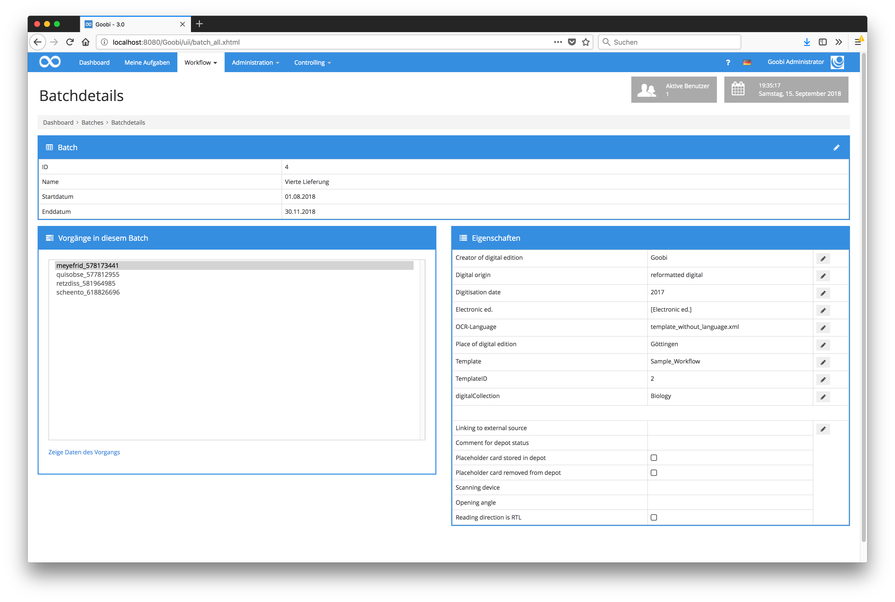
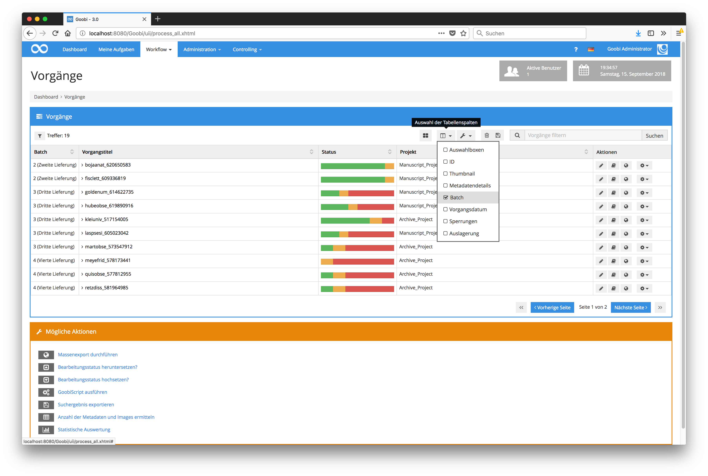
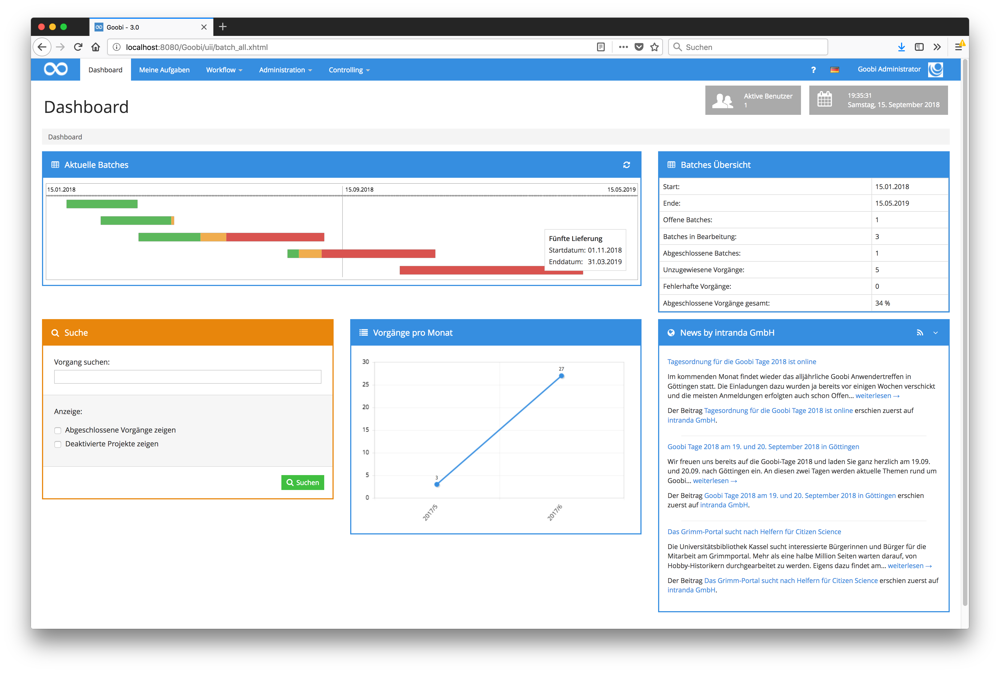
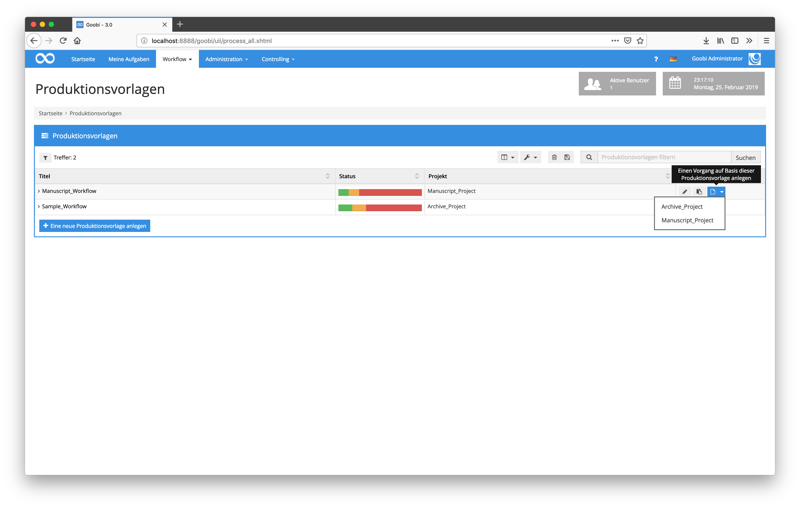

# Mai 2018

## Speicherung von Dateigrößen innerhalb der Goobi-Datenbank

Zur Gewährleistung der Möglichkeit weitere individuelle Statistiken erzeugen zu können, wird ab jetzt für die einzelnen Ordner eines jeden Vorgangs auch der jeweilige Speicherplatz mit innerhalb der Datenbank gecacht. Dies vermeidet das wiederholte Abfragen von Speichergrößen aus dem Dateisystem und gewährleistet so eine bessere Unterstützung von Speichersystem wie S3.

[https://github.com/intranda/goobi/commit/90f694e5e41ee7c3eb4c86e7c7027c3461c3f43d](https://github.com/intranda/goobi/commit/90f694e5e41ee7c3eb4c86e7c7027c3461c3f43d)

## Batches können nun Titel und eine Laufzeit haben

Bisher konnten Batches lediglich einen Identifier haben. Mit den neuen Entwicklungen können nun zusätzlich sprechende und suchbare Titel vergeben werden.



Diese Titel werden somit auch innerhalb der Spalte für Batches sowohl in den Vorgängen als auch in den eigenen Aufgaben mit aufgeführt und können über den Suchfilter `batch:` gefiltert werden.

```text
"batch:Vierte Lieferung"
```



Sind für Batches neben einem Titel ausserdem Datumsangaben für Start und Ende der Laufzeit eingetragen, so werden diese Batches innerhalb des Dashboards von Goobi automatisch abhängig von Ihrer Laufzeit und Ihrem tatsächlichen Fortschritt visualisiert.



[https://github.com/intranda/goobi/commit/1854d76fbfb8c6b268a8697c87e6fd1bb82c9bf4](https://github.com/intranda/goobi/commit/1854d76fbfb8c6b268a8697c87e6fd1bb82c9bf4) [https://github.com/intranda/goobi/commit/fb00653ddf3474a5a09ee7a282965d0bdf6efbc0](https://github.com/intranda/goobi/commit/fb00653ddf3474a5a09ee7a282965d0bdf6efbc0) [https://github.com/intranda/goobi/commit/35c181677742380a4f195088379a0503d91b4d6e](https://github.com/intranda/goobi/commit/35c181677742380a4f195088379a0503d91b4d6e)

## Produktionsvorlagen können nun für mehrere Projekte verwendet werden

Bisher gehörte eine Produktionsvorlage stets zu einem einzigen Projekt. Dadurch mussten häufig die gleichen Produktionsvorlagen mehrfach für jedes Projekt existieren, auch wenn sie inhaltlich identisch aufgebaut waren. Mit der neuen Änderung innerhalb der Nutzeroberfläche ist dies nun nicht mehr notwendig. Innerhalb der Schaltfläche zum Verwenden einer Produktionsvorlage besteht nun die Möglichkeit, die gleiche Produktionsvorlage auch für ein anderes Projekt zu verwenden. Aufgelistet werden dabei ausschließlich diejenigen Projekte, für die der aktuelle Nutzer eine Berechtigung besitzt.



[https://github.com/intranda/goobi/commit/4437ceab503cee708b7a4e40497bd364b86d3242](https://github.com/intranda/goobi/commit/4437ceab503cee708b7a4e40497bd364b86d3242) [https://github.com/intranda/goobi/commit/c9edc5db6ba0ef810c4f49e0394577e527e8abd8](https://github.com/intranda/goobi/commit/c9edc5db6ba0ef810c4f49e0394577e527e8abd8) [https://github.com/intranda/goobi/commit/5f99d3810c940ad1f38b568eaecdcc4514b197dd](https://github.com/intranda/goobi/commit/5f99d3810c940ad1f38b568eaecdcc4514b197dd)