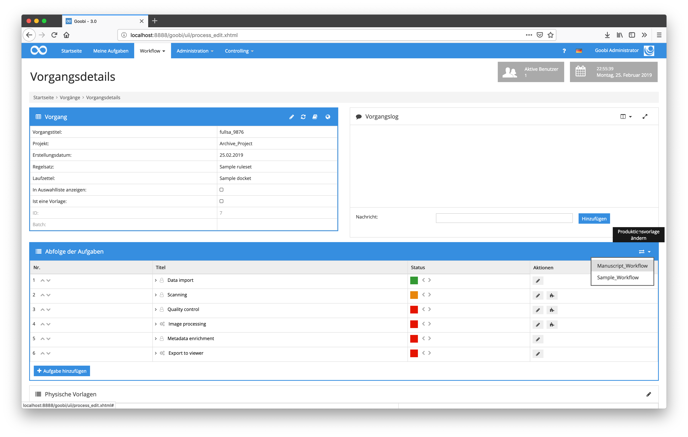

# Juni 2018

## Neues GoobiScript für die Bearbeitung von Metadaten

Es gibt nun mehrere neue GoobiScripts für die Manipulation von Metadaten innerhalb von METS-Dateien. Dieses GoobiScript kann wie alle anderen für mehrere Vorgänge gleichzeitig aufgerufen und ausgeführt werden. So ist es unter anderem möglich bestehende Metadaten in Masse zu ändern, zu ergänzen oder zu löschen.

Die neuen GoobiScripts sehen beispielhaft wie folgt aus:

```
action:metadataAdd field:MY_METADATA_FIELD value:MY_VALUE position:top_OR_child
action:metadataReplace field:MY_METADATA_FIELD search:OLD_VALUE replace:NEW_VALUE position:top_OR_child
action:metadataChange field:MY_METADATA_FIELD "prefix:MY_PREFIX" "suffix:MY_SUFFIX" position:top_OR_child "condition:MY_OPTIONAL_VALUE_THAT_SHOULD_BE_PRESENT"
action:metadataDelete field:MY_METADATA_FIELD value:MY_VALUE position:top_OR_child ignoreValue:true_OR_false_USE_IF_CURRENT_VALUE_SHALL_BE_IGNORED
```


[https://github.com/intranda/goobi/commit/315c0cf6d0169ead27db6358865434c8ab2dcd68](https://github.com/intranda/goobi/commit/315c0cf6d0169ead27db6358865434c8ab2dcd68) [https://github.com/intranda/goobi/commit/9a67111071953a77b33cb983f856f13fc5a74b8c](https://github.com/intranda/goobi/commit/9a67111071953a77b33cb983f856f13fc5a74b8c)

## Neue Funktionalität zum Ändern eine Workflows für einen bereits laufenden Vorgang

Um einen Vorgang im Nachhinein zu einem anderen Workflow zu konfigurieren besteht nun die Möglichkeit, dies über einen Button direkt auszuführen, ohne dass ein Vorgang manuell Schritt für Schritt geändert werden muss. Auch muss der Vorgang nicht neu angelegt werden. Stattdessen wird, sofern der Nutzer über die entsprechenden Rechte verfügt, der neu zu verwendende Workflow einfach ausgewählt. Alle bereits ausgeführten Arbeitsschritte werden in ihrem Status in dem neuen Workflow auf den gleichen Status gesetzt, sofern diese dort ebenfalls mit gleichem Namen vertreten sind.



Zu beachten ist hierbei, dass der Nutzer in einer Benutzergruppe Mitglied sein muss, die über das Recht `Produktionsvorlage nachträglich ändern` verfügt. Fehlt dieses Recht, muss es einer der Benutzergruppen zunächst hinzugefügt werden.


[https://github.com/intranda/goobi/commit/1981b70282afbc05ca233a41f3f56b182d70e826](https://github.com/intranda/goobi/commit/1981b70282afbc05ca233a41f3f56b182d70e826) [https://github.com/intranda/goobi/commit/f200bf9f8357d270f2c6698ec08fafe077a1d587](https://github.com/intranda/goobi/commit/f200bf9f8357d270f2c6698ec08fafe077a1d587) [https://github.com/intranda/goobi/commit/9ac738a64d1605d4606b462410751689d7c7e8ec](https://github.com/intranda/goobi/commit/9ac738a64d1605d4606b462410751689d7c7e8ec)

## Neues GoobiScript zur Änderung des Workflows für mehrere laufende Vorgänge

Um den Workflow gleich für mehrere Vorgänge gemeinsam ändern zu können, wurde ein neues GoobiScript eingeführt. Der Aufruf dieses GoobiScripts lautet wie folgt:

```
action:changeProcessTemplate templateName:MyOtherProcessTemplate
```


[https://github.com/intranda/goobi/commit/40297d1b05c8b31197c4830a5d03522c0e008609](https://github.com/intranda/goobi/commit/40297d1b05c8b31197c4830a5d03522c0e008609)

## Zoom innerhalb des METS-Editors mit prozentualer Anzeige

Die Bildanzeige innerhalb des METS-Editors wurde dahingehend erweitert, dass ein Zoom nun mittels Zoom-Slider möglich ist. Zugleich wird nun außerdem die aktuelle Zoomstufe als prozentualer Wert neben dem Zoom-Slider mit angezeigt. Darüber hinaus ist der Prozentwert für den Zoom auch mittels Tastatur eingebbar, um direkt die gewünschte Vergrößerung zu erhalten.


[https://github.com/intranda/goobi/commit/ad136df09f33b59adf92b82caba8d4523666052f](https://github.com/intranda/goobi/commit/ad136df09f33b59adf92b82caba8d4523666052f) [https://github.com/intranda/goobi/commit/e669135fc50282099def7e9d11b8106b7853229d](https://github.com/intranda/goobi/commit/e669135fc50282099def7e9d11b8106b7853229d)