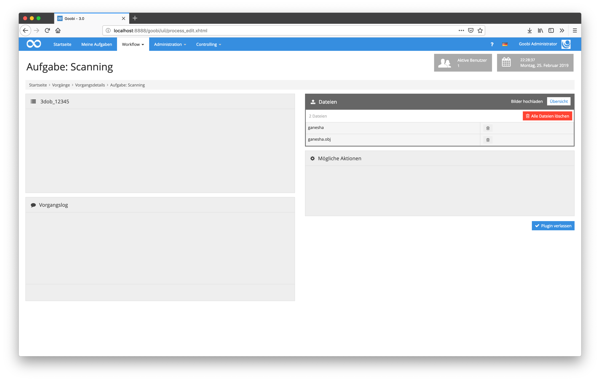
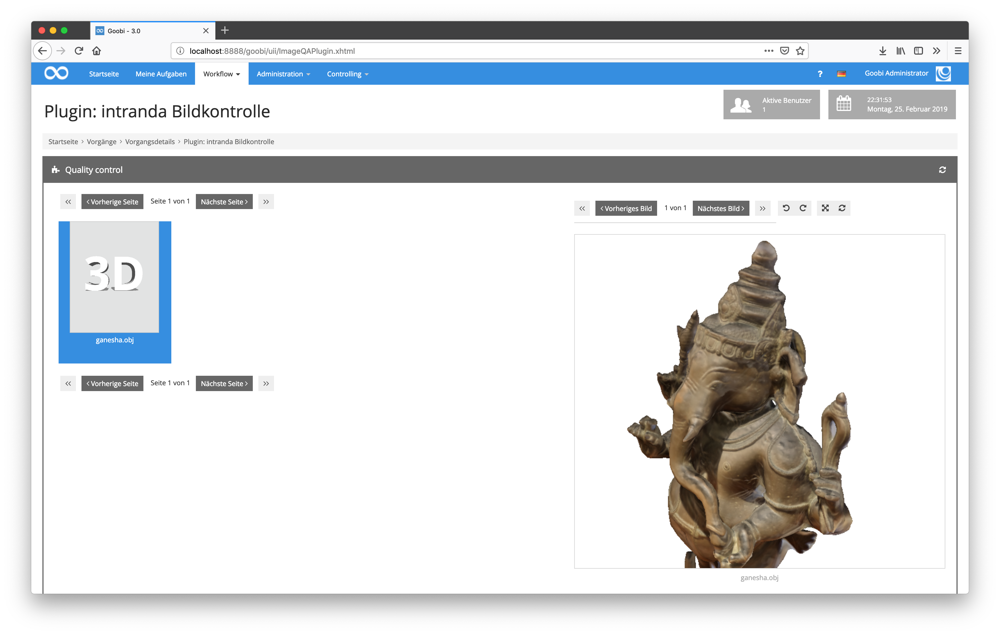
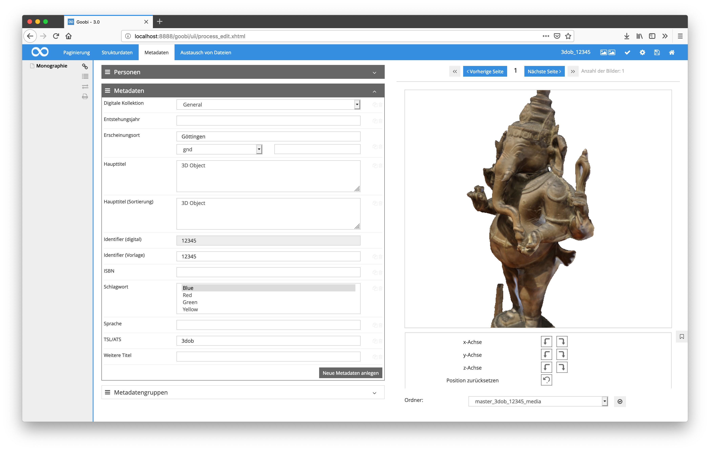

# Juli 2018

## Unterstützung von 3D Objekten im gesamten workflow

Nachdem bereits mehrere Monate an der Unterstützung für die Verarbeitung und Darstellung von 3D-Objekten gearbeitet wurde, ist nun der erste Meilenstein erreicht. 3D-Objekte werden nun im gesamten Workflow unterstützt. Das betrifft sowohl das Hochladen von Dateien als auch die Anzeige innerhalb des Image-QA-Plugins sowie den METS-Editor und auch den Export zum Goobi viewer. Somit sind sowohl Goobi workflow als auch Goobi viewer ab sofort für 3D-Objekte einsetzbar.

[https://github.com/intranda/goobi/commit/bfe18323b67fc7fb9fea159b38d661eb32fce518](https://github.com/intranda/goobi/commit/bfe18323b67fc7fb9fea159b38d661eb32fce518) [https://github.com/intranda/goobi/commit/df51c1d6cba86160937cbaad3c55daa4eb53a1d9](https://github.com/intranda/goobi/commit/df51c1d6cba86160937cbaad3c55daa4eb53a1d9) [https://github.com/intranda/goobi/commit/1a1d0ae7fca052835cf58dfc53dd6afbbf9d6652](https://github.com/intranda/goobi/commit/1a1d0ae7fca052835cf58dfc53dd6afbbf9d6652)