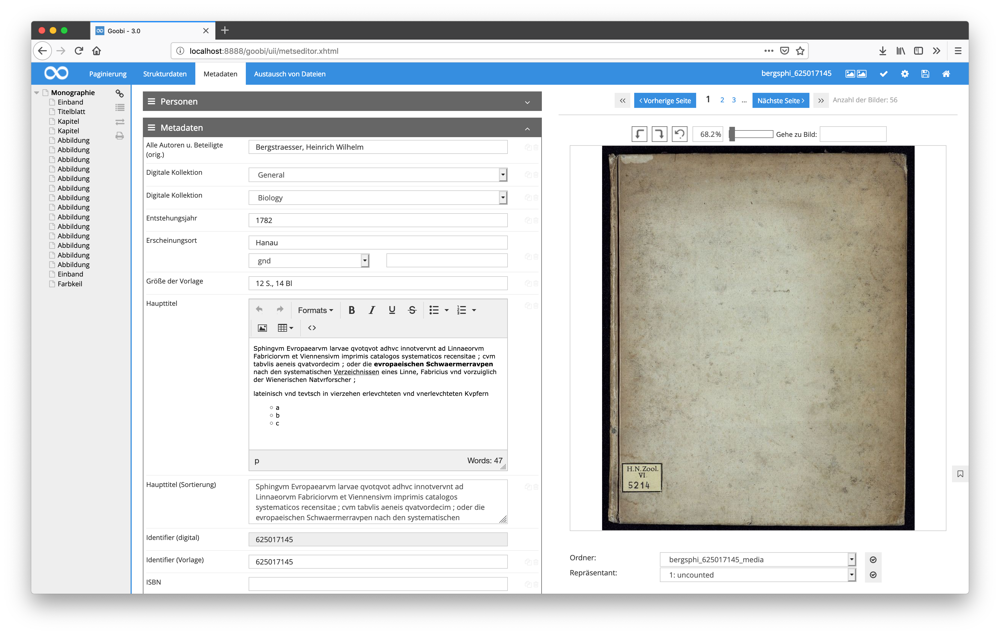
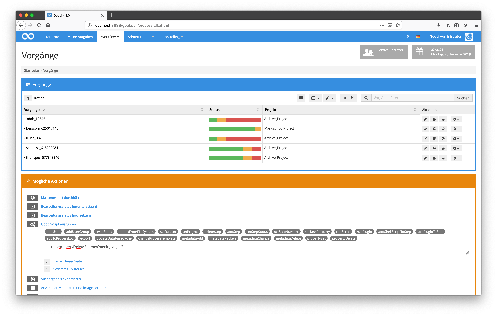
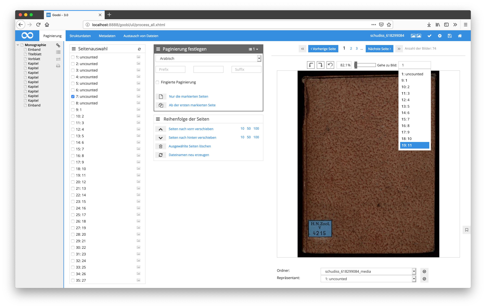

# August 2018

## Unterstützung von S3 als Speichersystem für Goobi workflow

Nach mehrmonatiger Entwicklung wurde die Unterstützung von S3 als Speichersystem für Goobi workflow nun integriert. Damit ist ein Betrieb von Goobi innerhalb der Amazon Cloud unter Nutzung der hierfür passenden Speicherstruktur nun möglich geworden.

[https://github.com/intranda/goobi/commit/ab154014f8e03ecc34973eacdd78a0564afe52cc](https://github.com/intranda/goobi/commit/ab154014f8e03ecc34973eacdd78a0564afe52cc) [https://github.com/intranda/goobi/commit/2f14bd25911d1715004dc93d3a9b863af8e1b316](https://github.com/intranda/goobi/commit/2f14bd25911d1715004dc93d3a9b863af8e1b316) [https://github.com/intranda/goobi/commit/b591884c3d234bffefe0a49aaac7e5b2f2119ec2](https://github.com/intranda/goobi/commit/b591884c3d234bffefe0a49aaac7e5b2f2119ec2) [https://github.com/intranda/goobi/commit/2c42756520a3365f078c3e94e77817edca3426f7](https://github.com/intranda/goobi/commit/2c42756520a3365f078c3e94e77817edca3426f7) [https://github.com/intranda/goobi/commit/9ef20712319f8a7b1bdad3bcb5b0dc6d4aa764ab](https://github.com/intranda/goobi/commit/9ef20712319f8a7b1bdad3bcb5b0dc6d4aa764ab)

## Neuer Typ für Bearbeitungsfelder im METS-Editor

Neben den bestehenden Bearbeitungsfeldern wie InputBox, SelectBox, MultiSelectBox, TextArea und einigen weiteren wurde im METS-Editor nun ein neuer Typ für die Bearbeitung von Metadaten ergänzt. Dieser dient zur Bearbeitung von RichText-Daten und erlaubt somit eine Erfassung von Texten samt Formatierungsvorgaben. Die Speicherung erfolgt dabei innerhalb der METS-Datei als HTML.

Die Konfiguration dieses neuen Feldtyps erfolgt innerhalb der Datei `goobi_metadataDisplayRules.xml` beispielhaft so:

```markup
  <htmlInput ref="TitleDocMain">
      <label></label>
  </htmlInput>
```



[https://github.com/intranda/goobi/commit/365f575e3ffd2f4fb6657f51a067be01ff5d7802](https://github.com/intranda/goobi/commit/365f575e3ffd2f4fb6657f51a067be01ff5d7802)

## Begrenzung von Anfragen zur GND

Um im Falle der Nichterreichbarkeit der Gemeinsamen Nordatendatei der DNB weiterhin eine korrekte Funktion zu gewährleisten, erfolgt die Abfrage der GND nun nur noch mit maximal drei Versuchen. Im Falle einer fehlerhaften Kommunikation werden somit weitere Versuche und eine weitere Wartezeit für den Nutzer vermieden.

[https://github.com/intranda/goobi/commit/5928186a80f72f632d48000d00ea9ff3b9817b36](https://github.com/intranda/goobi/commit/5928186a80f72f632d48000d00ea9ff3b9817b36)

## Neues GoobiScript zum Hinzufügen und Ändern von Eigenschaften

Neben den bestehenden GoobiScripts gibt es nun mehrere neue Scripts für die Bearbeitung von Vorgangseigenschaften. Mit diesen neuen Aufrufen ist es nun für mehrere Vorgänge gemeinsam möglich, bestehende Eigenschaften zu ändern oder zu löschen sowie neue Eigenschaften hinzuzufügen.

```
action:propertySet name:PROPERTY_TITLE value:MY_VALUE
action:propertyDelete name:PROPERTY_TITLE
```



[https://github.com/intranda/goobi/commit/e75188caac225af59470f2943e8dfd67b84a6f56](https://github.com/intranda/goobi/commit/e75188caac225af59470f2943e8dfd67b84a6f56)

## Begrenzung der Anzeige von Vorschlägen innerhalb des METS-Editors

Innerhalb des METS-Editors schlägt Goobi den Nutzer für mehrere Felder Inhalte vor. Diese Vorschlagliste wurde nun optisch auf eine bestimmte Höhe begrenzt, um nun auch bei sehr vielen Vorschlägen noch immer gut bedienbar zu sein.



[https://github.com/intranda/goobi/commit/73bd0950899f177ca0ebd9ddb25e64b8f52426b0](https://github.com/intranda/goobi/commit/73bd0950899f177ca0ebd9ddb25e64b8f52426b0) [https://github.com/intranda/goobi/commit/6cbc17a50807a2f363f2da9dca3ae6c11f16a912](https://github.com/intranda/goobi/commit/6cbc17a50807a2f363f2da9dca3ae6c11f16a912)