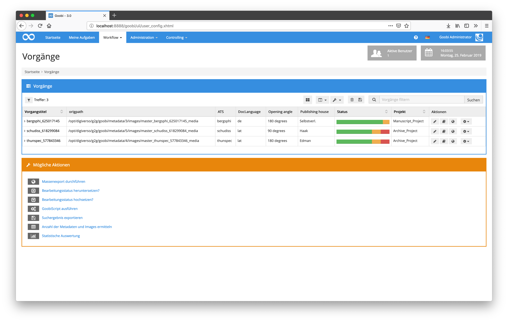
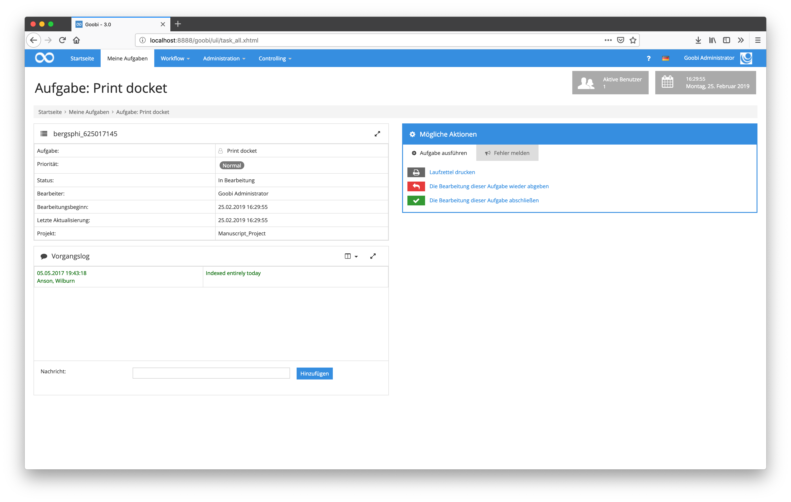

# September 2018

## Individuelles Styling von Goobi

Goobi wurde dahingehend erweitert, dass Nutzer nun Einfluss auf die optische Gestaltung nehmen können. Mittels kleinerer CSS-Anweisungen kann so nun jeder Nutzer für seine eigene Oberfläche Farben, Schriften, Abstände und vieles mehr anpassen.

```css
  body {
    font-family: Consolas;
    font-size: 12px !important;
  }
  h1, h2, h3, h4, h5 {
    font-family: 'Consolas', sans-serif;
  }
  #navigation {
    background: #ee1edf;
  }
```

Die hier gezeigte Beispielkonfiguration wird innerhalb der Benutzereinstellungen innerhalb des Hilfetextes angezeigt und resultiert in einer optischen Erscheinung wie folgt:


[https://github.com/intranda/goobi/commit/fb3bf47b208ebd8a57e4cb4599ec93f2b3f1a32c](https://github.com/intranda/goobi/commit/fb3bf47b208ebd8a57e4cb4599ec93f2b3f1a32c) [https://github.com/intranda/goobi/commit/48354ee6ea009aff7c35fd6317a97e7e17626cfa](https://github.com/intranda/goobi/commit/48354ee6ea009aff7c35fd6317a97e7e17626cfa)

## Frei konfigurierbare Anzeige von Tabellenspalten

Zusätzlich zu denjenigen Tabellenspalten, die Goobi üblicherweise anzeigt, sind für jeden Nutzer nun weitere Spalten einblendbar. Dies kann jeder Nutzer für sich innerhalb der eigenen Nutzerkonfiguration selbst festlegen.


```text
{origpath},{product.ATS},{meta.DocLanguage},{process.Opening angle},{template.Publishing house}
```

Die einmal dort festgelegten individuellen Spalten werden anschließend für den Nutzer innerhalb der Vorgangsauflistung verwendet.



Und auch innerhalb der Auflistung der eigenen Aufgaben findet diese Einstellung dann Anwendung.


[https://github.com/intranda/goobi/commit/5a62de41c745c17d060161b8ef4201a32946593d](https://github.com/intranda/goobi/commit/5a62de41c745c17d060161b8ef4201a32946593d) [https://github.com/intranda/goobi/commit/718a116f0989a204ba011cd8ba52dac59663908f](https://github.com/intranda/goobi/commit/718a116f0989a204ba011cd8ba52dac59663908f)

## Gesteigerte Performance für Prozessliste

Durch Optimierung der Datenbank-Operationen und mittels einer massiven Reduzierung der Prüfungen innerhalb Dateisystem konnte die allgemeine Geschwindigkeit der Goobi Nutzeroberfläche drastisch gesteigert werden. Dies ist insbesondere innerhalb der Aufgabenliste sowie auch der Vorgangsliste bemerkbar.

[https://github.com/intranda/goobi/commit/b730873e5e6dbacb50a3173c278f12932eec1d94](https://github.com/intranda/goobi/commit/b730873e5e6dbacb50a3173c278f12932eec1d94) [https://github.com/intranda/goobi/commit/9da399a0c5eeb3ab5540a585022579ff8fb94175](https://github.com/intranda/goobi/commit/9da399a0c5eeb3ab5540a585022579ff8fb94175) [https://github.com/intranda/goobi/commit/82626f5900894c35d7e6ac4b36afff13734c4b9c](https://github.com/intranda/goobi/commit/82626f5900894c35d7e6ac4b36afff13734c4b9c)

## Gesteigerte Performance beim Öffnen des Metadateneditors

Beim Einlesen der Daten für den Metadateneditor wurden einige verschachtelte Schleifen mit Dateisystemoperationen entfernt. Dadurch ist das Öffnen des Metadateneditors vor allem bei großen Werken wesentlich schneller geworden.

[https://github.com/intranda/goobi/commit/edd49559719ff7c335c131e1952f306746b74a08](https://github.com/intranda/goobi/commit/edd49559719ff7c335c131e1952f306746b74a08)

## Laufzettel können innerhalb von Aufgaben heruntergeladen werden

Das Drucken des Laufzettels ist nun nicht nur nach dem Erzeugen von Vorgängen möglich, sondern kann nun als eigener Schritt erfolgen. Dazu muss in den Schrittedetails die Checkbox `Laufzettel drucken` aktiviert werden.
 


In der angenommenen Aufgabe steht damit nun ein zusätzlicher Button zur Erzeugung des Laufzettels zur Verfügung.



[https://github.com/intranda/goobi/commit/03e38a7fa23025e2d0727b703588a7799e34bc06](https://github.com/intranda/goobi/commit/03e38a7fa23025e2d0727b703588a7799e34bc06) [https://github.com/intranda/goobi/commit/7547ef2c301740497e72cb94c8b9807caf7e3231](https://github.com/intranda/goobi/commit/7547ef2c301740497e72cb94c8b9807caf7e3231)

## Überarbeitung der Usability für den METS-Editor

Der METS-Editor wurde dahingehend überarbeitet, dass die Bildanzeige nun den zur Verfügung stehenden Platz optimal ausnutzt. Dazu wurde der gesamte Aufbau des METS-Editors so angepasst, dass alle Elemente responsive angezeigt werden. Dies erlaubt neben der besseren Anzeige des Bildcontainers zugleich ebenso, dass eine Bedienung auf mobilen Endgeräten mit kleineren Bildschirmgrößen von nun an ebenso möglich ist.

[https://github.com/intranda/goobi/commit/138e25e56ceed14c89cee494d98032afe28e954a](https://github.com/intranda/goobi/commit/138e25e56ceed14c89cee494d98032afe28e954a) [https://github.com/intranda/goobi/commit/71ff70b42029d7058d9b55109ba9bef9a820c1a6](https://github.com/intranda/goobi/commit/71ff70b42029d7058d9b55109ba9bef9a820c1a6) [https://github.com/intranda/goobi/commit/625a7d7984333880271484e999f2273263d7dacd](https://github.com/intranda/goobi/commit/625a7d7984333880271484e999f2273263d7dacd)