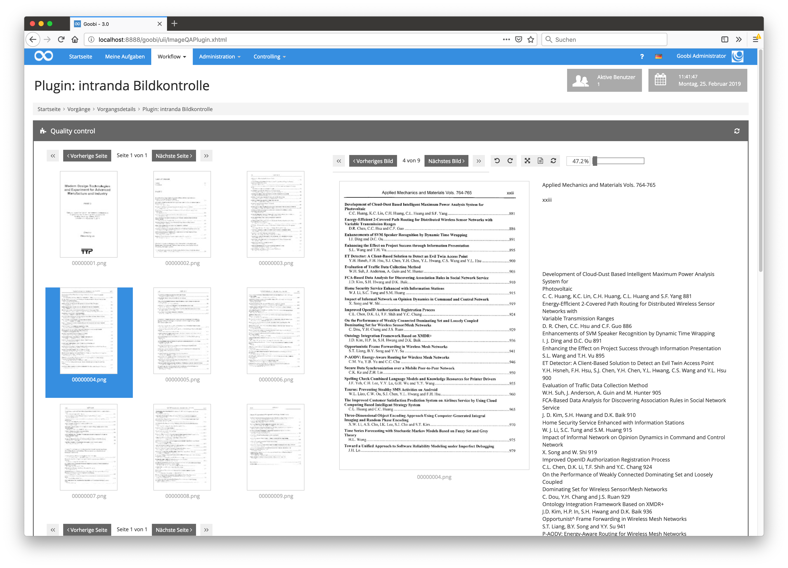

# Oktober 2018

## Optimierte Bildanzeige innerhalb des METS-Editors

Der Metadaten-Editor wurde für eine bessere Bildanzeige noch einmal weiter überarbeitet. Insbesondere für die ideale Anzeige unter Berücksichtigung von Bildhöhe und Bildbreite erfolgte noch einmal eine Optimierung. Unter anderem ist hierbei auch der Zoom sowie eine prozentuale Anzeige der Bildgröße ermöglicht worden.


[https://github.com/intranda/goobi/commit/4e9c2723cb7d1e336c6ae56ba2c34b5026cb378d](https://github.com/intranda/goobi/commit/4e9c2723cb7d1e336c6ae56ba2c34b5026cb378d) [https://github.com/intranda/goobi/commit/138e25e56ceed14c89cee494d98032afe28e954a](https://github.com/intranda/goobi/commit/138e25e56ceed14c89cee494d98032afe28e954a) [https://github.com/intranda/goobi/commit/625a7d7984333880271484e999f2273263d7dacd](https://github.com/intranda/goobi/commit/625a7d7984333880271484e999f2273263d7dacd) [https://github.com/intranda/goobi/commit/ebfa7fa3ef743f4546a21b8551847c4ef2a96793](https://github.com/intranda/goobi/commit/ebfa7fa3ef743f4546a21b8551847c4ef2a96793)

## Neue Authentifizierungs-Konfiguration für die REST-API

Für die `REST-API` wurde eine komplett neue und deutlich flexiblere Authentifizierungs-Konfiguration geschaffen. Diese erlaubt von nun an das Sperren und Freigeben einzelner HTTP-Methoden (`GET`, `POST` etc.)

Eine Beispiel-Konfiguration, mit einer `regular expression` für den Pfad und die zugehörigen Netzmasken ist hier zu sehen. Sie erlaubt ausschließlich `PUT` Requests gegen jeden Pfad, der zu dem regulären Ausdruck passt.

```markup
<config>
<endpoint path="/processes/\d*?/properties/.*?">
    <method name="put">
        <allow netmask="127.0.0.1/32" token="geheim" />
        <allow netmask="192.168.178.0/24" token="geheim" />
        <allow netmask="0:0:0:0:0:0:0:1/128" token="geheim" />
    </method>
</endpoint>
</config>
```

[https://github.com/intranda/goobi/commit/b85f2af5ab550220ebadea1cda0563bba57a3398](https://github.com/intranda/goobi/commit/b85f2af5ab550220ebadea1cda0563bba57a3398)

## Einfache CORS-Konfiguration für die REST-API

Die neue Konfiguration erlaubt auch das einfache Zulassen von `cross-origin` Anfragen aus dem Browser. Die folgende Beispiel-Konfiguration zeigt die Freischaltung von `CORS`-Anfragen von der Domain `https://intranda.com` mit den Methoden `GET` und `POST`.  
Dabei sind die eigentlichen `GET` und `POST` Aufrufe ohne IP- und Token-Beschränkungen erlaubt.

```markup
<endpoint path="/processes/search">
    <cors>
        <method>GET</method>
        <method>POST</method>
        <origin>https://intranda.com</origin>               
    </cors>
    <method name="get">
        <allow />
    </method>
    <method name="post">
        <allow />
    </method>
</endpoint>
```

[https://github.com/intranda/goobi/commit/eb53974280cfd2d5c1d6ae42c0944e0d44a0a1a8](https://github.com/intranda/goobi/commit/eb53974280cfd2d5c1d6ae42c0944e0d44a0a1a8) [https://github.com/intranda/goobi/commit/85413db9a024f55cbec47f704257297b51eab413](https://github.com/intranda/goobi/commit/85413db9a024f55cbec47f704257297b51eab413)

## Anzeige von Volltexten innerhalb des Image-QA-Plugins

Das Plugin für die Qualitätskontrolle von Digitalisaten wurde dahingehend überarbeitet, dass nun neben den Bildern zusätzlich ebenfalls der Volltext eingeblendet werden kann, sofern dieser bereits vorliegt. Hierfür muss der Workflow natürlich so konfiguriert sein, dass eine Volltexterkennung bereits im Vorfeld stattgefunden haben muss.



[https://github.com/intranda/goobi-plugin-step-imageqa/commit/847076ebd0728e7e44f037c83180e36c1ec193e2](https://github.com/intranda/goobi-plugin-step-imageqa/commit/847076ebd0728e7e44f037c83180e36c1ec193e2) [https://github.com/intranda/goobi-plugin-step-imageqa/commit/f23ed047d1d81e6b54269ffb785ebae952ec7538](https://github.com/intranda/goobi-plugin-step-imageqa/commit/f23ed047d1d81e6b54269ffb785ebae952ec7538) [https://github.com/intranda/goobi-plugin-step-imageqa/commit/dd124f738e9143fb34d0e4750307ff162812c0e2](https://github.com/intranda/goobi-plugin-step-imageqa/commit/dd124f738e9143fb34d0e4750307ff162812c0e2) [https://github.com/intranda/goobi-plugin-step-imageqa/commit/705bb11d91d996fd7552208d18b458587bd4372e](https://github.com/intranda/goobi-plugin-step-imageqa/commit/705bb11d91d996fd7552208d18b458587bd4372e)