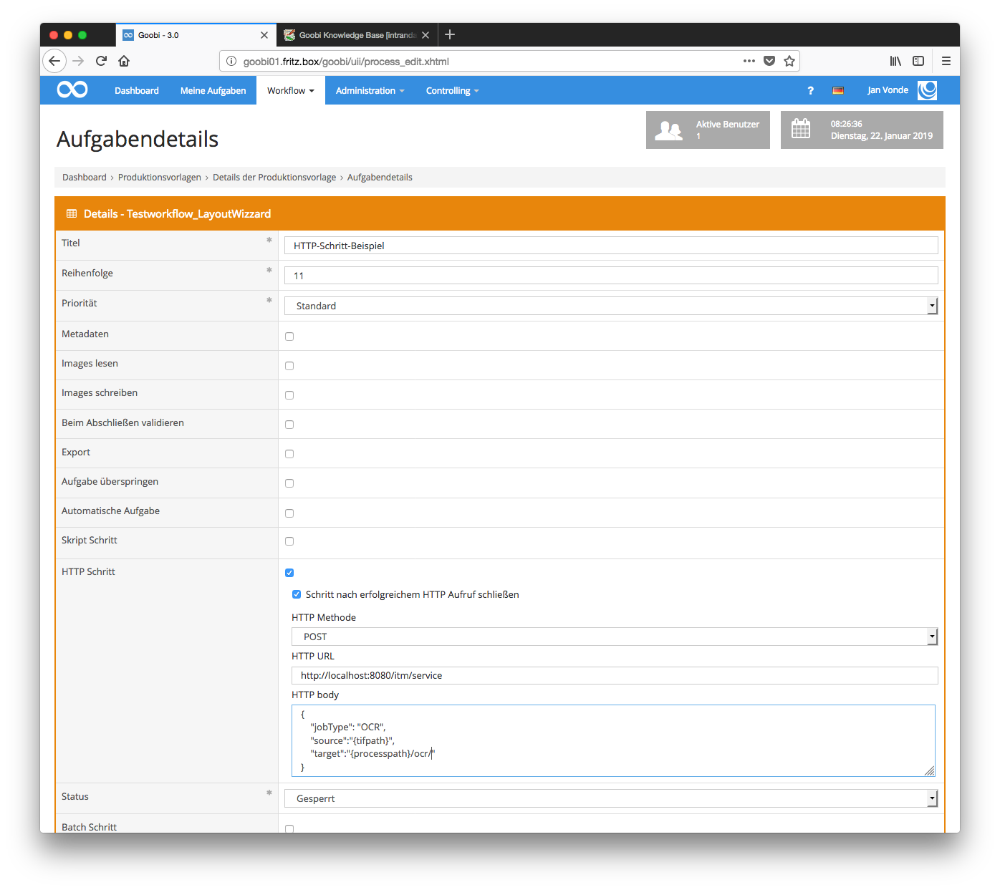

# November 2018

## Endgültige Umstellung auf maven als build-tool

Nach der Durchführung umfangreicher Tests wurde die interne Verwaltung von Programmbibliotheken sowie das Zusammenspiel mit den derzeit 170 Plugins auf [Maven](https://maven.apache.org/) umgestellt. Dies erlaubt eine einfachere Nutzung wiederholt benötigter Funktionalitäten über eingebundene Module und Libraries. Wie auch in der Vergangenheit erlaubt die Umstellung von [Ant](https://ant.apache.org/) zu Maven auch weiterhin, dass die in einem Applikationsserver wie [Apache Tomcat](http://tomcat.apache.org/) installierbare `*.war` Datei sowie auch eine `*.jar` Datei kompiliert werden können.

Mit den innerhalb von Maven-Projekten vorliegenden [pom.xml](https://github.com/intranda/goobi/blob/master/Goobi/pom.xml) ist es von nun an auch für alle Interessierten relativ einfach möglich, sich selbst ein Goobi aus Github herunterzuladen und zu kompilieren oder selbst zu entwickeln mit Kommandos wie:

```bash
git clone https://github.com/intranda/goobi.git
mvn install
```

Mittels dieser Aufrufe wird der Quellcode von Goobi bereits von Github heruntergeladen und anschließend kompiliert. Die innerhalb des Verzeichnisses `module-war/target/` vorhandene Datei `goobi.war`kann anschließend im Applikationsserver installiert werden.

[https://github.com/intranda/goobi/commit/12558bc5279245ca9728558e3315edb59ee2a471](https://github.com/intranda/goobi/commit/12558bc5279245ca9728558e3315edb59ee2a471) [https://github.com/intranda/goobi/commit/dc0c53a55dc7c89ca3e23191013f6dcfd6eb8fc7](https://github.com/intranda/goobi/commit/dc0c53a55dc7c89ca3e23191013f6dcfd6eb8fc7) [https://github.com/intranda/goobi/commit/38e26c12a78eb6577e1fb8dbe152926aa039403b](https://github.com/intranda/goobi/commit/38e26c12a78eb6577e1fb8dbe152926aa039403b) [https://github.com/intranda/goobi/commit/6f8467a0384249c4a7762ff15bc596ba92be8ecd](https://github.com/intranda/goobi/commit/6f8467a0384249c4a7762ff15bc596ba92be8ecd) [https://github.com/intranda/goobi/commit/7b9aea59178caef8524b1b02a47031c4193fbfee](https://github.com/intranda/goobi/commit/7b9aea59178caef8524b1b02a47031c4193fbfee) [https://github.com/intranda/goobi/commit/64a54a6e7d08f358e9c598ae8dcbf530c8802bf1](https://github.com/intranda/goobi/commit/64a54a6e7d08f358e9c598ae8dcbf530c8802bf1)

## Neuer Schritt-Typ für HTTP-Aufrufe

Goobi wurde für einen neuen Schritt-Typ erweitert: den `HTTP-Schritt`. Hier können automatisiert `GET`, `POST` und `PUT requests` ausgeführt werden.

Bei erfolgreichem Aufruf mit zurückgegebenem Statuscode `20x` wird der Arbeitsschritt (wenn so konfiguriert) geschlossen. Eventuell auftretende Fehlermeldungen werden innerhalb des Vorgangslogs gespeichert und können so auch im Nachhinein noch nachvollzogen werden.

Der folgende Screenshot zeigt eine beispielhafte Konfiguration für den Aufruf des TaskManager OCR-Plugins:



Die hier verwendete Konfiguration verwendet `POST`und sendet diese and die Adresse `http://localhost:8080/itm/service`:

```javascript
{
  "jobType":"OCR",
  "source":"{tifpath}",
  "target":"{processpath}/ocr/"
}
```

[https://github.com/intranda/goobi/commit/0a16484b60b3939ba4a79d66b630db5b40537cf6](https://github.com/intranda/goobi/commit/0a16484b60b3939ba4a79d66b630db5b40537cf6) [https://github.com/intranda/goobi/commit/b5be4c238e7ff1da81ac78ecd52fc45e6d0669db](https://github.com/intranda/goobi/commit/b5be4c238e7ff1da81ac78ecd52fc45e6d0669db)

## Unterstützung von JSON Web Tokens für den Zugriff auf die REST-API

Goobi workflow unterstützt nun die Möglichkeit, JSON Web Tokens (JWT) zu erstellen, die den Zugriff auf die API für eine bestimmte Zeit erlauben. Diese JWTs sind als Variable innerhalb von HTTP-Aufrufen vorgesehen. Bisher existiert bereits das JWT `{changesteptoken}`, das es erlaubt, einen bestimmten Arbeitsschritt zu ändern.

[https://github.com/intranda/goobi/commit/d17380c341ebb4dbe1112f3e5834aa7232290a51](https://github.com/intranda/goobi/commit/d17380c341ebb4dbe1112f3e5834aa7232290a51)