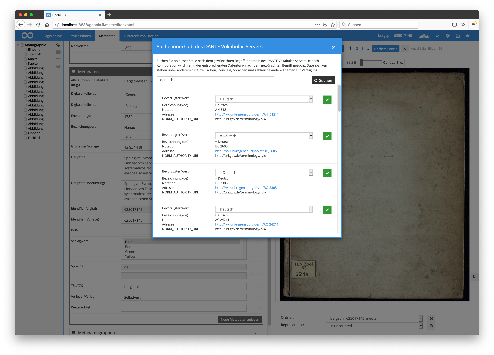

# Dezember 2018

## Erweiterte Unterstützung von Normdaten über DANTE

Neben den bereits seit längerem nutzbaren Metadatenfeldern für Textareas, Selectmenüs, schreibgeschützten Feldern oder der Anbindung von [GeoNames](https://www.geonames.org) und der [GND](https://www.dnb.de/DE/Standardisierung/GND/gnd_node.html) wurde der [DANTE Normdatenservice des GBV](http://dante.gbv.de/) angebunden. Dante stellt derzeit bereits [ca. 90 verschiedene Vokabulare](http://api.dante.gbv.de/voc) zur Verfügung, die alle mit dieser überarbeiteten Implementierung verwendet werden können.

Zur Nutzung der DANTE API muss die Datei `goobi_metadataDisplayRules.xml` um folgende Konfiguration erweitert werden:


```markup
<!-- dante configuration for the metadata field DocLanguage-->
<dante ref="DocLanguage">
    <!-- name of the vocabulary, a list of all vocabularies can be found here:  http://api.dante.gbv.de/voc, the vocabulary name can be found inside of the element notation -->
    <source>languages_gnd</source>
    <!-- the list of fields to import the value from. The list is ordered and the first value that was found will be used for the display. Can be overwritten inside of the UI -->
    <field>NORM_LABEL_de, NORM_LABEL_en, NORM_LABEL_fr, NORM_LABEL_es</field>
</dante>
```


Anschließend steht das jeweilig konfigurierte Feld im METS-Editor zur Verfügung. Mittels des Icons der Lupe wird das Suchformular geöffnet, so dass dort nach dem gewünschten Wert innerhalb des ausgewählten Normdatenvokabulars durchgeführt werden kann. Aus der angezeigten Suchtrefferliste kann der gewünschte Treffer anschliessend ausgewählt werden. Innerhalb des gewünschten Treffers kann der zu importierende Wert darüber hinaus aus einer Auswahlliste gewählt und durch einen Klick auf den grünen Button bestätigt werden.



[https://github.com/intranda/goobi/commit/b330b9b481939a48cdaca470d353ae2507beb753](https://github.com/intranda/goobi/commit/b330b9b481939a48cdaca470d353ae2507beb753) [https://github.com/intranda/goobi/commit/d61f25f75fd4398e4c3843232500ce8bf2be763c](https://github.com/intranda/goobi/commit/d61f25f75fd4398e4c3843232500ce8bf2be763c) [https://github.com/intranda/goobi/commit/24443bafcef10212d99c4ad33cfa23e11ed03793](https://github.com/intranda/goobi/commit/24443bafcef10212d99c4ad33cfa23e11ed03793) [https://github.com/intranda/goobi/commit/cf9b0993f64cf807e9c039657008425c207ad5cb](https://github.com/intranda/goobi/commit/cf9b0993f64cf807e9c039657008425c207ad5cb)

## Korrektur der Ermittlung von Verzeichnisgrößen bei Nutzung von S3

Die Anbindung von [Amazon S3](https://de.wikipedia.org/wiki/Amazon_S3) als Storagesystem für die Speicherung großer Datenmengen ist in den vergangengen Monaten bereits massiv fortgeschritten. Während dieser Arbeiten wurden immer auch weitere Verbesserungen und Fehlerkorrekturen notwendig. So ist neben einer Verringerung der Dateizugriffe unter anderem auch die Ermittlung von Verzeichnisgrößen überarbeitet worden, die bei der Benutzung von S3 nicht immer korrekte Ergebnisse geliefert hat.

[https://github.com/intranda/goobi/commit/152e3787d5dd9651b5e9f65a0be8cb454e0b0c54](https://github.com/intranda/goobi/commit/152e3787d5dd9651b5e9f65a0be8cb454e0b0c54) [https://github.com/intranda/goobi/commit/8c8d6e48660e78058751fa3da688453024c08ba5](https://github.com/intranda/goobi/commit/8c8d6e48660e78058751fa3da688453024c08ba5)

## Neues Plugin für den Import von Provinienzdaten aus dem GBV-Katalog

Wenn im [GBV Katalog](http://gso.gbv.de) bereits Provinienzdaten erfasst wurden, lassen sich diese von nun an mit importieren. Da diese Metadaten jedoch nicht innerhalb des `MARC` Datensatzes enthalten sind, können sie beim initialen Import der Metadaten nicht mit übernommen werden. Der Import findet daher in einem zweiten Schritt statt. Hierzu wird über die `EPN` des `A-Satzes` nach dem zugehörigen `Pica+` Datensatz gesucht. Anschließend wird geprüft, ob für das verwendete Exemplar Provenienzangaben vorliegen. Diese Prüfung findet über das Matching der `EPN` im Feld `092B$2` und des Bibliothekssigels innerhalb des Feldes `092B$1` statt.

Um das Plugin nutzen zu können, muss im Regelsatz eine Metadatengruppe `Provenience` existieren:


```markup
<MetadataType>
    <Name>ProvenienceCode</Name>
    <language name="de">Code</language>
    <language name="en">ProvenienceCode</language>
  </MetadataType>
  <MetadataType normdata="true">
    <Name>ProveniencePrevOwner</Name>
    <language name="de">Besitzer</language>
    <language name="en">ProveniencePrevOwner</language>
  </MetadataType>
  <MetadataType>
    <Name>ProvenienceCharacteristic</Name>
    <language name="de">Characteristik</language>
    <language name="en">ProvenienceCharacteristic</language>
  </MetadataType>
  <MetadataType>
    <Name>ProvenienceDate</Name>
    <language name="de">Datum</language>
    <language name="en">ProvenienceDate</language>
  </MetadataType>
  <MetadataType>
    <Name>ProvenienceExplanation</Name>
    <language name="de">Erläuterung</language>
    <language name="en">ProvenienceExplanation</language>
  </MetadataType>
  <MetadataType>
    <Name>ProvenienceGND</Name>
    <language name="de">GND</language>
    <language name="en">ProvenienceGND</language>
  </MetadataType>
  <Group>
    <Name>Provenience</Name>
    <language name="de">Provenienz</language>
    <language name="en">Provenience</language>
    <metadata>ProvenienceCode</metadata>
    <metadata>ProveniencePrevOwner</metadata>
    <metadata>ProvenienceCharacteristic</metadata>
    <metadata>ProvenienceDate</metadata>
    <metadata>ProvenienceExplanation</metadata>
    <metadata>ProvenienceGND</metadata>
  </Group>
```


Weitere Anpassungen sind nicht nötig. Das Plugin selbst ist Teil der Sammlung `goobi-plugin-opac-marc.jar` und kann über den Namen `HaabProvenienceOpac` angesprochen werden. Eine Freischaltung innerhalb der Konfigurationsdatei `goobi_opac.xml` ist nicht möglich, da das Plugin nur die Provenienz-Metadaten ausliefert und keine Strukturelemente erzeugt werden. Um es in den Workflow als Schritt nach dem initialen Import zu integrieren, wird außerdem das Schritteplugin `intranda_step_provenience_request` aus dem Repository `goobi-plugin-step-catalogue-request` benötigt.

## Import von EAD Datensätzen direkt in Goobi

Goobi ist nun in der Lage, einzelne Datensätze aus EAD Findbüchern zu importieren. Dazu werden die in XML vorliegenden EAD-Datensätze periodisch in die XML Datenbank [BaseX](http://basex.org/) importiert. Diese Datenbank dient ab dem Moment als dynamisch aktualisierter EAD-Speicher und kann mit Hilfe eines speziellen OPAC-Plugins via der Abfragesprache `RESTXQ` anstelle eines typischen Bibliothekskatalog abgefragt werden.

Die Besonderheit gegenüber einem normalen XML-basierten Import ist hier, dass die Tektonik des Findbuches erhalten bleibt, da diese ebenfalls innerhalb der XML-Datenbank hinterlegt ist. Wird die Tektonik geändert und der bereits zuvor importierte Datensatz zu einer anderen Gliederung verschoben, so muss lediglich die EAD-Datei in aktualisierter Form in die XML-Datenbank eingelesen werden. Da hierbei die Identifier der Datensätze erhalten bleiben, kann eine Präsentationssoftware wie der Goobi viewer, die ebenfalls einen Zugriff auf diesen EAD-Speicher hat, den jeweils aktuellen Stand der Tektonik live abfragen.

Weitere detaillierte Informationen über die Implementierung samt einer Installationsanleitung finden sich hier:

[https://docs.intranda.com/goobi-workflow-plugins-de/opac-plugins/opac-ead](https://docs.intranda.com/goobi-workflow-plugins-de/opac-plugins/opac-ead)

## Anzeige von Metadaten innerhalb von Aufgaben und in den Vorgangsdetails

Goobi workflow wurde dahingehend erweitert, dass nun innerhalb einzelner angenommener Aufgaben ebenso wie die Eigenschaften auch gezielt bestimmte Metadaten angezeigt werden können, die aus der METS-Datei stammen.


Die Anzeige dieser Metadaten integriert sich in den Bereich der bereits ebenfalls anzeig- und editierbaren Eigenschaften und kann für jede Aufgabe einzelner Workflows individuell konfiguriert werden. Eine solche Konfiguration sieht innerhalb der Datei `goobi_processProperties.xml` beispielhaft wie folgt aus:


```markup
<metadata name="CatalogIDDigital">
    <project>*</project>
    <showStep name="Print docket" />
</metadata>
<metadata name="DocLanguage">
    <project>*</project>
    <showStep name="Print docket" />
</metadata>
<metadata name="TitleDocMain">
    <project>*</project>
    <showStep name="Print docket" />
</metadata>
```


Die Anzeige der deskriptiven Metadaten ist außerdem ebenfalls innerhalb der Vorgangsdetails möglich. Dafür wurde eigens ein neuer Bereich unterhalb der Aufgaben geschaffen, der diese Metadaten auflistet.


Mit Hilfe dieser neuen Funktionalität und den kommenden Entwicklungen wird künftig die redundante Speicherung einiger Metadaten überflüssig. Informationen, die derzeit noch sowohl als Eigenschaft vorliegen als auch innerhalb der METS-Datei bestehen, können von nun an ausschließlich in der METS-Datei vorgehalten und von dort gelesen werden. Wichtig ist dabei, dass innerhalb der einzelnen Aufgaben des Workflows jeweils die Checkbox `Metadatenindex beim Abschließen aktualisieren` aktiviert wird, um das effizente Cachen der Daten aus der METS-Datei für die Anzeige zu gewährleisten.


Für eine vollständige Aktualisierung des Caches für die schnelle Anzeige dieser Metadaten innerhalb der Weboberfläche kann natürlich ebenfalls das vorhandene GoobiScript `updateDatabaseCache` für mehrere Vorgänge gleichzeitig aufgerufen werden.


[https://github.com/intranda/goobi/commit/0314dfccedf39d3d5d082c66562d1af3a62d47a4](https://github.com/intranda/goobi/commit/0314dfccedf39d3d5d082c66562d1af3a62d47a4) [https://github.com/intranda/goobi/commit/6218226341bdce689b178fdb3aef0bdf297f9b59](https://github.com/intranda/goobi/commit/6218226341bdce689b178fdb3aef0bdf297f9b59) [https://github.com/intranda/goobi/commit/2a278d03a20c3ce22f494b22fbab74a6ef67c36e](https://github.com/intranda/goobi/commit/2a278d03a20c3ce22f494b22fbab74a6ef67c36e) [https://github.com/intranda/goobi/commit/0c50c0401606eeadfc9b3ab33fa55d29b16c7346](https://github.com/intranda/goobi/commit/0c50c0401606eeadfc9b3ab33fa55d29b16c7346) [https://github.com/intranda/goobi/commit/68750e1858ec0a51353110e31c863db02be2291d](https://github.com/intranda/goobi/commit/68750e1858ec0a51353110e31c863db02be2291d)