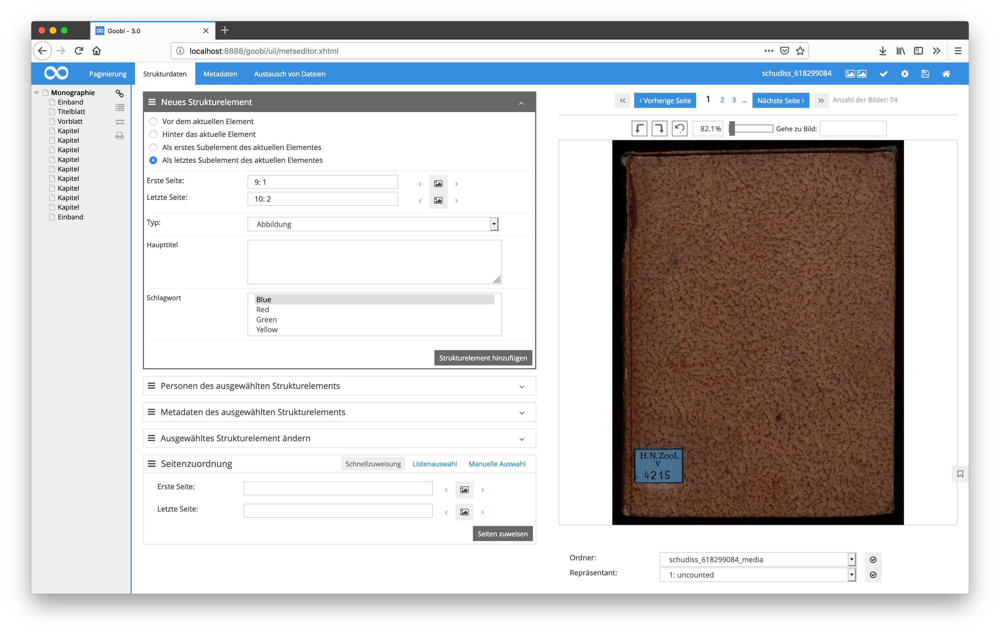
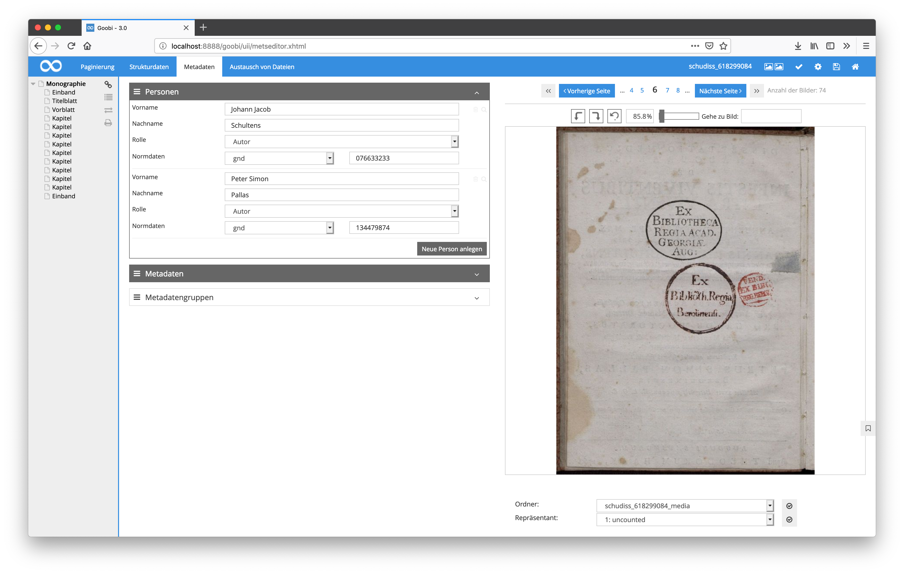
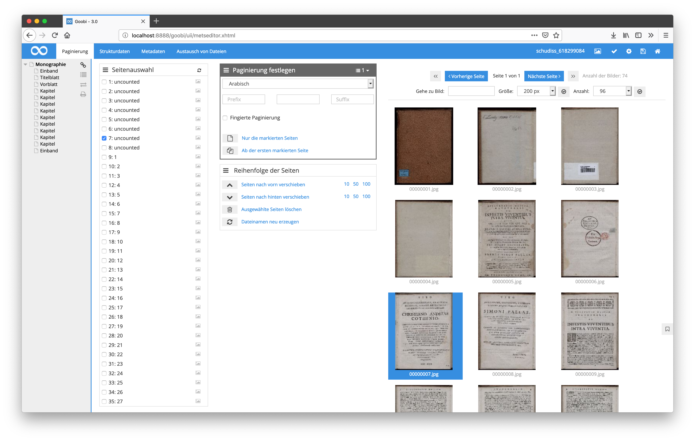
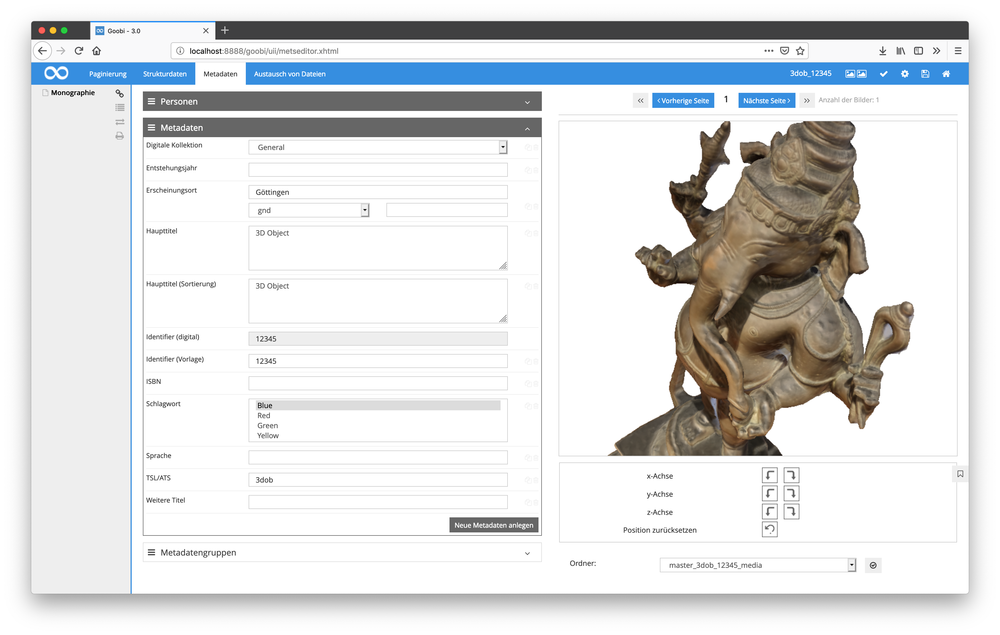
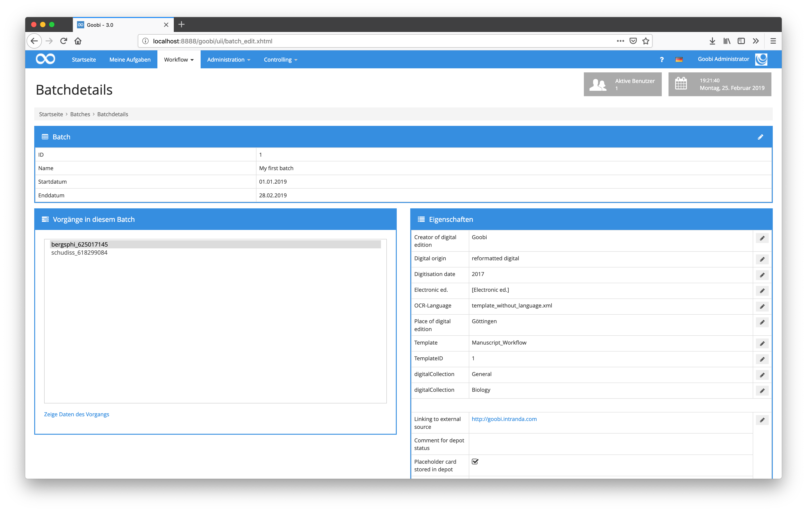

# Januar 2019

## Usability-Anpassungen für die Boxen innerhalb des METS-Editors

Innerhalb des METS-Editors von Goobi gab es noch einmal einige kleinere Verbesserungen für die Bedienbarkeit. So sind ab jetzt die Titelleisten der Boxen in der gesamten Breite anklickbar, um sie auf- oder zuzufahren. Zuvor war dies allein durch ein Klicken der Icons in der Titelleiste rechts außen möglich.

Bedingt durch diese Änderung wurde zugleich die Bedienlogik für das Hinzufügen von Personen und Metadaten an die anderen Bereiche von Goobi workflow angeglichen. Der bisherige Button innerhalb der Titelleiste der Boxen befindet sich von nun an innerhalb der Boxen im unteren rechten Bereich, ebenso wie in den anderen Bereichen zuvor.

[https://github.com/intranda/goobi/commit/6aa0ff7145390eb26a724219d65cdee3601d1961](https://github.com/intranda/goobi/commit/6aa0ff7145390eb26a724219d65cdee3601d1961) [https://github.com/intranda/goobi/commit/10e2d95d5aaca0926260827c7ef48f7961cb4b3b](https://github.com/intranda/goobi/commit/10e2d95d5aaca0926260827c7ef48f7961cb4b3b)

## Überarbeitung der Bildanzeige bei Manipulationen am Bildstapel

Wenn über die von Goobi bereitgestellten Funktionen zum Eingriff in den Bildstapel Veränderungen an der Reihenfolge von Bildern vorgenommen werden, so wird von nun an die Anzeige des geöffneten Bildes korrekt neu geladen. Außerdem ist auch die Logik beim Durchblättern der Thumbnailseiten überarbeitet worden, so dass die Bedienung intuitiver ist.

[https://github.com/intranda/goobi/commit/f7c192c28f12f1c2621de96f2f66a867a68adaaf](https://github.com/intranda/goobi/commit/f7c192c28f12f1c2621de96f2f66a867a68adaaf) [https://github.com/intranda/goobi/commit/314aea5646bad8452de2a6c16ab6a707640e622c](https://github.com/intranda/goobi/commit/314aea5646bad8452de2a6c16ab6a707640e622c)

## Rotation von 3D-Objekten im METS-Editor

Für die korrekte Rotation von 3D-Objekten innerhalb des METS-Editors wird nun der korrekte Mittelpunkt verwendet. Auf diese Weise soll verhindert werden, dass das Objekt während der Rotation den sichtbaren Bereich der Objektanzeige verlassen kann.

[https://github.com/intranda/goobi/commit/c0f24fa18e45a3c7c0a0a3da2ebf80c2fdf0fa63](https://github.com/intranda/goobi/commit/c0f24fa18e45a3c7c0a0a3da2ebf80c2fdf0fa63)

## Korrektur für die Eigenschaften von Batches

Innerhalb der Bearbeitung von Eigenschaften für Batches kam es zu einem Fehlverhalten, so dass die bearbeiteten Eigenschaften fälschlicherweise dupliziert wurden. Dieses Verhalten ist nun konfiguriert worden.

[https://github.com/intranda/goobi/commit/bf2e47d48af47686134fa03d0b4969bea7ed55a8](https://github.com/intranda/goobi/commit/bf2e47d48af47686134fa03d0b4969bea7ed55a8)

## Anpassung von Pfadangaben für Goobi-to-go

Aufgrund der zunehmenden Verbreitung von Goobi-to-go steigt auch der Bedarf nach Kompatibilität mit verschiedenen Betriebssystemen. Insbesondere das Betriebssystem Windows muss hierbei mit einigen Besonderheiten berücksichtigt werden. Aus diesem Grund sind einige Pfad-Angaben insbesondere für den Umgang mit Bildern innerhalb des METS-Editors überarbeitet worden und somit auf lange Sicht einfacher zu warten.

[https://github.com/intranda/goobi/commit/1f7f95846e9535bcddc50462b4e81b78e752d079](https://github.com/intranda/goobi/commit/1f7f95846e9535bcddc50462b4e81b78e752d079)

## Aktualisierung der englischen Nutzeroberfläche von Goobi workflow

Alle bisher nicht in englische übersetzten Texte der Nutzeroberfläche sind vom englischen Übersetzer überprüft, übersetzt und eingespielt worden.

[https://github.com/intranda/goobi/commit/1d55539c2c3ccd114ce65c48eb6e91897424420b](https://github.com/intranda/goobi/commit/1d55539c2c3ccd114ce65c48eb6e91897424420b) [https://github.com/intranda/goobi/commit/5c614ed06f7cbca2959f1285c282867a187e80ee](https://github.com/intranda/goobi/commit/5c614ed06f7cbca2959f1285c282867a187e80ee)