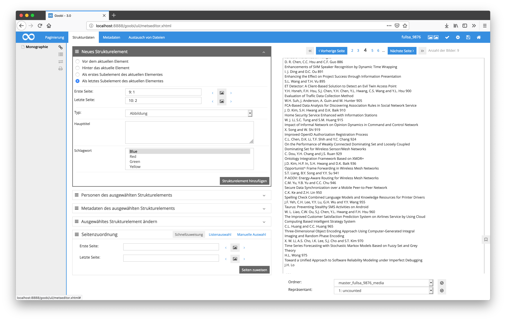
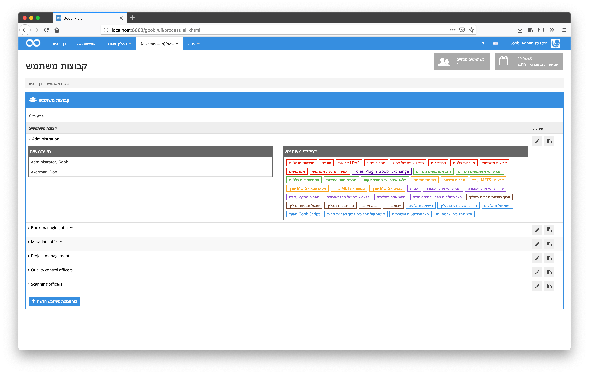
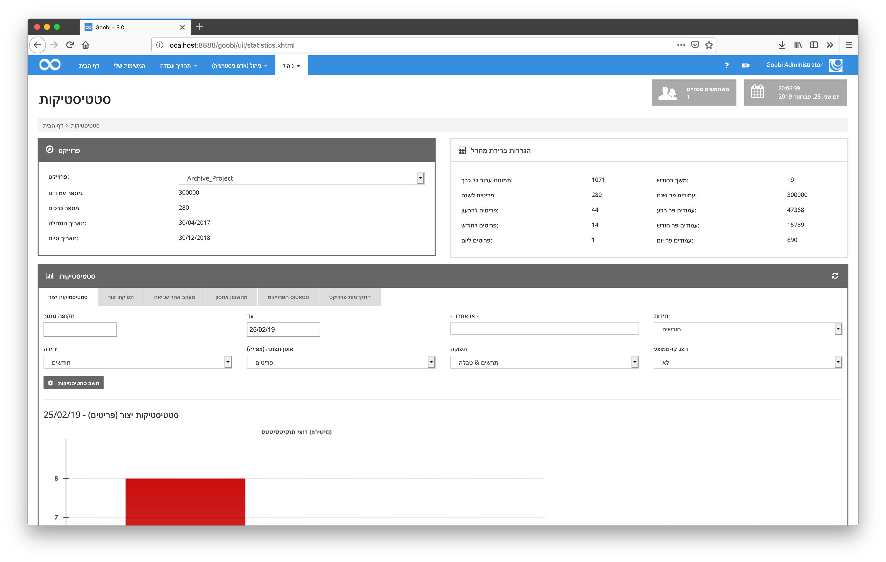

# Februar 2019

## Darstellung längerer OCR-Ergebnisse innerhalb des METS-Editors nun scrollbar

Wenn die Ergebnisse einer Volltexterkennung innerhalb des METS-Editors angezeigt wurden, so ist dieser bei längerem Text etwas abgekürzt dargestellt worden. Diese Darstellung wurde nun so angepasst, dass auch längere Texte problemlos angezeigt werden können, indem der zugehörige Container von nun an scrollbar ist.

[https://github.com/intranda/goobi/commit/888509510484574b10264ce7929260744515a944](https://github.com/intranda/goobi/commit/888509510484574b10264ce7929260744515a944)

## GoobiScript Ergebnisanzeige für besondere Rückgabewerte erweitert

Insbesondere bei der Kommunikation mit externen Programmen, die langlaufende Aufgaben übernehmen, kann Goobi bereits seit längerem mit verschiedenen Rückgabewerten der aufgerufenen Programme umgehen und den Workflow entsprechend behandeln. Die Verarbeitung von `GoobiScript`, um solche externen Programme in Masse für mehrere Vorgänge gemeinsam aufzurufen, konnte mit diesen Rückgabewerten allerdings noch nicht korrekt umgehen und zeigte diese irrtümlicherweise als fehlerhafte Aufrufe an. Dies ist nun korrigiert, so dass auch die Rückgabewerte `98`und `99`als erfolgreich gewertet werden und somit innerhalb von GoobiScript nicht mehr als Fehler angezeigt werden.

[https://github.com/intranda/goobi/commit/5e713f5d04f936506f351bec51de92e707d19604](https://github.com/intranda/goobi/commit/5e713f5d04f936506f351bec51de92e707d19604) [https://github.com/intranda/goobi/commit/9ce09f6c6410b820661e1d556364c8dc345101a1](https://github.com/intranda/goobi/commit/9ce09f6c6410b820661e1d556364c8dc345101a1) [https://github.com/intranda/goobi/commit/a0f1f211566e3e737e4db694395f65b65d1f2b89](https://github.com/intranda/goobi/commit/a0f1f211566e3e737e4db694395f65b65d1f2b89)

## Hebräische Nutzeroberfläche

Dank der Zusammenarbeit mit der [Nationalbibliothek Israel](http://nli.org.il/) ist Goobi workflow von nun an vollständig in hebräisch verfügbar.

[https://github.com/intranda/goobi/commit/b41194ad3ee350177a4ce95f0ec0e27a89f9f608](https://github.com/intranda/goobi/commit/b41194ad3ee350177a4ce95f0ec0e27a89f9f608)

## Vereinheitlichungen innerhalb der JavaScript-Dateien für 3D-Objekte

Für eine bessere Wartbarkeit und auch für das bessere Zusammenspiel von Goobi workflow und Goobi viewer wurden verschiedene JavaScript-Dateien zum Umgang mit 3D-Objekten vereinheitlicht. Dies kommt insbesondere für der Wartbarkeit und der Einarbeitung weiterer Goobi-Entwickler zu Gute.

[https://github.com/intranda/goobi/commit/eaaac77efd856e05a88f7ac39de9b9c8ffe01ab2](https://github.com/intranda/goobi/commit/eaaac77efd856e05a88f7ac39de9b9c8ffe01ab2) [https://github.com/intranda/goobi/commit/32b2e99172a6e31d03b0b3279b01dd02965722de](https://github.com/intranda/goobi/commit/32b2e99172a6e31d03b0b3279b01dd02965722de) [https://github.com/intranda/goobi/commit/76629353b0773e7425203114c65200ac96787e13](https://github.com/intranda/goobi/commit/76629353b0773e7425203114c65200ac96787e13)

## Korrektur des GoobiScripts für den Export zum Goobi viewer

Innerhalb des GoobiScripts für den Export von Vorgängen zum Goobi viewer existierte ein kleiner Fehler, der dafür sorgte, dass OCR-Ergebnisse grundsätzlich exportiert wurden, auch wenn dies im Aufruf deaktiviert war. Dieses Verhalten ist nun korrigiert und noch einmal intensiv geprüft worden.

[https://github.com/intranda/goobi/commit/d7864a6d06a648c20f4f1ec769ec00ffb7b541f8](https://github.com/intranda/goobi/commit/d7864a6d06a648c20f4f1ec769ec00ffb7b541f8)

## Korrektur für Export von Goobi-Vorgängen bei Suche nach Batch-Titeln

Bei der Generierung von Exporten wie z.B. Excel-Dateien kam es zu fehlerhaften Ergebnissen, wenn innerhalb der Suchanfrage eine Filterung nach dem Batch-Titel vorgenommen wurde. Diese Verhalten ist nun korrigiert.

[https://github.com/intranda/goobi/commit/9a94b8f63720951316934704dfbbf24eb6944914](https://github.com/intranda/goobi/commit/9a94b8f63720951316934704dfbbf24eb6944914)