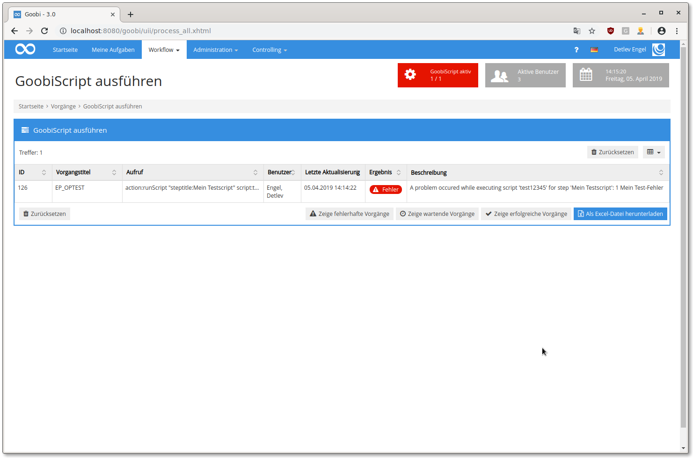
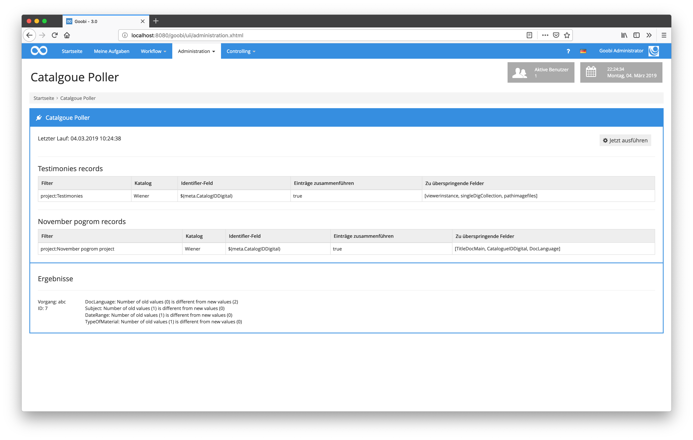
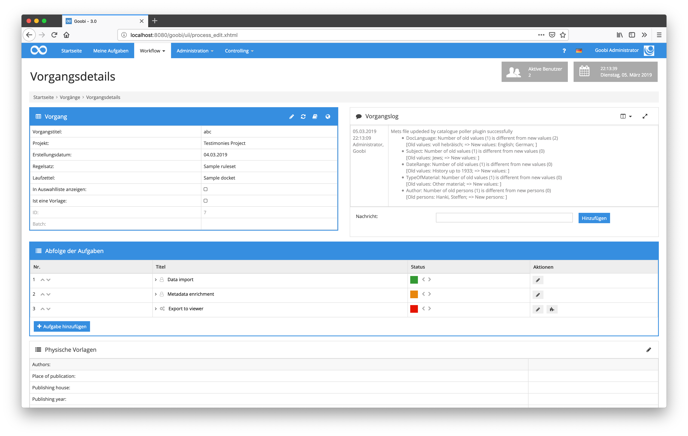
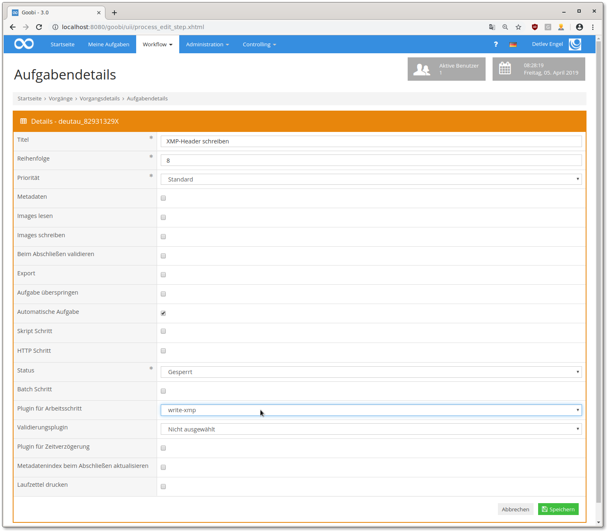
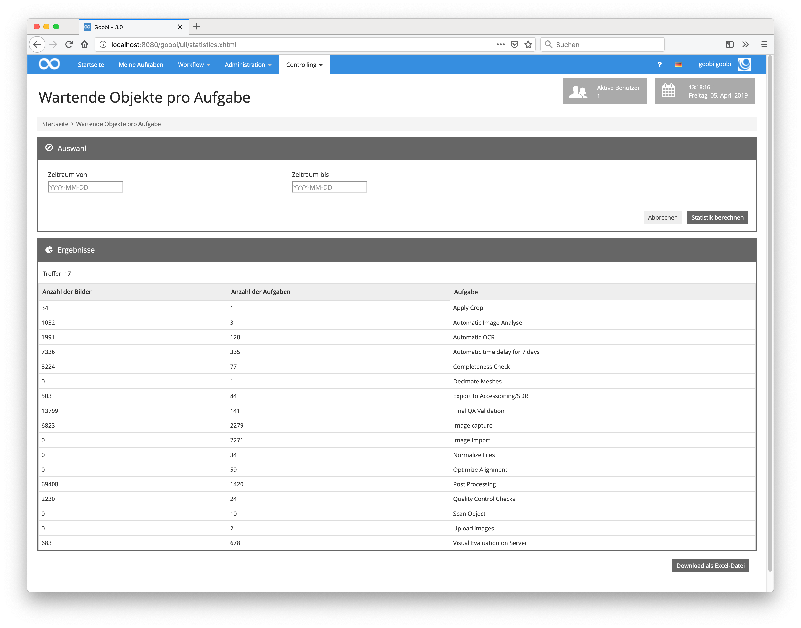
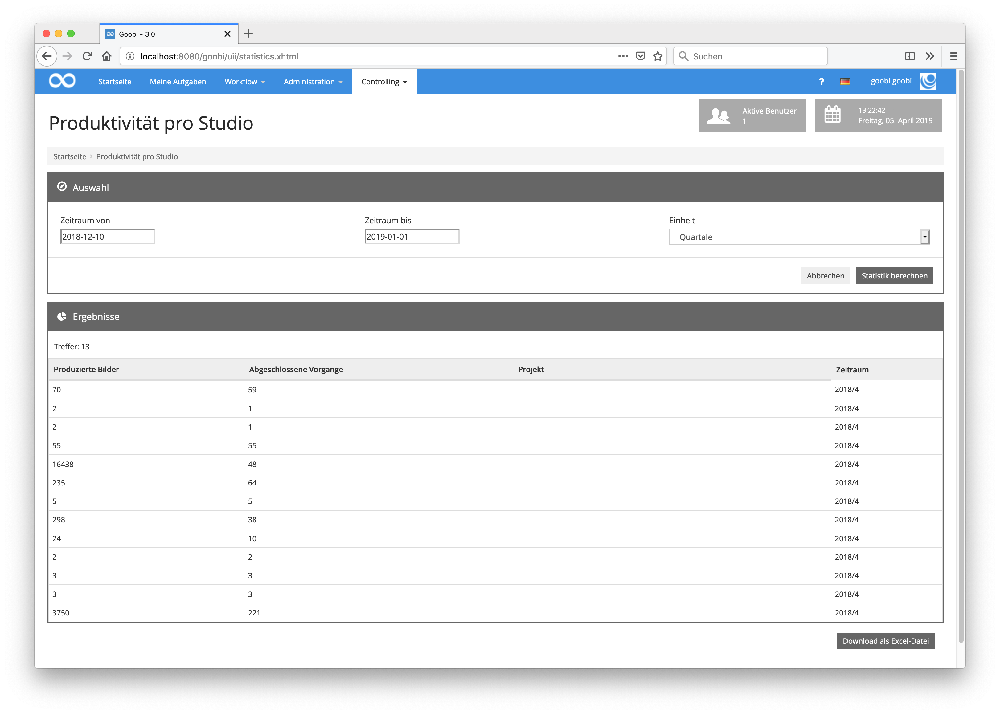
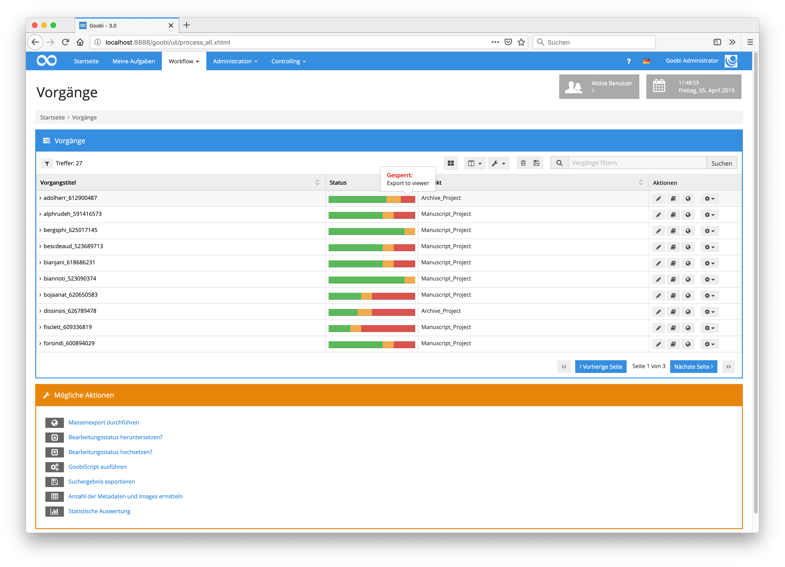
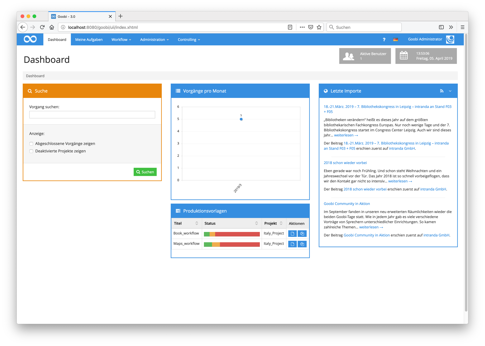

# März 2019

## Bessere Anzeige von Ergebnissen bei Scriptausführungen

Wenn ein GoobiScript fehlerhaft war, ließ sich das zwar am roten Fehlerstatus gut erkennen, die Ursache war jedoch oft nicht sichtbar. Daher wurde die Anzeige erweitert, um zusätzlich die Rückmeldungen der Skripte oder Plugins anzuzeigen. Diese Meldungen lassen sich auch als Excel-Datei herunterladen und werden in das Vorgangslog geschrieben.



Außerdem wurde Bereich Suchergebnis exportieren angepasst. Dort ist es nun möglich die zuletzt gespeicherte Fehlermeldung aus dem Vorgangslog zu zu exportieren. Hierzu muss die Spalte `Letzte Fehlermeldung` ausgewählt werden. Existiert für einen Vorgang keine Fehlermeldung, bleibt die Zelle leer. Die zugehörigen commits finden sich hier:

[https://github.com/intranda/goobi/commit/329487de6fa1e68e4da204a19c70516b2c73288b](https://github.com/intranda/goobi/commit/329487de6fa1e68e4da204a19c70516b2c73288b) [https://github.com/intranda/goobi/commit/af6930ab091653658003908458c05ced4215b84c](https://github.com/intranda/goobi/commit/af6930ab091653658003908458c05ced4215b84c)[https://github.com/intranda/goobi/commit/3344487fa53943a6cf7424e475493e3805fd5841](https://github.com/intranda/goobi/commit/3344487fa53943a6cf7424e475493e3805fd5841)

## Erweitertes Excel Import Plugin

Das bereits existierende Excel Import Plugins zum Import von Metadaten wurde erweitert, um nicht mit der Reihenfolge der Spalten, sondern mit dem Spaltentitel zu arbeiten. Dies erlaubt es, kleinere Änderungen an den Excel Dateien machen zu können, ohne jedes Mal die Konfiguration anpassen zu müssen, weil sich einzelne Spalten geändert haben oder die Reihenfolge nun eine andere ist.

In Goobi muss dazu während des Imports das Plugin `intranda_import_excel_read_headerdata` gewählt werden.

Die Konfigurationsdatei `plugin_intranda_import_excel_read_headerdata.xml` orientiert sich an der bisherigen Konfiguration, erlaubt jedoch eine Definition der Metadatenfelder nach folgendem Schema:

```markup
<metadata ugh="CatalogIDDigital" headerName="PPN-Digital" />
```

Sofern die Excel Datei eine Spalte enthält, die in der ersten Zeile den Wert `PPN-Digital` enthält, wird anschließend in jedem Datensatz der Wert aus dieser Spalte in das Metadatum `CatalogIDDigital` geschrieben.

Personen können auf mehrere Arten importiert werden. Wenn Vor- und Nachname in getrennten Spalten stehen, dann sieht das Feld wie folgt aus:

```markup
<person ugh="Author">
  <firstnameFieldHeader>Vorname</firstnameFieldHeader>
  <lastnameFieldHeader>Nachname</lastnameFieldHeader>
</person>
```

Wenn der vollständige Name in einer Spalte geliefert wird, ist hingegen folgende Konfiguration zu wählen:

```markup
<person ugh="Author">
  <nameFieldHeader>Person</nameFieldHeader>
  <splitName>true</splitName>
  <splitChar firstNameIsFirstPart="false">\, </splitChar>
</person>
```

Dabei wird der gefundene Wert am konfigurierten `<splitChar>` aufgetrennt und in Vorname und Nachname geteilt. Optional ist auch die Angabe von Normdaten zu einem Metadatum möglich:

```markup
<person ugh="Author" headerName="Person" normdataHeaderName="GND-Person">
[...]
</person>
<metadata ugh="PlaceOfPublication" headerName="Ort" normdataHeaderName="GND-Ort" />
```

## Aktualisiertes Catalogue Poller Plugin

Das bereits existierende Plugin, um die METS-Dateien innerhalb von Goobi periodisch aus einem Katalog zu aktualisieren, wurde einmal etwas überarbeitet. Hier gab es vor allem Handlungsbedarf, um genauer festlegen zu können, welche Metaden nicht mit geänderten Werten überschrieben werden sollen und wie mit wegfallenden Metadaten umgegangen werden soll.



In dem Zusammenhang wurde auch gleich das Logging der Aktivität des Plugins verbessert. Es ist nun im Goobi Vorgangslog auch jederzeit gut nachvollziehbar, was sich im Datensatz geändert hat und wann dies genau stattfand.



Letztlich haben wir die Gelegenheit gleich auch dafür genutzt, eine ausführliche Dokumentation für das Plugin zu erstellen. Diese findet sich unter der folgenden Adresse:



## Neues XMP Plugin

Das neue XMP Plugin ermöglicht es, verschiedenste Metadaten aus Goobi in die XMP-Header von Bilddateien zu schreiben. Dabei können sowohl Metadaten auf Werk-Ebene als auch Metadaten auf Bild-Ebene (wie zum Beispiel Zugehörigkeit zu Strukturelementen) geschrieben werden.



Eine vollständige Dokumentation kann hier eingesehen werden:



## Neue Plugins für die auf Einzelseiten konfigurierbare OCR-Durchführung

Mit diesem Plugin kann auf Einzelseiten-Basis festgelegt werden, welche Bilder aus einem Vorgang mit welchem Schrifttyp zur OCR gesendet werden.


Die Dokumentationen der beiden Plugins finden sich in diesem Portal:





## K10Plus Umstellung

Durch die Zusammenlegung der beiden Verbunddatenbanken von GBV und SWB zur K10plus-Datenbank ergebenen sich Veränderungen. Mit diesen kann Goobi bereits umgehen. Dabei ist es unerheblich, ob die Abfrage über SRU oder die XML Schnittstelle gemacht wird, ob pica+ oder marcxml oder welche Datenbank genutzt wird. In der Datei `goobi_opac.xml` müssen dazu folgende Katalog-Anbindungen konfiguriert werden:

```markup
<!-- replacement for old swb/gbv pica interface -->
<catalogue title="K10Plus">
  <config address="kxp.k10plus.de" database="1.1" description="K10plus-Datenbank" iktlist="IKTLIST-GBV.xml" port="80" ucnf="UCNF=NFC&amp;XPNOFF=1"/>
</catalogue>

<!-- replacement for old swb/gbs marc interface-->
<catalogue title="K10plus SRU">
  <config description="K10plus-SRU-Datenbank" address="http://sru.k10plus.de/k10cat" port="80" database="2.1" iktlist="IKTLIST-GBV.xml" ucnf="XPNOFF=1"  opacType="GBV-MARC"/>
</catalogue>
```

Da sich auch die Belegung einiger Felder geändert hat, sind unter Umständen auch Anpassungen an den Regelsätzen notwendig. Je nach Format können diese auch umfangreicher sein. Bei pica scheint die gravierenste Änderung zu sein, dass die `GND identifier` nun in `subfield 7` stehen und alle `PPNs`, die im neuen Katalog erstmalig erfasst wurden, in manchen Feldern einen Prefix `KXP` bekommen haben.

## Spezifische Statistiken für Durchsatz und Produktivität

Es wurden eine Reihe von statistischen Auswertungen erstellt, die den Fortschritt, Durchsatz oder den aktuellen Status der Vorgänge auswerten. Da diese Auswertungen zum Teil auf Nutzergruppen und sogar auch auf einzelne Nutzer herunter gebrochen werden können, können personenbezogene Aussagen getroffen werden. Aus diesem Grund befinden sich diese Statistiken in einem eigenständigen Plugin und werden lediglich auf Anfrage innerhalb von Goobi installiert.





## Detaillierte Informationen über den Status im Forschrittsbalken

Die Darstellung der Fortschrittsbalken für die Vorgänge sollte etwas informativer werden. Aus diesem Grund wurde Goobi so erweitert, dass nun ein Popup anzeigt wird, wenn die Maus über den Fortschrittsbalken bewegt wird. Darin wird von nun an visualisiert, welche konkreten Arbeitsschritte sich derzeit in dem Status befinden, über dem der Mauszeiger gerade positioniert ist.


Auf diese Weise ist nun ohne ein Aufklappen der Vorgänge oder ein Öffnen der Vorgangsdetails ersichtlich, welche Aufgaben bereits abgeschlossen sind, sich gerade in Bearbeitung befinden oder noch gesperrt sind.



Der commit hierzu ist hier zu sehen:

[https://github.com/intranda/goobi/commit/68b1c9ad05a63cdef2e7dfd75a473e03a062a53f](https://github.com/intranda/goobi/commit/68b1c9ad05a63cdef2e7dfd75a473e03a062a53f)

## Anlegen von Vorgängen direkt aus dem Dashboard

[In der Community wurde der Wunsch geäußert](https://community.goobi.io/t/vorgang-anlegen-von-der-goobi-startseite-aus/156), dass innerhalb des Standard-Dashboards direkt aus der Startseite von Goobi Vorgänge angelegt werden können sollten. Dies wurde in einem ersten Entwurf so nun bereits implementiert und kann in Betrieb genommen werden. Es werden hierbei all diejenigen Produktionsvorlagen aufgelistet, für die der jeweilige Nutzer auch tatsächlich Zugriff hat.

