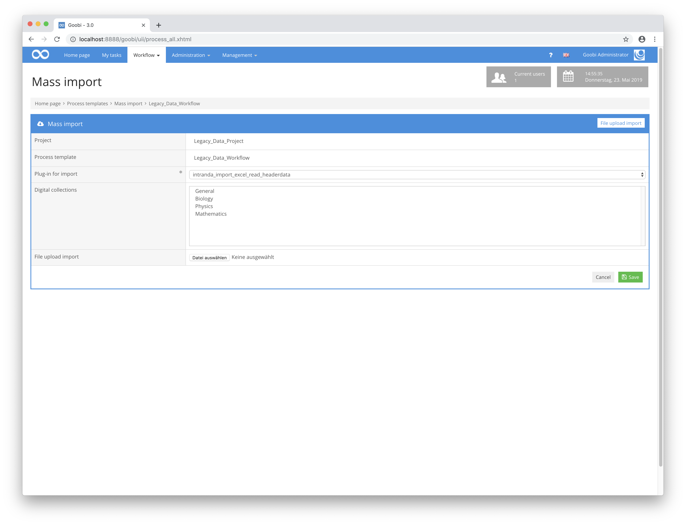

# Mai 2019

## Anpassungen am Massenimport Screen

Die Oberfläche für den Massenimport für Goobi workflow wurde massiv überarbeitet. Bisher musste man als Nutzer noch jeweils den richtigen Importmechanismus auswählen, anschließend das Plugin aus der Liste übernehmen. Und zu guter letzt musste man die hochzuladende Datei zunächst auswählen und dann auf einen separaten Button klicken. Dies alles ist nun deutlich intuitiver. Betritt man den Massenimport, so werden dort von nun an nur noch diejenigen Reiter angezeigt, für die Plugins installiert vorliegen. Ist nur ein Plugin installiert, so ist dieses auch bereits gleich ausgewählt. Und auch der Upload der Datei ist unmittelbar mit Drag & Drop möglich. Somit ist die Bedienung um ein vielfaches vereinfacht und erfordert wesentlich weniger Klicks als zuvor.

[https://github.com/intranda/goobi/commit/41d622981b7ea2ced3cc009a703c78a23c1967c1](https://github.com/intranda/goobi/commit/41d622981b7ea2ced3cc009a703c78a23c1967c1)\
[https://github.com/intranda/goobi/commit/93d0042cad7f99e480d1fbeb5b961af74702ae92](https://github.com/intranda/goobi/commit/93d0042cad7f99e480d1fbeb5b961af74702ae92)\
[https://github.com/intranda/goobi/commit/4f23eb2ca69ae7e5d35ae5658e017cae69c1c973](https://github.com/intranda/goobi/commit/4f23eb2ca69ae7e5d35ae5658e017cae69c1c973)\
[https://github.com/intranda/goobi/commit/b2a8bf88cd9a352ad00ff1571d4465b96a900ba7](https://github.com/intranda/goobi/commit/b2a8bf88cd9a352ad00ff1571d4465b96a900ba7)\
[https://github.com/intranda/goobi/commit/51ebf28f6deb99d6590c48906500f2d379c28a15](https://github.com/intranda/goobi/commit/51ebf28f6deb99d6590c48906500f2d379c28a15)

## Konvertierung aller Tabellen nach UTF8

Für die Gewährleistung einer besseren Kompatibilität mit verschiedenen Zeichensätzen und Sprachen wurde die Datenbank von Goobi workflow nun so angepasst, dass sämtliche Tabellen intern als UTF8 gespeichert werden. Diese Aktualisierung findet nach der Installation der neuen Version von Goobi workflow automatisch während des ersten Programmstarts statt, so dass keine manuellen Eingriffe in die Datenbank notwendig werden.

[https://github.com/intranda/goobi/commit/d48a075ab4a1db543a38ccce4c486acfe6187bce](https://github.com/intranda/goobi/commit/d48a075ab4a1db543a38ccce4c486acfe6187bce)\
[https://github.com/intranda/goobi/commit/b2fbd68681082e3ccbfc6a24064f8ea55537a270](https://github.com/intranda/goobi/commit/b2fbd68681082e3ccbfc6a24064f8ea55537a270)\
[https://github.com/intranda/goobi/commit/21fdbc7b0479f41dac8c2a922fadfb5d254a7f96](https://github.com/intranda/goobi/commit/21fdbc7b0479f41dac8c2a922fadfb5d254a7f96)

## Steigerung der Performance bei der Auflistung von Schritten

Durch die Anpassung einer SQL-Query konnte die Geschwindigkeit bei der Auflistung vieler Schritte gesteigert werden. Selbst bei 30.000 einem Nutzer zugeordneten Schritten sind die Wartezeiten jetzt kleiner als eine Sekunde.

[https://github.com/intranda/goobi/commit/80435577b4b0bac5b5c226c17a83907789256ae7](https://github.com/intranda/goobi/commit/80435577b4b0bac5b5c226c17a83907789256ae7)

## Platzhalter innerhalb des Metadateneditors bei fehlenden Bildern

Im Metadateneditor wird von nun an ein Platzhaltertext angezeigt, wenn zu einem Vorgang keine Medien bereitstehen. Somit ist dem Nutzer von nun an unmittelbar ersichtlich, ob überhaupt Dateien zu einem Vorgang gehören, oder ob es unter Umständen lediglich zu Problemen bei der Anzeige bereitstehender Medien kommt.

## File-Upload-Plugin jetzt mit Downloadmöglichkeit

Innerhalb des File-Upload-Plugins können von nun an nicht nur Dateien nur hochgeladen werden. Es ist nun ebenso möglich, dass einzelne Dateien wieder heruntergeladen werden. Darüber hinaus kann auch der gesamte Verzeichnisinhalt als zip-Datei heruntergeladen werden.

## Anpassung des Plugins Catalogue Poller für automatischen Export

Das Administration Plugin Catalogue Poller verfügt nun über einen Mechanismus, dass aktualisierte Vorgänge, die durch eine periodische Abfrage z.B. eines Bibliothekskataloges geändert wurden, exportiert werden können. Mit diesem neuen Mechanismus ist es nun möglich, dass ausschließlich die jenigen Datensätze z.B. im Goobi viewer neu veröffentlicht werden, zu denen es eine Aktualisierung gibt. Dabei wird grundsätzlich nur die METS-Datei exportiert, nicht jedoch zugehörige Bilder, Medien oder Volltextdateien. Auf diese Weise ist auch der Veröffentlichungsprozess entsprechend performant und es sind stets aktuelle Datensätze veröffentlicht.

Weitere Informationen zur Konfiguration des Catalogue Poller Plugins [finden sich in dessen Dokumentation](https://docs.intranda.com/goobi-workflow-plugins-de/administration-plugins/catalogue-poller).

## Anbindung an das LZA der GWDG (CDStar)

Für die Anbindung von Goobi workflow an das LZA der GWDG (CDStar) wurden drei Plugins entwickelt:

* Ein Schritte-Plugin für den Ingest der Master-Bilder und Derivate in CDStar
* Ein Plugin für den Export einer METS Datei mit Dateigruppen, in denen die IDs und URLs auf die vorher ingesteten Bilder in CDStar zeigen
* Ein Plugin, das die exportierte METS-Datei in ein Fedora System einspielt

Alle diese Plugins arbeiten bereits mit der Goobi-internen Warteschlange zusammen, wodurch Lastspitzen vermieden werden.

## Importplugin zum Import von Zeitungsartikeln aus einem Endnote Export

Es wurde ein neues Plugin für den Import von Zeitungsartikeln aus einem Endnote-Export erstellt. Eine Erklärung und Dokumentation ist [in diesem Portal](https://docs.intranda.com/goobi-workflow-plugins-de/import-plugins/import-fuer-zeitschriftenartikel-aus-einem-endnote-export) zu finden.\