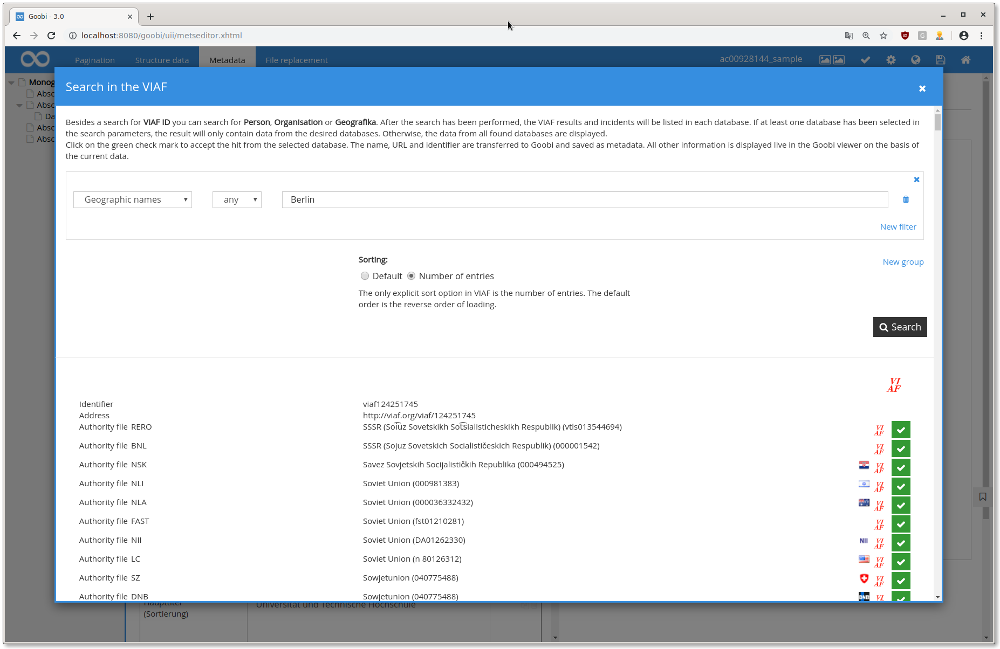
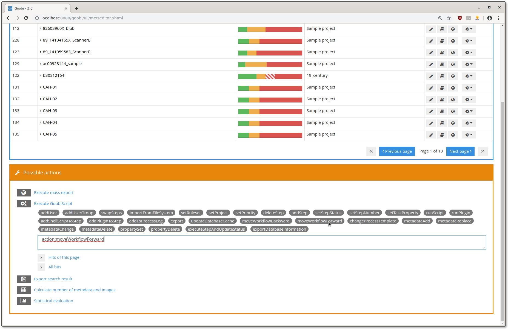
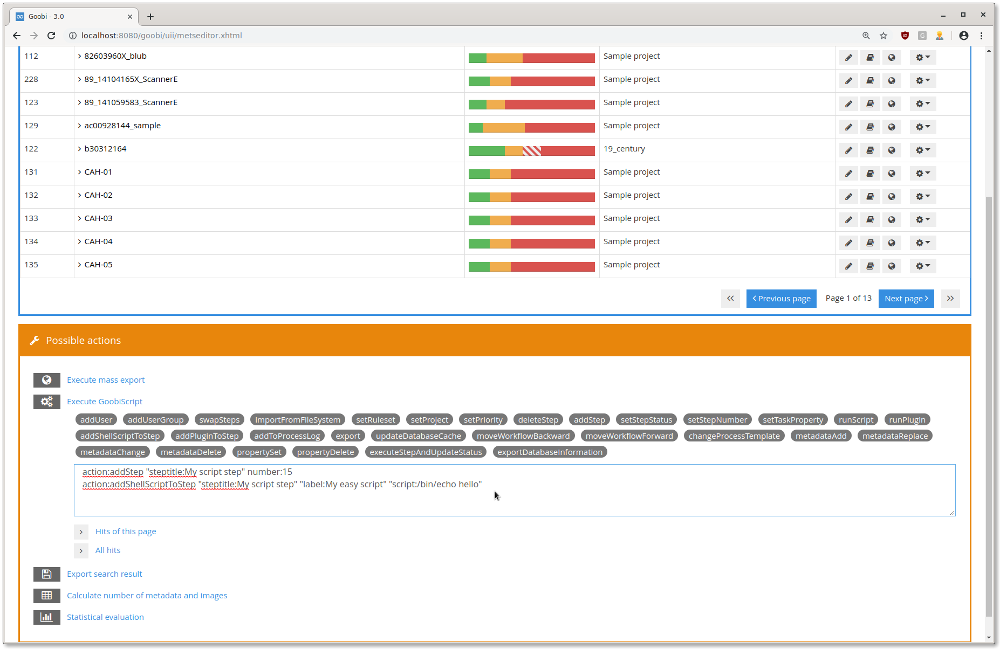
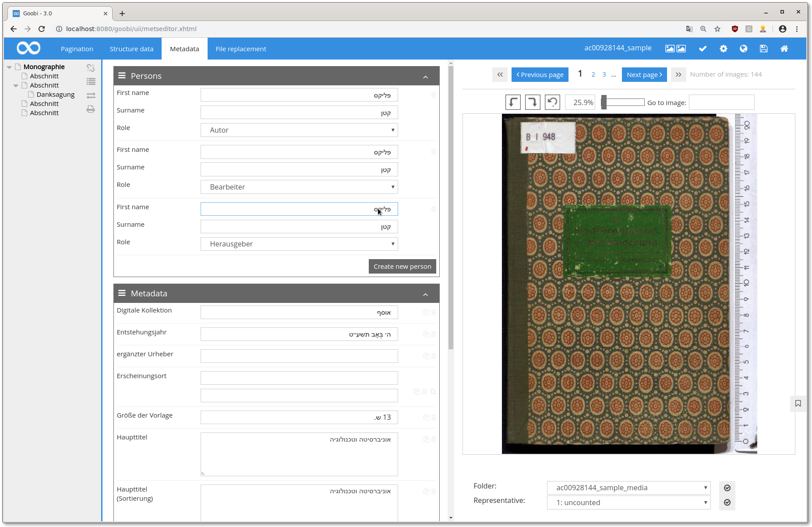

# Juni 2019

## Integration von VIAF zur Normdatenerfassung

Es wurde eine Suche in der [VIAF](https://viaf.org/) in den Metadateneditor integriert. Auf diese Weise können die Normdatenbanken aus 40 Ländern durchsucht und deren Werte in die METS-Datei übernommen werden.

Die Suche in der VIAF kann für ein Metadatum aktiviert werden, indem die Konfigurationsdatei `goobi_metadataDisplayRules.xml` angepasst und ein Block wie der folgende hinzugefügt wird:

```markup
<viaf ref="PlaceOfPublication">                
   <!-- # Format: 'mmmiis' -->                
   <!-- # mmm - MARC main field -->                
   <!-- # ii - indicator 1 + 2 (_ if empty) -->                
   <!-- # s - MARC subfield -->                
   <source>210__a; 111__a; 100__a; 110__a; 150__a; 151__a;</source>                

   <!-- # Format: 'mmmiis=label' -->                
   <!-- # mmm - MARC main field -->                
   <!-- # ii - indicator 1 + 2 (_ if empty) -->                
   <!-- # s - MARC subfield -->                
   <!-- # label - label of the field, can be used as message key -->                
   <field>001=NORM_IDENTIFIER; 0247_a=URI;</field>                
</viaf>
```



[https://github.com/intranda/goobi/commit/d56e244bde8cc5ba844f94f1bf2bb2846215bbb1](https://github.com/intranda/goobi/commit/d56e244bde8cc5ba844f94f1bf2bb2846215bbb1)  
[https://github.com/intranda/goobi/commit/96fa0656984d6b049e29a8853cf26a7fb94e927a](https://github.com/intranda/goobi/commit/96fa0656984d6b049e29a8853cf26a7fb94e927a)  
[https://github.com/intranda/goobi/commit/6f72039ef2393def29e8750ccb48558f6ec2c0a5](https://github.com/intranda/goobi/commit/6f72039ef2393def29e8750ccb48558f6ec2c0a5)

## Zwei neue GoobiScripts "moveWorkflowForward" und "action:moveWorkflowBackward"

Die beiden Buttons für das "vorspulen" und "zurückspulen" eines Prozesses unterhalb der Prozessliste wurden durch GoobiScripte ersetzt. Dies ermöglicht eine nebenläufige Ausführung in der GoobiScript Warteschlange. Ein weiterer Vorteil der Abarbeitung in der Warteschlange ist, dass Lastspitzen vermieden werden.



[https://github.com/intranda/goobi/commit/bd967dfb8b8ea02a1af2af846a770cb09ab595e5](https://github.com/intranda/goobi/commit/bd967dfb8b8ea02a1af2af846a770cb09ab595e5)

## Fix für Goobiscripte: serielle Abarbeitung sicherstellen

Durch diesen Fix ist es wieder möglich, verschiedene GoobiScripte miteinander zu kombinieren und eine Aufgabe die aus mehreren GoobiScripten-Aufrufen besteht, mit einem großen Befehl durchzuführen. Der Screenshot zeigt zum Beispiel das Hinzufügen eines neuen Script-Schritts.



[https://github.com/intranda/goobi/commit/74b8ecb7f62875a9e1be8cd47d9705cec7738da3](https://github.com/intranda/goobi/commit/74b8ecb7f62875a9e1be8cd47d9705cec7738da3)

## Metadateneditor: Schreibrichtung wird nun automatisch erkannt

Alle input-Felder im Metadateneditor erkennen nun automatisch je nach Inhalt die Textflussrichtung.



[https://github.com/intranda/goobi/commit/73a22c71b2165d6ba76241824d792aa7b453cf8c](https://github.com/intranda/goobi/commit/73a22c71b2165d6ba76241824d792aa7b453cf8c)  
[https://github.com/intranda/goobi/commit/d89ed3eff3fbfae453ce67d5c822c2284ddcd618](https://github.com/intranda/goobi/commit/d89ed3eff3fbfae453ce67d5c822c2284ddcd618)

## S3 storage backend: Verbindungen werden nun korrekt geschlossen

Bei der Benutzung von S3 als storage backend sind bisher Verbindungen zu lange offen gehalten worden. Diese Verbindungen werden nun korrekt geschlossen und ein Speicherleck verhindert.

[https://github.com/intranda/goobi/commit/c4f9487877d92d6526e6b36e07ae18761e4d7b4f](https://github.com/intranda/goobi/commit/c4f9487877d92d6526e6b36e07ae18761e4d7b4f)

## Thumbnail-Ordner im Vorgangsordner: fix für Windows

Der neue Thumbnail-Ordner hat bei der Benutzung von Goobi unter Windows nicht korrekt funktioniert. Dieser Fehler wurde nun behoben und Goobi sowie GoobiToGo funktionieren nun wieder unter Windows.

[https://github.com/intranda/goobi/commit/a84fe0e5e2f1a2bd28d56cb04ec25f88eb5bb792](https://github.com/intranda/goobi/commit/a84fe0e5e2f1a2bd28d56cb04ec25f88eb5bb792)