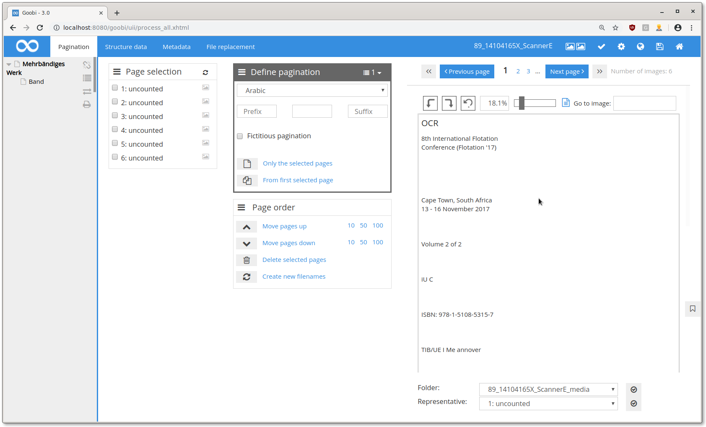
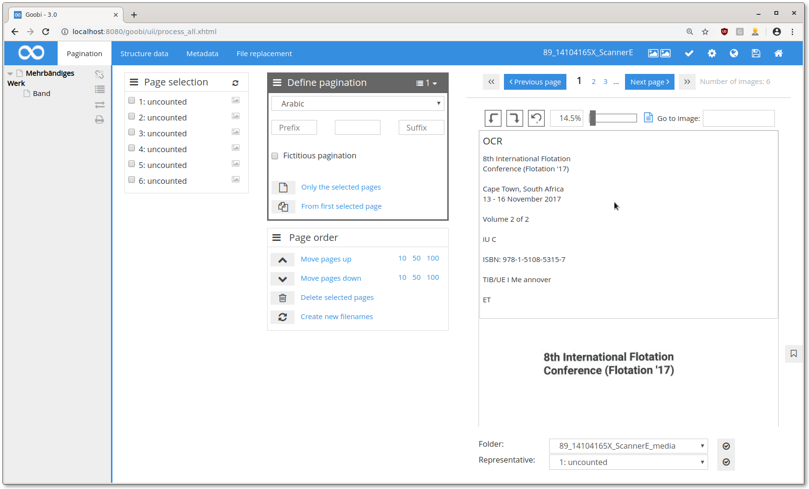
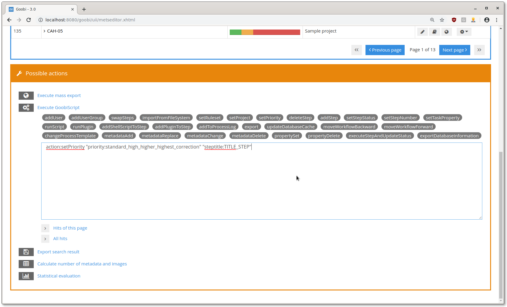

# Juli 2019

## Optimierung der Bildanzeige

Bisher wurde der gesamte Prozess aus der Datenbank geholt, wenn ein Bild aus diesem Prozess angezeigt werden sollte. Dies wurde nun so optimiert, dass keine Datenbankabfragen mehr nötig sind.

[https://github.com/intranda/goobi/commit/6ea16c3115cbef1fac0428353f59cf7f2def94bd](https://github.com/intranda/goobi/commit/6ea16c3115cbef1fac0428353f59cf7f2def94bd)

## Verbesserung der OCR-Anzeige im Metadateneditor

Wenn im OCR-Ergebnis mehrere Leerzeilen aufeinander folgen, kann es schnell unübersichtlich werden:

Ab sofort werden mehrere aufeinanderfolgende Leerzeilen zu einer zusammengefasst:

[https://github.com/intranda/goobi/commit/eaa0f1c0ee5d5b170d041cfc559259ca2680a9a7](https://github.com/intranda/goobi/commit/eaa0f1c0ee5d5b170d041cfc559259ca2680a9a7)

## Neues GoobiScript zum setzen von Schritte-Prioritäten

Es wurde ein neues GoobiScript hinzugefügt, welches die massenhafte Manipulation von Schritte-Prioritäten erlaubt.

[https://github.com/intranda/goobi/commit/a2f27549976cf3fc9af8bdf96c94e118828dec1a](https://github.com/intranda/goobi/commit/a2f27549976cf3fc9af8bdf96c94e118828dec1a)

## Entfernen des gesamten Prozess-Ordners wenn ein Prozess gelöscht wird

Bisher blieb wegen eines Fehlers in Goobi nach dem löschen eines Vorgangs ein leerer Ordner im Dateisystem übrig. Dieser Fehler ist nun behoben und auch der Ordner selbst wird gelöscht.

[https://github.com/intranda/goobi/commit/2ee43e3a6cb890416f90f2ff50a44faf707d242f](https://github.com/intranda/goobi/commit/2ee43e3a6cb890416f90f2ff50a44faf707d242f)