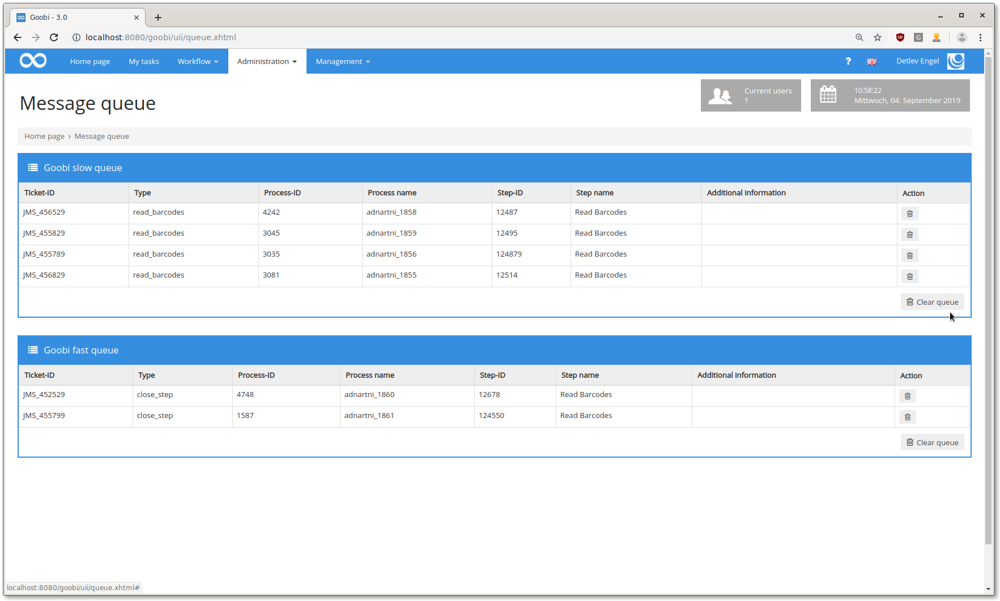
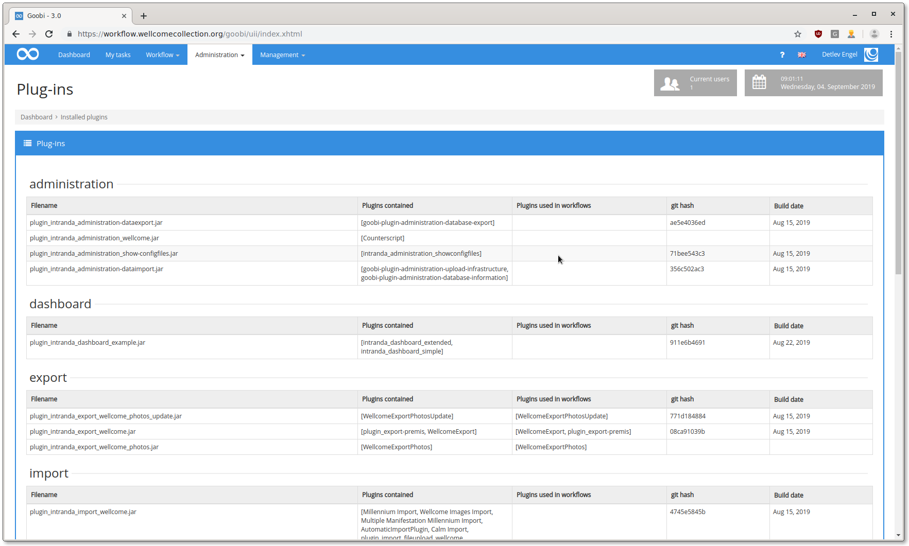
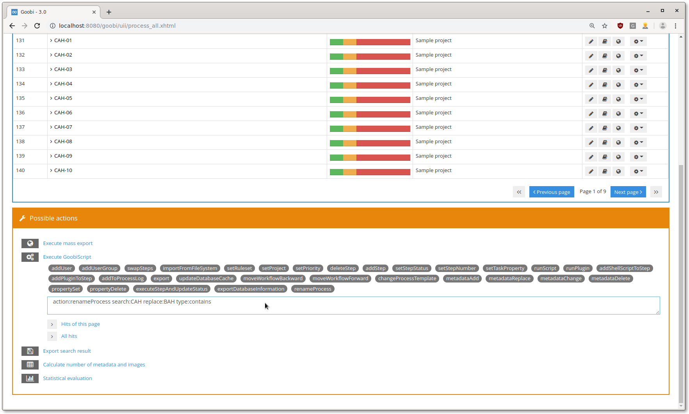
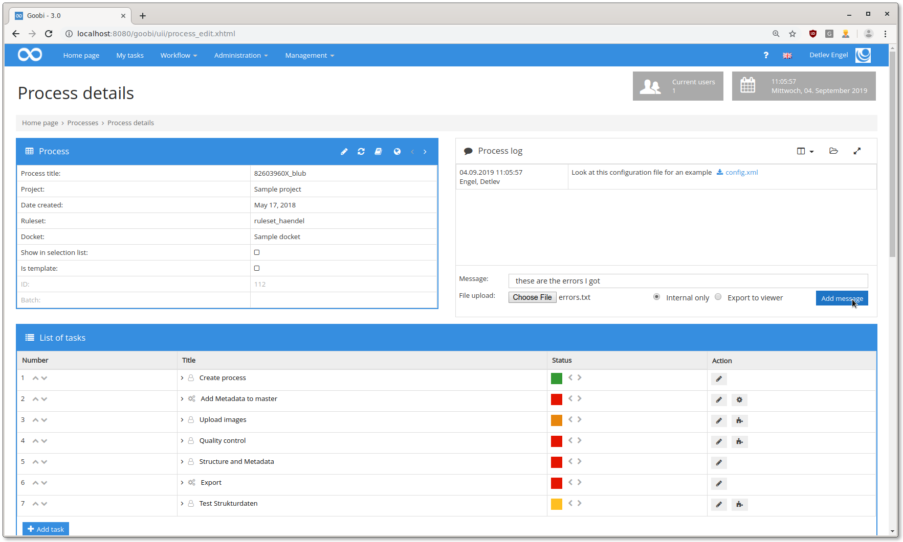
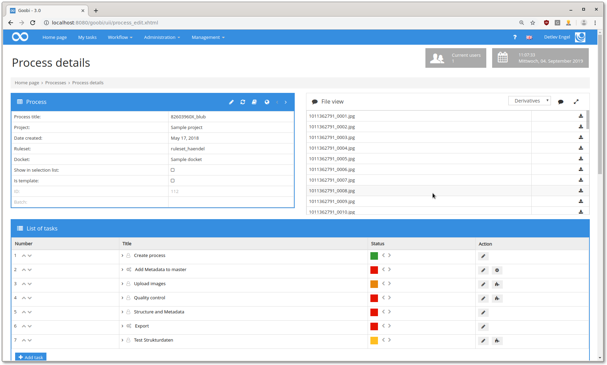
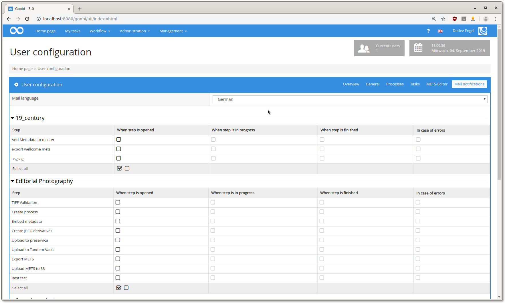
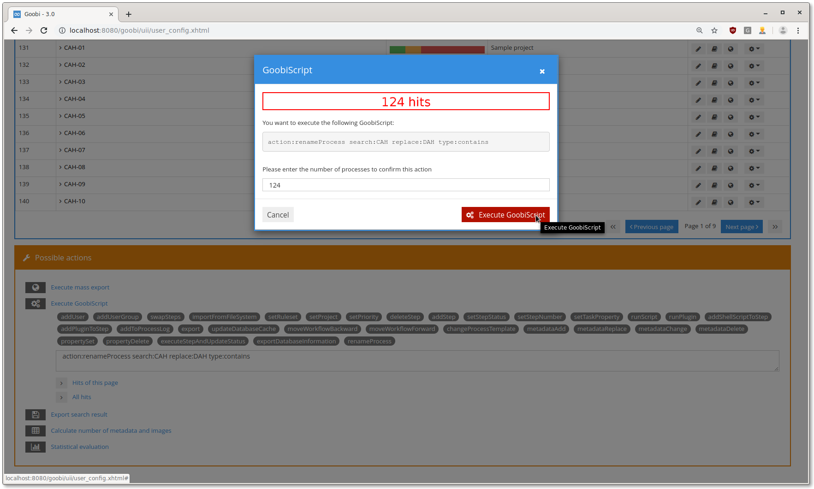

# August 2019

## ActiveMQ Warteschlangen werden nun angezeigt

Bereits [vor einiger Zeit](https://docs.intranda.com/goobi-workflow-digests-de/2019/04#neue-warteschlangenverarbeitung-in-goobi-workflow) haben wir eine neue Warteschlange in Goobi eingebaut. Von dieser war bisher wenig zu sehen, sie hat ihre Arbeit leise im Hintergrund verrichtet.\
Dies wurde jetzt geändert. Es gibt eine neue Seite, auf der Admins sich die Warteschlangen ansehen und Jobs auch abbrechen können.



[https://github.com/intranda/goobi/commit/38a43c078f403b24cc1fb2910e619ad189e3c4a2](https://github.com/intranda/goobi/commit/38a43c078f403b24cc1fb2910e619ad189e3c4a2) [https://github.com/intranda/goobi/commit/e3331d76932a20f1aa750f4be227264c123e7a10](https://github.com/intranda/goobi/commit/e3331d76932a20f1aa750f4be227264c123e7a10) [https://github.com/intranda/goobi/commit/e3331d76932a20f1aa750f4be227264c123e7a10](https://github.com/intranda/goobi/commit/e3331d76932a20f1aa750f4be227264c123e7a10)

## Stabilität von GoobiScript verbessert

Wenn GoobiScripts ausgeführt wurden und währenddessen neue gestartet wurden, gab es manchmal einen Fehler, weil zwei Methoden gleichzeitig auf die Liste der GoobiScripte zugreifen wollten. Dieser Fehler ist nun behoben, da die gesamte GoobiScript-Verwaltung Thread-safe gemacht wurde.

[https://github.com/intranda/goobi/commit/349a75d98492779075db61e134783dc34862c9a7](https://github.com/intranda/goobi/commit/349a75d98492779075db61e134783dc34862c9a7) [https://github.com/intranda/goobi/commit/5906bcecc0855bc9286c310193e87049131820f6](https://github.com/intranda/goobi/commit/5906bcecc0855bc9286c310193e87049131820f6)

## Schnellere Abfrage von Schritten

Wenn einem Nutzer sehr viele Schritte zugeordnet waren (ab \~30.000), hat die Auflistung der Aufgaben bis zu 10 Sekunden gedauert. Das gleiche galt bei der Abgabe von Aufgaben. Die beiden zuständigen SQL-Abfragen wurden optimiert und sind jetzt auch für Nutzer mit mehr als 30.000 zugeteilten Schritten schnell.

[https://github.com/intranda/goobi/commit/ec5fb70fa8af702f813d58f256ef5808c3cebf77](https://github.com/intranda/goobi/commit/ec5fb70fa8af702f813d58f256ef5808c3cebf77) [https://github.com/intranda/goobi/commit/5373c1887509cd34cfdf17060fe7463d4568cb1d](https://github.com/intranda/goobi/commit/5373c1887509cd34cfdf17060fe7463d4568cb1d)

## Anzeige aller installierter Plugins

Es gibt eine neue Seite, die alle installierten Plugins auflistet und auch anzeigt, ob diese jeweils in Workflows benutzt werden. Die neue Seite ist über das Admin-Menü erreichbar.



[https://github.com/intranda/goobi/commit/953b733d652c99682b3221e1cea67ea4d67ed21e](https://github.com/intranda/goobi/commit/953b733d652c99682b3221e1cea67ea4d67ed21e) [https://github.com/intranda/goobi/commit/019f9ac744d4690de6427ea57f5cae13a92b4b17](https://github.com/intranda/goobi/commit/019f9ac744d4690de6427ea57f5cae13a92b4b17) [https://github.com/intranda/goobi/commit/aa88a32a873ed1a04e0b79a9a9a7b78d432af2a5](https://github.com/intranda/goobi/commit/aa88a32a873ed1a04e0b79a9a9a7b78d432af2a5)

## Neues GoobiScript zum Umbenennen von Vorgängen

Es gibt ein neues GoobiScript zum umbenennen von Vorgängen. Die Syntax lautet:

```
action:renameProcess search:OLDNAME replace:NEWNAME type:contains|full
```

Dabei wird im Vorgangsnamen des zu ändernden Vorgangs nach `OLDNAME` gesucht und mit `NEWNAME` ersetzt. Wenn `type` auf `full` gesetzt wird, muss der gesamte Vorgangsname mit `OLDNAME` übereinstimmen. Wird `contains` benutzt, wird nur der Teil des Vorgangsnamens ersetzt, der mit `OLDNAME` übereinstimmt.



[https://github.com/intranda/goobi/commit/c1387648d3606304f0fe5f5bdf5532512d2b691f](https://github.com/intranda/goobi/commit/c1387648d3606304f0fe5f5bdf5532512d2b691f)

## Dateien im Vorgangslog verlinken

Es gibt jetzt die Möglichkeit, Dateien im Vorgangslog zu verlinken. Dazu können diese direkt unter der Eingabemaske für die Nachricht hochgeladen werden.



[https://github.com/intranda/goobi/commit/cbbcbdb54c99fee8349296d5f2893cdab7533855](https://github.com/intranda/goobi/commit/cbbcbdb54c99fee8349296d5f2893cdab7533855) [https://github.com/intranda/goobi/commit/1f299436c67fbcf26421bacd3b5bc6e331854c09](https://github.com/intranda/goobi/commit/1f299436c67fbcf26421bacd3b5bc6e331854c09) [https://github.com/intranda/goobi/commit/2032e423fddd3642e3a8876e863ef23ed8914fb5](https://github.com/intranda/goobi/commit/2032e423fddd3642e3a8876e863ef23ed8914fb5)

## Auflistung aller Bilder eines Vorgangs in der Vorgangs-Ansicht

Zusammen mit dem Dateiupload ins Vorgangslog wurde auch eine Auflistung aller sich momentan im Vorgang befindlichen Bild-Dateien hinzugefügt.



## Emails versenden, wenn ein Schritt geöffnet oder geschlossen wird

Es gibt jetzt die Möglichkeit, Emails an Nutzer zu senden, wenn ein Schritt geöffnet wird, dem der Nutzer zugeordnet wird. Nutzer mit erweiterten Rechten können sich auch Emails schicken lassen, wenn ein Schritt in einen beliebigen anderen Status übergeht.\
Die Konfiguration erfolgt für jeden Nutzer in seinen Benutzereinstellungen pro Projekt und Schritt-Typ. Die Emails können auch direkt über einen Link in der jeweiligen Email abbestellt werden.



[https://github.com/intranda/goobi/commit/16cd4c52679c658b6151e34a9b0b8e37c98a632d](https://github.com/intranda/goobi/commit/16cd4c52679c658b6151e34a9b0b8e37c98a632d)

## Link zur Anzeige eines Vorgangs nach dem Anlegen wird nur berechtigten Nutzern gezeigt

Nach dem Anlegen eines Vorgangs wird ein Link angezeigt, der es einem ermöglicht, direkt zum Vorgang zu springen. Dieser Link wird jetzt nur noch angezeigt, wenn der Nutzer auch die nötigen Rechte hat, den Vorgang zu sehen.

[https://github.com/intranda/goobi/commit/dfbc61977cb856bc1b7e870d9d42f61f82079dcb](https://github.com/intranda/goobi/commit/dfbc61977cb856bc1b7e870d9d42f61f82079dcb)

## Neue Sicherheitsabfrage für GoobiScripte

Die alte Rechenaufgabe hat bei einigen Nutzern für etwas Frust gesorgt, also haben wir die Abfrage so geändert, dass das auszuführende GoobiScript angezeigt wird, sowie die Anzahl der betroffenen Vorgänge. Zur Bestätigung muss jetzt nur noch die Zahl der betroffenen Vorgänge abgetippt werden.

[https://github.com/intranda/goobi/commit/f3964314b7d44d763f7fe9fa6b8dcd4151e5603f](https://github.com/intranda/goobi/commit/f3964314b7d44d763f7fe9fa6b8dcd4151e5603f)



## Docker images

Es gibt jetzt öffentliche Docker images für Goobi workflow. Sie sind auf [Docker Hub](https://hub.docker.com/r/intranda/goobi-workflow) zu finden. Diese images stellen eine Grundinstallation ohne Plugins dar und sind als Grundlage zur Erstellung von auf die eigenen Bedürfnisse angepassten images gedacht. Zur Nutzung der images haben wir unter folgendem Link eine Anleitung erstellt, die auch die Anbindung an eine Datenbank zeigt:

[https://github.com/intranda/goobi/blob/master/DOCKER.md](https://github.com/intranda/goobi/blob/master/DOCKER.md)

## Installationsanleitung

Es gibt jetzt eine Installationsanleitung für Goobi workflow. Diese ist unter folgendem Link zu finden:

[Installationsanleitung](https://docs.intranda.com/goobi-workflow-de/admin/8)

Die Anleitung bezieht sich auf `Ubuntu Linux 16.04` und kann Schritt für Schritt durchgearbeitet werden. Die Installation behandelt auch das kompilieren und die Installation der gebräuchlichsten Goobi-Plugins.