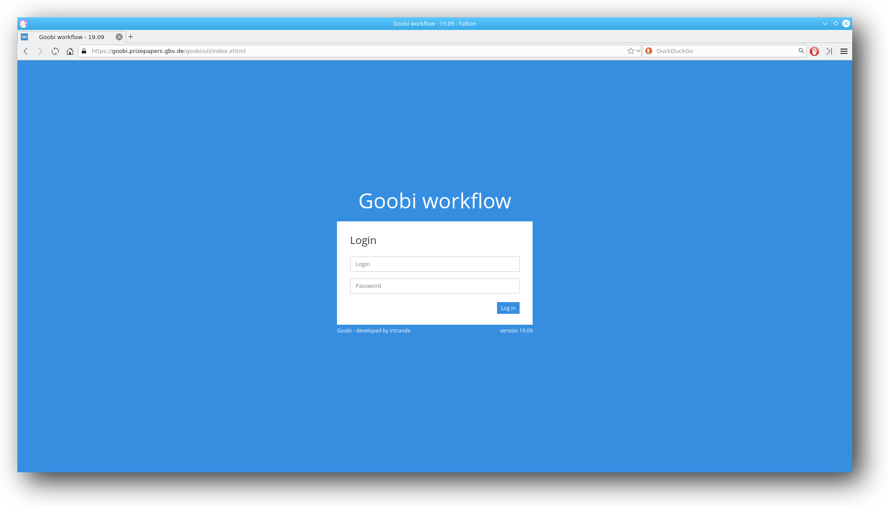
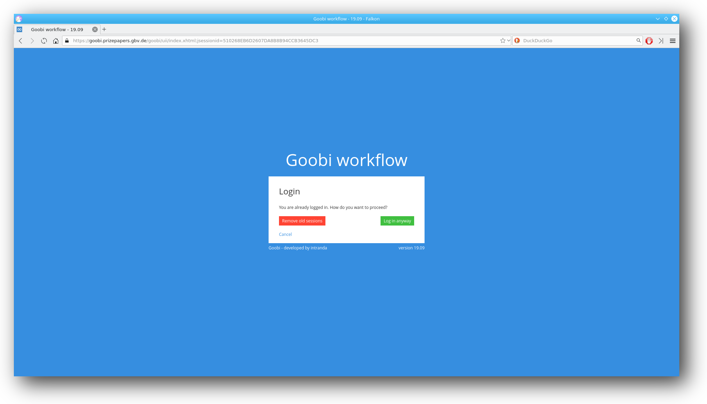
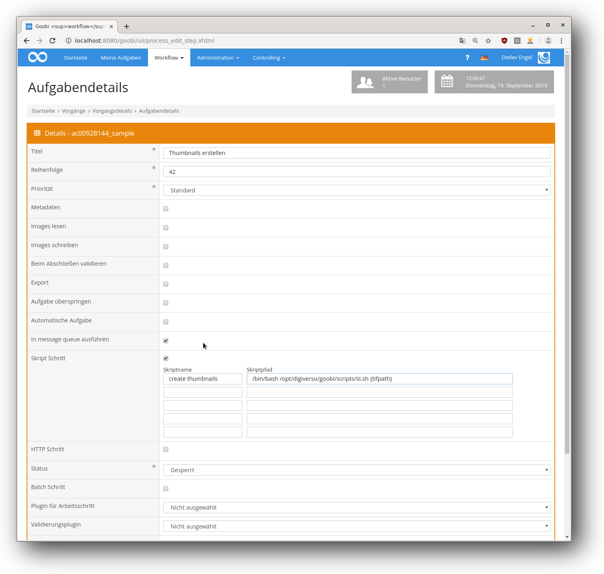

# September 2019

## Neuer Login-Screen

Es gibt einen neuen Login-Screen, der das "workflow" im Namen besser widerspiegelt.



[https://github.com/intranda/goobi/commit/5a9ed3e75e03cb04ef63ac20b74dda90b9bd8eb6](https://github.com/intranda/goobi/commit/5a9ed3e75e03cb04ef63ac20b74dda90b9bd8eb6)

## Session-Nachfrage ist weg

Wenn man bisher schon einmal als Benutzer eingeloggt war und dies in einem anderen Browser oder an einem anderen Rechner noch einmal versucht hat, wurde eine Zwischenseite angezeigt. Diese hat nachgefragt, ob die alten Sitzungen aufgeräumt werden sollen. Diese Zwischenseite ist nun nicht mehr vorhanden und man wird ganz normal eingeloggt.



[https://github.com/intranda/goobi/commit/596353f747155ddcde9a8eca854798e30598108a](https://github.com/intranda/goobi/commit/596353f747155ddcde9a8eca854798e30598108a)

## Neue Versionierung

Seit den Goobi Tagen Ende September gibt es eine neue Versionierung für Goobi workflow. Das erste Release mit der neuen Versionierung war "Goobi workflow 19.09". Dabei stehen die ersten zwei Zahlen für das Jahr, die zweiten für den Monat in ebenjenem Jahr.  
Sollte es ein Bugfix-Release geben, wird eine weitere Zahl hochgezählt, z.B. 19.09-1, 19.09-2 etc.

Die Version kann (wie oben in den Screenshots zu sehen) direkt beim Login und im Seiten-Titel abgelesen werden.

[https://github.com/intranda/goobi/commit/5a9ed3e75e03cb04ef63ac20b74dda90b9bd8eb6](https://github.com/intranda/goobi/commit/5a9ed3e75e03cb04ef63ac20b74dda90b9bd8eb6)

## Automatische Schritte in die Message Queue



Es ist jetzt möglich, automatische Schritte in einer Warteschlange abarbeiten zu lassen. Der Warteschlange können beliebig viele Arbeiter zugeordnet werden, sodass auf kleineren wie größeren Systemen keine Lastspitzen entstehen.

[https://github.com/intranda/goobi/commit/ee7484fb88313203a9ca699414a2add3f53e149f](https://github.com/intranda/goobi/commit/ee7484fb88313203a9ca699414a2add3f53e149f) [https://github.com/intranda/goobi/commit/72a6d16bfe33aded4c0434cf68fa7f13584c8a9c](https://github.com/intranda/goobi/commit/72a6d16bfe33aded4c0434cf68fa7f13584c8a9c) [https://github.com/intranda/goobi/commit/0d94330938577a9a5897855d536342f629e88fe0](https://github.com/intranda/goobi/commit/0d94330938577a9a5897855d536342f629e88fe0)

## Persönliche Informationen werden beim Benutzer-Löschen mitgelöscht

Wenn ein Nutzer in Goobi workflow gelöscht wird, werden jetzt auch die folgenden persönlichen Informationen mit gelöscht:

* Nutzername
* Email-Adresse
* Vorname
* Nachname
* LDAP login

[https://github.com/intranda/goobi/commit/38d4f2f56d39015ff40bfc6b39e02c7193ded5d8](https://github.com/intranda/goobi/commit/38d4f2f56d39015ff40bfc6b39e02c7193ded5d8)

## Process Search: Neuer Filter nach TemplateID

Der REST-Endpoint zur Prozess-Suche erlaubt nun auch das Filtern nach Template-IDs. Dem Such-JSON-Objekt wird dazu eine Liste mit den zu filternden Template-IDs übergeben:

```javascript
{
  "templateIDs: [
    2,
    51,
    8
  ]
}
```

[https://github.com/intranda/goobi/commit/d42389620c1bc93f50b0b3a889645b73f5edd519](https://github.com/intranda/goobi/commit/d42389620c1bc93f50b0b3a889645b73f5edd519)