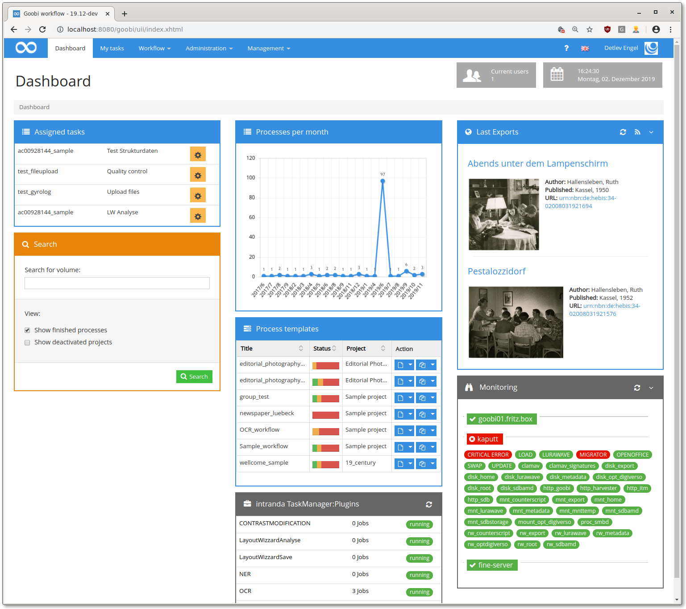

# Oktober 2019

## Neuer REST-Endpoint für den Dateiupload in einen Vorgang.

Es kann jetzt per Multipart-POST eine Datei in einen der Bild-Ordner eines Vorgangs kopiert werden. Der endpoint sieht folgendermaßen aus:

POST `https://mygoobi.tld/goobi/api/processes/{processId}/images/{folder}`

Wenn `{folder}` auf "master" gesetzt ist, wird in den Master-Ordner hochgeladen, der Standard ist der Derivate-Ordner.

[https://github.com/intranda/goobi/commit/403d970d4ba95ecf87a710ec9357ed9bc2c27a13](https://github.com/intranda/goobi/commit/403d970d4ba95ecf87a710ec9357ed9bc2c27a13)

## Weitere SQL-Performance-Verbesserungen

Es wurden weitere Queries optimiert.

[https://github.com/intranda/goobi/commit/7fddc8b303eca3a057dd070bf668293e2571f52a](https://github.com/intranda/goobi/commit/7fddc8b303eca3a057dd070bf668293e2571f52a)

## Release-binaries

Travis baut jetzt Goobi-Releases, die dann [auf Github](https://github.com/intranda/goobi/releases) veröffentlicht werden.

## Support für GLB-Objekte in der 3D-Ansicht

Für bessere Performance werden jetzt GLB-Objekte in der 3D-Ansicht des METS-Editors unterstützt.

[https://github.com/intranda/goobi/commit/0250f80d3685a2698c15e1ff6ed3a2aad7579050](https://github.com/intranda/goobi/commit/0250f80d3685a2698c15e1ff6ed3a2aad7579050)

## Performance-Verbesserungen des erweiterten Dashboards

Das erweiterte Dashboard wurde komplett überarbeitet und bietet jetzt bessere Performance und weniger Bugs.

[https://github.com/intranda/goobi/commit/fd739050f8b89d04b7d02d9453f16e47f4f09fdb](https://github.com/intranda/goobi/commit/fd739050f8b89d04b7d02d9453f16e47f4f09fdb) [https://github.com/intranda/goobi/commit/83c5abdb4c7d342b50c7454dd0d55a9e64806334](https://github.com/intranda/goobi/commit/83c5abdb4c7d342b50c7454dd0d55a9e64806334) [https://github.com/intranda/goobi/commit/e9c4ffd3027eb37a30d5f20089ae59c3d7916cc2](https://github.com/intranda/goobi/commit/e9c4ffd3027eb37a30d5f20089ae59c3d7916cc2)

## Eine weiterer GoobiScript fix

Die letzten Änderungen am Goobiscript hatten neue Fehler eingeführt, die zur Nicht-Benutzbarkeit von Goobi bei langen Warteschlangen geführt haben. Das wurde repariert.

[https://github.com/intranda/goobi/commit/826b47d403cd830e2624e11eb7ffcc2a7da3bfee](https://github.com/intranda/goobi/commit/826b47d403cd830e2624e11eb7ffcc2a7da3bfee)