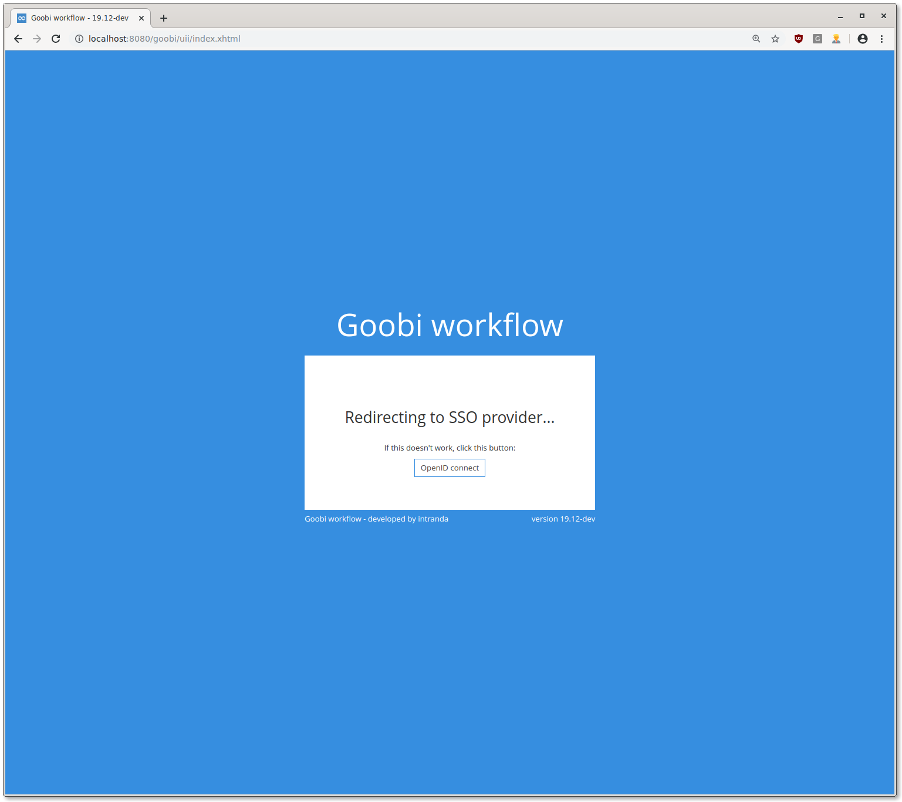
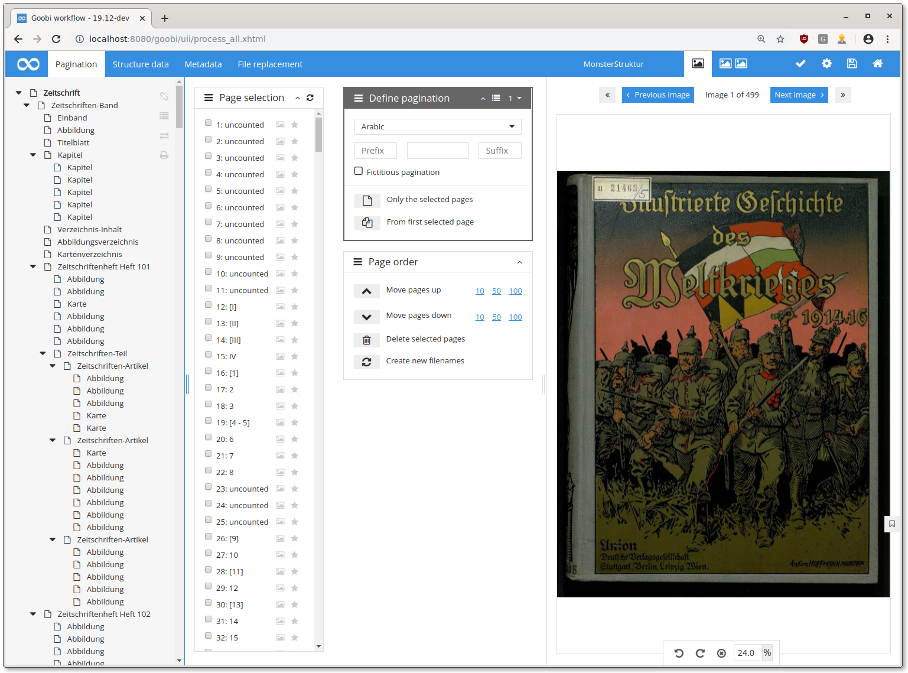

# November 2019

## Coming soon

* Mandantenfähigkeit von Goobi workflow
* Message queue für externe Prozesse
* Metadateneditor und ImageQA-Plugin: rechts-nach-links blättern und Thumbnails

## Zwei neue GoobiScripte

Es wuren zwei neue GoobiScripte hinzugefügt:

* **deleteUserGroup** entfernt eine Nutzergruppe aus Schritten
* **renameStep** __benennt einen Schritt um

[https://github.com/intranda/goobi/commit/36d9e5c75b2523d5c13e6def32b07c926edb1611](https://github.com/intranda/goobi/commit/36d9e5c75b2523d5c13e6def32b07c926edb1611)

## Single sign on mit openID Connect

Goobi workflow unterstützt nun openID Connect als externen Authentifizierungs-Anbieter. Die Implementierung ist konfigurierbar gehalten und kann mit vielen openID Connect Anbietern zusammenarbeiten.

[https://github.com/intranda/goobi/commit/843e9d4d8ee2731803832736a98e3fcf43ec1df4](https://github.com/intranda/goobi/commit/843e9d4d8ee2731803832736a98e3fcf43ec1df4)[https://github.com/intranda/goobi/commit/29d78831087b5a42d484c32ffeb5a6cf0600b4e1](https://github.com/intranda/goobi/commit/29d78831087b5a42d484c32ffeb5a6cf0600b4e1)[https://github.com/intranda/goobi/commit/1d98eeaa59b393f6e5485db64c5f6470cdf1dc73](https://github.com/intranda/goobi/commit/1d98eeaa59b393f6e5485db64c5f6470cdf1dc73)

## Neuer METS-Editor

Der neue METS-Editor ist im stabilen Goobi gelandet. Vorrangiges Ziel des Umbaus war es, den Code wartbarer zu machen.

Durch die neue Code-Struktur konnten wir schon einige Verbesserungen vornehmen. Die meisten dieser Verbesserungen umgehen das neu laden der Seite, was zu besserem Arbeitsfluss führen sollte. So ist zum Beispiel die Vergrößerung und Verkleinerung der einzelnen Bereiche jetzt ohne reload möglich.

In den neuen METS-Editor sind mehrere Dutzend commits eingeflossen, deswegen wird hier nur der finale merge-commit aufgeführt:

[https://github.com/intranda/goobi/commit/cc72ab41a793d1c8986b6b4fc880bcd44cd75433](https://github.com/intranda/goobi/commit/cc72ab41a793d1c8986b6b4fc880bcd44cd75433)

## Message queue: Anzeige der dead letter queue

Wenn Nachrichten in der Message queue mehrfach nicht erfolgreich abgearbeitet werden konnten, sind sie bisher im Nirvana verschwunden. Ab sofort wird die sogenannte "dead letter queue" von Goobi überwacht und die Nachrichten aus dieser in der Nutzeroberfläche angezeigt.

[https://github.com/intranda/goobi/commit/b8f294ceddfeb7e563efb27365c2a4709de45ab5](https://github.com/intranda/goobi/commit/b8f294ceddfeb7e563efb27365c2a4709de45ab5)

## Thumbnail-Ordner: Performance-Verbesserungen

Der `thumbs`-Ordner in Goobi workflow enthält vorgerenderte kleinere Versionen der Bilder in den Master- und Derivate-Ordnern. Wenn ein Bild mit kleinerer Größe als in einem der `thumbs`-Ordner vorgehaltenen Versionen angefragt wird, wird dieses kleinere Bild geladen und ausgeliefert.

In dieser oben beschriebenen Logik wurden einige Performance-Optimierungen durchgeführt. Außerdem wird ein Bild mit der genau richtigen Größe nun nicht mehr in den Speicher geladen, sondern direkt Richtung Browser durchgereicht.

[https://github.com/intranda/goobi/commit/de4659e3dde243a646a184c7e1621747969f6bc5](https://github.com/intranda/goobi/commit/de4659e3dde243a646a184c7e1621747969f6bc5) [https://github.com/intranda/goobi/commit/06bea9d7a87475416c03ce4ee0819ab1c9d1dc1e](https://github.com/intranda/goobi/commit/06bea9d7a87475416c03ce4ee0819ab1c9d1dc1e)

## EasyDB-Integration im METS-Editor

Es gibt jetzt analog zur Suche in Normdatenbanken nun auch die Möglichkeit aus dem METS-Editor heraus eine Suche in easyDB zu starten und eine Objekt aus der easyDB mit einem Goobi-Prozess zu verknüpfen.

[https://github.com/intranda/goobi/commit/d9d9fcd2e0fec2dcc95fa6e9baee30fe09f331e4](https://github.com/intranda/goobi/commit/d9d9fcd2e0fec2dcc95fa6e9baee30fe09f331e4)