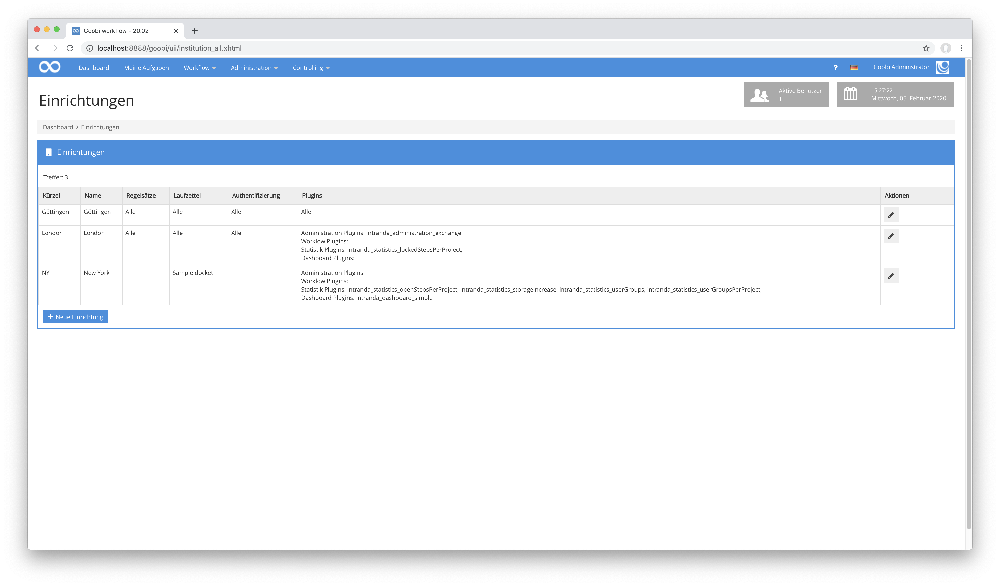
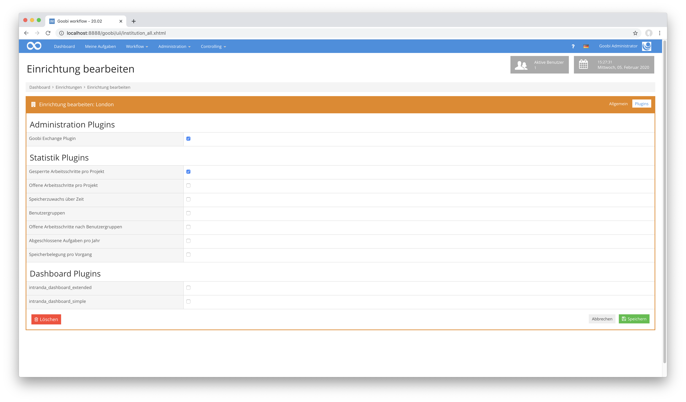
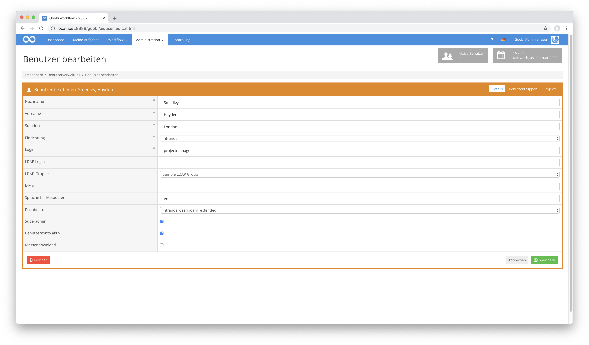
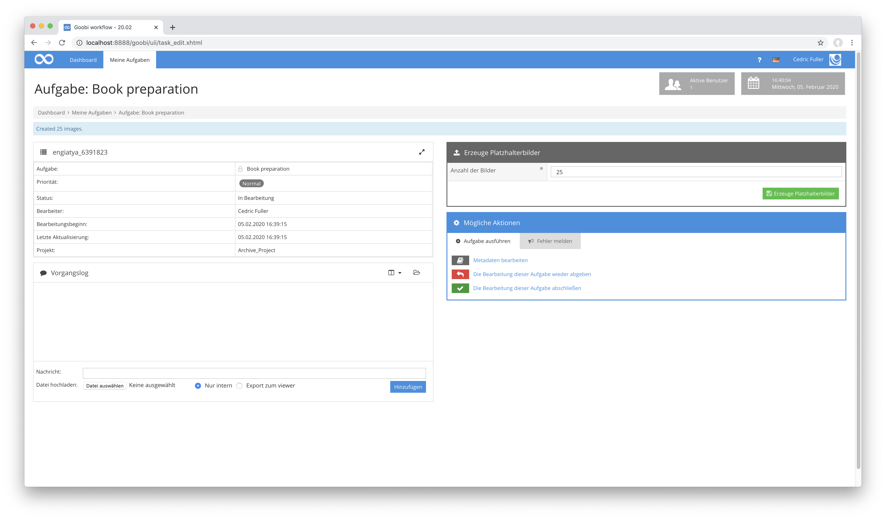
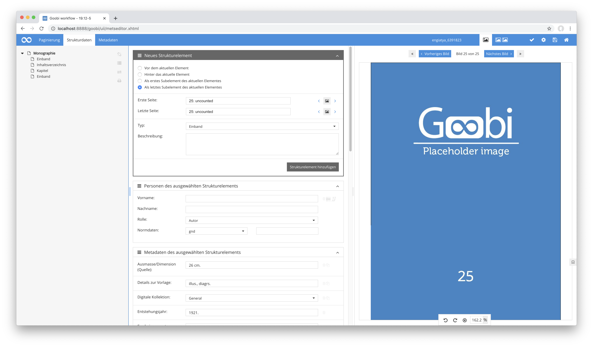
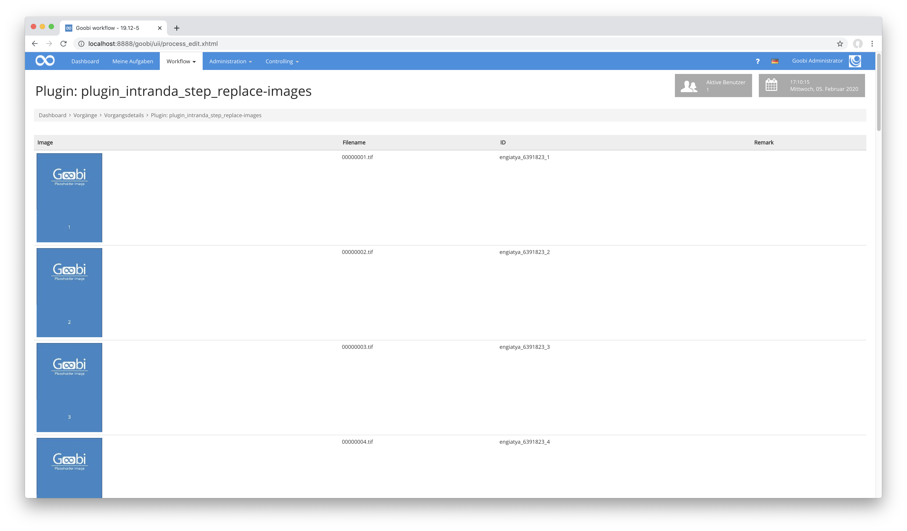
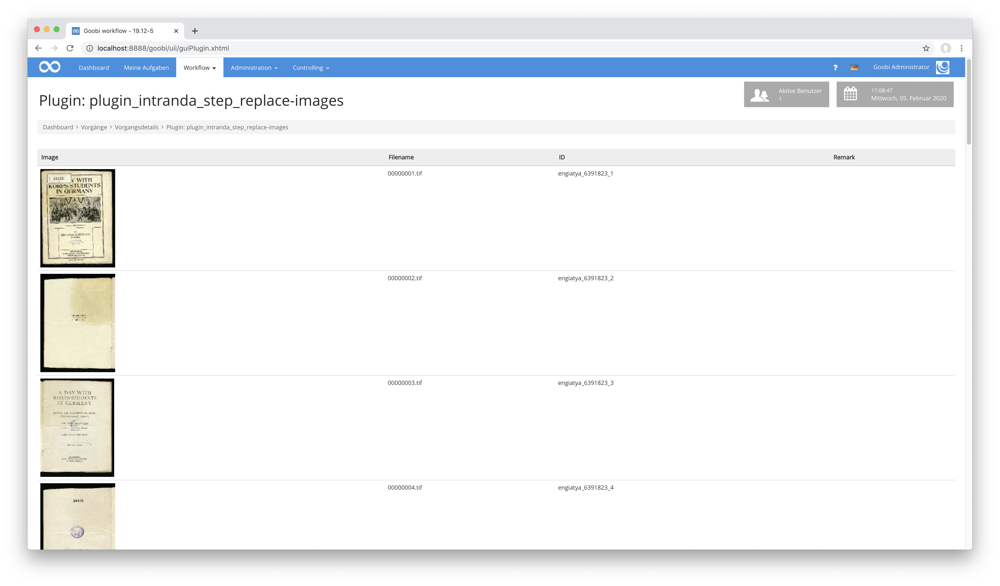
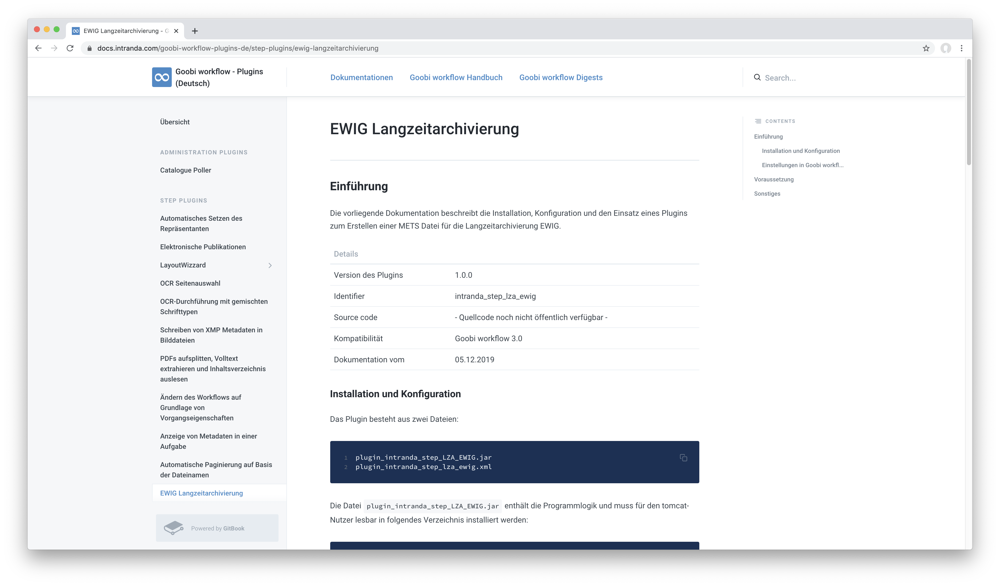
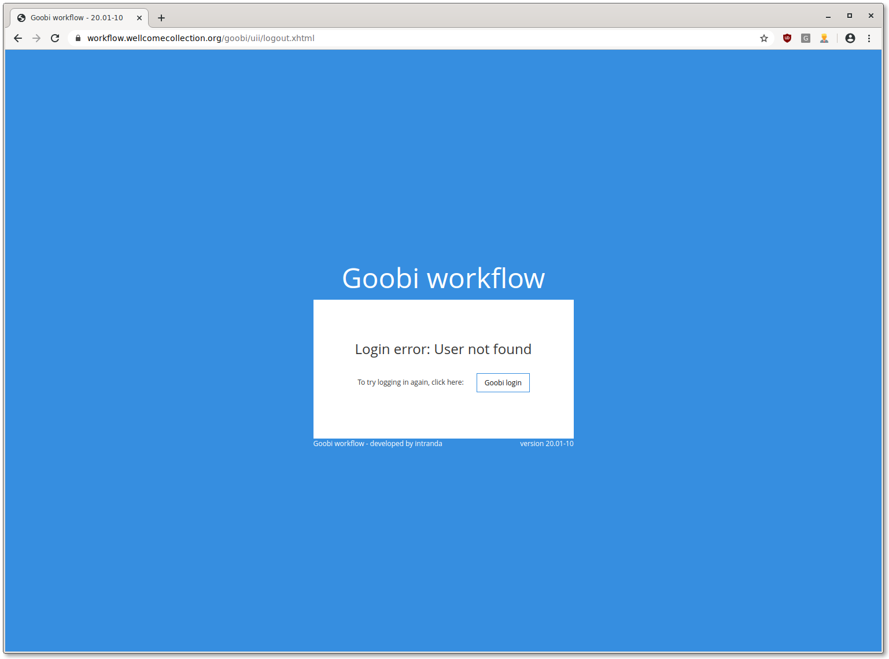

# Dezember 2019

## Mandantenfähigkeit in Goobi workflow

Mit dem aktuellen Release ist Goobi workflow nun mandantenfähig. Dafür existieren von nun an in Goobi workflow `Insitutionen`, denen die Laufzettel, Regelsätze, Nutzer, Gruppen und Projekte zugeordnet werden können. Dabei können Laufzettel und Regelsätze auch mehreren Institutionen gleichzeitig zugeordnet sein.





Dadurch, dass die Benutzer von Goobi workflow stets nur einer Institution zugeordnet sind, sieht Goobi für normale Nutzer zunächst völlig unverändert aus. Im Hintergrund jedoch greift hier bereits die Einschränkung auf die jeweilige Institution und verhindert so den Zugriff auf die Inhalte der anderen Institutionen. Dabei gilt Einschränkung gilt entsprechend ebenfalls für Administratoren, die jeweils ebenso nur die Einstellungen für ihre eigene Institution anpassen und Nutzer für diese hinzufügen können. Für die Verwaltung der Institutionen selbst gibt es von nun an eine neue übergeordnete Rechteebene in Goobi workflow, den `superadmin`.



Für die Inbetriebnahme der Mandantenfähigkeit muss zumindest ein Nutzer mit dem Recht `superadmin` ausgestattet werden. Dies ist möglich mittels des folgenden angepassten SQL-Statements innerhalb der Datenbank, wo die korrekte ID des Benutzers eingetragen wird:

```sql
  update benutzer set superadmin = true where benutzerid = xyz
```

Anschließend kann der somit erzeugte Super-Administrator innerhalb der Nutzeroberfläche von Goobi workflow auch weitere Super-Administratoren erzeugen.

[https://github.com/intranda/goobi/commit/6c41dd7969](https://github.com/intranda/goobi/commit/6c41dd7969)  
[https://github.com/intranda/goobi/commit/fac1506e8a](https://github.com/intranda/goobi/commit/fac1506e8a)  
[https://github.com/intranda/goobi/commit/3472e38eb4](https://github.com/intranda/goobi/commit/3472e38eb4)

## Zwei neue Plugins für eine völlig andere Arbeitsweise

Vermehrt traten in der Vergangenheit Interessenten an uns heran, die Goobi gerne vollkommen anders einsetzen möchten, als dies in den meisten anderen Einrichtungen der Fall ist. Konkret geht es hierbei darum, dass die Workflows so konzipiert sein sollen, dass noch vor dem Erzeugen von Digitalisaten eine logische Struktur angelegt werden können soll. Die zugehörigen Bilder jedoch sollen erst im Nachhinein eingepflegt werden. Dank der enormen Flexibilität von Goobi workflow ließ sich auch hierfür ein Lösungsweg finden. Hierzu wurden zwei neue Plugins entwickelt, um diese Arbeitsweise zu ermöglichen:

Zunächst einmal kommt das neue Plugin `goobi-plugin-step-placeholder-creation` zum Einsatz. Innerhalb dessen Oberfläche kann der Nutzer festlegen, welche Anzahl an Platzhalterbildern erzeugt und im Verzeichnis für die Master-Bilder abgelegt werden soll.



Auf der Basis der somit erzeugten Platzhalterbilder läßt sich nun innerhalb des METS-Editors fast wie gewohnt arbeiten. Strukturdaten und Metadaten können nun erzeugt und den jeweiligen Seiten zugewiesen werden.



Im weiteren Verlauf des Workflows wird dann das Plugin `goobi-plugin-step-replace-images` verwendet. Dieses erlaubt, dass die temporär vorgehaltenen Platzhalterbilder nun durch die tatsächlichen Digitalisate ersetzt werden. Dabei stellt das Plugin zugleich sicher, dass die per Drag & Drop hochzuladenden Bilder einerseits nur die gewünschten Dateien ersetzt und dass zugleich unabhängig von der ursprünglichen Benennung der Dateien eine automatische Umbenennung der Dateien erfolgt, so wie diese durch die Platzhalterbilder vorgegeben wurde. Die Dateiendung richtet sich hierbei allerdings dynamisch nach dem hochgeladenen Dateiformat, so dass neben TIF-Dateien hier ebenso mit JPEG, JP2 oder anderen Formaten gearbeitet werden kann.





Sollten während des Uploads ggf. einzelne Bilder nicht erzeugt und hochgeladen werden, so ist dies aufgrund der auffälligen Platzhalterbilder auch beispielsweise innerhalb des Image-QA-Plugins und im Metadateneditor sofort ersichtlich.


Zur besseren Verständlichkeit steht hier ein Screencast zur Verfügung, der den Durchlauf eines solchen Workflows einmal nachvollziehbar durchläuft.



## EWIG LZA Anpassungen

Das Export-Plugin für den Ingest in das Langzeitarchiv EWIG unterstützt von nun an Submission-Manifeste und exportiert ebenfalls die Inhalte des Vorgangslogs. Damit kann auch nun innerhalb des Langzeitarchivs noch nachvollzogen werden, was genau im Laufe des Workflows mit den Daten wann geschehen ist.



Die ausführliche Dokumentation zu diesem Plugin findet sich unter der folgenden Adresse:



## Fix für Single Sign On

Ist Goobi workflow für die Authentifizierung an ein Single Sign On über OpenID angebunden, so trat in der Vergangenheit ein Fehler im Falle unbekannter Nutzer auf. Diese gerieten bisher während des Einloggens in eine Endlosschleife, bei der immer wieder zum Login-Provider und dann wieder zu Goobi weitergeleitet wurde. Das Verhalten von Goobi wurde an dieser Stelle nun so geändert, dass stattdessen von nun an eine aussagekräftige Fehlerseite angezeigt wird.



[https://github.com/intranda/goobi/commit/684f7638bd91ec5a788ac419b592fc20341e1cea](https://github.com/intranda/goobi/commit/684f7638bd91ec5a788ac419b592fc20341e1cea)