# März 2020

## Coming soon

In den kommenden Wochen werden wir uns voraussichtlich auf folgende Punkte konzentrieren:

* LayoutWizzard-Erweiterungen
* Audio- und Video-Integrationen
* Dokumentationen
* Erweiterung der Vokabularfunktionalitäten

## Projekte jetzt mit eigenen editierbaren Identifiern

Projekte verfügen nun über ein neues Datenfeld, den `Identifier`. Dieser neue Wert steht ebenso im sog. VariablenReplacer zur Verfügung. Dies heißt, dass diese neue Information ebenfalls innerhalb von Skripten, auf Laufzetteln oder in Plugins wie dem neuen Datei-Umbenennungs-Plugin (siehe weiter unten) verwendet werden können.

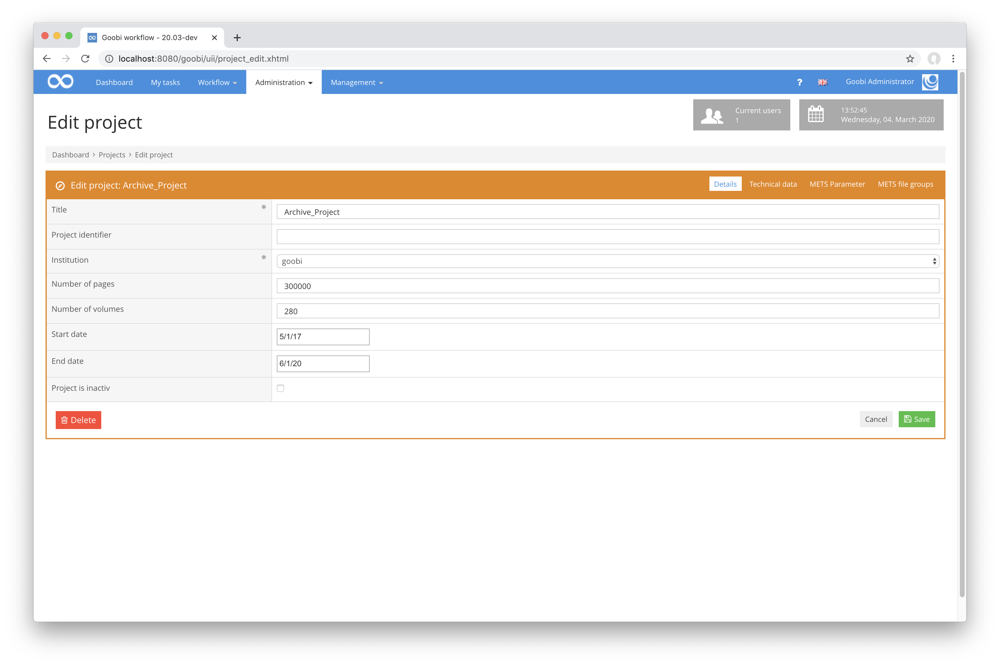

[https://github.com/intranda/goobi/commit/30d41e7969e26c5268602dcd47bad3651c313116](https://github.com/intranda/goobi/commit/30d41e7969e26c5268602dcd47bad3651c313116) [https://github.com/intranda/goobi/commit/38c2cbd58d52c260b29c2645bf88f4968ca0d897](https://github.com/intranda/goobi/commit/38c2cbd58d52c260b29c2645bf88f4968ca0d897) [https://github.com/intranda/goobi/commit/7e14445cd902540f74a42653b7c6db9dfee095a9](https://github.com/intranda/goobi/commit/7e14445cd902540f74a42653b7c6db9dfee095a9)

## Neues Plugin: Flexibler Editor für die Handschriftenerschließung

Es gibt jetzt einen neuen enorm flexiblen Editor, der für die Erschließung von Handschriften implementiert wurde, der aber auch in anderen Bereichen eingesetzt werden kann. Er besteht grundsätzlich aus drei Spalten, die jeweils beliebig viele Boxen enthalten können, innerhalb denen widerum mehrere Eingabefelder gruppiert werden können. Die Besonderheit ist hierbei, dass die Inhalte der einzelnen Boxen zunächst einmal nicht alle eingeblendet sein müssen. Somit ist es dem Bearbeiter möglich, das gesamte Formular zu überblicken, ohne scrollen zu müssen. Die einzelnen Felder innerhalb der jeweiligen Bereiche werden über einen Klick auf einen der Badges aktiviert und somit sichtbar. Auf diese Weise werden nicht benötigte Formularfelder ausgeblendet und überladen den Bildschirm nicht mit unbenötigten platzintensiven Komponenten.

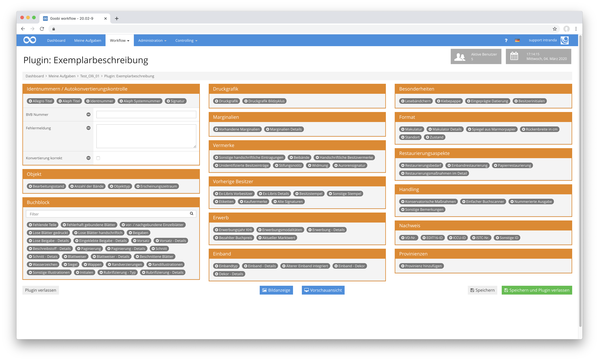

Die einzelnen Felder innerhalb jeder Box können typisiert werden. So lässt sich festlegen, dass bestimmte Informationen über Input-Boxen, Auswahlfelder, Text-Areas, Checkboxen etc. erfasst werden können, um die Bedienung möglichst zu optimieren.

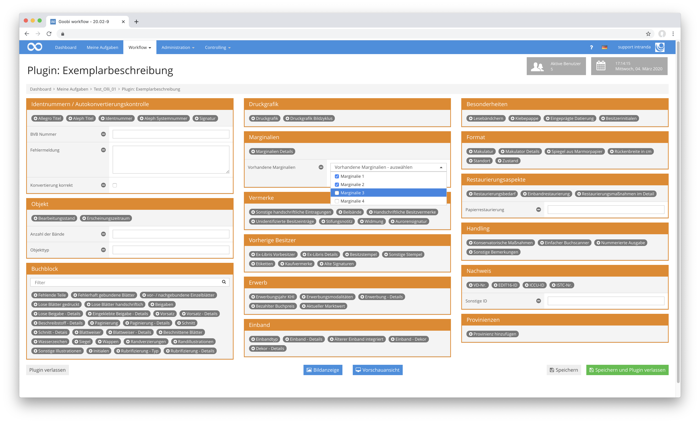

Dabei kommt unter anderem auch die Funktionalität mit ins Spiel, dass die Werte für Auswahlfelder aus dem neuen Vokabularmanager stammen. So lassen sich kontrollierte Vokabulare innerhalb von Goobi verwalten und innerhalb des Handschrifteneditors direkt nachnutzen.

Sämtliche Inhalte des neuen Editors für Handschriften werden über die Konfigurationsdatei des Plugins gesteuert und können im laufenden Betrieb angepasst werden.

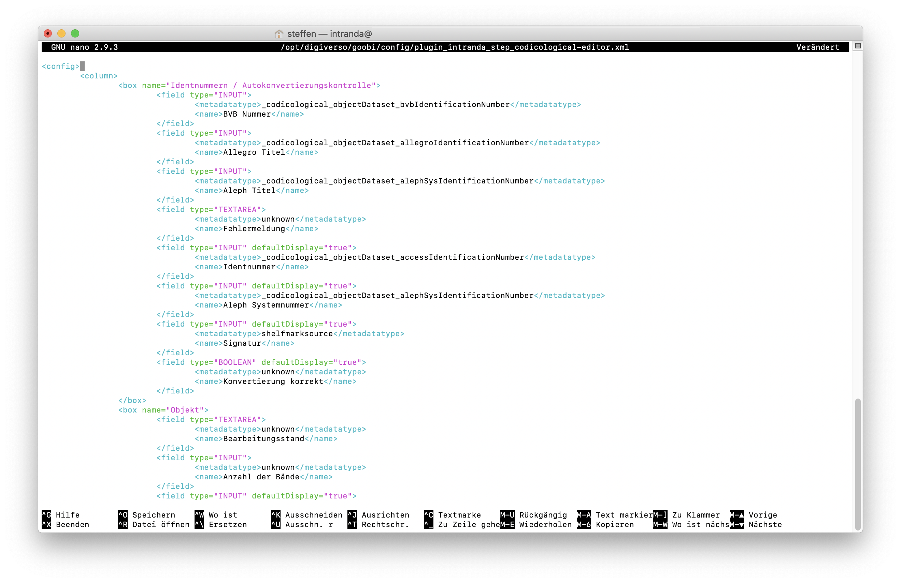

## Vokabularmanager als Teil von Goobi workflow

Seit einiger Zeit existierte bereits ein Administration-Plugin für die Verwaltung von Vokabularen. Dieses Plugin wurde nun in den Kern von Goobi workflow übernommen und stellt von nun an eine zentrale Basiskomponente für alle Goobi workflow Installationen dar.

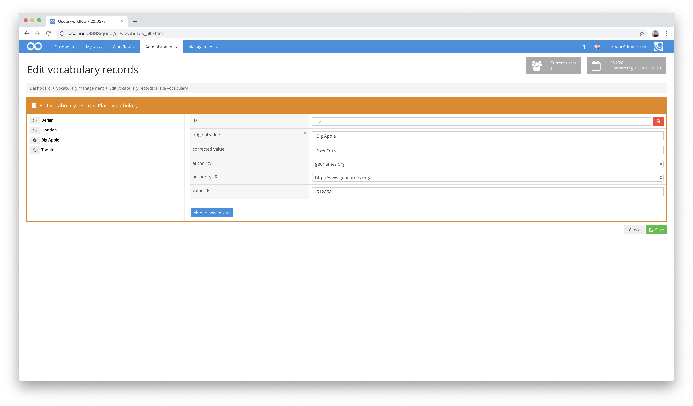

Innerhalb dieses neuen Vokabularmanager können nun beliebig viele Vokabulare definiert und bearbeitet werden. Für das Erzeugen und die Konfiguration eines Vokabulars ist hierbei als besondere Rechtestufe die Berechtigung `Vokabularverwaltung - Administration` notwendig. Für die Verwaltung der einzelnen Vokabulardatensätze hingegen wird die Berechtigung `Vokabularverwaltung - Datensätze` benötigt.

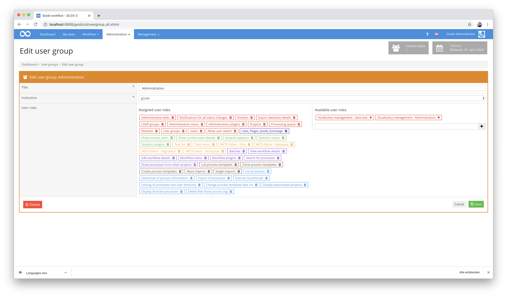

Für die Administration eines Vokabulars stehen verschiedene Optionen zur Verfügung. So lassen sich verschiedene Felder unterschiedlicher Typen definieren, die jeweils mehrsprachige Inhalte haben, mit Inhalten vorbelegt und auch als Pflichtfelder festgelegt werden können.

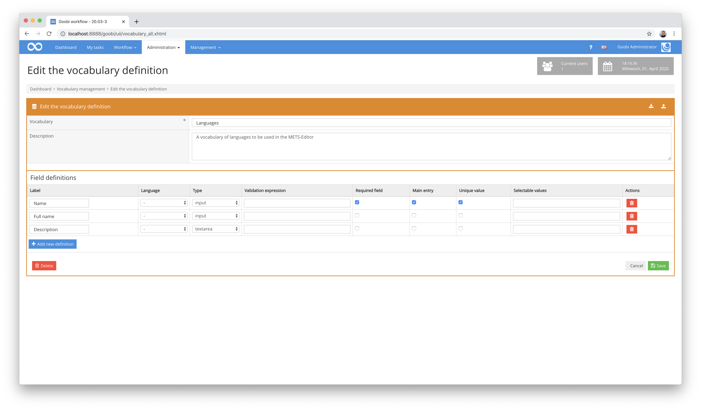

Für einen bequemen Datenaustausch steht ausserdem ein Import- und Exportmechanismus über das Datenformat Microsoft Excel zur Verfügung. Bereits vorliegende kontrollierte Vokabulare können so automatisch auch mit großen Datenmengen importiert werden.

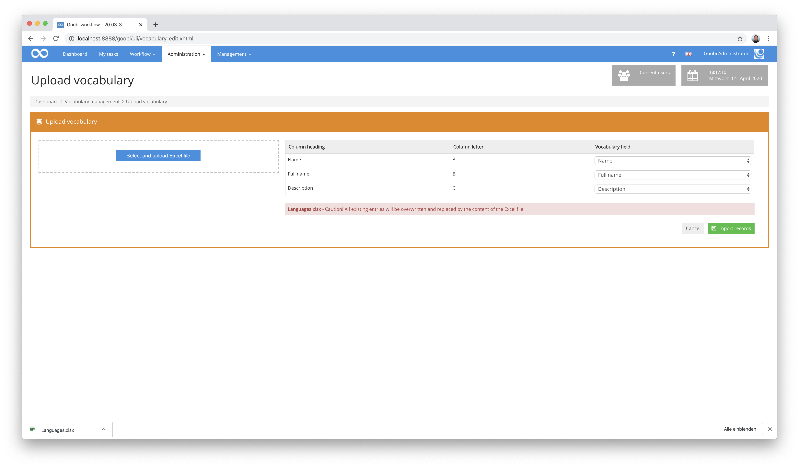

Die Oberfläche zur Bearbeitung der einzelnen Datensätze eines Vokabulars passt sich dynamisch der Vokabulardefinition an. Je nach Konfiguration können so pro Datensatz entsprechend mehrere verschiedene Felder unterschiedlicher Typen ausgefüllt werden.

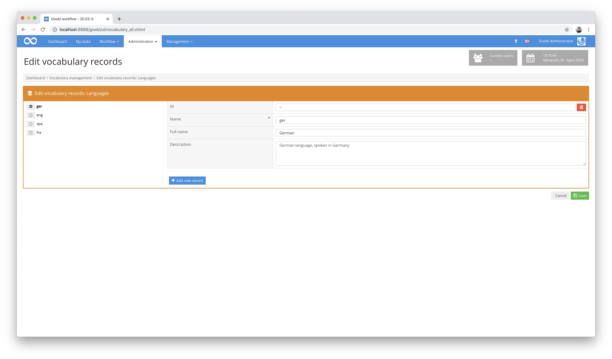

Die so angelegten Datensätze stehen anschließend über eine REST-API für den Zugriff durch externe Applikationen zur Verfügung, können innerhalb des METS-Editors für die Verwendung als Metadaten genutzt werden oder auch zur automatischen Anreicherung von Metadaten eingesetzt werden.

[https://github.com/intranda/goobi/commit/e515dac2ed6835a0a6a5d81fc0ea50b1a4b22f83](https://github.com/intranda/goobi/commit/e515dac2ed6835a0a6a5d81fc0ea50b1a4b22f83) [https://github.com/intranda/goobi/commit/4d2bd8c118272f0b7d01ff25ad56bb32bbc99e7b](https://github.com/intranda/goobi/commit/4d2bd8c118272f0b7d01ff25ad56bb32bbc99e7b) [https://github.com/intranda/goobi/commit/17c1d9072bcf9c13cd8036330149ba591c1f4103](https://github.com/intranda/goobi/commit/17c1d9072bcf9c13cd8036330149ba591c1f4103) [https://github.com/intranda/goobi/commit/7479bb8220307fed4c92a8b23e1c537984b652e1](https://github.com/intranda/goobi/commit/7479bb8220307fed4c92a8b23e1c537984b652e1) [https://github.com/intranda/goobi/commit/c7b6c86d6a0f91f7dc588c763c07e342f1b940e9](https://github.com/intranda/goobi/commit/c7b6c86d6a0f91f7dc588c763c07e342f1b940e9)

## Auswahlfelder für den Mets-Editor mit Inhalten aus Vokabularmanager

Innerhalb des METS-Editors besteht nun die Möglichkeit, dass Feldinhalte aus einem Vokabular des Vokabularmanagers ausgewählt werden können. Somit lassen sich jetzt über die Nutzeroberfläche eigene kontrollierte Vokabulare definieren und für die Metadatenerfassung nutzen. Hierzu bestehen zwei unterschiedliche Arbeitsweisen:

Eine Auswahl von Datensätzen kann einfach über ein Drop-Down-Feld erfolgen, das innerhalb der Konfigurationsdatei `goobi_metadataDisplayRules.xml` so festgelegt wird:

```markup
<vocabularyList ref="singleDigCollection">
  <source>Digital collections</source>
</vocabularyList>
```


Eine Auswahl von Datensätzen ist ebenso über ein Suchformular möglich, wie dies für andere Vokabularien (z.B. Viaf, GND, Geonames etc.) ebenfalls möglich ist. In diesem Fall erfolgt die Konfiguration in der Datei `goobi_metadataDisplayRules.xml` folgendermaßen:

```markup
<vocabularySearch ref="SubjectTopic">
  <source>Languages</source>
  <field>Name; Full Name; Description</field>
</vocabularySearch>
```

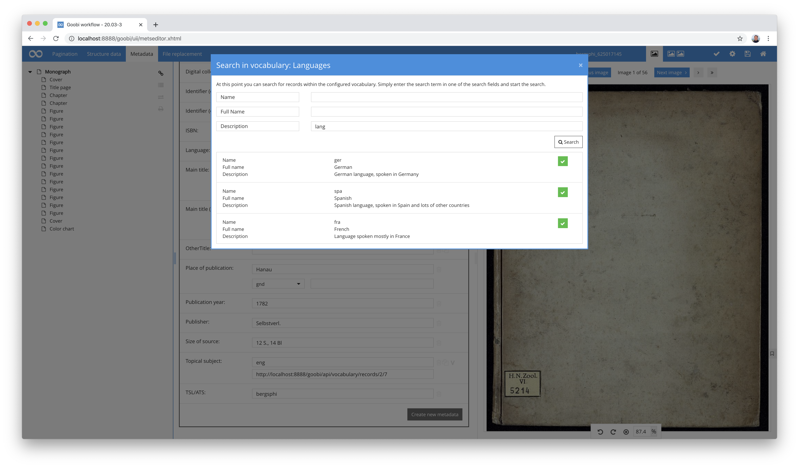

Für beide Anwendungsfälle ist es im Übrigens wichtig, dass die REST-API von Goobi aktiv ist und innerhalb der Konfigurationsdatei `goobi_rest.xml` den Zugriff auf das Vokabular wie folgt erlaubt:

```markup
<endpoint path="/vocabulary.*">
  <method name="get">
    <allow />
  </method>
  <method name="post">
    <allow />
  </method>
</endpoint>
```

## Neues Plugin zum automatischen Suchen und Ersetzen von Metadaten aus einem Vokabular

Die neue Funktionalität der Vokabularverwaltung erlaubt viele neue Nutzungsszenarien von Goobi workflow. So wurde in dem Kontext unter anderem ein Plugin entwickelt, das automatisch Korrekturen von existierenden Metadaten durchführen kann. Hierzu kann innerhalb der Konfiguration des Plugins festgelegt werden, welches Metadatum als Quellinformation genutzt werden soll und in welches Metadatum die Zielinformation geschrieben werden soll. Somit läßt sich beispielsweise folgendes Szenario abdecken:

* innerhalb der Metadaten stehen im Feld `Erscheinungsort` verschiedene Varianten des gleichen Ortes in unterschiedlichen Schreibweisen und Abkürzungen, jeweils ohne Normdatenangabe
* Dieser Anwendungsfall gilt für zahlreiche Städte innerhalb der Datensätze mit unterschiedlichen Schreibweisen
* In einem Vokabular sind Orte mit den verschiedenen verwendeten Schreibweisen und Abkürzungen definiert, ebenso wie die gewünschte gleichartige Schreibweise
* Ebenso ist in dem Vokabular definiert, dass für den korrigierten Wert des Erscheinungsortes eine Verlinkung auf den Normdatensatz aus GeoNames verwendet werden soll. Hierzu ist für den Ort entsprechend die Authority sowie der zu verwendene Datensatz-Identifier hinterlegt
* Das Plugin wird automatisch vor der Veröffentlichung eines Digitalisats im Workflow von Goobi ausgeführt. Es analysiert alle Metadatenfelder, ob hierfür eine Ersetzungsdefinition vorliegt. Wird ein solcher Wert gefunden, so wird die gewünschte Zielschreibweise zusammen mit den Normdatenangaben verwendet und in das Zielfeld geschrieben. Wir das konfigurierte Metadatenfeld hingegen kein andere Schreibweise im Vokabular gefunden, so wird der Ursprungswert in das Zielfeld unverändert übernommen zusammen mit ggf. vorliegenden Normdaten.

Die Konfiguration einer solchen Ersetzungsdefinition sieht beispielhaft so aus:

```markup
<config_plugin>
  <config>
    <project>*</project>
    <step>*</step>
    <entry>
      <fieldFrom>originalPlaceOfPublication</fieldFrom>
      <fieldTo>PlaceOfPublication</fieldTo>
      <vocabulary>Place vocabulary</vocabulary>
      <contentSearch>original value</contentSearch>
      <contentReplace>corrected value</contentReplace>
      <contentAuthority>authority</contentAuthority>
      <contentAuthorityUri>authorityURI</contentAuthorityUri>
      <contentAuthorityValueUri>valueURI</contentAuthorityValueUri>
    </entry>
  </config>
</config_plugin>
```

Innerhalb des Vokabulars sind für die verschiedenen Abkürzungen und Schreibweisen Datensätze hinterlegt, die durch für die Ersetzung berücksichtigt werden sollen:


Nach dem erfolgreichen Durchlauf des Plugins sind die Metadaten automatisch angereichert. Diese Ersetzungen können auch wiederholt innerhalb des Workflows stattfinden und aktualisieren die konfigurierten Zielfelder mit dem der jeweils gültigen Fassung aus dem Vokabular.


Die ausführliche Dokumentation des Plugins findet sich hier:



## Neuer Plugin-Typ für Part-GUI und Full-GUI gleichzeitig

In der Vergangenheit gab für die Step-Plugins von Goobi bisher drei Varianten:

| Typ    | Beschreibung                                                                                                                      |
| ------ | --------------------------------------------------------------------------------------------------------------------------------- |
| `NONE` | Plugins ganz ohne Nutzeroberfläche                                                                                                |
| `PART` | Plugins mit einer teilweisen Nutzeroberfläche, integriert in eine angenommene Aufgabe (Beispiel: `File-Upload-Plugin`)            |
| `FULL` | Plugins mit einer vollständigen Nutzeroberläche, die aus einer angenommenen Aufgabe betreten werden (Beispiel: `Image-QA-Plugin`) |

Neu hinzugekommen ist eine neue Variante, die nun erlaubt, dass ein Plugin sowohl eine teilweise als auch eine vollständige Nutzeroberfläche unterstützt.

| Typ             | Beschreibung                                                                                                    |
| --------------- | --------------------------------------------------------------------------------------------------------------- |
| `PART_AND_FULL` | Plugins mit teilweiser und vollständiger Nutzeroberfläche zugleich (Beispiel: überarbeitetes `Image-QA-Plugin`) |

Auf diese Weise ist es nun möglich, dass ein Plugin beispielsweise bereits innerhalb einer angenommenen Aufgabe eine Vorschau anzeigt davon, was in der vollständigen Nutzeroberfläche in detaillierter Form betrachtet und bearbeitet werden kann. Beispielhaft wurde dies zunächst anhand des Image-QA-Plugins implementiert.

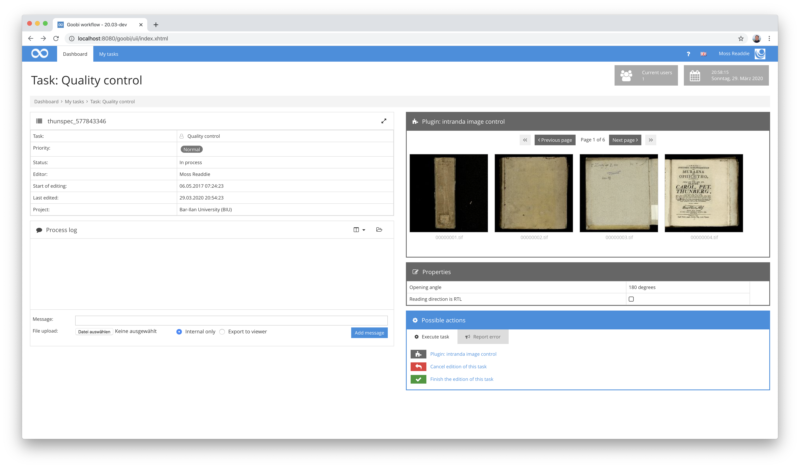

[https://github.com/intranda/goobi/commit/05d755e8d738a6d4248307c55861c7f6ca75a7cc](https://github.com/intranda/goobi/commit/05d755e8d738a6d4248307c55861c7f6ca75a7cc) [https://github.com/intranda/goobi/commit/80ea9855ba60ce1ad54322668798562211086e12](https://github.com/intranda/goobi/commit/80ea9855ba60ce1ad54322668798562211086e12) [https://github.com/intranda/goobi/commit/a824f97aa7044d6e302eb7a67dd77af2e6300ebc](https://github.com/intranda/goobi/commit/a824f97aa7044d6e302eb7a67dd77af2e6300ebc)

## Überarbeitung und Dokumentation des Image-QA-Plugins

Das Image-QA-Plugin ist eines der am weitesten verbreiteten Plugins. Es hat in der Vergangenheit schon verschiedene Updates erhalten. Allerdings ist es bisher nie öffentlich dokumentiert worden. In diesem Monat haben wir dies einmal in Angriff genommen. Neben diversen größeren und kleineren optischen Anpassungen wurde vor allem eine umfangreiche Unterstützung von 3D-Objekten implementiert und eine Dokumentation erstellt.


Und falls es noch nicht bekannt sein sollte, das QA-Plugin kann viel mehr als nur Bilder anzeigen. Es kann unter anderem auch folgendes:

* in verschiedenen Workflows kann es sich unterschiedlich verhalten, was die Anzeige und die Funktionalität betrifft
* ein Download von einzelnen oder mehreren Bildern ist möglich
* Bilder können einzeln oder zusammen in 90-Grad-Schritten rotiert werden
* Bilder können gelöscht werden
* es gibt eine Vollbild-Anzeige
* Volltexte können parallel zum Bild angezeigt werden
* PDF-Dateien können generiert werden
* die Anzahl der Thumbnails ist konfigurierbar
* die Auflösungen der Zoomstufen für das große Bild ist konfigurierbar
* es unterstützt als erste Plugin die neue Anzeigevariante `PART_AND_FULL` für eine Anzeige von Thumbnails direkt innerhalb der Aufgabe




[https://github.com/intranda/goobi/commit/6bba5b0d27c4e2ff8420a9a1fb8ae382c4cc8fa1](https://github.com/intranda/goobi/commit/6bba5b0d27c4e2ff8420a9a1fb8ae382c4cc8fa1) [https://github.com/intranda/goobi/tree/a322a94342beedd4a2c730ad4e8671814ff793fc](https://github.com/intranda/goobi/tree/a322a94342beedd4a2c730ad4e8671814ff793fc)

## Plugin für Anzeige von speziellen Validierungsergebnissen innerhalb von Aufgaben

Vor einigen Monaten bereits wurde ein spezielles Import-Plugin entwickelt, dass einen Massenimport von Metadaten aus einer Excel-Tabelle erlaubt und dabei noch vor dem eigentlichen Import eine ausführliche Validierung der Feldinhalte erlaubt. Mehr zu diesem Plugin findet sich in dessen Dokumentation hier:



Hinzu kommt nun ein zweites Plugin, das eng mit diesem Import-Plugin zusammenarbeitet. Es nutzt die gleiche Konfigurationsdatei ein weiteres Mal nach und sorgt für eine wiederholt mögliche Anzeige von Metadaten, die zuvor importiert und im Laufe des Workflows überarbeitet wurden. Als Step-Plugin erlaubt es eine wiederholte Ausführung sowie eine kombinierte Ausführung zusammen mit dem Zugriff auf dem Metadaten-Editor von Goobi workflow.

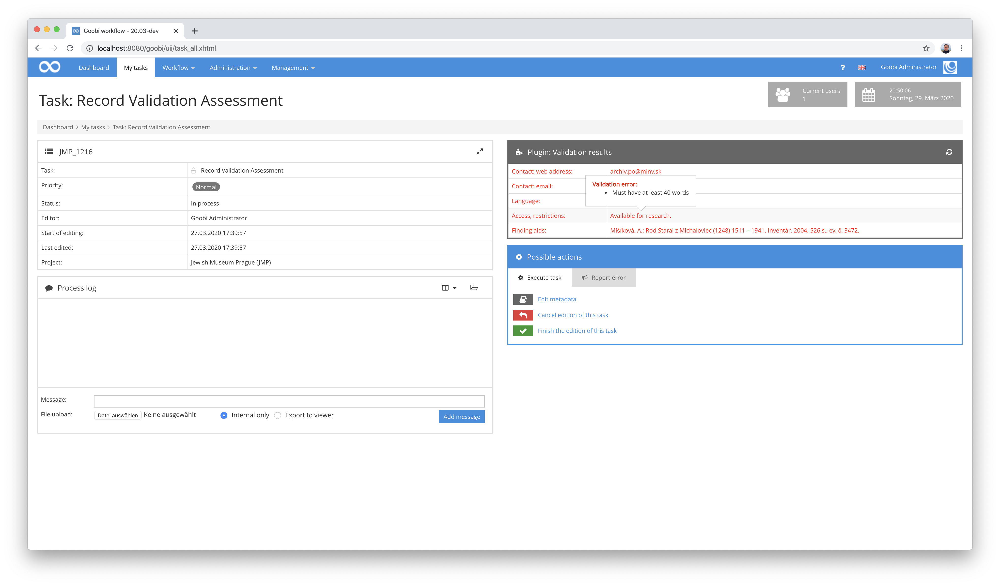



## Zahlreiche optische Anpassungen an mehreren Stellen

In Goobi workflow gab es zahlreiche kleinere optische Anpassungen, auf die hier gar nicht im Detail eingegangen werden kann. Mehrheitlich betreffen diese optischen Anpassungen Fragen des Layouts, Vereinheitlichung von Abständen und Schriftgrößen sowie Icon-Darstellungen. Unter anderem haben wir in diesem Kontext ebenfalls noch einigen Funktionen leicht geänderte Icons zugewiesen, um einerseits Doppelungen zu vermeiden und andererseits für eine Vereinheitlichung des Layouts zu sorgen.

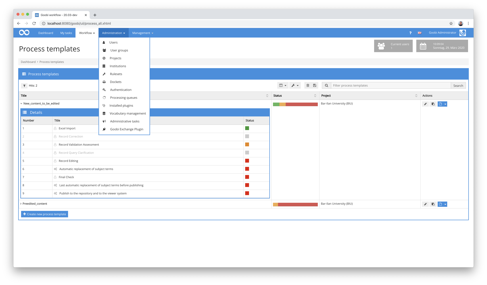

Nach dem größeren Updated METS-Editors im November und Dezember 2019 erhielten wir wiederholt die Rückmeldung, dass innerhalb des METS-Editors weiterhin eine Navigation zwischen den Seiten möglich sein soll, bei der jeweils eine Seite übersprungen werden kann. Dies war im Kontext der Homogenisierung des Paginators während der Umstellungen abgeschafft worden. Mit unseren Umstellungen haben wir nun diese Funktion wiederhergestellt, so dass eine Navigation nicht mehr nur in Einzelseitensprüngen erfolgen muss.


[https://github.com/intranda/goobi/commit/dc6adab07ef74a10dd1d0f570a3297141c11efc0](https://github.com/intranda/goobi/commit/dc6adab07ef74a10dd1d0f570a3297141c11efc0) [https://github.com/intranda/goobi/commit/940dc8d68f2b21f4e8a4f0566fba8ba7585b1990](https://github.com/intranda/goobi/commit/940dc8d68f2b21f4e8a4f0566fba8ba7585b1990) [https://github.com/intranda/goobi/commit/92a8ae02f79da6dde326f27ed60c45d80262599c](https://github.com/intranda/goobi/commit/92a8ae02f79da6dde326f27ed60c45d80262599c) [https://github.com/intranda/goobi/commit/6484491167c12f1a0ab29a6f5b7f1cbea5145fcf](https://github.com/intranda/goobi/commit/6484491167c12f1a0ab29a6f5b7f1cbea5145fcf) [https://github.com/intranda/goobi/commit/531986e7430213c739a5312300137868777378e3](https://github.com/intranda/goobi/commit/531986e7430213c739a5312300137868777378e3)