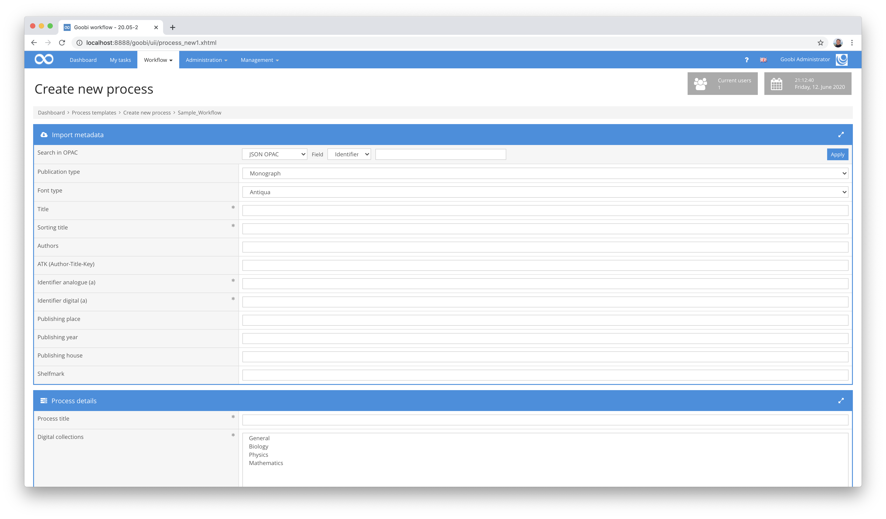

# Mai 2020

## Coming soon

In den kommenden Wochen werden wir uns voraussichtlich auf folgende Punkte konzentrieren:

* LayoutWizzard Refactoring
* Umstellung des Goobi-Codes zur Nutzung von CDI
* Accessibility nach WCAG 2.1

## Darstellung von Audio- und Video-Materialien innerhalb des Image-QA-Plugins

Nachdem wir im vorherigen Monat bereits eine Unterstützung von Audio- und Video-Materialien innerhalb des METS-Editors von Goobi workflow fertigstellen konnten, haben wir uns diesen Monat ebenso das Image-QA-Plugin noch einmal angeschaut, um auch dieses kompatibel für die Audio- und Videoanzeige zu machen.


Auch hier gelten wieder die gleichen Kompatibilitätseinschränkungen wie für den METS-Editor, so dass folgende Format bisher direkt innerhalb der Anzeige möglich sind:

Videoformate:

| Browser                | MP4 | WebM | Ogg |
| ---------------------- | --- | ---- | --- |
| Edge/Internet Explorer | YES | NO   | NO  |
| Chrome                 | YES | YES  | YES |
| Firefox                | YES | YES  | YES |
| Safari                 | YES | NO   | NO  |
| Opera                  | YES | YES  | YES |

Audioformate:

| Browser                | MP3 | WAV | OGG |
| ---------------------- | --- | --- | --- |
| Edge/Internet Explorer | YES | NO  | NO  |
| Chrome                 | YES | YES | YES |
| Firefox                | YES | YES | YES |
| Safari                 | YES | YES | NO  |
| Opera                  | YES | YES | YES |

[https://github.com/intranda/goobi/commit/32cad013767d747f308d1e0168e111232f44ee27](https://github.com/intranda/goobi/commit/32cad013767d747f308d1e0168e111232f44ee27)

## Optimierung der Bildanzeige im Zusammenspiel mit den neuen thumbs-Ordnern

Wenn eine `info.json` für ein Bild über IIIF angefragt wird, werden nun die vorhandenen thumbs als Zoomstufen zurückgegeben. Dadurch fragt der Browser mit dem darin enthaltenen Tool für die Bildanzeige (openSeadragon) dann genau diese an, so dass die Thumbnails direkt durchgereicht werden können. Diese Veränderung bringt eine enorme Beschleunigung der Ladezeiten mit sich. Bei einigen Bildern mit längeren Ladezeiten konnten die Zeit somit beispielsweise von ursprünglich 2,4 Sekunden auf nur noch 0,2 Sekunden gesenkt werden.

[https://github.com/intranda/goobi/commit/0afa8ac5b58b801a07699ac982239965e2a257e8](https://github.com/intranda/goobi/commit/0afa8ac5b58b801a07699ac982239965e2a257e8) [https://github.com/intranda/goobi/commit/a61d3e0735e2b53bac5192adfa4b07e42d3395cd](https://github.com/intranda/goobi/commit/a61d3e0735e2b53bac5192adfa4b07e42d3395cd)

## ImageQA: Neue Vollbildansicht für schnelles durchblättern

Die Vollbildansicht des Image-QA-Plugins wurde ebenfalls deutlich überarbeitet. Sie wurde nun noch einmal neu in JavaScript implementiert, die es im Zusammenspiel mit obiger schneller Bildauslieferung erlaubt, mit gefühlter Desktop-Geschwindigkeit durch die Bilder zu navigieren.


Um diese neue Vollbildanzeige zu nutzen, muss innerhalb der Konfiguration des Plugins dieser Anpassung vorgenommen werden:

```markup
<useJSFullscreen>true</useJSFullscreen>
```

[https://github.com/intranda/goobi/commit/f43f2dbfd0eb737c8a75a00db987ee6e5c328411](https://github.com/intranda/goobi/commit/f43f2dbfd0eb737c8a75a00db987ee6e5c328411) [https://github.com/intranda/goobi/commit/0042b21959930d2dc80c92d1864125e92bc40f8f](https://github.com/intranda/goobi/commit/0042b21959930d2dc80c92d1864125e92bc40f8f) [https://github.com/intranda/goobi/commit/1843faf29f7985a5f6fc4a45d6f04e708b636b7e](https://github.com/intranda/goobi/commit/1843faf29f7985a5f6fc4a45d6f04e708b636b7e) [https://github.com/intranda/goobi/commit/fcf566fe0d0d4194585793c272f13c5603918001](https://github.com/intranda/goobi/commit/fcf566fe0d0d4194585793c272f13c5603918001)

## METS-Editor: Letzte Seite für neues Strukturelement verwenden ist jetzt optional

Vor relativ kurzem wurde im METS-Editor die neue Funktion integriert, die es erlaubt, dass unmittelbar nach dem Anlegen eines Strukturelements automatisch die verwendete Endseite zur neuen Startseite für das nächste Strukturelement werden kann. Dies spart in dem meisten Anwendungsfällen unnötige Mausklicks sowie einiges an Zeit.


Dennoch bestehen in der Goobi-Community so viele individuelle Arbeitsweisen, dass nicht jeder von solchen Neuerungen profitiert. Aus diesem Grund haben wir nun diese Funktion abschaltbar gemacht. Unmittelbar innerhalb der Box zum Anlegen neuer Strukturelemente kann nun mittels der dort angebotenen Checkbox festgelegt werden, ob die Funktion der Seitenübernahme für folgende Strukturelemente deaktiviert werden soll.

[https://github.com/intranda/goobi/commit5f22c48421e29e0d4cce3a48e8c3e89a348a02a0](https://github.com/intranda/goobi/commit5f22c48421e29e0d4cce3a48e8c3e89a348a02a0)

## Neues Opac Plugin für generischen JSON import

Das Format JSON spielt in immer mehr Systemen eine große Rolle, wenn es um den Austausch von Daten zwischen Maschinen geht. Unter anderem ist dies so auch in einigen Katalogsystemen bereits in Verwendung, so unter anderem innerhalb von ArchiveSpace ([https://archivesspace.org/](https://archivesspace.org/)). Um solche Datenquellen ebenfalls zu unterstützen, wurde ein neues Opac-Plugin für die Datenübernahme von JSON-Daten zu ermöglichen.



Der Funktionsumfang dieses Plugins ist ähnlich zu dem XML-Opac-Plugin extrem generisch gehalten. Statt mittels der Abfragespache XPath zu arbeiten kommt für JSON die Abfrage der Metadaten mittels JSONPath in den Einsatz, so dass auch hier sehr individuelle Mappings der Metadaten von JSON zu METS definiert werden können.

Mehr Informationen über die Einsatzmöglichkeiten von JSONPath finden sich hier:


https://support.smartbear.com/alertsite/docs/monitors/api/endpoint/jsonpath.html


Der Quellcode für dieses neue Opac-Plugin ist bei Github veröffentlicht:


https://github.com/intranda/goobi-plugin-opac-json


Eine umfangreiche Dokumentation über das Plugin und dessen Konfigurationsmöglichkeiten findet sich hier:


https://docs.goobi.io/goobi-workflow-plugins-de/opac/goobi-plugin-opac-json


[https://github.com/intranda/goobi/commit/fa5ecfd989a96b2540dfae4d0c61e75e2d583797](https://github.com/intranda/goobi/commit/fa5ecfd989a96b2540dfae4d0c61e75e2d583797) [https://github.com/intranda/goobi/commit/8a050eaf689f0cd4f0ceabaa69a493d9ebbc74cd](https://github.com/intranda/goobi/commit/8a050eaf689f0cd4f0ceabaa69a493d9ebbc74cd) [https://github.com/intranda/goobi/commit/fa4ef8689ddd14726214b7a4c0f9ecce3c092330](https://github.com/intranda/goobi/commit/fa4ef8689ddd14726214b7a4c0f9ecce3c092330) [https://github.com/intranda/goobi/commit/b40b6ab79fae816c3ec78d72a10687d6b9fb1915](https://github.com/intranda/goobi/commit/b40b6ab79fae816c3ec78d72a10687d6b9fb1915)

## Mehrere Abhängigkeiten wurden aktualisiert

Die allgemeinen Refactoring-Arbeiten an Goobi workflow schreiten voran neben dem üblichen Tagesgeschäft. Unter anderem wurden verschiedene Programmbibliotheken aktualisiert, wie beispielsweise:

* PDFBox
* Jackson
* Jersey

[https://github.com/intranda/goobi/commit/5b90c799f9955a1cf666ecdf679661e7d820c934](https://github.com/intranda/goobi/commit/5b90c799f9955a1cf666ecdf679661e7d820c934)