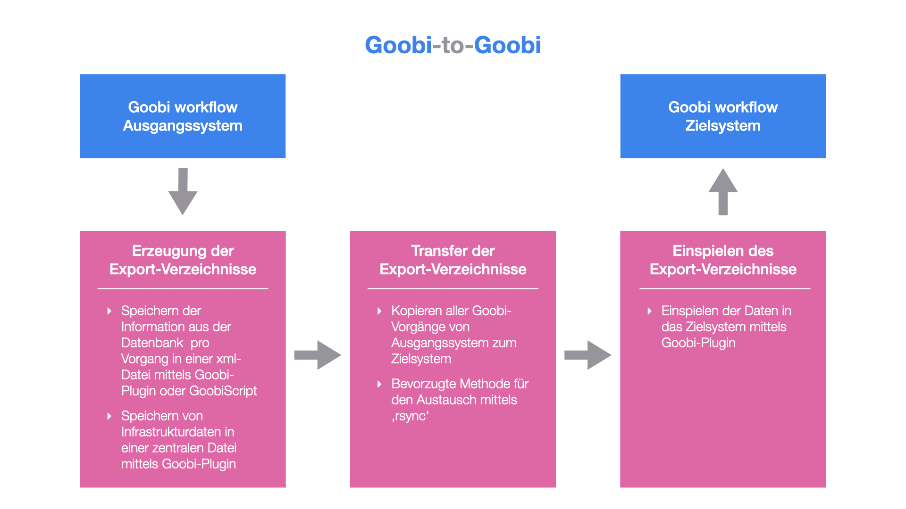
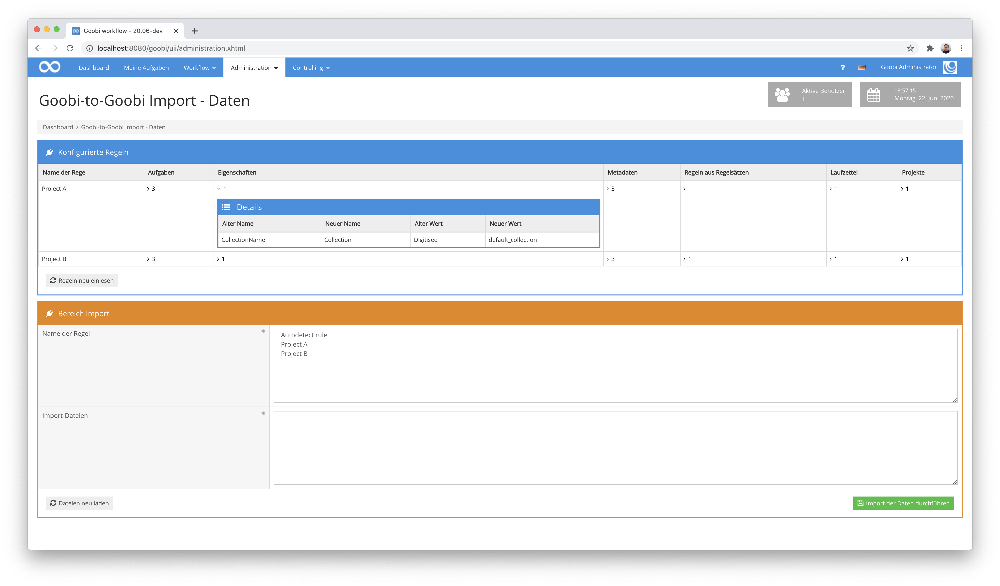
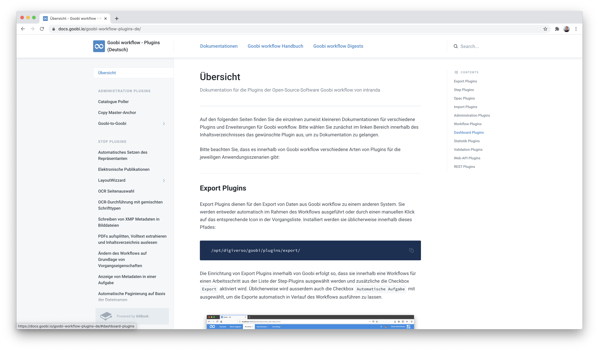
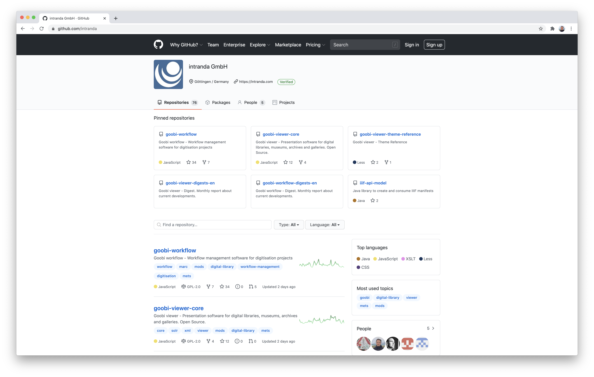
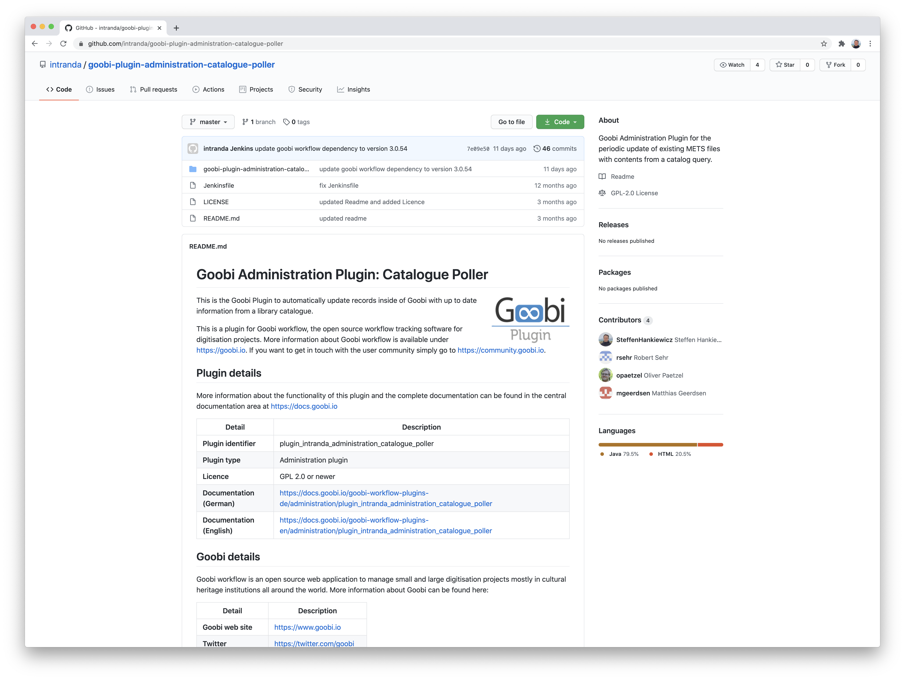
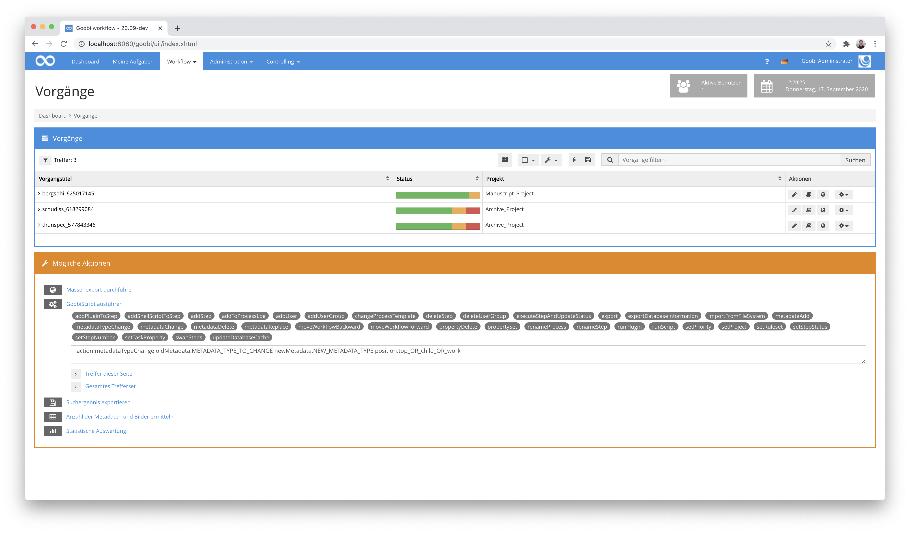
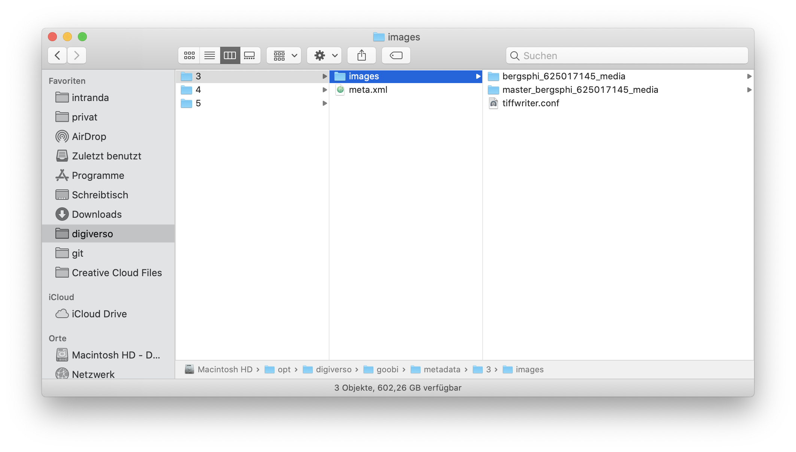
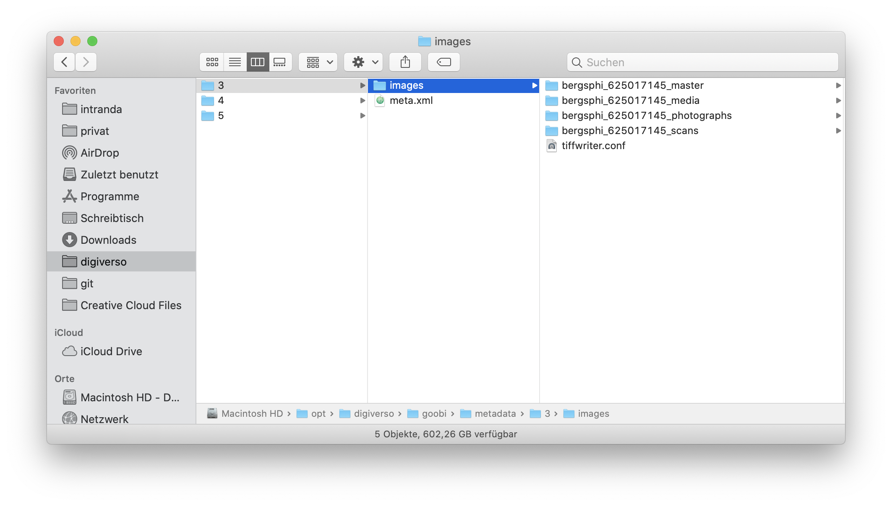

# Juni 2020

## Coming soon

In den kommenden Wochen werden wir uns voraussichtlich auf folgende Punkte konzentrieren:

* Erweiterung der Ordnerverwaltung pro Vorgang
* Accessibility gemäß WCAG
* Ermöglichung einer vorgangsübergreifenden Möglichkeit für die Arbeit mit dem Layoutwizzard

## Neues Plugin für den Datenaustausch: Goobi-to-Goobi

Goobi workflow wird in immer mehr Einrichtungen und Ländern eingesetzt. Dabei beschränkt sich der Nutzerkreis nicht mehr nur auf Kultureinrichtungen sondern umfasst ebenso auch vermehr Scandienstleister. Bisher war die Datenübergabe zwischen zwei verschiedenen Goobi-Instanzen noch recht schwierig gewesen. Mit dem neuen Goobi-to-Goobi-Plugin ist dies nun einfach geworden.



Die Arbeitsweise ist dabei so, dass insgesamt drei separate Arbeitsschritte für den Austausch stattfinden müssen:

### a) Erzeugung der Export-Verzeichnisse durch das Ausgangssystem

Zunächst werden die relevanten Daten aus dem einen Goobi exportiert. Dies beinhaltet die Vorgänge und Mediendateien. Darüber hinaus können hierbei aber ebenso Regelsätze und Benutzerinformationen mit exportiert werden. Wie der Export genau abläuft, ist hier erläutert:


https://docs.goobi.io/goobi-workflow-plugins-de/administration/plugin_intranda_adminstration_goobi2goobi/step_1_export


### b) Transfer der Export-Verzeichnisse vom Ausgangssystem zum Zielsystem

Nach dem erfolgreichen Export der Daten, müssen diese zum Zielsystem transferiert werden. Dieser Transfer setzt derzeit einen Austausch über Tools wie `rsync` oder die Nutzung einer externen Festplatte voraus.

Eine Beschreibung des Transfers ist mit praxistauglichen Kommandos hier beschrieben:


https://docs.goobi.io/goobi-workflow-plugins-de/administration/plugin_intranda_adminstration_goobi2goobi/step_2_transfer


### c) Einspielen der Export-Verzeichnisse im Zielsystem

Sobald der Transfer der Daten zum Zielsystem erfolgt ist, kann das Einspielen beginnen. Hierzu steht eine eigene Nutzeroberfläche zur Verfügung, in der festgelegt werden kann, welche Daten genau übernommen werden sollen.



Auch hierzu steht eine ausführliche Dokumentation zur Verfügung:


https://docs.goobi.io/goobi-workflow-plugins-de/administration/plugin_intranda_adminstration_goobi2goobi/step_3_import


Die vollständige Dokumentation des Plugins findet sich unter der folgenden Adresse:


https://docs.goobi.io/goobi-workflow-plugins-en/administration/plugin_intranda_adminstration_goobi2goobi


Der Quellcode des Plugins wurde hier veröffentlicht:


https://github.com/intranda/goobi-plugin-administration-goobi2goobi-export



https://github.com/intranda/goobi-plugin-administration-goobi2goobi-import


## Neue Dokumentationen für zahlreiche Plugins

Innerhalb der Goobi-Dokumentationsplattform sind zahlreiche Plugins neu hinzugekommen und erhielten eine ausführliche Dokumentation der Konfiguration sowie der Bedienung. In diesem Zusammenhang wurden hierbei zugleich die Lizenzen und Verlinkungen zu den Quellcode-Repositories eingepflegt. Darüber hinaus ist die Dokumentation zugleich jeweils in Deutsch und Englisch veröffentlicht worden.



Eine Übersicht der derzeitig öffentlich dokumentierten Goobi workflow Plugins findet sich hier:


https://docs.goobi.io/goobi-workflow-plugins-de/


## Zahlreiche Plugins auf GitHub veröffentlicht

Viele der am häufigsten eingesetzten Plugins haben wir nun mit dem Quellcode auch auf Github veröffentlicht. Dazu haben wir zunächst einen Standard für unsere Readme-Dateien entworfen und anschließend für alle zu veröffentlichenden Plugins eingepflegt. Dadurch haben wir nun seit Juni 2020 bereits über 70 Open-Source-Repositories bei Github online:



Insgesamt haben wir damit nun bereits den Quellcode von 48 Plugins veröffentlicht:



Mehr Informationen hierzu finden sich auf unserer GitHub-Seite:


https://github.com/intranda


## Neues GoobiScript um Metadatentyp zu ändern

Es wurde ein neues GoobiScript eingeführt, um innerhalb von vielen METS-Dateien den Typ eines Metadatums ändern zu können. Der Aufruf dieses GoobiScripts sieht wie folgt aus:

```
action:metadataTypeChange oldType:TYPE_TO_CHANGE newType:NEW_TYPE position:top_OR_child_OR_work
```

Mittels dieses Kommandos kann nun abhängig von den gewählten Parametern ein existierendes Metadatum so geändert werden, dass der Wert erhalten bleibt, der Typ jedoch geändert wird. So kann zum Beispiel aus einer `Beschreibung` ein `Haupttitel` werden. Darüber hinaus kann hierbei ebenso festgelegt werden, auf welcher Ebene innerhalb des Strukturbaums diese Änderung erfolgen soll. So ist es möglich zu bestimmen, ob eine solche Änderung nur für übergeordnete Werke, nur für Unterelemente oder grundsätzlich für eigenständige Werke erfolgen soll.



[https://github.com/intranda/goobi-workflow/commit/4306740b00a75d0a7874fb7cd10f8a19074f7754](https://github.com/intranda/goobi-workflow/commit/4306740b00a75d0a7874fb7cd10f8a19074f7754)

## METS-Editor: Vermeidung unnötiger Ladezeiten durch den Einsatz von mehr Ajax

Innerhalb des METS-Editors haben wir uns eine schnellere Arbeitsweise gewünscht. Insbesondere gefiel uns nicht, dass das angezeigte große Bild oder gar die eingeblendeten Thumbnails unnötig häufig neu geladen wurden und so den Arbeitsfluss etwas unterbrachen. Aus diesem Grund haben wir die Nutzeroberfläche dahingehend umgestellt, dass nun deutlich mehr partielle Reloads von Seiteninhalten stattfinden, ohne dass die gesamte Seite davon betroffen ist. Diese Änderung wird der Nutzer vor allem bemerken, wenn er zwischen den einzelnen Reitern des METS-Editors hin und her wechselt. Aber auch beim Hinzufügen, Speichern und Bearbeiten von Personen, Metadaten und Metadatengruppen schlägt sich dies spürbar nieder.


[https://github.com/intranda/goobi-workflow/commit/c5fe9d3cd76fe93adbbb258b869a08724ba2a6e7](https://github.com/intranda/goobi-workflow/commit/c5fe9d3cd76fe93adbbb258b869a08724ba2a6e7)\
[https://github.com/intranda/goobi-workflow/commit/b433851dd74017a985be26cdd38b2f1f27055bf6](https://github.com/intranda/goobi-workflow/commit/b433851dd74017a985be26cdd38b2f1f27055bf6)

## Ordnernamen sind nun komplett konfigurierbar

Eine besonders große Änderung wurde in einem Projekt notwendig, wo zur Erzeugung von Masterbildern verschiedene Geräte zum Einsatz kamen und die dort eingespielten Dateien unterschiedlich validiert werden mussten. Diese Anforderung nahmen wir zum Anlass, um Goobi workflow dahingehend zu erweitern, dass nicht mehr nur die gängigen Ordner `master` und `media` (bzw. `tif`) existieren. Stattdessen sind von nun an sehr viele beliebige Verzeichnisse definierbar. Hinzu kommt bei der Gelegenheit auch, dass wir das alte Namenschema der Benennungen nun nicht mehr hartgecodet erwarten sondern andere Bezeichnungen erlauben.

Bisheriges Benennungsschema:



Neues mögliches Benennungsschema:



Folgendermaßen kann eine solche Verzeichnisbezeichnung innerhalb der Konfigurationsdatei `goobi_config.properties` festgelegt werden:

```
process.folder.images.main={processtitle}_media
process.folder.images.master={processtitle}_master
process.folder.images.scans={processtitle}_scans
process.folder.images.photos={processtitle}_photographs
```

[https://github.com/intranda/goobi-workflow/commit/a0395f332aaba1ddc7b75792e2113bbbbb16e4bd](https://github.com/intranda/goobi-workflow/commit/a0395f332aaba1ddc7b75792e2113bbbbb16e4bd)

## Weitere Anpassungen

Neben diesen größeren Entwicklungen gab es auch wieder einige kleinere Anpassungen, die hier kurz genannt werden sollen:

### Anlegen von Vorgängen

Bisher wurde beim Anlegen neuer Vorgänge ein Vorgang erfolgreich in Goobi angelegt, auch wenn die zugehörige METS-Datei nicht korrekt gespeichert werden konnte. Dies ist nun korrigiert, so dass eine aussagekräftige Meldung angezeigt und der Vorgang im Fehlerfall nicht angelegt wird.

[https://github.com/intranda/goobi-workflow/commit/18efa1677b98ac76828c6f40ac4fb7d22cb05da2](https://github.com/intranda/goobi-workflow/commit/18efa1677b98ac76828c6f40ac4fb7d22cb05da2)

### Scrollen im Vorgangslog

In einigen Browsern kam es beim Scrollen innerhalb des Vorgangslogs zu Schwierigkeiten, so dass sich die Bedienung unintuitiv anfühlte. Dies ist nun korrigiert, so dass sich das Scrollen nun intuitiv verhält.

[https://github.com/intranda/goobi-workflow/commit/8a9b821eb620685bc340e332c38f468806dc16ea](https://github.com/intranda/goobi-workflow/commit/8a9b821eb620685bc340e332c38f468806dc16ea)

### Andere Behandlung von Kommata innerhalb von Konfigurationsdateien

In der Vergangenheit war es so, dass Kommata in der mehreren Goobi-Konfigurationsdateien eigens maskiert bzw. escaped werden mussten. Statt eines `,` musste daher stets `\,` angegeben werden. Dies ist nun korrigiert worden. Leider geht mit dieser Änderung allerdings auch einher, dass bei einem Goobi-Update nun einige Konfigurationsdateien auf diese Maskierung geprüft werden müssen. Das gleiche gilt neben dem Komma im übrigen auch für den Backslash, der nun als `\` angegeben werden kann statt als `\\`.

[https://github.com/intranda/goobi-workflow/commit/f58d6a47a066e9a9c26e30d3eea4c579b27d831d](https://github.com/intranda/goobi-workflow/commit/f58d6a47a066e9a9c26e30d3eea4c579b27d831d)

### Ladezeiten im LayoutWizzard

Innerhalb des LayoutWizzards gab es eine Umstellung, die in einer höheren Geschwindigkeit beim ersten Öffnen des LayoutWizzard sowie beim Blättern zwischen den Vorschaubildern resultieren.