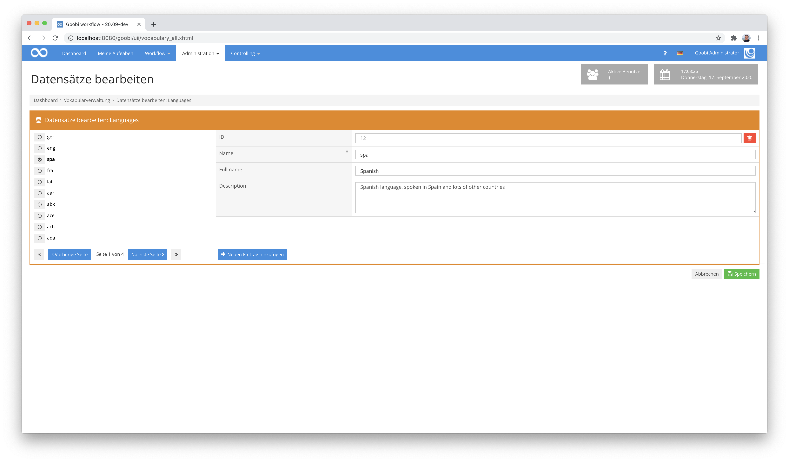
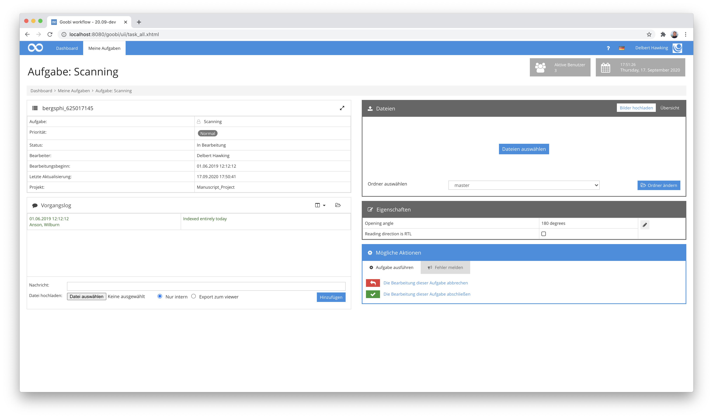
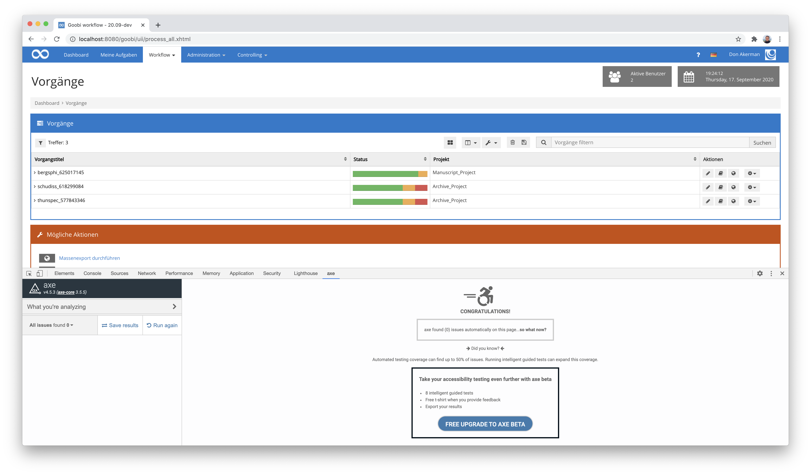

# Juli 2020

## Coming soon

In den kommenden Wochen werden wir uns voraussichtlich auf folgende Punkte konzentrieren:

* Abschluß der WCAG-Kompatibilität
* Überarbeitung der Anlegeseite von Vorgängen zur Nutzung der Daten des jeweiligen Regelsatzes
* Erweiterung der Warteschlangenfunktionalitäten mittel Active MQ
* Implementierung verschiedener generischer Plugins für unterschiedliche Workflows

## Umfangreiche Vokabulare mit blätterbarer Auflistung der Datensätze

Nachdem wir vor einigen Monaten den Vokabularmanager in den Kern von Goobi workflow überführt hatten, wurde dieser schnell bereits für mehrere Projekte verwendet, um kontrollierte Vokabulare innerhalb des METS-Editors als Drop-Down-Liste zu haben oder auch um spezielle Plugins und Exporte durchzuführen, die verschiedene Schreibweisen homogenisieren. Was dabei auffiel war, dass die Bedienung noch nicht optimal war, insbesondere wenn es sich um umfangreiche Vokabulare handelte, wie sie über einen Excel-Import eingespielt werden können.



Die Vokabulareinträge werden von nun an mit einem Paginator anzeigt. Dies erlaubt nicht nur eine deutlich kürzere Ladezeit als bisher sondern verhindert darüber hinaus auch ein unnötiges Scrollen der Webseite, wenn zwischen verschiedenen Datensätzen gewechselt wird.

[https://github.com/intranda/goobi-workflow/commit/241ef334ac0237dfc1195d3bfc64fdf4acc9b576](https://github.com/intranda/goobi-workflow/commit/241ef334ac0237dfc1195d3bfc64fdf4acc9b576)\
[https://github.com/intranda/goobi-workflow/commit/904df6556feea3eb1a0fb9780e09e15af9911d19](https://github.com/intranda/goobi-workflow/commit/904df6556feea3eb1a0fb9780e09e15af9911d19)\
[https://github.com/intranda/goobi-workflow/commit/c31869eb31cd22a79630c4d429a59408eefbecf6](https://github.com/intranda/goobi-workflow/commit/c31869eb31cd22a79630c4d429a59408eefbecf6)

## Flexible Ordner-Namen innerhalb des FileUpload-Plugins

Im letzten Monat hatten wir bereits über eine Erweiterung von Goobi workflow berichtet, die es den Nutzern nun ermöglicht, dass Goobi verschiedene Ordner verwaltet mit eigenem Benennungsschema. Um diese Funktionalität nun auch an anderen Stellen nutzen zu können, haben wir das File Upload Plugin nun ebenfalls erweitert. Es kann nun nicht nur mit diesen neuen konfigurierbaren Ordnern umgehen. Es erlaubt darüber hinaus neuerdings ebenfalls, dass für einzelne Aufgaben erlaubt werden kann, dass ein Nutzer seine Dateien in mehr als ein Verzeichnis hochladen kann.



Die Konfiguration für einen solchen Use Case würde innerhalb der Datei `plugin_intranda_step_fileUpload.xml` beispielhaft folgendermaßen aussehen:

```markup
<config_plugin>

    <config>
        <!-- which projects to use for (can be more than one, otherwise use *) -->
    <project>*</project>
        <step>*</step>
        <!-- which file types to allow -->
        <regex>/(\.|\/)(gif|jpe?g|png|tiff?|jp2|pdf)$/</regex>
        <!-- which folder to use (master or media) -->
    <folder>master</folder>
        <folder>media</folder>
    </config>

</config_plugin>
```

[https://github.com/intranda/goobi-plugin-step-fileupload/commit/3dcc5ba4930501a378920703a309e7573f79cf6b](https://github.com/intranda/goobi-plugin-step-fileupload/commit/3dcc5ba4930501a378920703a309e7573f79cf6b)\
[https://github.com/intranda/goobi-plugin-step-fileupload/commit/0b2caa7105b15f4f3fe05d2bcfa7bf9feb4a007d](https://github.com/intranda/goobi-plugin-step-fileupload/commit/0b2caa7105b15f4f3fe05d2bcfa7bf9feb4a007d)\
[https://github.com/intranda/goobi-plugin-step-fileupload/commit/12a803c02fd8e24e00609237d96725588393581a](https://github.com/intranda/goobi-plugin-step-fileupload/commit/12a803c02fd8e24e00609237d96725588393581a)

## Flexible Ordner-Namen innerhalb des ImageQA-Plugins

Nachdem eine Erweiterung des FileUpload Plugins bereits erfolgte, haben wir in ähnlicher Form auch das Image QA Plugin für die Nutzung verschiedener Ordner erweitert. Damit ist es nun möglich, dass ein Anwender eine Qualitätskontrolle von Bildern innerhalb verschiedener Verzeichnisse eines Vorgangs vornimmt. Der Nutzer kann hierbei, je nachdem, welche Verzeichnisse in seiner Aufgabe erlaubt wurden, zwischen den verschiedenen Ordnern wechseln und die darin enthaltenen Objekte betrachten.


Für die Festlegung, welche Verzeichnisse in welcher Aufgabe für einen Nutzer zugänglich sein sollen, erfolgt eine Konfiguration beispielsweise so innerhalb der Datei `plugin_intranda_step_imageQA.xml`:

```markup
    ...
    <config>
        <project>*</project>
        <step>ImageQA</step>
        <foldername>master</foldername>
        <foldername>media</foldername>
        <!-- how to display the thumbnails -->
        <numberOfImagesPerPage>12</numberOfImagesPerPage>
        <thumbnailsize>200</thumbnailsize>
        <!-- which image sizes to use for the big image -->
        <imagesize>800</imagesize>
        <imagesize>3000</imagesize>
        <!-- show OCR text beside image -->
        <displayocr>true</displayocr>
    </config>
    ...
```

[https://github.com/intranda/goobi-plugin-step-imageqa/commit/9b99a3180b16f83b495062102a033068b5fd994d](https://github.com/intranda/goobi-plugin-step-imageqa/commit/9b99a3180b16f83b495062102a033068b5fd994d)\
[https://github.com/intranda/goobi-plugin-step-imageqa/commit/b444f75e681a284fddf0c3b73511b6da4a5f01d6](https://github.com/intranda/goobi-plugin-step-imageqa/commit/b444f75e681a284fddf0c3b73511b6da4a5f01d6)\
[https://github.com/intranda/goobi-plugin-step-imageqa/commit/9b99a3180b16f83b495062102a033068b5fd994d](https://github.com/intranda/goobi-plugin-step-imageqa/commit/9b99a3180b16f83b495062102a033068b5fd994d)

## Flexible Ordner-Namen innerhalb des JHove-Validation-Plugins

Um für ein Projekt eine unterschiedliche Validierung verschiedener Bildordner zu erlauben, musste auch das Plugin zur Validierung von Bildern auf Basis von JHove überarbeitet werden. Somit ist auch in diesem Plugin nun steuerbar, welcher Ordner genau wie validiert werden soll, was auch für die flexiblen individuell konfigurierten Verzeichnisse gilt. Die Konfiguration dafür sieht innerhalb der Konfigurationsdatei `plugin_intranda_step_tif_validation.xml` beispielhaft wie folgt aus:

```markup
<config_plugin>
  <config>
      <project>*</project>
      <step>Validate Scans</step>
      <!-- folders to validate, can be multiple one (e.g. master, main etc. -->
      <folder>scans</folder>
      <openStepOnError>Scanning</openStepOnError>
      <lockAllStepsBetween>true</lockAllStepsBetween>
      <jhoveConfiguration>/opt/digiverso/goobi/config/jhove/jhove.conf</jhoveConfiguration>
      <namespace uri="http://www.loc.gov/mix/v20" name="mix" />
      <namespace uri="http://hul.harvard.edu/ois/xml/ns/jhove" name="jhove" />
      <!--Check color depth -->
      <check>
          <xpath>string(//mix:bitsPerSampleValue[1])</xpath>
          <wanted>8</wanted>
          <error_message> Check color depth for "${image}": Expected value "${wanted}", but found value "${found}".</error_message>
      </check>
  </config>
  <config>
        <project>*</project>
        <step>Validate Photographs</step>
        <!-- folders to validate, can be multiple one (e.g. master, main etc. -->
        <folder>photographs</folder>
        <openStepOnError>Scanning</openStepOnError>
        <lockAllStepsBetween>true</lockAllStepsBetween>
        <jhoveConfiguration>/opt/digiverso/goobi/config/jhove/jhove.conf</jhoveConfiguration>
        <namespace uri="http://www.loc.gov/mix/v20" name="mix" />
        <namespace uri="http://hul.harvard.edu/ois/xml/ns/jhove" name="jhove" />
        <!--Check color depth -->
        <check>
            <xpath>string(//mix:bitsPerSampleValue[1])</xpath>
            <wanted>16</wanted>
            <error_message> Check color depth for "${image}": Expected value "${wanted}", but found value "${found}".</error_message>
        </check>
    </config>
</config_plugin>
```

## Barrierefreiheit gemaß WCAG 2.1

Die Web Content Accessibility Guidelines (WCAG) als internationaler Standard zur barrierefreien Gestaltung von Internetangeboten sind innerhalb der Europäischen Union für öffentliche Stellen ab dem 23. September 2019 für neue und ab 23. September 2020 auch für bestehende Websites gemäß WCAG 2.1 Stufe AA verbindlich. Um diese Vorgaben einzuhalten, überarbeiten wir die Nutzeroberfläche von Goobi workflow gründlich. Die meisten Bereiche haben wir im Juli bereits abschließen können. Die sehr kleinteilige Arbeit wird noch etwas in Anspruch nehmen, insbesondere für den METS-Editor und die zahlreichen zu berücksichtigenden Plugins. Wir freuen uns aber darüber, dass wir die ersten Accessiblity-Validatoren nun bereits erfüllen können.



[https://github.com/intranda/goobi-workflow/commit/ed0e76c20334ff318d8e856927c6f3359a322c77](https://github.com/intranda/goobi-workflow/commit/ed0e76c20334ff318d8e856927c6f3359a322c77)\
[https://github.com/intranda/goobi-workflow/commit/e7c49f18cd4bba9bb299ec5f3f70034a92d5918f](https://github.com/intranda/goobi-workflow/commit/e7c49f18cd4bba9bb299ec5f3f70034a92d5918f)\
[https://github.com/intranda/goobi-workflow/commit/e7c49f18cd4bba9bb299ec5f3f70034a92d5918f](https://github.com/intranda/goobi-workflow/commit/e7c49f18cd4bba9bb299ec5f3f70034a92d5918f)

## LayoutWizzard Workflow Plugin

Innerhalb eines Projektes ergab sich die Anforderung, dass das automatische Croppen mittels LayoutWizzard nicht nur für gesamte Vorgänge möglich sein. Speziell ging es darum, dass in einem Vorgang durchaus auch einmal jeweils nur ein oder zwei Bilder vorhanden sind und daher eine Vorgangsübergreifende Bearbeitung der Bilder möglich sein soll. Aus diesem Grund haben wir eine Erweiterung für den LayoutWizzard implementiert, die als Workflow-Plugin arbeitet. Dort ist es möglich, über mehrere Vorgänge hinweg Bilder aufgelistet zu bekommen, um diese zu croppen. In der Liste der dort aufgeführten Bilder werden dabei nur diejenigen aufgeführt, die bereits einen konfigurierten Arbeitsschritt (z.B. eine abgeschlossene Bildanalyse) durchlaufen haben.


Eine Dokumentation für dieses neue Plugin findet sich unter der folgenden URL:


https://docs.goobi.io/goobi-workflow-plugins-de/workflow/plugin-workflow-crop


## Weitere Anpassungen

Neben den größeren Entwicklungen gab es auch wieder einige weitere Anpassungen:

### Update sehr vieler Dependencies in Goobi workflow

Wie jede größere Software bedient sich auch Goobi workflow zahlreicher externer Programmbibliotheken, die andere Entwickler unter einer Open-Source-Lizenz bereitstellen. Hier haben wir einmal gründlich aufgeräumt und zahlreiche solcher Bibliotheken aktualisiert, um auf dem neuesten Stand zu sein. Eine solche Änderung hat im ersten Moment zwar kaum einen Effekt auf die Nutzeroberfläche. Mittelfristig erlaubt dies aber natürlich viele zusätzliche Erweiterungen des Funktionsumfangs.

[https://github.com/intranda/goobi-workflow/commit/ad712cdd5509fd478c8753ef6c112a389cb41e9e](https://github.com/intranda/goobi-workflow/commit/ad712cdd5509fd478c8753ef6c112a389cb41e9e)

### Goobi workflow auf S3: Fix für die Übertragung von Dateien größer als 5GB

Kaum eine Einrichtung nutzt bisher die Möglichkeit von Goobi workflow auch innerhalb der Amazon Cloud unter S3 zu laufen. Für diejenigen, die dies aber dennoch tun, gibt es eine Anpassung für den Upload von großen Dateien. So ist es nun auch möglich, mit Dateien zu arbeiten, die größer als 5 GB sind.

[https://github.com/intranda/goobi-workflow/commit/2a384950ce45cd23fd1f082ef4f460d65995f091](https://github.com/intranda/goobi-workflow/commit/2a384950ce45cd23fd1f082ef4f460d65995f091)

### Behebung kleiner JavaScript-Fehler

Während unserer regelmäßigen Aufräumarbeiten am Quellcode der Software sind auch wieder einige kleinere JavaScript-Fehler gefunden und behoben worden. Dies betrifft vorrangig kleiner Unstimmigkeiten innerhalb der Anzeige in der Nutzeroberfläche.

[https://github.com/intranda/goobi-workflow/commit/4fd6f8a69755fa9568e5c0eac458d62bb28a63f8](https://github.com/intranda/goobi-workflow/commit/4fd6f8a69755fa9568e5c0eac458d62bb28a63f8)

### Interne Infrastrukturanpassungen

Um auch bei regelmäßiger Veröffentlichung einer monatlichen neuen Version von Goobi workflow alle relevanten Plugins aktuell zu halten, haben wir unsere interne Infrastruktur auf Basis von Jenkins und Nexus noch einmal deutlich überarbeitet. Damit können wir sicherstellen, dass unsere Plugins steht automatisch mit der jeweils aktuellen Goobi-Version kompatibel bleiben. Auf der Basis dieser Arbeiten gestalten sich entsprechend die Updates von Goobi-Systemen einfacher.