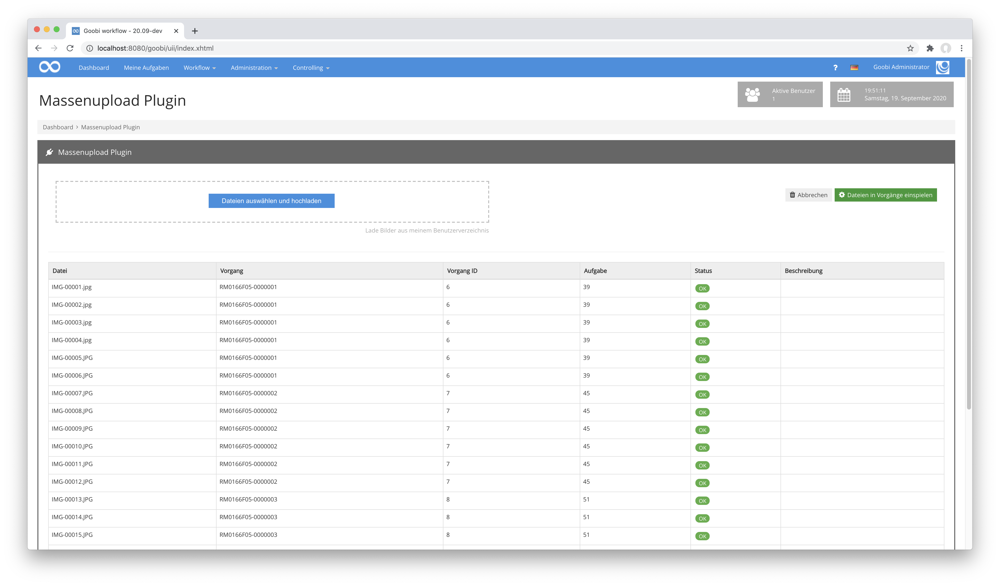
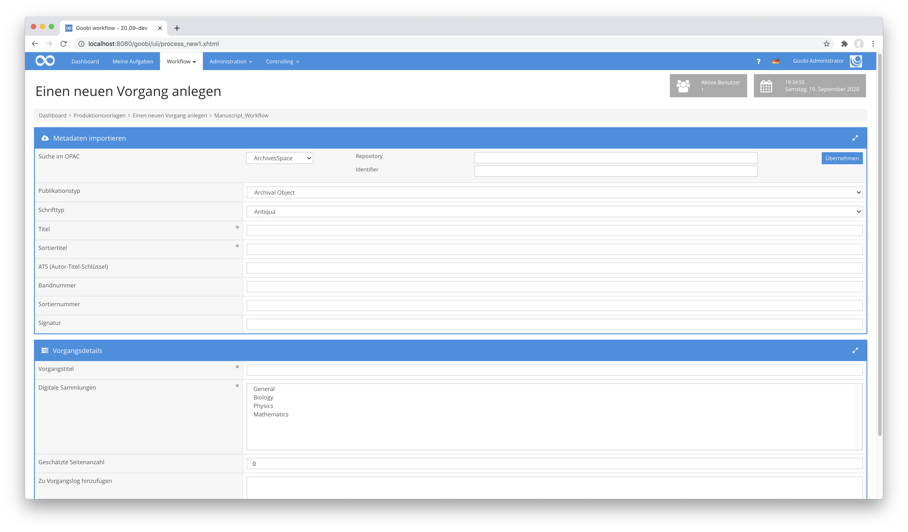
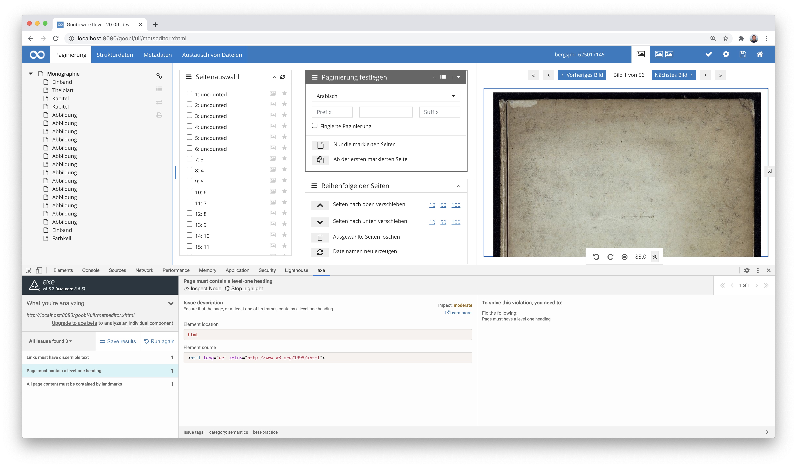

# August 2020

## Coming soon

In den kommenden Wochen werden wir uns voraussichtlich auf folgende Punkte konzentrieren:

* Implementierung einer Tektonik-Bearbeitungsmaske
* Erweiterung der Metadatenverarbeitung für einen besseren Umgang mit Körperschaften
* Weitere allgemeine Plugin-Entwicklungen
* Vorbereitung der Goobi-Tage :)

## Massenupload-Plugin mit Barcode-Erkennung

Im August haben wir eine Vielzahl neuer Plugins entwickelt für teilweise ganz neue Arbeitsweisen. Das erste hier zu nennende Plugin betrifft den Massenupload. Dieses Plugin gibt es bereits seit einiger Zeit. Es erlaubt, dass mehrere Bilder hochgeladen oder aus einem Verzeichnis gelesen werden können, um diese automatisch den richtigen Vorgängen zuzuordnen. Die bisherige Funktionalität beschränkte sich dabei auf die Erkennung der richtigen Goobi-Vorgänge auf Basis der Dateinamen. Mit der neuen Entwicklung ist es jetzt ebenfalls möglich, dass ein Barcode auf Bildern erkannt wird, so dass das Bild mit dem Barcode sowie alle nachfolgenden Bilder bis zum nächsten Bild mit Barcode zu dem Vorgang aus dem Barcode zugeordnet werden.


Mit diesem Plugin sind nun gänzlich neue Arbeitsweisen durchführbar, wo objektübergreifend erstellte Bilder automatisiert in eigenständige Entitäten unterteilt und den richtigen Workflows zugeordnet werden.



Die ausführliche Dokumentation des Plugins findet sich unter der folgenden URL:


https://docs.goobi.io/goobi-workflow-plugins-de/workflow/plugin-workflow-massupload


Der Quellcode des Plugins selbst ist unter folgender URL verfügbar:


https://github.com/intranda/goobi-plugin-workflow-massupload


## Neues Step-Plugin für Scaling und Watermarking

Mit einem neuen Plugin ist es nun möglich, dass Goobi workflow direkt innerhalb eines Arbeitsschrittes eine gewünschte Skalierung von Bildern vornimmt. Dafür kann innerhalb einer Konfigurationsdatei angegeben werden, wie groß das skalierte Bild an seiner längsten Seite maximal sein darf. Auch läßt sich ein Watermark konfigurieren, dass in das Bild eingerechnet werden soll. Dieses kann sowohl aus Text als auch aus grafischen Elementen bestehen. Auch ist steuerbar, an welcher Stelle das Watermark genau eingefügt werden soll.


Die Festlegung, wie die Skalierung und das Erzeugen des Watermarks erfolgen soll, ist innerhalb der Plugin-Konfiguration für unterschiedliche Workflows steuerbar. Eine Konfiguration für das hier gezeigte Bild würde beispielsweise innerhalb der Datei `plugin_intranda_step_image_resize_and_watermark.xml` folgendermaßen aussehen:

```markup
<config_plugin>
    <gmPath>/usr/local/bin/gm</gmPath>
    <convertPath>/usr/local/bin/convert</convertPath>

    <config>
        <!-- which projects to use for (can be more than one, otherwise use *) -->
        <project>*</project>
        <step>*</step>
        <sourceDir>master</sourceDir>
        <destDir>media</destDir>

        <imageConfig collection="*" mediaType="*">
            <resizeTo>1500</resizeTo>
            <watermark>
                <image>/opt/digiverso/goobi/watermark.png</image>
                <location>south</location>
                <xDistance>0</xDistance>
                <yDistance>150</yDistance>
            </watermark>
        </imageConfig>
    </config>
</config_plugin>
```

Die Dokumentation des Plugins findet sich hier:


https://docs.goobi.io/goobi-workflow-plugins-de/step/intranda_step_image_resize_and_watermark


Der Quellcode des Plugins selbst ist unter folgender URL verfügbar:


https://github.com/intranda/goobi-plugin-step-image-resize-and-watermark


## Opac Plugins mit mehr Abfragemöglichkeiten

Plugins für die Abfrage von Katalogen existieren in Goobi bereits seit dem Jahr 2009. Dabei hat es bisher immer genügt, dass aus einem Katalog ein einzelner Datensatz anhand eines konkreten Identifiers abzufragen. In einem der letzten Projekte, an denen wir beteiligt waren, hat sich jedoch herausgestellt, dass auch ein Bedarf nach komplexeren Abfragen besteht. Konkret sollte es darum gehen, dass abhängig von der Katalogauswahl ein, zwei oder gar drei Identifier zusammen in der Katalogabfrage verwendet werden sollen, um einen konkreten Datensatz zu erhalten. Aus diesem Grund musste die Schnittstelle für Opac Plugins nun dahingehend erweitert werden, dass solche Plugins nun einen zusätzlichen Bereich steuern können, in dem weitere Eingaben möglich sein sollen. Im Falle des JSON-Opac-Plugins wurde dies einmal konkret in den Produktivbetrieb genommen und gestaltet sich in der Oberfläche nun anders als die Opac Plugins der Vergangenheit. Hier ist neben der Eingabe eines Identifiers nun mindestens eine weitere Zeile mit zusätzlichen Angaben möglich.



Details darüber, was das JSON-Opac-Plugin macht, wie es konfiguriert und in Betrieb genommen wird, finden sich in der Dokumentation hier:


https://docs.goobi.io/goobi-workflow-plugins-de/opac/goobi-plugin-opac-json


Der Quellcode des Plugins ist auf GitHub hier zu finden:


https://github.com/intranda/goobi-plugin-opac-json


## Accessibility im METS-Editor

Nachdem wir in den vergangenen Wochen bereits viel Energie in die Unterstützung der Accessibility gemäß WCAG 2.1 gesteckt haben, mussten wir auch im METS-Editor noch weiter daran arbeiten. Ganz abgeschlossen sind die Arbeiten noch nicht, so dass uns das im September noch weiter begleiten wird.



[https://github.com/intranda/goobi-workflow/commit/52225055feac93b713c815bc4c02f8ac49bf4b79](https://github.com/intranda/goobi-workflow/commit/52225055feac93b713c815bc4c02f8ac49bf4b79)\
[https://github.com/intranda/goobi-workflow/commit/d62135f801ddb12e741b4335d9157d6f2f5e44a1](https://github.com/intranda/goobi-workflow/commit/d62135f801ddb12e741b4335d9157d6f2f5e44a1)\
[https://github.com/intranda/goobi-workflow/commit/6dc1fe71c727c8a941eb26f12aeac0a974da33af](https://github.com/intranda/goobi-workflow/commit/6dc1fe71c727c8a941eb26f12aeac0a974da33af)

## Verarbeitung von Jobs in Warteschlangen: Unterstützung für Amazon SQS

In unserem Großumbau von Goobi workflow für einen Betrieb innerhalb der Amazon Cloud haben wir nun auch Amazon SQS berücksichtigt. Die Warteschlange für rechenintensive Arbeiten als extern ausführbare Aufgaben kann von nun an auch auf Basis Amazon SQS stattfinden. Dies vereinfacht die Integration in eine in AWS gepflegte Infrastruktur nochmals deutlich.

[https://github.com/intranda/goobi-workflow/commit/2f399e7374322b577e1cdbc3ee8e4af3565d72e5](https://github.com/intranda/goobi-workflow/commit/2f399e7374322b577e1cdbc3ee8e4af3565d72e5)