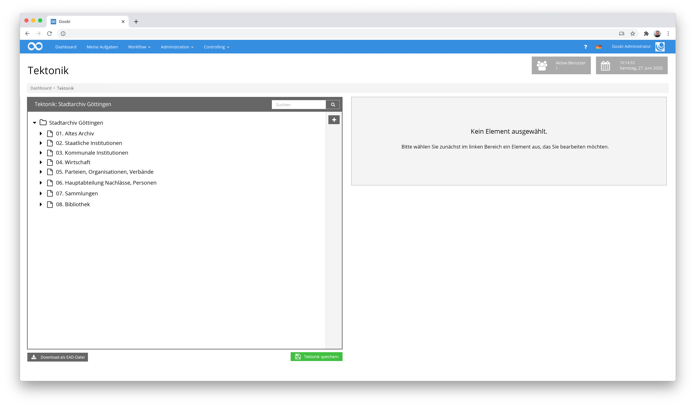
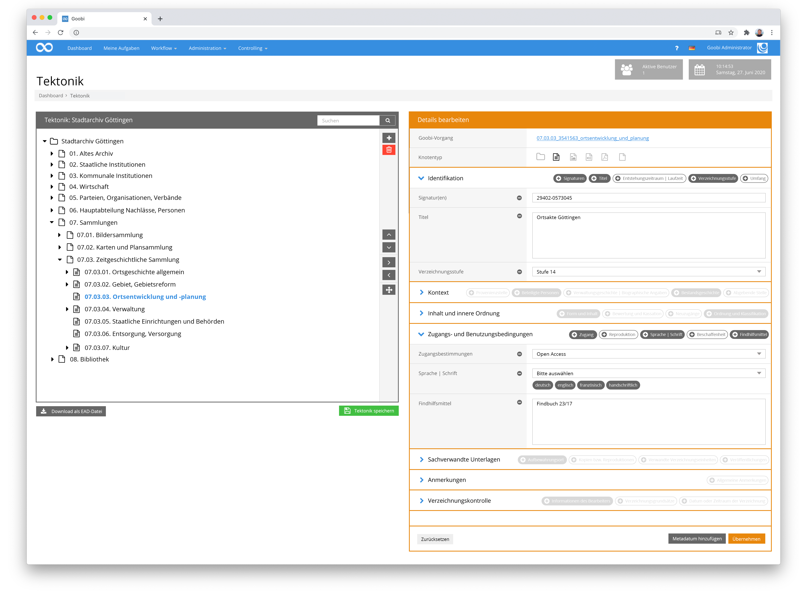
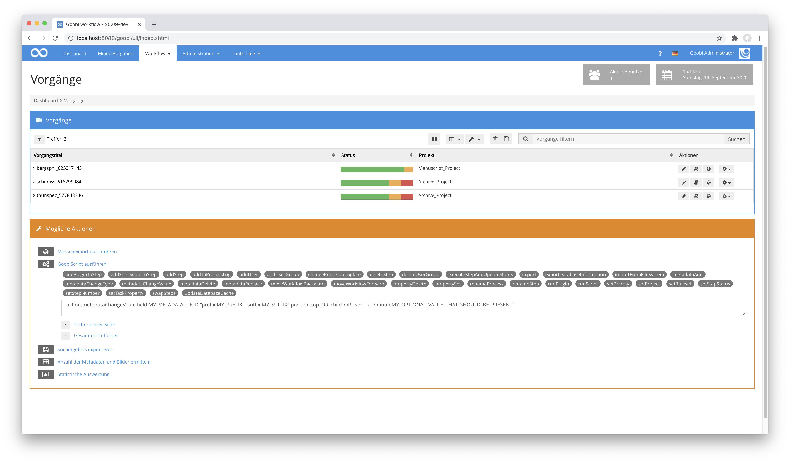
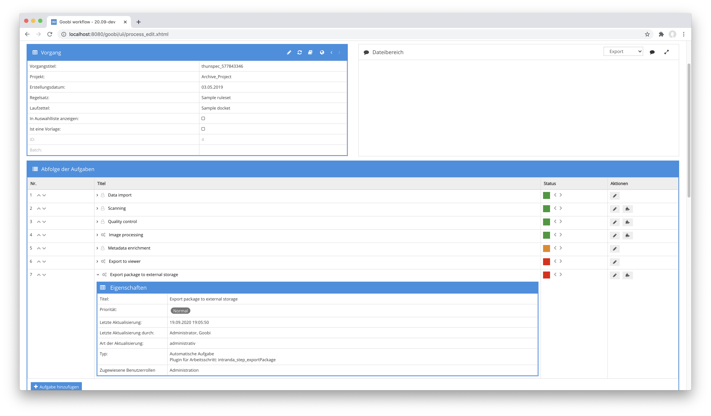
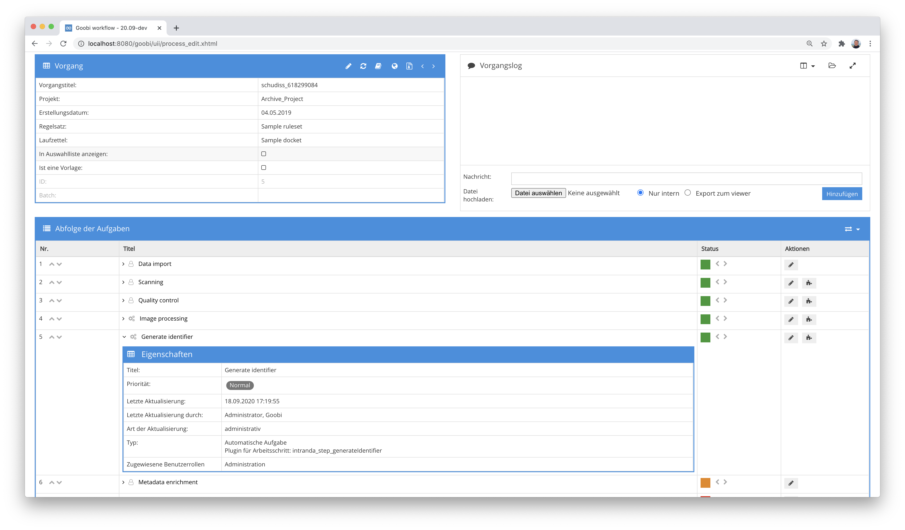
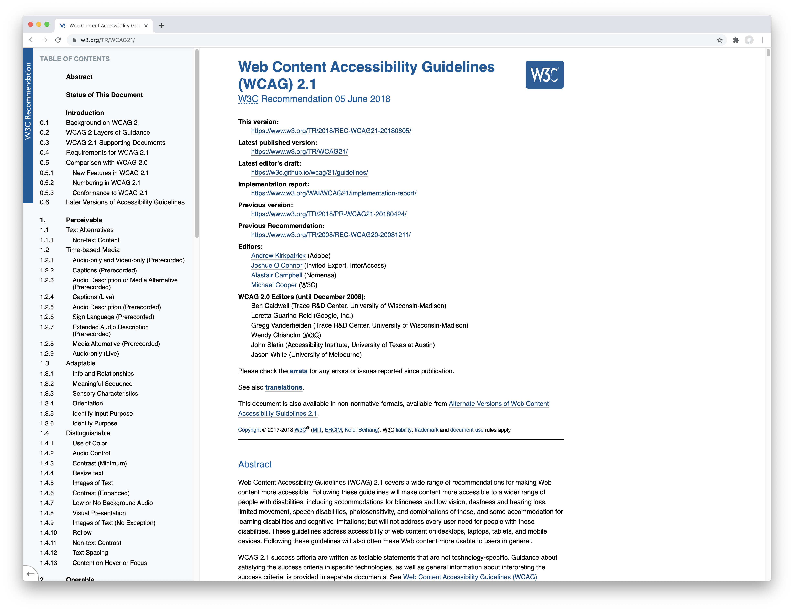
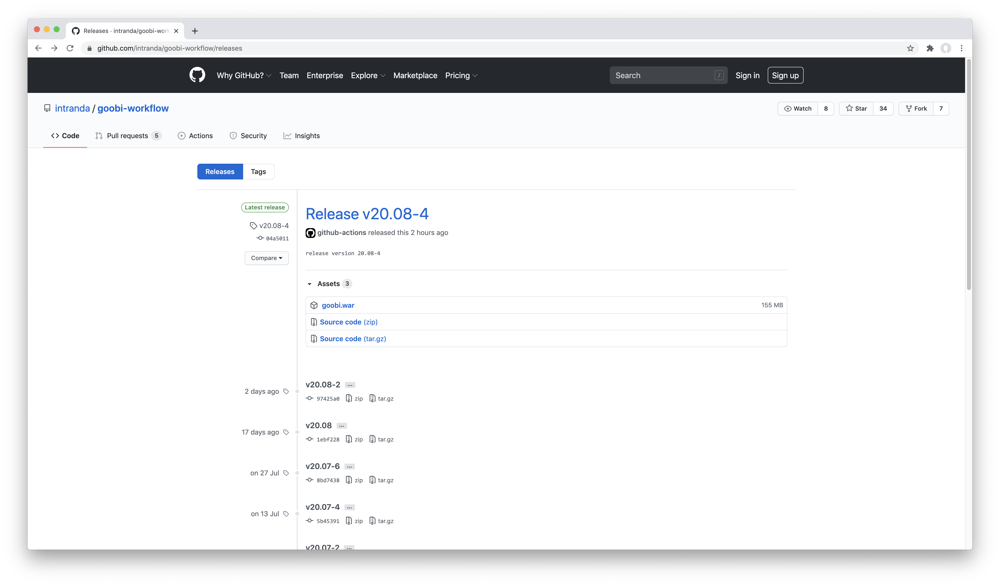

# September 2020

## Coming soon

* Abschluss des Tektonik-Editors
* Erweiterung des Handschriften-Editors um Provenienz-Informationen
* Implementierung einer Multi-Process-Editors

## Implementierung eines Tektonik-Editors

Die Datenverwaltung innerhalb von Archiven ist grundsätzlich anders aufgebaut als diejenigen in Bibliotheken. Insbesondere die sehr hierarchische Metadatenerfassung ist hierbei zu nennen, die darin resultiert, dass auf Ebene des zu digitalisierenden Objekts kaum Metadaten vorhanden sind. Stattdessen spielen hier die Metadaten der hierarchisch oberhalb angeordneten Knoten des sogenannten Tektonik-Baumes eine entscheidende Rolle.



Um insbesondere kleineren Archiven nun die Möglichkeit zu geben, Ihre Tektonik auch bereits direkt in Goobi workflow auf Basis einer Open-Source-Infrastruktur zu erfassen und dabei die Metadaten zugleich gemäß des Standards ISAD(G) zu erfassen, implementieren wir derzeit einen Tektonik-Editor.



Die hier gezeigten Ansichten der Nutzeroberfläche sind noch Mockups. Die Implementierung ist bereits im Gange. Sie ist im September aber noch nicht ganz abgeschlossen worden, so dass wir im kommenden Monat noch weiter daran arbeiten werden und dann auch tatsächliche Screenshots und die zugehörige Dokumentation zeigen können werden.

## Erweiterung der Metadatenbibliothek UGH für bessere Unterstützung von Körperschaften

Innerhalb der deutschsprachigen Anwendercommunity kam wiederholt der Wunsch zum Ausdruck, dass Goobi workflow eine bessere Unterstützung von Körperschaften bieten sollte. Kollaborativ wurde diese Entwicklung nun in Angriff genommen. Ein Großteil dieser Arbeiten ist in diesem Monat auch bereits erfolgt, vorrangig auf Basis der im Hintergrund arbeitenden Metadatenbibliothek UGH. Ein zweiter Teil der Entwicklung steht derzeit noch aus, soll aber im kommenden Monat bereits folgen. Dann werden auch optische Änderungen innerhalb der Nutzeroberfläche von Goobi sichtbar, die auf den aktuellen Entwicklungen basieren werden.

## GoobiScripts metadataChange und metdataTypeChange umbenannt zu metadataChangeValue und metadataChangeType

Die noch recht neuen GoobiScripts metadataChange und metdataTypeChange wurden zugunsten einer intuitiveren Bedienung noch einmal umbenannt. Die neuen Namen hierfür lauten nun:

| Name                  | Beschreibung                                                                                                                                                                                      |
| --------------------- | ------------------------------------------------------------------------------------------------------------------------------------------------------------------------------------------------- |
| `metadataChangeValue` | Dieses GoobiScript erlaubt die Änderung von Werten innerhalb eines existierenden Metadatums (z.B. wird dem bisherigen Wert `NY` innerhalb des Metadatums `Erscheinungsort` der Wert `New York` ). |
| `metadataChangeType`  | Dieses GoobiScript behält den Wert des Metadatums unverändert bei. Es ändert jedoch den Typ des Metadatums (z.B. wird `Haupttitel` zu `Beschreibung`)                                             |

Bei der Gelegenheit haben wir die Dokumentation von GoobiScript innerhalb des Goobi Handbuches ebenfalls gleich mit aktualisiert. Sie findet sich unter den folgenden Adressen:


https://docs.goobi.io/goobi-workflow-de/manager/7/7.4#goobiscript-metadatachangevalue



https://docs.goobi.io/goobi-workflow-de/manager/7/7.4#goobiscript-metadatachangetype




[https://github.com/intranda/goobi-workflow/commit/0b0fb555cf35d95ea80f8020dc9c30e22b72f69a](https://github.com/intranda/goobi-workflow/commit/0b0fb555cf35d95ea80f8020dc9c30e22b72f69a)

## Step Plugin für generischen Export und XSLT-Verarbeitung

In den meisten Fällen wird Goobi workflow dafür verwendet am Ende des Workflows die Vorgänge in Form einer METS-Datei zusammen mit den Digitalisaten als Derivat zu exportieren und online anzuzeigen. Oft kommt hierbei auch noch der Export von Volltextergebnissen mit ins Spiel. Sollen hingegen neben den Derivaten auch die Masterbilder, die interne Metadatendatei oder andere Daten exportiert werden, kommt der Standard-Export von Goobi workflow an seine Grenzen. Daher haben wir ein neues generisches Export-Plugin entwickelt, dass sogar innerhalb eines Workflows wiederholt zum Einsatz kommen und sich dabei aber auch unterschiedlich verhalten kann.



Für jeden Arbeitsschritt innerhalb des Workflows, der dieses Plugin verwenden möchte kann individuell festgelegt werden, wie der Export erfolgen soll. Dabei kann gesteuert werden, welche Bildverzeichnisse exportiert werden sollen, ob Volltexte exportiert werden sollen, ob ausgewählte andere Ordner für den Export berücksichtigt werden sollen und wohin das ganze geschrieben werden soll. Darüber hinaus werden mit dem Plugin die interne METS-Datei sowie die Standard-Export-METS-Datei ebenfalls exportiert. Dabei kann für beide METS-Dateien jeweils festgelegt werden, ob diese zusätzlich durch eine XSLT-Transformation weiterverarbeitet werden sollen, um beispielsweise ein weiteres Datenformat daraus zu erzeugen.

Eine solche Konfiguration sieht dann beispielhaft wie folgt aus:

```markup
<config_plugin>
    <config>
        <!-- which projects to use for (can be more then one, otherwise use *) -->
        <project>*</project>
        <step>*</step>

        <!-- export path -->
        <target>/opt/digiverso/export/</target>

        <!-- which image folders to use (master|media|jpeg|source|...) -->
        <imagefolder>master</imagefolder>
        <imagefolder>media</imagefolder>

        <!-- which additional folders to use -->
        <ocr>false</ocr>
        <source>false</source>
        <import>false</import>
        <export>false</export>
        <itm>false</itm>
        <validation>false</validation>

        <!-- if the internal METS file shall get transformed into another file define the path of the xsl file here -->
        <transformMetaFile>true</transformMetaFile>
        <transformMetaFileXsl>/opt/digiverso/goobi/xslt/export_meta.xsl</transformMetaFileXsl>
        <transformMetaFileResultFileName>xslt_result_meta.xml</transformMetaFileResultFileName>

        <!-- if the METS file shall get transformed into another file define the path of the xsl file here -->
        <transformMetsFile>true</transformMetsFile>
        <transformMetsFileXsl>/opt/digiverso/goobi/xslt/export_mets.xsl</transformMetsFileXsl>
        <transformMetsFileResultFileName>xslt_result_mets.xml</transformMetsFileResultFileName>
    </config>
</config_plugin>
```

Mit diesem generischen Plugin sind nahezu beliebige Exporte implementierbar. Wenn der Standard-METS-Export also einmal nicht genügen sollte, läßt sich auf Basis dieses Plugins sicher schnell eine individuelle Lösung erstellen.

Die ausführliche Dokumentation des Plugins findet sich unter der folgenden URL:


https://docs.goobi.io/goobi-workflow-plugins-de/step/intranda_step_exportPackage


Der Quellcode des Plugins selbst ist unter folgender URL verfügbar:


https://github.com/intranda/goobi-plugin-step-exportPackage


## Step Plugin für das selektive Löschen von Inhalten

Um während des Workflows automatisiert bestimmte Inhalte eines Vorgangs löschen zu können, existierte bisher keinerlei Plugin. Stattdessen hatten wir uns in der Vergangenheit mit der Implementierung von Bash-Scripten geholfen. Das neue Delete-Content-Plugin übernimmt diese Arbeit ab jetzt.

Wie nahezu alle Step-Plugins kann auch dieses wiederholt innerhalb eines Workflows verwendet werden und dabei unterschiedliche Aufgaben übernehmen. Welche Inhalte jeweils genau gelöscht werden sollen, wird dabei über eine zentrale Konfigurationsdatei gesteuert. Darin kann dann beispielsweise festgelegt werden, dass die Master-Bilder erhalten bleiben sollen, die Derivate und METS-Dateien allerdings gelöscht werden sollen. Auch wird so gesteuert, ob der gesamte Vorgang nach dem Löschen deaktiviert werden soll.

Genaueres zu den Möglichkeiten und der Konfiguration des Delete-Content-Plugins finden sich in der Dokumentation hier:


https://docs.goobi.io/goobi-workflow-plugins-de/step/intranda_step_deletecontent


Der Quellcode des Plugins ist unter folgender URL verfügbar:


https://github.com/intranda/goobi-plugin-step-deleteContent


## Step Plugin für Identifier Generierung

Hin und wieder ergibt sich der Bedarf, dass Identifier generiert werden sollen, die bisher nicht vorliegen und die innerhalb der METS-Datei gespeichert werden sollen. Mit dem Generate-Identifier-Plugin lassen sich solche Identifier einfach im Workflow generieren und in ein gewünschtes Metadatenfeld der METS-Datei speichern. Hierbei kann festgelegt werden, ob ein eventuell bereits vorhandener Identifier überschrieben werde soll oder nur im Fall eines noch fehlenden Metadatums erzeugt werden soll. Auch läßt sich bestimmen, wie der Identifier gestaltet sein soll. Zur Auswahl stehen derzeit UUIDs, Timestamps sowie Zufallszahlen mit konfigurierbarer Länge.



Mehr Informationen zum Plugin finden sich wie üblich in der Online-Dokumentation:


https://docs.goobi.io/goobi-workflow-plugins-de/step/intranda_step_generateidentifier


Der Quellcode des Plugins ist unter folgender URL verfügbar:


https://github.com/intranda/goobi-plugin-step-generateIdentifier


## Reorder Step Plugin erweitert

In vielen Kultureinrichtungen werden Buchobjekte nicht in komplett aufgeschlagenem Zustand digitalisiert, so dass häufig die linken und rechten Seiten eines Buchs nicht abwechselnd nacheinander folgen. Stattdessen werden solche Bücher unter Umständen so digitalisiert, dass ein Buch von vorn durchblättert wird und dabei nur die rechten Seiten aufgenommen werden. Im Anschluß daran erfolgt dann ein zweiter Durchgang, bei dem das Buch von hinten durchblättert wird und nur die linken Seiten aufgenommen werden. Mit dem Reorder-Images-Plugin können solche Seiten automatisch in die korrekte Reihenfolge gebracht werden. Dabei ist über eine Konfiguration steuerbar, wie die Sortierung vorgehen soll und ob die Bilder innerhalb des gleichen Verzeichnisses umbenannt werden oder in ein anderes Verzeichnis kopiert werden sollen. Mit den neuesten Entwicklungen lassen sich gezielt Teile von Dateinamen angegeben werden, die von der Sortierung nicht betroffen sein sollen und die in festgelegter Reihenfolge nach den sortierten Dateien eingefügt werden sollen.


Mehr Informationen zum Plugin finden sich wie üblich in der Online-Dokumentation:


https://docs.goobi.io/goobi-workflow-plugins-de/step/intranda_step_reorder_images


Der Quellcode des Plugins ist unter folgender URL verfügbar:


https://github.com/intranda/goobi-plugin-step-reorder-images


## Accessibility für den METS-Editor sowie erste Plugins

Die Arbeiten am METS-Editor gingen fleißig voran, um nun auch dort die Vorgaben der WCAG 2.1 zugunsten der Barrierefreiheit einzuhalten. Mit Hilfe zweier automatisierter Validierung konnten wir Stück für Stück die einzelnen Bemängelungen beseitigen um WCAG auf Level AA einzuhalten. Mit Hilfe einer Universitätsbilbiothek konnten darüber hinaus Tests mit einem Screenreader erfolgen. Neben dem METS-Editor haben wir in diesem Zusammenhang nun auch bereits die ersten Plugins für Goobi workflow für eine bessere Barrierefreiheit überarbeitet. Dies betrifft unter anderem die folgenden Plugins:

| Plugin         | Erläuterung                                                                                                        |
| -------------- | ------------------------------------------------------------------------------------------------------------------ |
| FileUpload     | Plugin für den Upload von Masterbildern, Digitalisaten oder auch anderen Dateien innerhalb einer Aufgabe           |
| ImageQA        | Plugin zur Durchführung einer Qualitätskontrolle von Digitalisaten unmittelbar in der Browseroberfläche            |
| Dashboard      | Plugin zur Generierung von Inhalten des Dashboards, das die meisten Goobi-Installationen für Ihre Nutzer verwenden |
| JSON-Opac      | Opac-Plugin für die Abfrage von Daten über das Format JSON                                                         |
| Statistics     | Standard-Statistik-Plugin, das in den meisten Goobi-Installationen in Betrieb genommen wurde                       |
| Replace images | Plugin zum Ersetzen von zuvor generierten Platzhalterbildern                                                       |

Die Vorgaben, wie auch Webapplikationen eine Barrierefreiheit zu gewährleisten haben, finden sich unter der folgenden URL:


https://www.w3.org/TR/WCAG21/




Bitte beachten Sie, dass diese Vorgaben unter Umständen auch für Ihre Goobi-Installation verbindlich sein können. Mehr dazu erfahren sie unter anderem unter diesen Adressen:


https://de.wikipedia.org/wiki/Web_Content_Accessibility_Guidelines



https://en.wikipedia.org/wiki/Web_Content_Accessibility_Guidelines



https://wikis.ec.europa.eu/display/WEBGUIDE/01.+Accessibility+overview


[https://github.com/intranda/goobi-plugin-step-fileupload/commit/397702fef2225c46bc01a4ab4ec953f8542d7967](https://github.com/intranda/goobi-plugin-step-fileupload/commit/397702fef2225c46bc01a4ab4ec953f8542d7967)

## Automatisch kompilierte Releases auf GitHub

Seit vielen Monaten veröffentlichen wir nun bereits jeden Monat mindestens eine stabile Version von Goobi workflow als neues Release und kombinieren das mit dem monatlichen Digest. Nach einer größeren Umstellung der Infrastruktur für das Kompilieren der Applikation und der Plugin funktionierte zwischenzeitlich die automatische Bereitstellung der kompilierten Applikation nicht mehr richtig. Dies ist nun korrigiert. Unter der folgenden URL kann man die veröffentlichten Releases jeden Monats einsehen und nachvollziehen:

[https://github.com/intranda/goobi-workflow/releases](https://github.com/intranda/goobi-workflow/releases)



Und unter dieser URL steht übrigens auch immer die jeweils aktuellste stabile Version von Goobi workflow zum Download bereit:


https://github.com/intranda/goobi-workflow/releases/latest


## Vorbereitungen für das Goobi Anwendertreffen 2020

Wie auch in den vergangenen Jahren fand wieder ein großes deutschsprachiges Anwendertreffen der Goobi-Nutzer und -Entwickler statt. Auch wenn es in diesem Jahr in rein digitaler Form stattfand, so waren doch ähnlich viele Arbeiten im Rahmen von Vortragsvorbereitungen im Vorfeld der Veranstaltung notwendig. Unter anderem wurden wieder an zahlreichen Stellen kleine optische Feinheiten korrigiert, Layouts und Übersetzungen angepasst, Dokumentationen ergänzt oder auch gänzlich neu erstellt und veröffentlicht sowie weitere Plugins auf GitHub veröffentlicht. All diese zahlreichen kleineren Änderungen schlagen sich ebenfalls innerhalb der Applikation und deren täglicher Anwendung nieder.