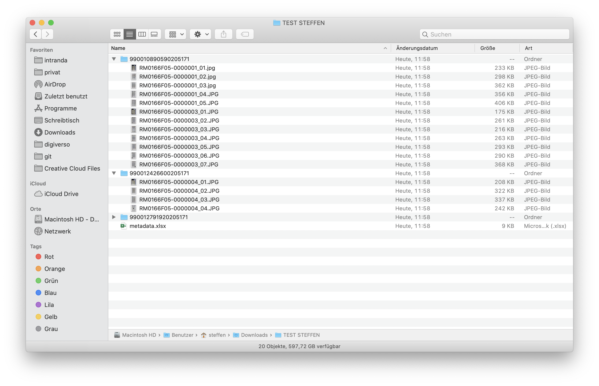

# Oktober 2020

## Coming soon

* Erweiterung der Single-Sign-On Unterstützung
* Implementierung von Checksummen-Vergleichen für Exporte
* Abschluss der Accessibility-Arbeiten gemäß WCAG
* Swagger-Support

## Workflow Plugin zum Export eines kompletten Projektes

Im Rahmen eines Projektes wurde benötigt, dass nicht einzelne Vorgänge am Ende ihres Workflows exportiert werden. Stattdessen war gefordert, dass ein Goobi-Projekt als ganzes exportiert wird, so dass für sämtliche zu exportierenden Vorgänge eines Projekts eine gesamte Excel-Datei generiert werden sollte und die zugehörigen Bilder in Verzeichnissen gespeichert werden. Darüber hinaus sollte der gesamte Export abschließend noch als Download zur Verfügung stehen.

Mit einem neu entwickelten Workflow-Plugin ist diese Arbeitsweise nun möglich. Und sofern alle Vorgänge des Projekte auch einen konfigurierten Arbeitsschritt des Workflows absolviert haben, schließt das Plugin den ebenfalls konfigurierten Export-Schritt innerhalb des Workflows ab, so dass der Workflow einen korrekten Statusfortschritt hat.

Bitte beachten Sie, dass das Plugin mit den sehr spezifischen Vorgaben des Excel-Exports unter Umständen nicht zwangsläufig für andere Projekte so unverändert in Betrieb genommen werden kann. Je nach Projektziel und Goobi-Installation könnten hier für andere Einsatzszenarien Anpassungen an dem Plugin notwendig werden.

Die ausführliche Dokumentation des Plugins findet sich unter der folgenden URL:


https://docs.goobi.io/goobi-workflow-plugins-de/workflow/intranda_workflow_projectexport


Der Quellcode des Plugins selbst ist unter folgender URL verfügbar:


https://github.com/intranda/goobi-plugin-workflow-projectexport


## Step Plugin für das Editieren ausgewählter Metadaten

Nicht in dem Anwendungsfall sollte eine Bearbeitung von Metadaten mit dem Betreten des METS-Editors einhergehen. Für einige Einsatzzwecke ist hier eine vereinfachte Oberfläche bereits ausreichend. Aus diesem Grund haben wir ein neues Plugin entwickelt, das erlaubt, dass festgelegte Metadaten direkt innerhalb einer geöffneten Aufgabe bearbeitbar sind. Hierbei kann über eine Konfigurationsdatei festgelegt werden, welche Metadaten in welcher Aufgabe angezeigt werden sollen und in welcher Form sie editierbar sein sollen (z.B. als Checkbox, Input-Feld, Textarea, Dropdown).

Neben der Bearbeitung der Metadaten erlaubt das Plugin ebenfalls eine reine Sichtkontrolle der Daten, so dass die Felder als readonly angezeigt werden können. Zusätzlich kann auch der Repräsentant des Vorgangs direkt in der Oberfläche gesetzt werden.

Die bearbeitbaren Metadaten können im übrigen auch aus einem konfigurierten Vokabular stammen und so in einer Auswahlliste angeboten werden. Und für den Fall, dass Metadaten eines anderen Vorgangs übernommen werden sollen, besteht die Möglichkeit, direkt nach den gewünschten Vorgängen zu suchen (z.B. nach denjenigen mit gleicher Identifikatoren) und aus diesen einzelne oder alle Metadaten nachzunutzen.

Die ausführliche Dokumentation des Plugins findet sich unter der folgenden URL:


https://docs.goobi.io/goobi-workflow-plugins-de/step/intranda_step_metadata_edition


Der Quellcode des Plugins selbst ist unter folgender URL verfügbar:


https://github.com/intranda/goobi-plugin-step-metadata-edition


## Neues Statistik-Plugin für die Auswertung von Übersetzungen

Im Rahmen eines hebräisch- und eines arabischsprachigen Projektes stellte sich die Anforderung, dass die mehrsprachige Metadaten von Übersetzern eingepflegt werden. Dabei bestand die besondere Schwierigkeit darin, hier den Überblick über den Fortschritt zu behalten. Aus diesem Grund wurde ein neues Statistik-Plugin entwickelt, dass diese Informationen tabellarisch aufbereitet und als Download anbietet.

Eine ausführliche Dokumentation des Plugins findet sich hier veröffentlicht:


https://docs.goobi.io/goobi-workflow-plugins-de/statistics/intranda_statistics_sudan_memory


Der Quellcode des Plugins selbst ist unter folgender URL verfügbar:


https://github.com/intranda/intranda_statistics_sudan_memory_activity_by_user


## Besseres Zurücksetzen von Passwörtern

Wir fanden den bisherigen Mechanismus zum Zurücksetzen von Passwörtern nicht ideal. Daher haben wir diesen Bereich einmal überarbeitet. Ein Administrator muss daher von nun an nicht mehr erst in die Rolle des Benutzers wechseln, um dessen Passwort zu ändern. Stattdessen kann dies nun direkt aus dem Administrationsbereich für Benutzer erfolgen.

Um auf diese neue Funktion zugreifen zu können, muss die Benutzergruppe der Administratoren über die neue Benutzerrolle `Setzen eines neuen Passworts erlauben` verfügen.

Für das Ändern des eigenen Passworts haben wir in diesem Zusammenhang auch eine Umstellung vorgenommen. Dort ist es von nun an erforderlich, dass man zunächst das alte Passwort angibt, bevor ein neues Passwort gesetzt werden kann.

## Erweiterung des LayoutWizzards für eine Hintergrundaufbereitung

Mit dem Plugin `LayoutWizzard` lassen sich viele Optimierungen von Digitalisaten sehr effizient automatisieren. In erster Linie dient es zum (semi-) automatischen Croppen von digitalisierten Einzel- oder Doppelseiten aus Büchern, wie es ausführlich auch in dessen Dokumentation hier erläutert ist:


https://docs.goobi.io/goobi-workflow-plugins-de/step/intranda_step_crop


Im Rahmen eines Projektes ergaben sich nun weitere Anforderungen, die der LayoutWizzard ebenfalls erfüllen soll. So sollten Seiten nicht nur von ihrem Hintergrund erkannt, gerade gerückt und beschnitten werden. Vielmehr sollte der Hintergrund von Unregelmäßigkeiten bereinigt werden. Schwarze Moosgummimatten, wie sie häufig während der Digitalisierung eingesetzt werden, mit leichten Verfärbungen, Fusseln oder anderen Strukturen können auf diese Weise gleichmäßiger mit einem dunkleren Schwarzton versehen werden. Das folgende Beispiel zeigt einmal den Unterschied zwischen aktivierter und nicht aktivierter Hintergrundaufbereitung:

## Erweiterung für den Betrieb unter Docker: Nutzung von Konfigurationsdateien aus gemountetem Verzeichnis

Da ein Betrieb von Goobi workflow zunehmend auch unter Docker stattfindet, ergeben sich hier auch neue Anforderungen hinsichtlich der Inbetriebnahme. Konkret ergab sich die Notwendigkeit, dass vorliegende Konfigurationsdateien automatisch beim Starten des Docker-Containers aus einem gemounteten Verzeichnis in das Konfigurationsverzeichnis `/opt/digiverso/goobi/config/` kopiert werden. Diese Funktionalität ist nun umgesetzt, so dass von nun an individuelle Konfigurationsdateien unabhängig vom Docker-image gepflegt werden können.

Die Dockerversion von Goobi workflow findet sich wie gehabt unter der folgenden URL:


https://hub.docker.com/r/intranda/goobi-workflow
