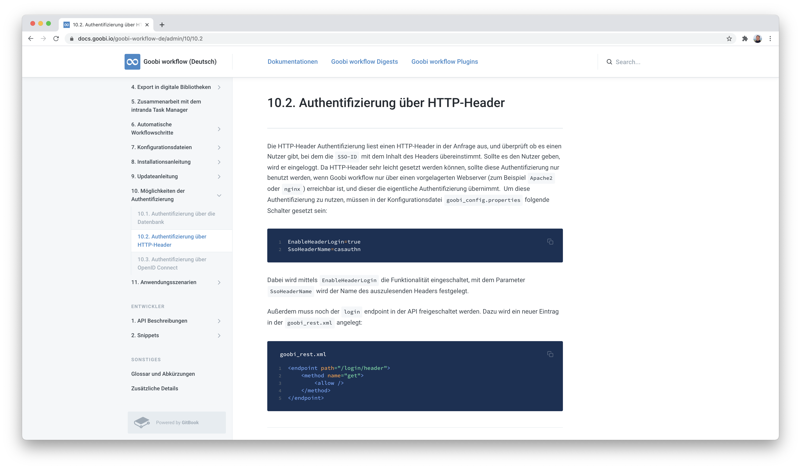
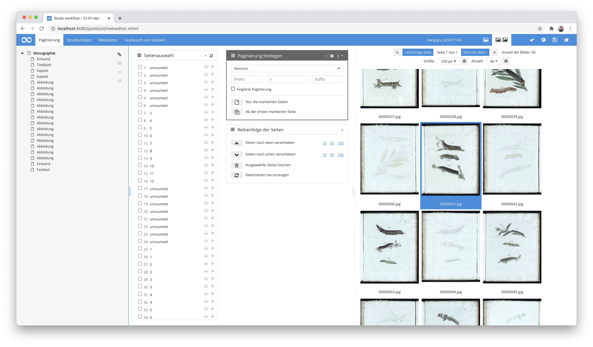
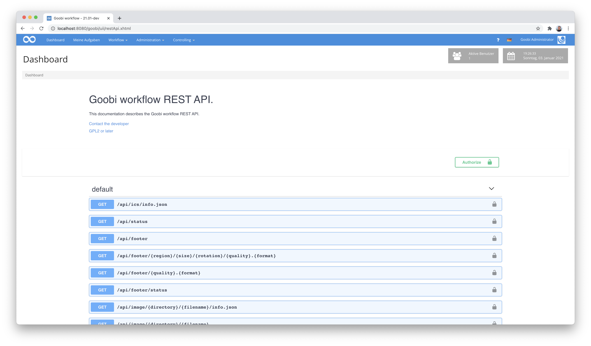
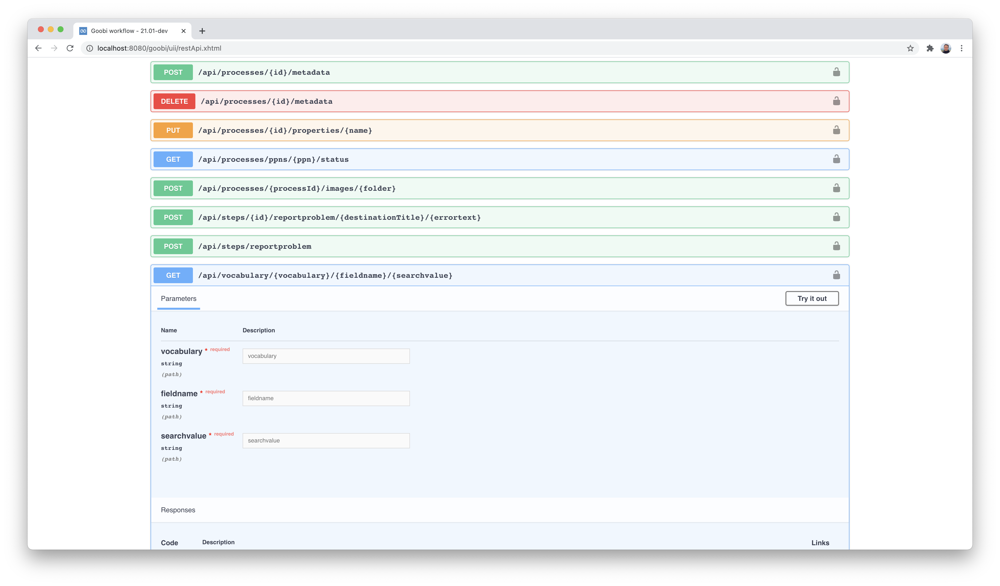
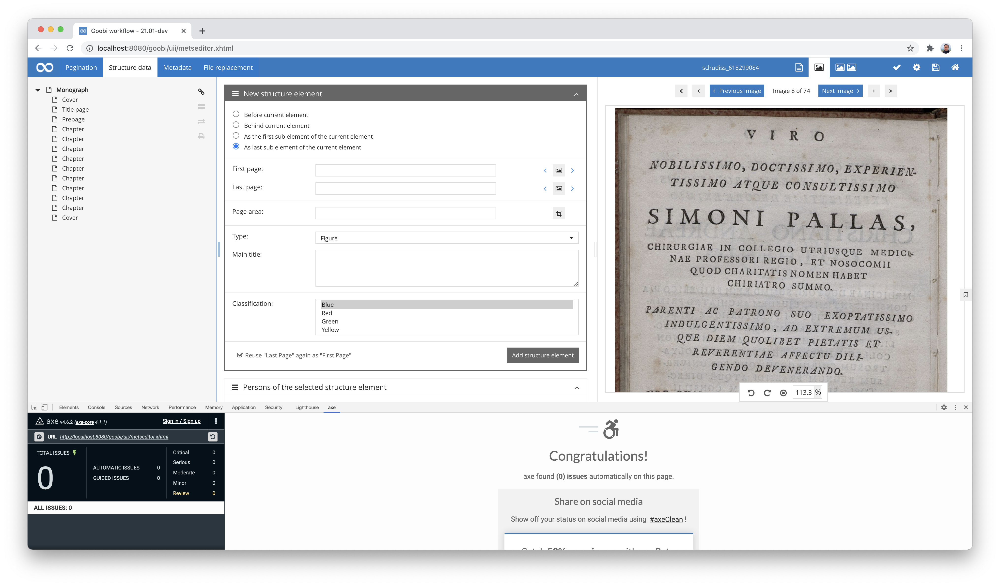
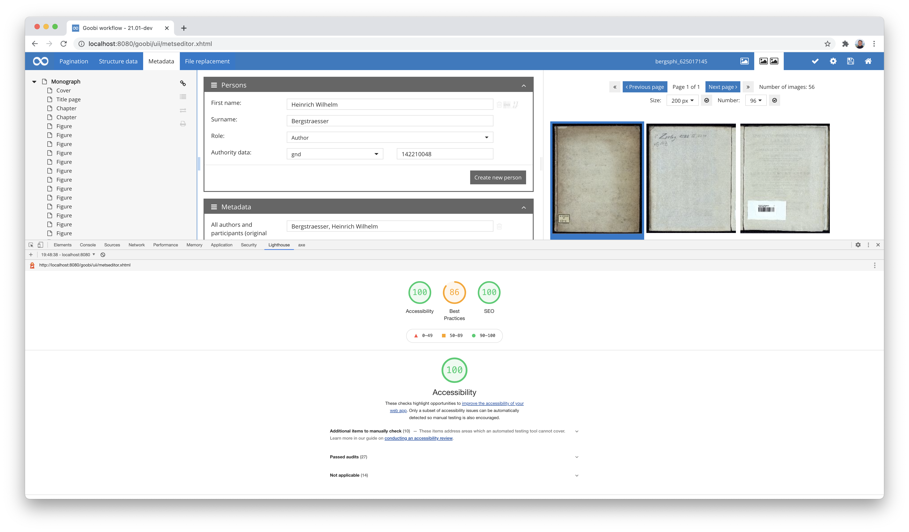
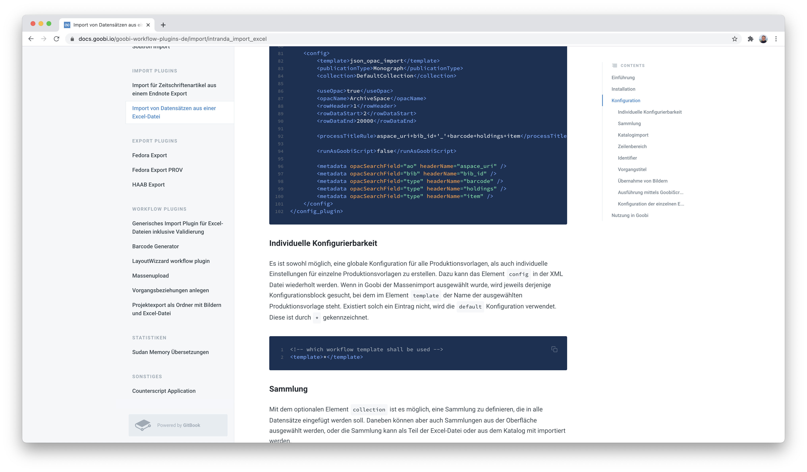

# November 2020

## Coming soon

* Abschlussarbeiten am Archiv-Management-Plugin
* Erweiterung des Flex-Editors für Provenienzen
* Erweiterung des Vokabular-Managements

## Neue Single-Sign-On Authentifizierung für Nutzer auf Basis von HTTP-Headern

Goobi workflow unterstützt bereits seit einiger Zeit verschiedene Authentifizierungen, so unter anderem auch eine Authentifizierung mittels OpenID. Neu hinzugekommen ist nun eine weitere sehr generische Lösung, die HTTP-Header einer Anfrage auswertet. Diese Implementierung hat den großen Vorteil, dass sie für viele verschiedene Einsatzszenarien infrage kommen kann, da die eigentliche Authentifizierung somit externen Apache-Modulen überlassen werden kann. Auf diese Art und Weise ist zum Beispiel eine Authentifizierung mittels eines CAS möglich.

Um eine bessere Übersicht über die mittlerweile verschiedenen Arten der Nutzerauthentifizierung zu bieten, haben wir einen neuen Bereich in der Dokumentation geschaffen, der die unterschiedlichen Konfigurationen einmal aufführt. Die Dokumentation findet sich an dieser Stelle:


https://docs.goobi.io/goobi-workflow-de/admin/10


Neben der Authentifizierung über die Datenbank, eine Anbindung an LDAP-Server und Active Directory, OpenID ist damit nun auch eine Anbindung an zahlreiche weitere Single-Sign-On-Systeme möglich.

[https://github.com/intranda/goobi-workflow/commit/a30441e78bf7e7f2e6aebc08f94d8d4aac43f87f](https://github.com/intranda/goobi-workflow/commit/a30441e78bf7e7f2e6aebc08f94d8d4aac43f87f)

## Metadaten-Editor: Thumbnail Navigation überarbeitet

Die Navigation für die Anzeige der Thumbnails im Metadaten-Editor wurde überarbeitet. Die Navigationsbuttons sind von nun an im oberen Bereich fixiert und bleiben daduch auch dann im sichtbaren Bereich, wenn nach unten gescrollt wird.

Außerdem wird jetzt bei einem Wechsel von der großen Bildansicht in die Thumbnails direkt zum momentan ausgewählten Bild gescrollt. Dies spart künftig das Suchen nach dem zuletzt verwendeten Bild.

[https://github.com/intranda/goobi-workflow/commit/d5d020e1d1ddac3642f570c5534743298a0968fa](https://github.com/intranda/goobi-workflow/commit/d5d020e1d1ddac3642f570c5534743298a0968fa)

## Einbindung von Swagger UI als Schnittstellenbeschreibung

Für die Goobi REST-API gibt es jetzt eine Beschreibung mittels `Swagger UI`. Hierbei handelt es sich um eine sehr verbreitete Schnittstellenbeschreibung, die es Entwicklern erlaubt die REST-API von Goobi workflow mit eigenen Kommandos auszuprobieren und somit eine Anbindung externer Applikationen an Goobi workflow zu implementieren.

Mehr Informationen über die Möglichkeiten, die eine Schnittstellendokumentation via Swagger bietet, lassen sich hier erfahren:


https://swagger.io/


Diese neue Schnittstellenbeschreibung ist innerhalb von Goobi workflow über das Menü Administration zu erreichen und erlaubt von hier unmittelbar ein interaktives Testen einzelner Kommandos direkt im Webbrowser:

[https://github.com/intranda/goobi-workflow/commit/ec286ee1268a9316199b4f3097c20fc255cafedc](https://github.com/intranda/goobi-workflow/commit/ec286ee1268a9316199b4f3097c20fc255cafedc)\
[https://github.com/intranda/goobi-workflow/commit/31e0496783d0b24870861aca3ddc8b535f60b0b4](https://github.com/intranda/goobi-workflow/commit/31e0496783d0b24870861aca3ddc8b535f60b0b4)

## Abschlussarbeiten an der Barrierefreiheit für die Nutzeroberfläche

Das Thema der Barrierefreiheit begleitet uns nun bereits seit einigen Monaten und gestaltet sich als sehr aufwendig. Dennoch konnten wir nun unser hochgestecktes Ziel der erfolgreichen Validierung mittels zweier anerkannter Browser-Plugins erreichen, die eine Prüfung von Webseiten hinsichtlich der Einhalten der Vorgaben der WCAG Richtlinie auf Niveau AA vornehmen.

Insbesondere die Überarbeitung der Nutzeroberfläche für den Metadateneditor gestaltete sich noch einmal als recht aufwendig. Neben den typischen Anforderungen hinsichtlich Farbkontrasten, Icons und Hilfetexten nahmen wir auch unter anderem auch die Tab-Reihenfolgen nochmal unter die Lupe.

Das Thema der Barrierefreiheit ist mit diesen Arbeiten für uns nicht abgeschlossen. Wir werden auch weiterhin routinemäßige Prüfungen der Nuzteroberflächen vornehmen und in dem Kontext sicher auch noch bei einigen Plugins nachjustieren müssen. Mit den hier beschriebenen Arbeiten haben wir allerdings einen enormen Meilenstein für eine barrierefreie Nutzeroberfläche von Goobi workflow erreicht.

[https://github.com/intranda/goobi-workflow/commit/edb97cdd94ee298894452926ad2240273f1d9a48](https://github.com/intranda/goobi-workflow/commit/edb97cdd94ee298894452926ad2240273f1d9a48)

## Neues Plugin für Registrierung von eindeutigen Identifiern: OID

Innerhalb eines Projektes ergab sich die Anforderung, dass das gesamte digitalisierte Objekt sowie jede zugehörige Datei mit eigenen Identifiern auszustatten waren, die von einem zentralen Dienst abgefragt und anschließend einen Einfluß auf die Benennung der Dateien haben sowie auch innerhalb der METS-Datei hinterlegt werden sollten. Hierfür haben wir mit dem OID-Creation-Plugin ein neues Plugin entwickelt und hier hier auch hinsichtlich seiner Installation und Konfiguration dokumentiert:


https://docs.goobi.io/goobi-workflow-plugins-de/step/intranda_step_oid_creation


Der Quellcode für das Plugin findet sich wie gewohnt auf GitHub veröffentlicht hier:


https://github.com/intranda/goobi-plugin-step-oid-creation


## Erweiterung des Package-Export-Plugins für die Nutzung der OID-Identifier

Damit das hier beschriebene Verfahren der OID-Identifier-Generierung für den weiteren Workflow verwendet werden kann, musste auch das Package-Export-Plugin erweitert werden.


https://docs.goobi.io/goobi-workflow-plugins-de/step/intranda_step_exportpackage


Dieses wurde um die Unterstützung von OID, die Generierung von UUIDs sowie für eine Validierung von zuvor generierten Checksummen für die einzelnen Bilddateien erweitert.

## Erweiterung des Excel Plugins für Nutzung mehrerer Identifier

Im Kontext der Entwicklung des [JSON-Opac-Plugins](https://docs.goobi.io/goobi-workflow-plugins-de/opac/intranda_opac_json) wurde Goobi erstmalig mit einer Funktion ausgestattet, dass ein Datensatz nicht nur mit einem einzigen Identifier vom Quellsystem abgefragt und importiert werden können. Um diese Funktionalität nun auch für einen Massenimport mittels Excel-Dateien zu ermöglichen, wurde das Excel-Import-Plugin erweitert. Im dem Kontext wurde auch die Dokumentation des Plugins aktualisiert, um einen solchen Anwendungsfall dort ebenfalls zu beschreiben:


https://docs.goobi.io/goobi-workflow-plugins-de/import/intranda_import_excel


[https://github.com/intranda/goobi-plugin-import-excel/commit/5cc58b6b9e52ae9fb4e0b7941bbc811037335ff9](https://github.com/intranda/goobi-plugin-import-excel/commit/5cc58b6b9e52ae9fb4e0b7941bbc811037335ff9)

## Neues Plugin für die Transkription von Bildinhalten

Wir haben ein neues Plugin für die Transkription von Inhalten auf Bildern entwickelt. Es ist zunächst hinsichtlich des Funktionsumfangs noch überschaubar und erlaubt noch keine Erfassung von Koordinaten für Wörter oder Buchstaben. Es erlaubt aber bestehende Plaintext-Volltexte zu bearbeiten oder auch ganz neu zu erfassen.

Die Arbeitsweise des Plugins sieht vor, dass eine seitenweise Erfassung von Volltexten erlaubt ist, so dass also eine Transkription für jedes Digitalisat einzeln erfolgt. Die Transkription erfolgt dabei mittels eine Rich-Text-Editors und erlaubt einige grundlegende Formatanpassungen. Aufgrund des Einsatzes des sehr populären Editors [`TinyMCE`](https://www.tiny.cloud/) können bei Bedarf auch recht einfach weitere Formatierungen erlaubt werden.

Eine ausführliche Dokumentation des neuen Plugins findet sich unter dieser URL:


https://docs.goobi.io/goobi-workflow-plugins-de/step/intranda_step_transcription


Der Quellcode für das Plugin wurde auf GitHub hier veröffentlicht:


https://github.com/intranda/goobi-plugin-step-transcription


## Bugfix: Anführungszeichen in Projektnamen

Wenn ein Titel eines Projektes ein einfaches Anführungszeichen (`'`) enthielt, konnten dessen Vorgänge nicht korrekt geöffnet und bearbeitet werden. Dieser Fehler wurde behoben.

[https://github.com/intranda/goobi-workflow/commit/56d26b9752571dc34d2a0633768a9c0f2e4bd388](https://github.com/intranda/goobi-workflow/commit/56d26b9752571dc34d2a0633768a9c0f2e4bd388)\
[https://github.com/intranda/goobi-workflow/commit/eb8a238b6af0088c64c73ffc72918c8d199f2cef](https://github.com/intranda/goobi-workflow/commit/eb8a238b6af0088c64c73ffc72918c8d199f2cef)