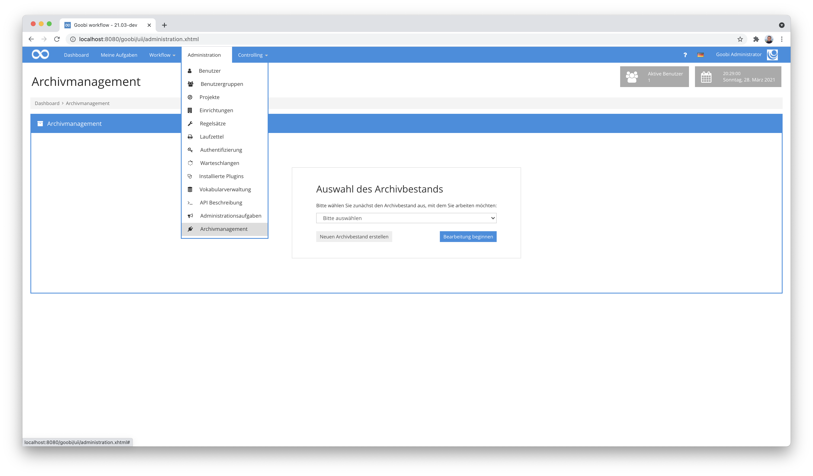
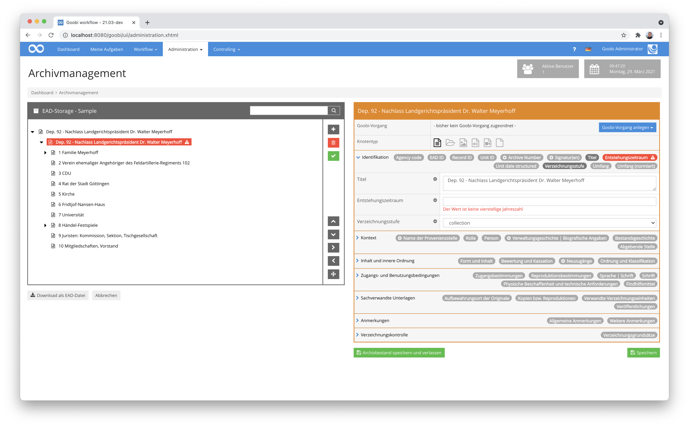
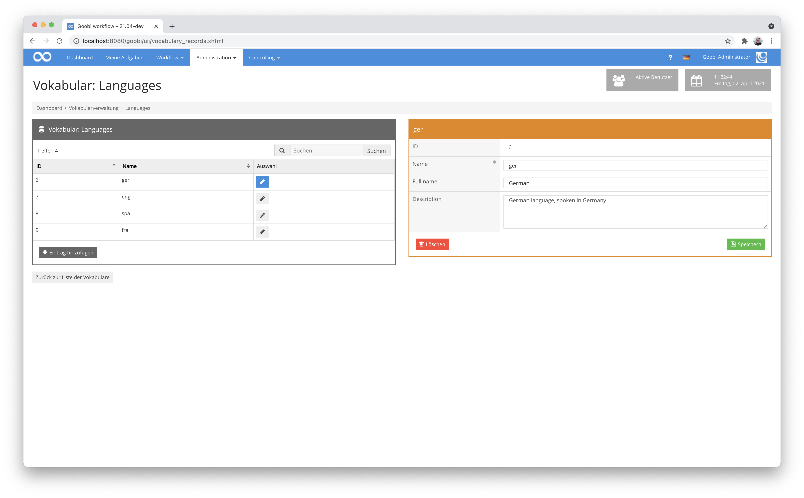
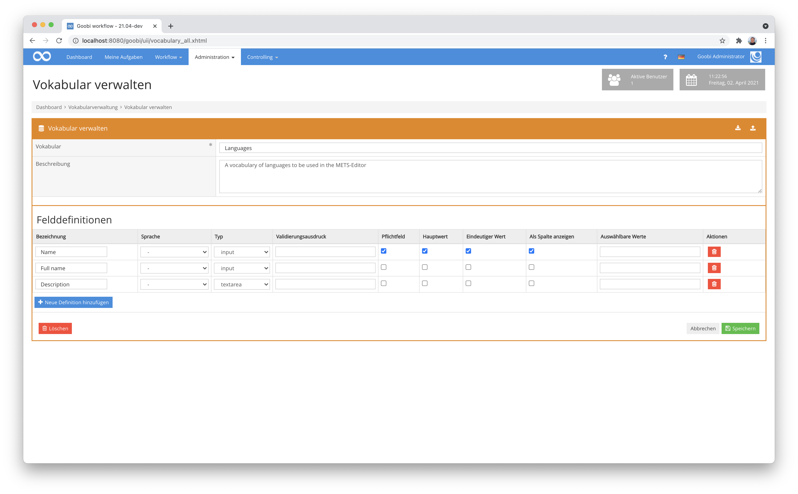
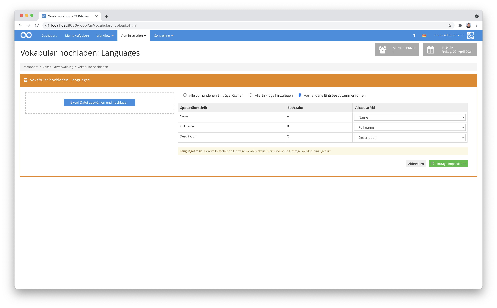
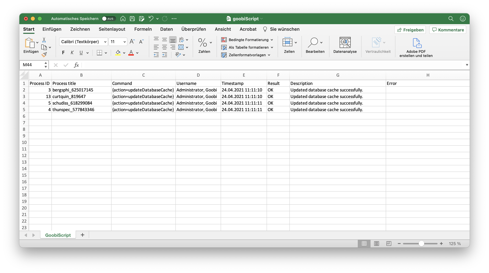
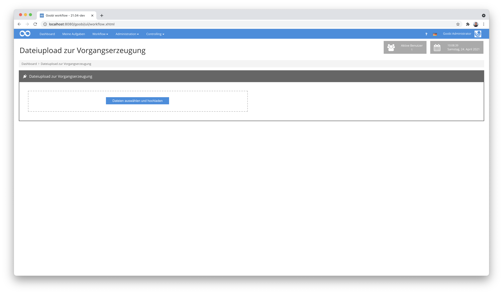

# Dezember 2020

## Coming soon

* Erweiterung LayoutWizzard Funktionalitäten
* Erweiterung der Dokumentation für viele bestehende Plugins
* Implementierung einer Metadatenübernahme aus Bildern
* Erweiterung für den Umgang mit Körperschaften

## Neues Plugin für die Erfassung von Archivgut

Über mehrere Monate haben wir ein umfangreiches neues Plugin für die Verarbeitung von Archivgut entwickelt. Dieses Plugin erlaubt eine Erfassung von Metadaten für sehr umfangreiche Archivbestände innerhalb von EAD-Dateien. Es erlaubt nicht nur, dass bestehende umfangreiche Archivbestände bearbeitet und selektiv digitalisiert werden. Es ermöglicht darüber hinaus auch, Daten als neuen Bestand zu erfassen.



Intern werden die Objekte, deren Metdaten sowie die Hierarchie der Objekte untereinander in einer standardisierten EAD-Datei gespeichert, die sich auch jederzeit aus der Weboberfläche herunterladen läßt.

Pro Knoten innerhalb des Bestandes werden die Metadaten gemäß des ISAD(G)-Standards in verschiedene Bereiche (`Identifikation`, `Kontext`, `Inhalt und innere Ordnung`, `Zugangs- und Benutzungsbedingungen`, `Sachverwandte Unterlagen`, `Anmerkungen`, `Verzeichnungskontrolle`) untergliedert und liegen dank der intensiven Zusammenarbeit mit dem MNHA in Luxembourgh auch gleich in den Sprachen Deutsch, Englisch und Französisch vor.



Die Struktur des gesamten Baumes läßt sich aus der Oberfläche des Plugins sehr einfach ändern und einzelne Knoten auch umfangreicher Bestände lassen sich schnell durchsuchen. Für die Bedienberfläche haben wir hier wieder auf die Anzeige sog. Badges zurückgegriffen. Sie erlauben eine schnelle Übersicht über die möglichen und auch bereits verwendeten Metadaten pro Bereich eines jeden Knotens. Hinzu kommt, dass die frei konfigurierbaren Validerungen sehr deutlich hervorheben, an welchen Stellen der Metadaten ggf. noch Anpassungen notwendig sind.

Die ausführliche Dokumentation des Plugins findet sich unter der folgenden URL:


https://docs.goobi.io/goobi-workflow-plugins-de/administration/intranda_administration_archive_management


Der Quellcode des Plugins selbst ist unter folgender URL verfügbar:


https://github.com/intranda/goobi-plugin-administration-archive-management


## Optische Überarbeitung des Vokabularmanagers und Ermöglichung einer Suche

Der Vokabularmanager findet seit seiner Veröffentlichung zunächst als Plugin und dann als Kernkomponente von Goobi Workflow ziemlich viel Verwendung. Es gibt bereits erste Goobi Nutzer, mit mehreren tausend Datensätzen pro Vokabular. Dabei fiel allerdins auch auf, dass die Bedienung der Vokabulare insbesondere bei umfangreichen Datenbeständen noch nicht optimal war. Daher haben wir nun eine tabellarische Darstellung der Datensätze im linken Bereich implementiert, die eine Sortierung sowie eine Suche in den Spalten ermöglicht. Insgesamt ist dadurch die Bedienung der Vokabulare nicht nur intuitiver und übersichtlicher geworden sondern auch noch deutlich performanter.



Innerhalb der Administration der Vokablare kann festgelegt werden, welche Felder jedes Vokabular hat, welchen Typ jedes dieser Felder haben soll und nun auch, ob es als durchsuchbare und sortierbare Spalte innerhalb des Vokabulars angezeigt werden soll.



[https://github.com/intranda/goobi-workflow/commit/531bb9828f210770b42571b79c215768c156d816](https://github.com/intranda/goobi-workflow/commit/531bb9828f210770b42571b79c215768c156d816)

## Schnellerer Import von Vokabularen aus Excel-Dateien

Oft stammen die Inhalte von Vokabularen zunächst aus anderen Systemen. Daher verfügt der Vokabularmanager über einen Importmechanismus für Excel-Dateien. An diesem haben wir auch einige Erweiterungen und Anpassungen vorgenommen. So ist es möglich, dass bestehende Vokabulare künftig nicht mehr komplett überschrieben sondern auch ergänzt werden können, beispielsweise wenn Daten zu späterem Zeitpunkt wiederholt eingespielt werden sollen.



In dem Kontext haben wir auch die Routinen für den Import noch einmal überarbeitet, um auch sehr umfangreiche Vokabulare performant importieren zu können.

[https://github.com/intranda/goobi-workflow/commit/59820a1832caf5149489c26443764f12830f90e9](https://github.com/intranda/goobi-workflow/commit/59820a1832caf5149489c26443764f12830f90e9)

## Paginierung überarbeitet

Wir haben an der Paginierung innerhalb des METS-Editors von Goobi workflow einmal einige Änderungen vorgenommen. Dies betrifft beispielsweise die Funktionalität für die Erzeugung von römischen Seitenzahlen, so dass nun nicht nur Großbuchstaben (X, V, I, etc.) für die römische Paginierung verwendet werden können sondern ebenfalls kleine Buchstaben (x, v, i, etc.).


Wenn man den Mauszeiger über die jeweiligen Elemente hält, so wird nun der Name der zugehörigen Bilddatei als Tooltip angezeigt.


Ausserdem wurde die Darstellung der zugewiesenen Paginierung überarbeitet, um sie besser lesbar zu machen. Dies wurde sowohl im mittleren Bereich des METS-Editors angepasst als auch innerhalb des Popups, das erscheint, wenn man den Mauszeiger über die Strukturelemente im Strukturbaum an der linken Seite hält.


Auf diese Weise ist die Paginierungsinformation deutlich einfacher lesbar geworden und lässt sich auch besser von der Bildnummer unterscheiden.

[https://github.com/intranda/goobi-workflow/commit/c4fab02d29deec6b68de76d858b26b2a429d9e50](https://github.com/intranda/goobi-workflow/commit/c4fab02d29deec6b68de76d858b26b2a429d9e50)

## Neuer REST-API endpoint für Statusabfrage von eingeloggten Nutzern

Ob aus dem Terminal, um vor einem Neustart zu prüfen, dass keine Nutzer eingeloggt sind, oder für das allgemeine Monitoring: Dieser neue REST-Endpoint ist einfach praktisch. Unter der URL `https://mygoobi.tld/goobi/api/currentusers/` kann eine JSON-codierte Liste der momentan angemeldeten Nutzer abgefragt werden:

```javascript
[
  {
    "user": "Engel, Detlev",
    "address": "127.0.0.1",
    "browser": "Firefox",
    "created": "14:59:02",
    "last": "14:59:11"
  },
  {
    "user": " - ",
    "address": "0:0:0:0:0:0:0:1",
    "browser": "Chrome",
    "created": "14:59:25",
    "last": "15:01:25"
  }
]
```

## Goobiscript: Excel-Export enthält nun auch Zeitstempel und Nutzernamen

Der Excel-Export von ausgeführten GoobiScripten wurde etwas erweitert. Er listet neuerdings ebenfalls einen Zeitstempel sowie den Namen des Nutzers auf, der das GoobiScript gestartet hat.



## Neues Workflow Plugin für das Erzeugen von Vorgängen auf Basis hochgeladener Dateien

Es wurde ein neues Workflow-Plugin implementiert, dass einen Massenupload von Bildern erlaubt und auf Basis der hierbei verwendeten Dateinamen automatisch Goobi-Vorgänge erzeugt. Über eine Konfigurationsdatei kann dabei gesteuert werden, welchem Benennungsschema die Dateien entsprechen müssen, um diese jals zusammengehörig erkennen zu können. Auch kann angegeben werden, welche Produktionsvorlage Verwendung finden soll und als welcher Publikationstyp die Vorgänge erzeugt werden sollen.



Die ausführliche Dokumentation des Plugins findet sich hier:


https://docs.goobi.io/goobi-workflow-plugins-de/workflow/intranda_workflow_fileupload_processcreation


Der Quellcode für das Plugin findet sich wie gewohnt auf GitHub veröffentlicht hier:


https://github.com/intranda/goobi-plugin-workflow-fileupload-processcreation


## Step Plugin zum Import von exif Daten als Metadaten

Im Kontext eines Projektes mit einem Stadtarchiv hat sich die Notwendigkeit ergeben, dass Metadaten aus Bilddateien extraiert werden sollten. Aus diesem Grund haben wir ein Step-Plugin entwickelt, dass das jeweils erste Bild eines Vorgangs nimmt, um aus diesem ausgewählte Metdaten zu lesen und gemäß eines konfigurierbaren Mappings nach Goobi zu überführen. Diese erlaubt anschließend eine Bearbeitung dieser Informationen innerhalb des Metadateneditors sowie auch eine Anzeige der Informationen innerhalb des Goobi viewers.

Wie ein solches Mapping konfiguriert wird, sieht man beispielhaft in dieser Konfigurationsdatei:

```markup
<config_plugin>

    <config>
        <project>*</project>
        <step>*</step>

        <command>/usr/bin/exiftool</command>
        <field line="Object Name" metadata="TitleDocMain" />
        <field line="Keywords" metadata="SubjectTopic" />
        <field line="Special Instructions" metadata="Footnote" />
        <field line="City" metadata="PlaceOfPublication" />
        <field line="Source" metadata="singleDigCollection" />
        <field line="Copyright Notice" metadata="AccessCondition" />
        <field line="Caption-Abstract" metadata="Abstract" />
    </config>

</config_plugin>
`
```

Mehr Informationen über die Funktionalität des neuen Plugins finden sich in der Dokumentation hier:


https://docs.goobi.io/goobi-workflow-plugins-de/step/intranda_step_imagemetadataextraction


Der Quellcode des Plugins wurde hier veröffentlicht:


https://github.com/intranda/goobi-plugin-step-image-metadata-extraction


## Bugfixes

Es gab einige kleinere Anpassungen und Verbesserungen am Kern von Goobi workflow für verschiedene Bereiche. Unter anderem waren dabei folgende Bereiche betroffen:

* Wenn beim Anlegen von Einrichtungen auf dem Button `Abbrechen` geklickt wurde, erschien fälschlicherweise eine Meldung, dass der Name der Einrichtung ein erforderliches Feld ist. Dies wurde korrigiert.
* Bei der Bearbeitung von Einrichtungen wurden Inhalte von Textfeldern zurückgesetzt, wenn die Werte von Checkboxen geändert wurden. Dieses Verhalten ist behoben worden.
* Das Neuanlegen von Nutzern war aufgrund von Umstellungen der Authentifizierungsmöglichkeiten nicht immer erfolgreich und konnte durch eine Überarbeitung behoben werden.
* Die Anzeige des Abarbeitungsstatus der Message-Queues war fehlerhaft im Falle von deaktivierten Message-Queues, so dass ein neues Einloggen notwendig wurde. Dies wurde ebenfalls korrigiert.

[https://github.com/intranda/goobi-workflow/commit/2094d049b8b81b7af3ccf8d51e0b1801d273a847](https://github.com/intranda/goobi-workflow/commit/2094d049b8b81b7af3ccf8d51e0b1801d273a847)\
[https://github.com/intranda/goobi-workflow/commit/064c2c0b95d826d5d656aa11936f3e7379af9327](https://github.com/intranda/goobi-workflow/commit/064c2c0b95d826d5d656aa11936f3e7379af9327)\
[https://github.com/intranda/goobi-workflow/commit/7ef268114a40b6c2a224884fde7dcb7e2c2aa8b4](https://github.com/intranda/goobi-workflow/commit/7ef268114a40b6c2a224884fde7dcb7e2c2aa8b4)\
[https://github.com/intranda/goobi-workflow/commit/cc2cabec9d35a10a98768db66892d9e831b2abec](https://github.com/intranda/goobi-workflow/commit/cc2cabec9d35a10a98768db66892d9e831b2abec)