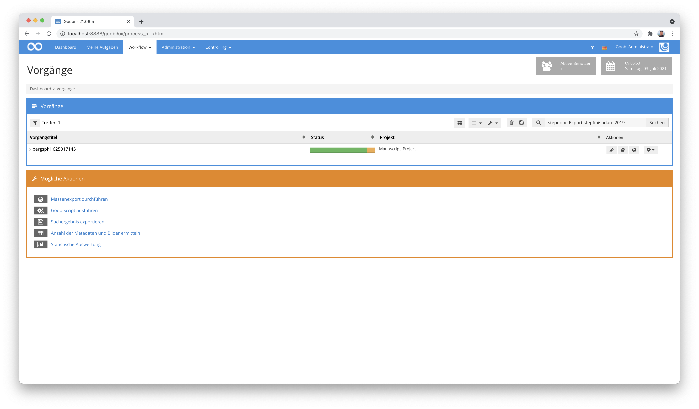

# Februar 2021

## Coming soon

* Erweiterung der Verarbeitung von GoobiScripten
* Neues Rechtemanagement für die Ausführung von GoobiScript
* Bessere Unterstützung von Körperschaften und Metadatengruppen
* Flex-Editor für die Erfassung von Handschriften und anderes

## Neue Suchmöglichkeiten für eine Suche nach Vorgängen anhand eines Datums

Wir haben die Suchmöglichkeiten erweitert, so dass es nun möglich ist, dass Vorgänge anhand ihres Erstellungsdatums gefunden werden können. Die Suchsyntax sieht dabei folgendermaßen aus.

```
processdate=2021
```

Es ist auch möglich, nach Vorgängen, die vor oder nach einem bestimmten Datum (oder auch einer Uhrzeit) erstellt wurden, zu filtern:

```
"processdate<2020-01-01 12:00:00"
```

Diese neuen Suchparameter ermöglichen somit ebenfalls eine Suche von Vorgängen nach einem Zeitraum:

```
processdate>2020-01-01 processdate<2020-12-31
```

## Suche nach Arbeitsschritten anhand von Datum

Analog zu den neuen Suchmöglichkeiten nach den Vorgängen, kann auch nach Arbeitsschritten gefiltert werden. Hierbei besteht die Unterscheidung zwischen `stepstartdate` als Zeitpunkt des Bearbeitungsbeginns und `stepfinishdate` für den Zeitpunkt des Bearbeitungsendes.

Um nach dem Bearbeitungsende zu filtern, muss in der gleichen Suchanfrage auch nach dem Status eines Schritts gesucht werden. Dies sieht entsprechend folgenermaßen aus:

```
stepdone:Export stepfinishdate:2019
```



Der folgende Filter sucht nach Vorgängen, bei denen `Scanning` und `Export` im Jahr 2021 abgeschlossen wurden:

```
stepdone:Scanning stepdone:Export stepfinishdate:2021
```

Die Verwendung der Suche wurde innerhalb der Dokumentation an die neuen Möglichkeiten angepasst und findet sich nach wie vor unter dieser Adresse:


https://docs.goobi.io/goobi-workflow-de/manager/7/7.1


## Anpassung für das Change-Workflow-Plugin

Im Change-Workflow-Plugin wurden einige Erweiterungen für die Funktionalität vorgenommen. So lässt sich von nun an nicht nur der Status von Aufgaben ändern sondern auch die Zuweisung von Benutzergruppen. Eine Konfiguration hierfür sieht beispielsweise wie folgt aus:

```markup
<config>
    <!-- which projects to use for (can be more then one, otherwise use *) -->
    <project>*</project>
    <step>*</step>

    <!-- multiple changes can be done within one configuration rule; simply add another 'change' element with other properties here -->
    <change>
      <!-- name of the property to check -->
      <propertyName>{meta.ISBN}</propertyName>
      <!-- expected value (can be blank too) -->
      <propertyValue></propertyValue>
      <!-- condition for value comparing, can be 'is' or 'not' or 'missing' or 'available' -->
      <propertyCondition>missing</propertyCondition>

      <!-- list of steps to deactivate -->
      <steps type="deactivate">
          <title>Metadata enrichment</title>
      </steps>

      <!-- user groups to assign -->
      <usergroups step="Metadata enrichment">
          <usergroup>Administration</usergroup>
      </usergroups>
    </change>
</config>
```

Hinzu kommt, dass mit diesem Update nicht mehr allein Eigenschaften der Vorgänge auf ihre Werte hin geprüft werden können. Stattdessen können nun alle zur Verfügung stehenden Werte, die als Variablen ausgedrückt werden können, verwendet werden. Aus den bisherigen Konfigurationen in dieser Form:

```markup
<propertyName>Template</propertyName>
```

müssen in den Konfigurationsdateien nun solche Formulierungen verwendet werden:

```markup
<propertyName>{process.Template}</propertyName>
```

Weitere Erläuterungen über die Möglichkeiten der Variablen finden sich unter folgender URL:


https://docs.goobi.io/goobi-workflow-de/manager/8


Die aktualisierte Dokumentation für das Change-Workflow-Plugin findet sich hier:


https://docs.goobi.io/goobi-workflow-plugins-de/step/intranda_step_changeworkflow


## Plugin zum automatischen Erzeugen von Metadaten innerhalb der METS-Datei

In mehreren Projekten ergab sich die Anforderung, dass Metdaten innerhalb der METS-Datei dynamisch aktualisierbar sein sollten. So sollte es beispielsweise möglich sein, dass Metadaten für hierchisch untergeordnete Strukturelemente generiert werden können sollen und dabei ggf. mit Daten angereichert werden sollen, die aus anderen Struktelementen oder auch aus Eigenschaften stammen.

Wie bei vielen anderen Plugins auch wurde dieses Plugin ziemlich generisch gehalten und ist entsprechend je nach Einsatzzweck und Workflow sehr individuell konfigurierbar. Eine solche Konfiguration sieht beispielsweise so aus:

```markup
<config_plugin>
    <config>
        <!-- which projects to use for (can be more then one, otherwise use *) -->
        <project>*</project>
        <step>*</step>

        <!-- multiple updates can happen within one call. 
            Repeat the update blocks for each additional change -->
        <update>
            <!-- define for which field inside of the METS file the content shall be generated -->
            <field>TitleDocMain</field>

            <!-- for which structure elements shall the content be updated? 
                Multiple 'element' can be listed here. 
                Use '*' to match all structure element types. -->
            <element>Monograph</element>

            <!-- define if the content shall be overwritten if the field is not empty -->
            <forceUpdate>true</forceUpdate>

            <!-- define a list of content here to be used for the field as metadata value
                variable: this content gets analyzed and replaced by the variable replacer 
                metadata: value of the metadata field with the given name inside of the same docstruct element
                static: a static string
                random: a random number with a defined length 
                uuid: a UUID with 36 characters
                timestamp: a numeric timestamp 
                groupcounter: a separate counter for each value of 'groupField' -->
            <content type="variable">{meta.CatalogIDDigital}</content>
            <content type="metadata">DocLanguage</content>
            <content type="static">_</content>
            <content type="random">9</content>
            <content type="uuid" />
            <content type="timestamp" />
            <content type="counter">%03d</content>
            <content groupField="{meta.PublicationYear}" type="groupcounter">%03d</content>
        </update>

        <update>
            <field>DocLanguage</field>
            <element>Chapter</element>
            <forceUpdate>false</forceUpdate>
            <content type="variable">{meta.DocLanguage}</content>
        </update>

    </config>

</config_plugin>
```

Im Falle dieses Konfigurationsbeispiels werden in das Feld `TitleDocMain` innerhalb von Monographien mehrere verschiedene Daten hintereinander eingefügt. Hierbei handelt es sich um Feldinhalte aus der Mets-Datei, umd statische Werte, um Timestamps, Zähler und weitere Typen. Dabei können solche Kombinationen auch für tieferliegende Strukturelemente angewendet werden und erlauben so sehr flexible Einsatzmöglichkeiten.

Die ausführliche Dokumentation des Plugins wurde noch nicht erstellt und folgt bald. Der Quellcode des Plugins selbst ist unter folgender URL verfügbar:


https://github.com/intranda/goobi-plugin-step-metadata-update-field


## Websockets zur Benachrichtigung von Nutzern

​ Durch die Umstellung auf aktuelle Technologien (CDI, JSF 2.3) können nun in Goobi worflow Websockets eingesetzt werden. Diese ermöglichen eine performante bidirektionale Kommunikation zwischen Server und Browser. Dadurch ist es uns nun möglich, von der Serverseite aus Nachrichten zum Nutzer zu schicken. Ein erster Anwendungsfall, wo dieses Anwendung findet sind die folgenden zwei Bereiche:

Administrative Nachrichten, die für alle Anwender angezeigt werden sollen, werden nun unmittelbar bei allen Nutzer angezeigt, nicht erst beim nächsten Reload.

Der Fortschritt der Abarbeitung von GoobiScript-Ausführungen wird live angezeigt, ohne dass hier ein manueller Reload für die Aktualisierung der Fortschrittsanzeige erfolgen muss.


## Goobi überwacht nun Dead Letter Queue für externe Warteschlange

Wenn eine Nachricht in einer Message Queue wiederholt Fehler erzeugt, wird sie als unzustellbar markiert und in eine andere Message Queue, die "Dead Letter Queue" geschickt. Goobi überwacht nun diese "Dead Letter Queue" auf Nachrichten und setzt den zur Nachricht zugehörigen Schritt in den Fehlerstatus, damit sich ein menschlicher Nutzer den Fehler ansehen kann.

## Dashboard erweitert für zurückliegende Aufgaben

Das am häufigsten eingesetzte Dashboard hat eine hilfreiche Erweiterung erhalten. Dort ist es nun möglich, dass diejenigen Aufgaben aufgelistet werden, die der Nutzer als letztes abgeschlossen hat. Neben der Anzeige, welche Aufgaben der Nutzer derzeit in Bearbeitung hat, ergbit sich nun eine unmittelbare Einsicht in die kürzlich abgeschlossenen Aufgaben.


Dabei wurde zugleich ein häufig geäußerter Wunsch realisiert: Kürzlich abgeschlossene Aufgaben, die also aus der Aufgabenliste bereits verschwunden sind und im Workflow weiter vorangeschritten sind, können aus dem Dashboard heraus auch noch einmal zurückgenommen werden, um sie doch noch einmal zu bearbeiten. Dies ist allerdings nur dann mögich, wenn die nachfolgende Aufgabe nicht bereits durch einen Nutzer für die Bearbeitung angenommen oder durch einen Automatismus gestartet wurde.

## Erweiterte Logik für Anpassungen an der Reihenfolge von Arbeitsschritten

Die zumeist sequentielle Reihenfolge von Arbeitsschritten erlaubt grundsätzlich eine sehr gute Übersicht über den Ablauf der involvierten Aufgaben und deren Fortschritt. Als zu umständlich empfanden wir allerdings die Bedienung, wenn die Reihenfolge von Aufgaben einmal geändert werden sollte oder neue Aufgaben zwischen existierende Aufgaben eines Workflows integriert werden sollten. Hier fanden daher einige größere Umstellungen statt. So können in der überarbeiteten Nutzeroberfläche die Aufgaben mittels der Pfeil-Icon verschoben werden, so dass sich die zugehörigen Reihenfolgennummern der betroffenen Arbeitsschritte automatisch mit anpassen, ohne manuell die Reihenfolgennummern ändern zu müssen.


Die zweite große Neuerung in diesem Kontext ist, dass neue Aufgaben, die in einen bestehenden Workflow integriert werden sollen, automatisch eine richtige Reihenfolgennummer erhalten, so dass die neue Aufgabe automatisch korrekt an das Ende des existierenden Workflows gesetzt wird.


Wird an dieser Stelle allerdings eine Reihenfolgennummer angegeben, die mitten im Workflow liegt, so werden die bereits existierenden Aufgaben automatisch um jeweils eine Position verschoben, um die neue Aufgabe dazwischen zu fügen. Diese Verhalten kann allerdings auf Wunsch auch unterbunden werden, so dass auch weiterhin eine parallele Ausführung von Aufgaben möglich ist.

Um von diesen Neuentwicklungen zu profitieren wurde diese Logik auch auf die Ausführung von GoobiScript erweitert. Aus diesem Grund existiert ein neues GoobiScript, das das Einfügen von Aufgaben in den Workflow unter Berücksichtung der korrekten zu ändernden Reihenfolgen für eingefügte Aufgaben auch in Masse erlaubt.


Für die Verwendung des neuen GoobiScripts findet sich hier der entsprechende Abschnitt innerhalb der Goobi workflow Dokumentation:


https://docs.goobi.io/goobi-workflow-de/manager/7/7.4#goobiscript-addstepatotherstepposition
