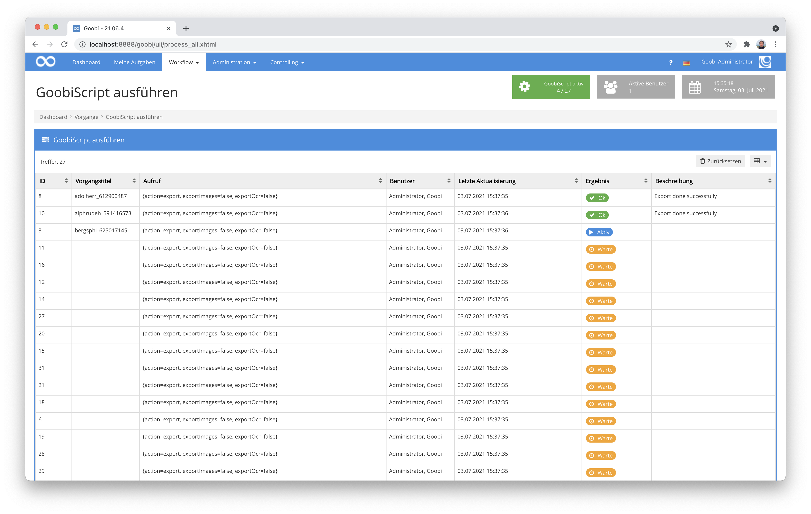
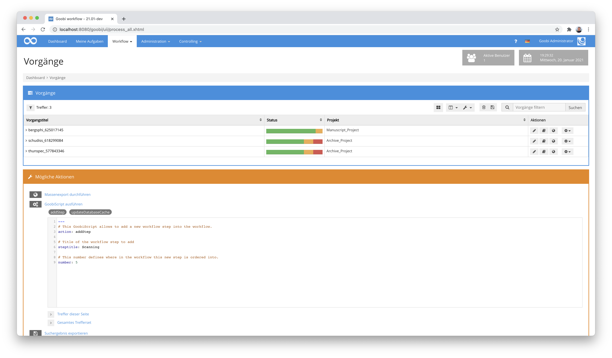
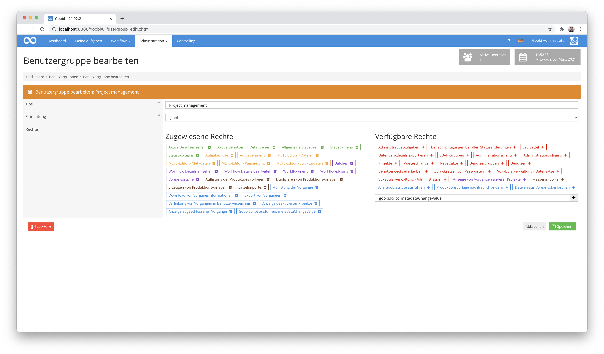
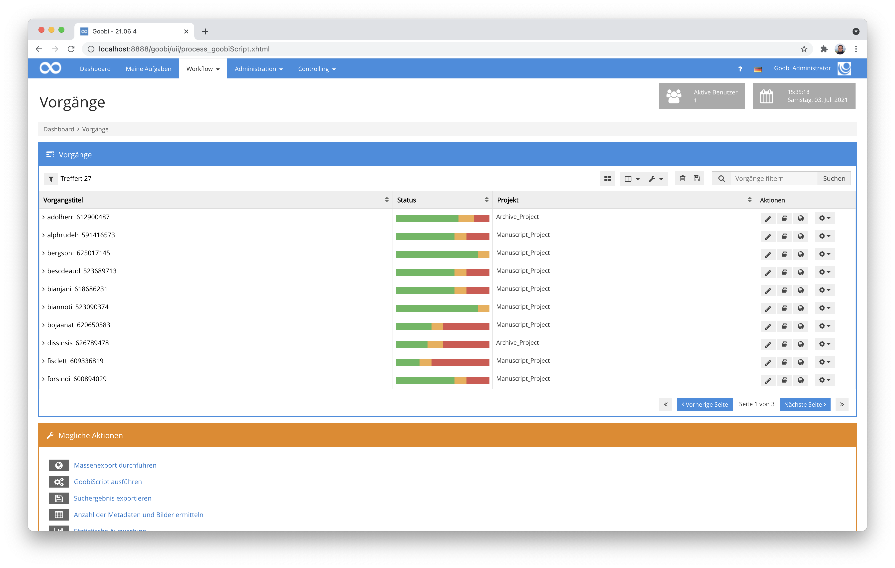
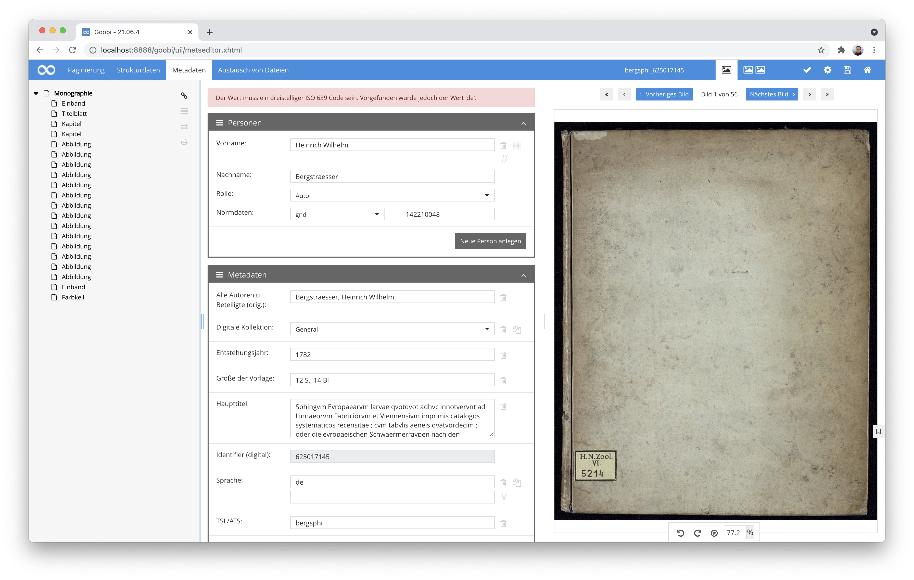
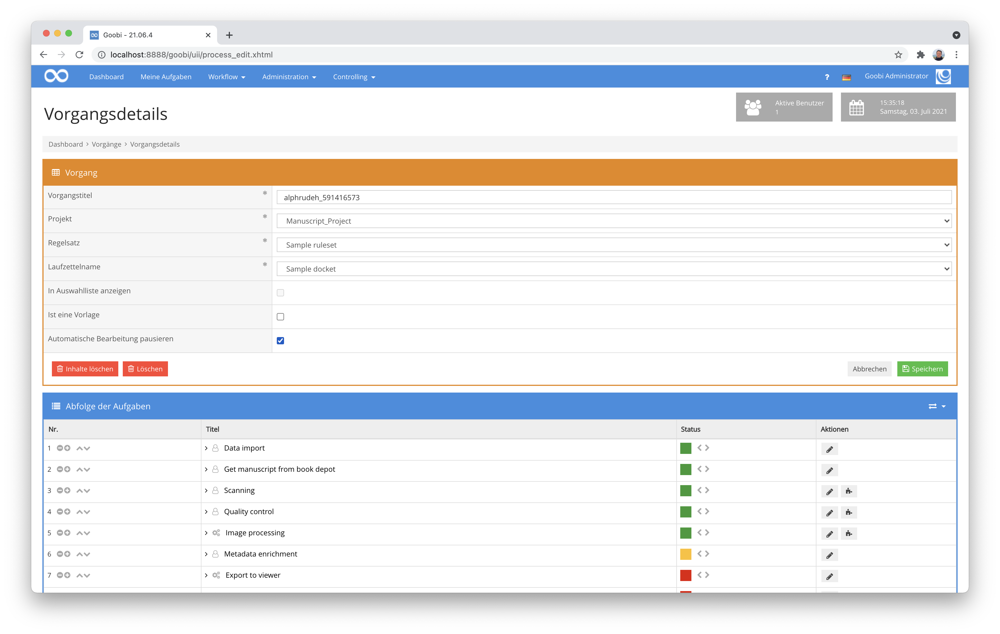
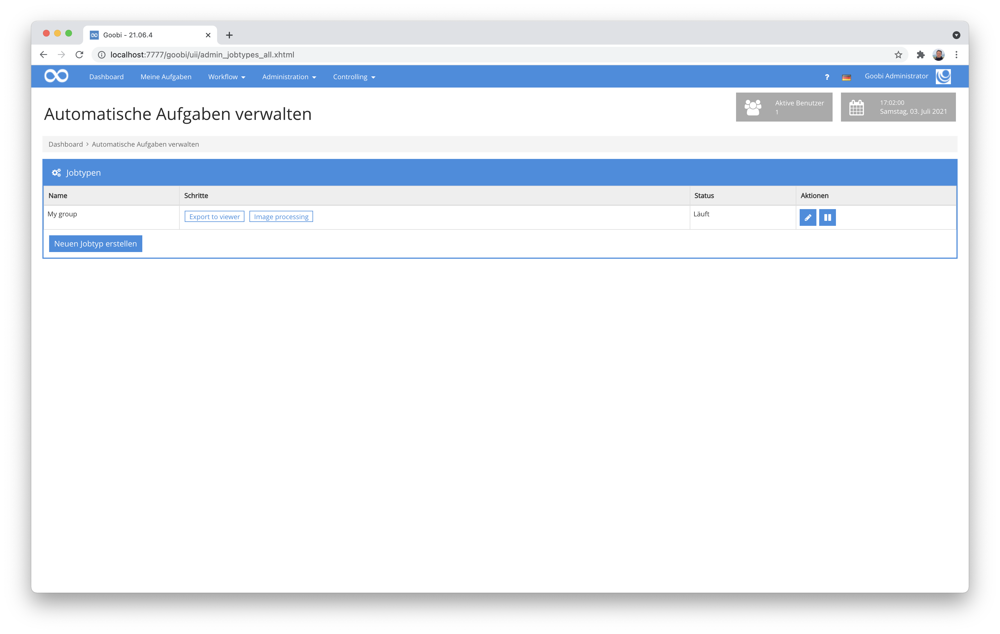
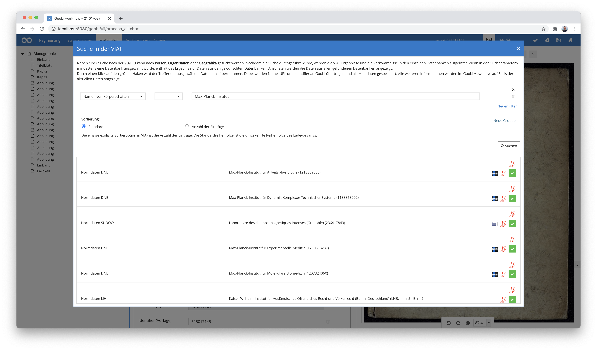

# März 2021

## Coming soon

* Erweiterung der Unterstützung von Metadatengruppen
* Flex-Editor für die Erfassung von Handschriften und anderes
* Neuer Paginierungstyp für Doppelseiten
* Auszeichnung von Doppelseiten in METS
* Unterstützung von IIIF URLs innerhalb des Variablen Replacers

## GoobiScript Umbau

GoobiScripte sind aus dem Werkzeugkasten des gewieften Goobi-Anwenders nicht mehr wegzudenken. Doch obwohl sie überaus praktisch und hilfreich sind, gab es immer mal wieder Probleme mit steckenbleibenden Warteschlangen oder hoher Auslastung des Systems, wenn viele GoobiScripte auf Ihre Ausführung warteten. Außerdem kam es ab und an zu Problemen mit der parallelen Ausführung. Diese Probleme gehören nun allesamt der Vergangenheit an, denn die interne GoobiScript-Verwaltung und -Ausführung wurden komplett neu durchdacht und implementiert. Dadurch ist GoobiScript jetzt effizienter als je zuvor.



[https://github.com/intranda/goobi-workflow/commit/7d9306f9b644508d5a2dd292b079e4c34ee43120](https://github.com/intranda/goobi-workflow/commit/7d9306f9b644508d5a2dd292b079e4c34ee43120)

## Abgestufte Rechte für GoobiScript

Goobi workflow erlaubt mit der Ausführung von GoobiScript umfangreiche Operationen, um Vorgänge, deren Workflows, Metadaten oder auch andere Bereiche zu beeinflussen und dies dabei gleich auf tausende Vorgänge einheitlich anzuwenden. Insofern ist GoobiScript oft eine großartige Hilfe, wenn es um Massenänderungen geht. Doch leider waren diese Optionen in der Vergangenheit lediglich einem sehr beschränkten Nutzerkreis zugänglich, da mittels GoobiScript natürlich auch versehentlich größere unerwünschte Eingriffe in die Vorgänge erfolgen könnten und somit oft nur Admistratoren Zugriff auf GoobiScript erhielten.

Mit den Neuentwicklungen am Rechtesystem von Goobi workflow gibt es an dieser Stelle einige Verbesserungen, so dass es jetzt möglich wird, einzelne Nutzergruppen gezielt mit ausgewählten Rechten für die Ausführung von definierten GoobiScripten auszustatten. Auf diese Weise läßt sich beispielsweise erlauben, dass Nutzer das GoobiScript für die Durchführung des Exports auch für viele Vorgänge ausführen können, nicht jedoch andere GoobiScripte wie das Ändern von Metadaten oder Eingriffe in den Workflow.



Die Konfiguration dieser Rechte ist relativ einfach gehalten. Im Bereich der Benutzergruppen können hier spezifisch einzelne Kommandos hinzugefügt werden, wie im folgenden Screenshot ersichtlich.



Das überarbeitete Rechtemanagement für die Steuerung des Zugriffs auf GoobiScript ist innerhalb des Goobi Handbuchs anschaulich beschrieben. Hier läßt sich dies einmal nachlesen:


https://docs.goobi.io/goobi-workflow-de/manager/6#individuelle-goobiscripte


Übrigens haben wir auch die Dokumentation der GoobiScripte allgemein deutlich überarbeitet, um deren Ausführung und Arbeitsweise besser zu erklären. Diese Dokumentation findet sich nach wie vor unter folgender Adresse:


https://docs.goobi.io/goobi-workflow-de/manager/7/7.4


## Verbessertes Handling für Message Queues

Dass rechenintensive bzw. zeitaufwendige Automatismen über eine sog. Message Queue ausgeführt werden können, ist noch immer relativ neu und bringt insbesondere für größere Projekte enorme Vorteile mit sich, weil so beispielsweise die Berechnungen auch über mehrere Server verteilt werden können. Überarbeitet haben wir hier, dass Aufgaben, die während der Verarbeitung hängen geblieben sind, weil eine der zur Verfügung stehenden Queues nicht erreichbar war, nicht mehr in einem ungewissen Zustand verbleiben. Stattdessen werden sie jetzt in einen formellen Fehlerstatus gesetzt, so dass deren fehlerhafte Verarbeitung ersichtlich wird und sich entsprechend auch sich deren Ausführung so auch korrigieren läßt.

[https://github.com/intranda/goobi-workflow/commit/8d7abaef78b43fd0eef26dabe67675c4fed88b1e](https://github.com/intranda/goobi-workflow/commit/8d7abaef78b43fd0eef26dabe67675c4fed88b1e)

## Neuer Schrittstatus für automatische Workflowschritte

Es wurde ein völlig neuer Schrittstatus `INFLIGHT` eingeführt. Dieser neue Status wird dann gesetzt, wenn ein automatischer Workflowschritt auf einem anderen System bearbeitet werden soll, dorthin übertragen wird, aber noch nicht von dem externen System aufgegriffen wurde und entsprechend noch nicht bearbeitet wird. Durch diesen neuen Schrittstatus kann somit zu jedem Zeitpunkt abgefragt werden, wie ausgelastet das Gesamtsystem ist und ob ggf. noch weitere Server zur Abarbeitung von rechenintensiven Aufgaben zugeschaltet werden sollten.

[https://github.com/intranda/goobi-workflow/commit/47a1b3e50a122b5d5b0a1f126f98aeca9d50aead](https://github.com/intranda/goobi-workflow/commit/47a1b3e50a122b5d5b0a1f126f98aeca9d50aead)

## Accessibility: Links werden zu Buttons

Für eine gute Accessibility ist es besonders wichtig, dass die HTML-Elemente die richtige Semantik haben. So bedeutet ein `<a>` (ein Link, oder auch **a**nchor), dass eine neue Seite betreten wird und nicht, dass eine Aktion ausgeführt wird. Ein `<button>` hingegen deutet darauf hin, dass eine Aktion ausgeführt wird. Aus historisch-technischen und auch optischen Gründen war in Goobi workflow bisher jede Aktion als Link umgesetzt. Im Zuge der großen Accessibility-Anstrengungen der letzten Monate haben wir auch hier größere Umstellungen vorgenommen. Somit wurden alle Links, die eigentlich eine Aktion auslösen und nicht nur zur Navigation dienen in Buttons überführt worden.



Am äußeren Erscheinungsbild sollte diese Umstellung für den Nutzer keine Änderung bedeuten. Sollten funktionell Überraschungen auftreten, weil eine der zahlreichen Umstellungen nicht reibungslos erfolgte, so freuen wir uns über Rückmeldungen, so dass wir hier dann Anpassungen vornehmen können wenn nötig.

[https://github.com/intranda/goobi-workflow/commit/b4170331f68491f3747dab8ff648dd793f59e608](https://github.com/intranda/goobi-workflow/commit/b4170331f68491f3747dab8ff648dd793f59e608)

## Individuelle Validierungsmeldungen für Metadaten

Lang gewünscht und jetzt sind sie da: Individualisierbare Validierungsmeldungen im Metadateneditor.

Für die sehr granular steuerbaren Validierungsprüfungenen, die innerhalb der Regelsätze festgelegt werden können, wurden in der Vergangenheit Meldungen im Metdateneditor angezeigt, die nicht für jeden verständlich waren, da sie zu technisch waren. Mit den Entwicklungen in diesem Kontext sind diese Meldungen jetzt steuerbar und können innerhalb der Regelsätze individuell und mehrsprachig festgelegt werden. Innerhalb der Regelsätze sieht dies beispielsweise so aus:

```markup
  <MetadataType>
    <Name>DocLanguage</Name>
    <language name="de">Sprache</language>
    <language name="en">Language</language>
    <language name="es">Idioma</language>
    <validationExpression>[a-z]{3}</validationExpression>
    <validationErrorMessage name="de">Der Wert muss ein dreistelliger ISO 639 Code sein. Vorgefunden wurde jedoch der Wert '{}'.</validationErrorMessage>
    <validationErrorMessage name="en">The value '{}' does not correspond to a three-letter ISO 639 code.</validationErrorMessage>    
  </MetadataType>
```

In der Nutzeroberfläche wird diese Meldung dann entsprechend beim Verstoß gegen die Validierungsvorgaben beispielsweise so angezeigt:



[https://github.com/intranda/goobi-workflow/commit/a279925b4aef785fcb4f0b32351823c989ace165](https://github.com/intranda/goobi-workflow/commit/a279925b4aef785fcb4f0b32351823c989ace165)\
[https://github.com/intranda/goobi-workflow/commit/8fbabedd71540ffad860d3f19b53f038908db5b7](https://github.com/intranda/goobi-workflow/commit/8fbabedd71540ffad860d3f19b53f038908db5b7)

## Lokale Übersetzungs-Dateien werden beim Start angelegt, wenn sie nicht existieren

In Goobi workflow gibt es lokale Übersetzungsdateien, die im Konfigurationsverzeichnis liegen. Die in diesen Dateien hinterlegten Übersetzungen überschreiben die von Goobi workflow selbst mitgelieferten Übersetzungen. Auf diese Weise ist es möglich, dass in jeder Goobi workflow Instanz auch individuelle Texte verwendet werden können, die in der Nutzeroberfläche angezeigt werden sollen.

Goobi überwacht diese Dateien stets auf Änderungen und lädt diese lokalen Übersetzungen neu, wenn sich an den Dateien etwas geändert hat. Allerdings funkioniert diese Routine nur, wenn die Dateien bereits beim Start von Goobi vorliegen. So kam es in der Vergangenheit öfter vor, dass Goobi neu gestartet werden musste, nur um eine Übersetzung zu ändern bzw. anzuzeigen. Mit den Änderungen, die wir nun vorgenommen haben überprüft Goobi bereits beim Start zusätzlich, ob alle eventuell benötigten Übersetzungsdateien im entprechenden Verzeichnis vorhanden sind und legt ggf. fehlende Dateien sonst automatisch an.

[https://github.com/intranda/goobi-workflow/commit/7f7fea7b5ec0dfbc5f2c327561c0750bc810386e](https://github.com/intranda/goobi-workflow/commit/7f7fea7b5ec0dfbc5f2c327561c0750bc810386e)

## Automatische Workflows sind nun pausierbar

Durch eine Einstellung in den Vorgangsdetails läßt sich nun in einzelnen Vorgängen die Abarbeitung der automatischen Arbeitsschritte pausieren. Dies ist vor allem dann besonders praktisch, wenn ein Werk eher als geplant in Goobi workflow eingespielt wurde, der weitere Workflowverlauf aber vollautomatisch stattfindet. Durch diese Änderung kann der automatische Export, der noch nicht stattfinden soll, durch nur zwei Klicks verhindert werden.



[https://github.com/intranda/goobi-workflow/commit/d3d27cc2d20da0ea6b04278f5d6514cc1e80ef0b](https://github.com/intranda/goobi-workflow/commit/d3d27cc2d20da0ea6b04278f5d6514cc1e80ef0b)

## Pausieren von gruppierten automatischen Workflowschritten (Jobtypen)

Im Menü `Administration` gibt es nun einen neuen Menüpunkt `Automatische Schritte`. Dieser ermöglicht es, automatische Schritte zu sogenannten "Jobtypen" zu gruppieren. Diese Jobtypen können dann pausiert werden. Dadurch lassen sich mehrere vollautomatische Vorgänge auf einmal an einer bestimmten Stelle pausieren. Wenn zu einem späteren Zeitpunkt der Jobtyp wieder gestartet wird, werden alle pausierten Schritte erneut gestartet.



[https://github.com/intranda/goobi-workflow/commit/72014e78697d7fb57c778970f44b4817de99b7c4](https://github.com/intranda/goobi-workflow/commit/72014e78697d7fb57c778970f44b4817de99b7c4)

## JWT Authentifizierung für alle Endpoints in der Goobi API

Goobi workflow erlaubt ja, Anfragen an dessen API per JSON Web Token (JWT) zu authentifizieren. Solche JWTs werden dabei von Goobi workflow selbst erstellt und an einen Drittservice versandt, der sie dann später nutzt, um die Ausführung einer Aktion in Goobi zu legitimieren. Die Verwendung einer solchen JWT-Methode hat den großen Vorteil, dass ein JWT immer nur einen sehr bestimmten Endpoint authentifiziert (zum Beispiel einen einzelnen Workflowschritt von einem einzelnen konkreten Vorgang zu abzuschließen). Darüber hinaus erlaubt diese Herangehensweise, dass ein solches JWT nach einer gewissen Zeit abläuft. Somit ist also auch der potentielle Verlust eines JWTs wesentlich weniger problematisch als der Verlust eines unbegrenzt für mehrere Endpoints gültigen Tokens oder eines Passworts.

Um diese Funktionalität zu nutzen. muss innerhalb der zentralen Konfigurationsdatei von Goobi workflow `goobi_config.properties` ein zentrales JWT-Secret hinterlegt werden. Die Konfiguration kann beispielsweise so aussehen:

```
jwtSecret = MySecretForJwt
```

[https://github.com/intranda/goobi-workflow/commit/35fd0008b36df6648b125f5052bae7c744972965](https://github.com/intranda/goobi-workflow/commit/35fd0008b36df6648b125f5052bae7c744972965)

## Unterstützung von Körperschaften innerhalb des Metadateneditors

Nach einigen Monaten Arbeit ist es uns nun gelungen, dass Goobi workflow Körperschaften vollständig unterstützt. Diese werden nun ähnlich wie bisher Personen, Metadaten und Metadatengruppen als eigener Bereich innerhalb des Metadateneditors aufgeführt und erlauben die Erfassung mehrerer zugehöriger Metadaten.


Natürlich ist hierbei auch gleich berücksichtigt worden, dass auch die Anbindung an gängige Normdatenbanken unterstützt wird. Entsprechend kann hier nun auch nach Körperschaften gesucht und deren Daten übernommen werden.



Die Definition von Körperschaften ist innerhalb der zentralen UGH-Dokumentation für die Verarbeitung von Metadaten erläutert:


https://docs.goobi.io/ugh-de/3/3.1#3-1-3-koerperschaften


## Einfachere Konfiguration mehrerer Projekte

Eine zentrale Konfigurationsdatei von Goobi workflow ist die Datei `goobi_projects.xml`. Sie steuert in erster Linie, wie sich die Anlegemaske für Vorgänge verhalten soll, welche Felder angezeigt werden sollen und inwieweit dies pro Publikationstyp unterschiedlich sein soll.

Grundsätzlich ist diese Konfiguration von Goobi bereits eine der eher komplexeren Dateien und nicht unbedingt selbsterklärend. Hinzu kam bisher der Umstand, dass diese Konfigurationdatei prinzipiell schon erlaubte, dass für verschiedene Projekte unterschiedliche Konfigurationen festgelegt werden konnten. Dazu mussten jedoch bisher stets die gesamten zumeist sehr umfangreichen Blöcke mehrfach in der Datei vorkommen, was häufig zu unnötigen Redundanzen und Wiederholungen führte. Mit einer Umstellung an dieser Stelle soll diese Konfiguration nun etwas einfacher werden und solche Wiederholungen vermeiden. Daher erlauben die bisherigen `project`-Elemente nun eine wiederholbare Nennung von mehreren Projektnamen, für die der jeweilige Abschnitt gelten soll. Bei der unmittelbaren Gegenüberstellung wird gut nachvollziehbar, wo sich hier die Neuerungen ergeben:

### Bisherige Konfiguration

Bisherige Konfiguration von mehreren Projekten, bei der die Konfiguration für das `Manuscript-Project` und das `Archive-Project` identisch ist und vom `default` abweicht:

```markup
<?xml version="1.0" encoding="UTF-8"?>
<goobiProjects>

    <project name="Manuscript-Project">
        <createNewProcess>

            <itemlist>
                <item from="werk" multiselect="false">
                    Font type
                    <select label="Antiqua">Antiqua </select>
                    <select label="Gothic"> Gothic </select>
                    <select label="Mixed">Mixed </select>
                </item>

                <!-- Title for Monograph and Periodical -->
                <item docstruct="topstruct" from="vorlage" isnotdoctype="multivolume" metadata="TitleDocMain" required="true" ughbinding="true"> Title </item>
            </itemlist>

            <opac use="true">
                <catalogue>Library of Congress</catalogue>
            </opac>

        </createNewProcess>
    </project>    

    <project name="Archive-Project">
        <createNewProcess>

            <itemlist>
                <item from="werk" multiselect="false">
                    Font type
                    <select label="Antiqua">Antiqua </select>
                    <select label="Gothic"> Gothic </select>
                    <select label="Mixed">Mixed </select>
                </item>

                <!-- Title for Monograph and Periodical -->
                <item docstruct="topstruct" from="vorlage" isnotdoctype="multivolume" metadata="TitleDocMain" required="true" ughbinding="true"> Title </item>
            </itemlist>

            <opac use="true">
                <catalogue>Library of Congress</catalogue>
            </opac>

        </createNewProcess>
    </project>    

    <project name="default">
        <createNewProcess>

            <itemlist>
                <!-- Title for Monograph and Periodical -->
                <item docstruct="topstruct" from="vorlage" isnotdoctype="multivolume" metadata="TitleDocMain" required="true" ughbinding="true"> Title </item>
            </itemlist>

            <opac use="true">
                <catalogue>K10Plus</catalogue>
            </opac>

        </createNewProcess>
    </project>    
</goobiProjects>
```

### Neue Konfiguration

Künftige Konfiguration mehrerer gleich zu behandelnder Projekte zusammengefasst in einem Block:

```markup
<?xml version="1.0" encoding="UTF-8"?>
<goobiProjects>

    <project>
        <name>Manuscript-Project</name>
        <name>Archive-Project</name>
        <name>Biology.*</name>
        <createNewProcess>

            <itemlist>
                <item from="werk" multiselect="false">
                    Font type
                    <select label="Antiqua">Antiqua </select>
                    <select label="Gothic"> Gothic </select>
                    <select label="Mixed">Mixed </select>
                </item>

                <!-- Title for Monograph and Periodical -->
                <item docstruct="topstruct" from="vorlage" isnotdoctype="multivolume" metadata="TitleDocMain" required="true" ughbinding="true"> Title </item>
            </itemlist>

            <opac use="true">
                <catalogue>Library of Congress</catalogue>
            </opac>

        </createNewProcess>
    </project>    

    <project name="default">
        <createNewProcess>

            <itemlist>
                <!-- Title for Monograph and Periodical -->
                <item docstruct="topstruct" from="vorlage" isnotdoctype="multivolume" metadata="TitleDocMain" required="true" ughbinding="true"> Title </item>
            </itemlist>

            <opac use="true">
                <catalogue>K10Plus</catalogue>
            </opac>

        </createNewProcess>
    </project>    
</goobiProjects>
```

Eine Dokumentation über den Aufbau der Konfigurationsdatei `goobi_projects.xml` findet sich unter der folgenden URL:


https://docs.goobi.io/goobi-workflow-de/admin/7/7.6


[https://github.com/intranda/goobi-workflow/commit/d36c63bdb7802922c53b3e9531a3f09f5f593a78](https://github.com/intranda/goobi-workflow/commit/d36c63bdb7802922c53b3e9531a3f09f5f593a78)