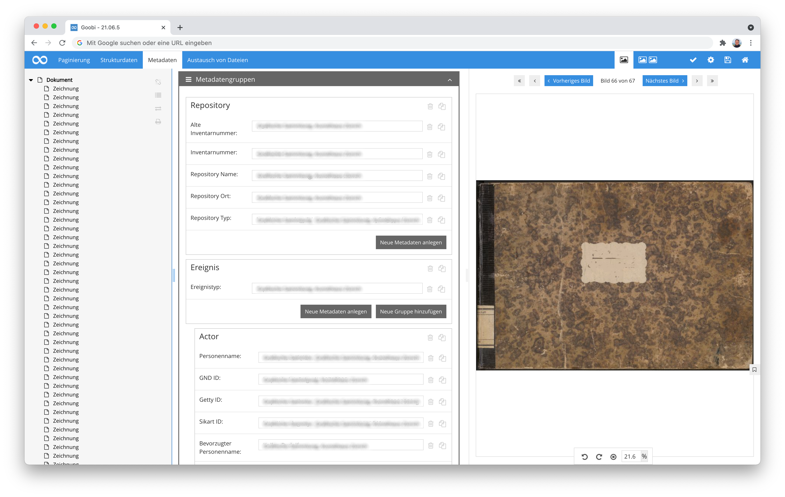
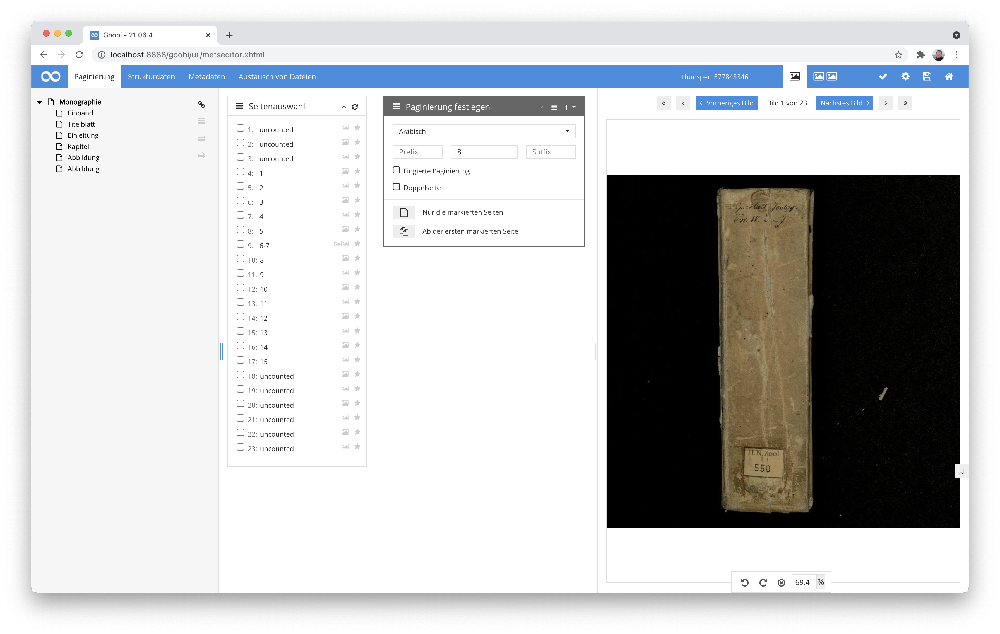
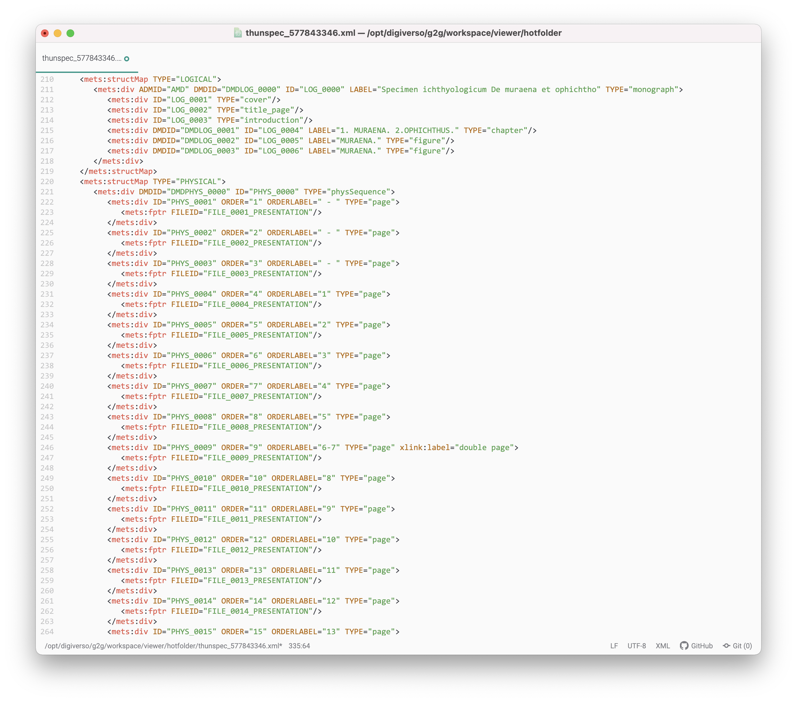
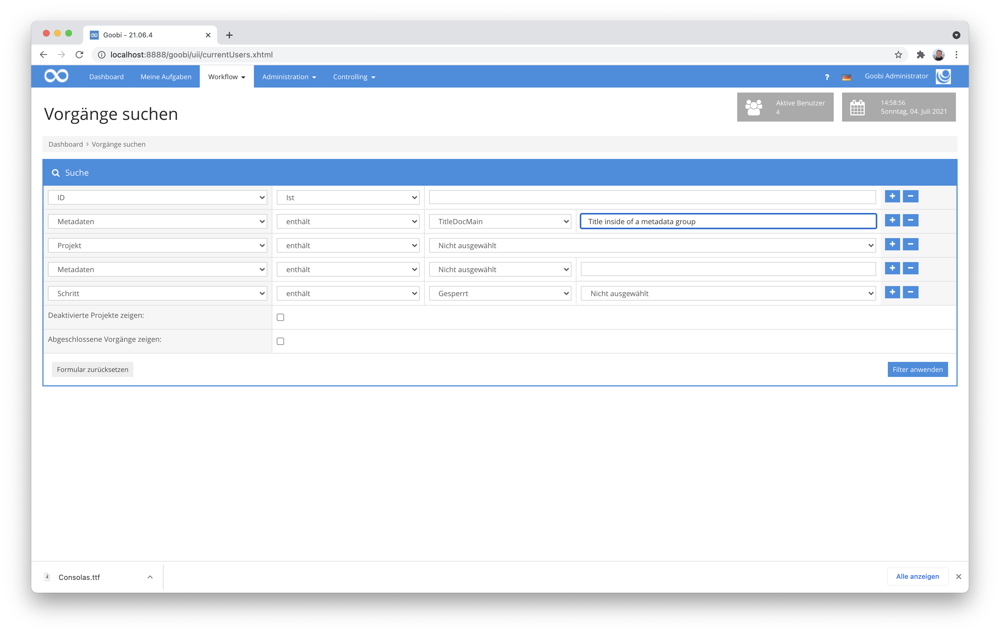
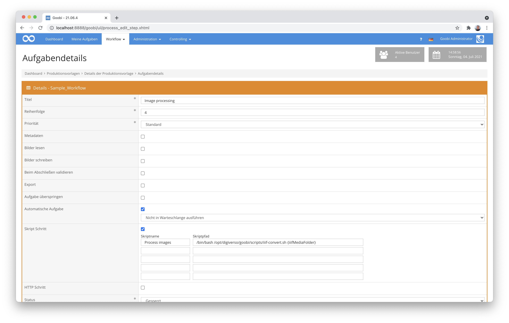
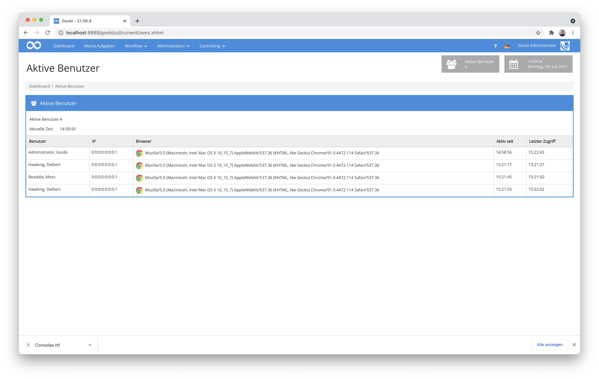
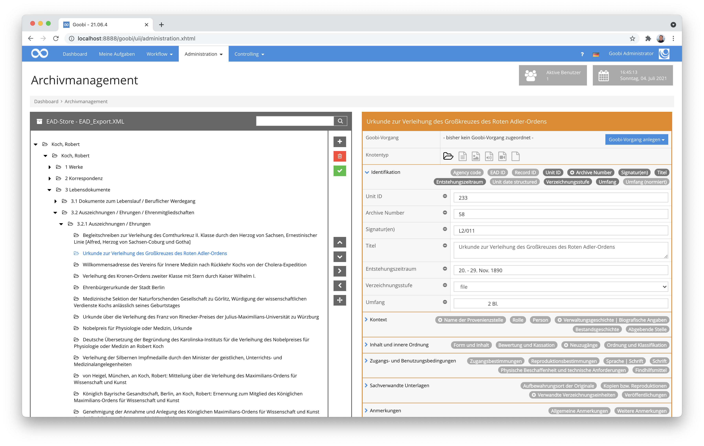
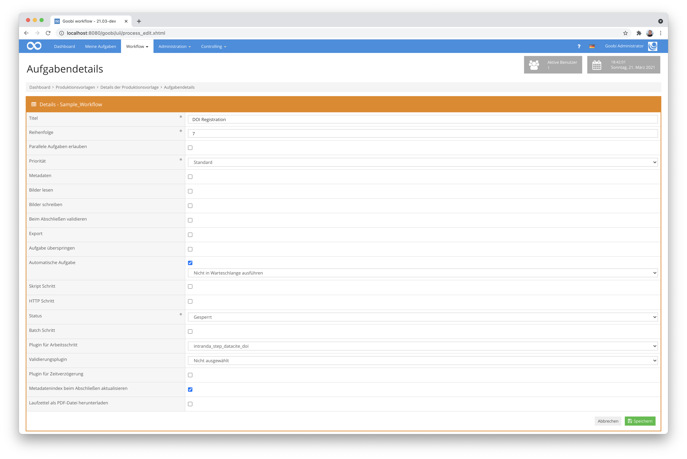

# April 2021

## Coming soon

* Implementierung eines ALTO-Editors zur Bearbeitung von Volltexten
* Erweiterungen des Dashboards
* Anpassungen am Caching

## Großumbau bei den Metadatengruppen

Der Metadateneditor erlaubt nun, Metadatengruppen innerhalb von anderen Metadatengruppen anzulegen. Dies ist insbesondere für museale Inhalte von Interesse, um beispielsweise Daten aus dem Format LIDO korrekt abbilden zu können. Zur Umsetzung dieser Funktionalität wurde die Metadatenbibliothek ugh massiv erweitert und auch der Metadateneditor in Goobi hat einige Zeilen neuen Code bekommen. Außer den Gruppen innerhalb von Gruppen werden nun wiederholbare Felder, Pflichtfelder, Duplizieren oder Löschen von einzelnen Feldern oder Untergruppen sowie die Auswertung der `DefaultDisplay="true"`-Direktive innerhalb von Gruppen unterstützt.



[https://github.com/intranda/goobi-workflow/commit/a357beb2d4d1c4f9dc47d40d1649fe03ec3259d3](https://github.com/intranda/goobi-workflow/commit/a357beb2d4d1c4f9dc47d40d1649fe03ec3259d3)

## Weitere Accessibility-Anpassungen

Das Großthema Accessibility begleitet uns leider noch immer. Aber wenn es gut werden soll, dann muss man hier halt auch einmal Durchhaltevermögen aufbringen. Also haben wir auch in diesem Monat wieder viele kleine unscheinbare aber sinnvolle Anpassungen vorgenommen. In erster Linie ging es hierbei noch einmal darum auch weitere bisherige Links auf Buttons umzustellen.

Hier gibt es übrigens mal einige spannende Links zu der Thematik Button vs. Links:

[https://a11y-101.com/design/button-vs-link](https://a11y-101.com/design/button-vs-link)\
[https://naga.co.za/2020/03/13/links-vs-buttons/](https://naga.co.za/2020/03/13/links-vs-buttons/)\
[https://www.w3.org/WAI/fundamentals/accessibility-intro/](https://www.w3.org/WAI/fundamentals/accessibility-intro/)


[https://github.com/intranda/goobi-workflow/commit/d7242e22d03db5339fd74fcc1a3345ad8e9cd26d](https://github.com/intranda/goobi-workflow/commit/d7242e22d03db5339fd74fcc1a3345ad8e9cd26d)\
[https://github.com/intranda/goobi-workflow/commit/656955f364f78b3a992641688551bf9a20b07688](https://github.com/intranda/goobi-workflow/commit/656955f364f78b3a992641688551bf9a20b07688)\
[https://github.com/intranda/goobi-workflow/commit/d6c3ccd093a1a21cf5e1d97bd86f0f4560f5b0a8](https://github.com/intranda/goobi-workflow/commit/d6c3ccd093a1a21cf5e1d97bd86f0f4560f5b0a8)\
[https://github.com/intranda/goobi-workflow/commit/9c2530fd47a25d847237e9ea48f0fd6bfaf47228](https://github.com/intranda/goobi-workflow/commit/9c2530fd47a25d847237e9ea48f0fd6bfaf47228)\
[https://github.com/intranda/goobi-workflow/commit/1531b91f61b5e5c18c32108b2f76be456717c72d](https://github.com/intranda/goobi-workflow/commit/1531b91f61b5e5c18c32108b2f76be456717c72d)

## Neuer Paginierungstyp für Doppelseiten

Für ein Schweizer Projekt war es notwendig, dass Goobi workflow und Goobi viewer besser mit Digitalisaten umgehen, die bereits als Doppelseite vorliegen. Die besondere Schwierigkeit lag dabei darin, dass solche Doppelseiten nur vereinzelt innerhalb von digitalisierten Werken vorhanden sein sollten, die Blätterlogik innerhalb des viewers dann davon allerdings nicht betroffen ist und eine Doppelseitenanzeige für Einzelseiten ebenso nahtlos erlaubt wie auch eine korrekte Anzeige der einzelnen Doppelseite.



Im Metadateneditor von Goobi workflow besteht nun die Möglichkeit, dass Doppelseiten als solche gekennzeichnet werden. Die betrifft einerseits die Markierung der Seite, um diese innerhalb der METS-Dateien korrekt zu klassifizieren. Andererseits wurden hierbei auch die Paginierungsmöglichkeiten erweitert, so dass nun Möglichkeiten für eine Doppelseitenzählung bestehen.



Im Endergebnis einer solchen generierten METS-Datei sind die so erfassten Informationen korrekt ausgezeichnet und lassen sich dort nachvollziehen. Der Goobi viewer kann damit dann entsprechend umgehen und die Bildanzeige hierfür korrekt erlauben.

[https://github.com/intranda/goobi-workflow/commit/18f445d1ae737488fac4dac66230c630e284326e](https://github.com/intranda/goobi-workflow/commit/18f445d1ae737488fac4dac66230c630e284326e)

## Erweiterung der Suchmöglichkeiten für Metadatengruppen

Nachdem wir in letzter Zeit einiges an der Bearbeitung von Metadatengruppen neu implementiert haben, ist uns aufgefallen, dass die bisherige Suche nach Metadatengruppen noch nicht im gewünschten Umfang möglich war. Daher haben wir die Indexierung der Metadaten nun um diejenigen der Metadatengruppen erweitert.



Veranschaulicht am konkreten Beispiel läßt sich dies ganz gut aufzeigen. Eine Metadatengruppe wird im Regelsatz beispielsweise so konfiguriert:

```markup
<Group>
      <Name>Title</Name>
      <language name="de">Titel</language>
      <language name="en">Title</language>
      <metadata num="1o">NonSort</metadata>
      <metadata num="1m">SortingTitle</metadata>
      <metadata num="*">Subtitle</metadata>      
</Group>
```

Diese könnte dann innerhalb eines konkreten Vorgangs mit solchen Informationen gefüllt werden:

| Metadatum      | Wert                |
| -------------- | ------------------- |
| `NonSort`      | The                 |
| `SortingTitle` | Art of War          |
| `Subtitle`     | The Ancient Classic |

Für die Suche nach einem dieser Felder kann nun eine Suchanfrage wie diese verwendet werden:

```
"meta:SortingTitle:Art of War"
```

## IIIF URLs für Skripte und an weiteren Stellen

Über die zunehmende Verbreitung von IIIF haben Sie sicher auch schon einmal gehört. Wir verwenden dies vor allem im Kontext des Goobi viewers auch bereits sehr viel. Kürzlich ergab sich jedoch, dass wir hiervon auch im Kontext von Goobi workflow noch mehr profitieren können. Daher haben wir den sogenannten VariablenReplacer dahingehend erweitert, dass er neben gängigen Variablen wie der Vorgangs-ID, Metadaten aus der METS-Datei und Verzeichnispfaden nun auch die zugehörigen Bilddateien eines Vorgangs als IIIF Image URLs erzeugen kann. Dies ist dann praktisch, wenn eine externe Applikation oder ein Skript beispielsweise Zugriff auf alle Bilddateien eines Vorgangs haben soll, um auf deren Basis eine Verarbeitung durchzuführen.

Verwendet wird dies ebenso wie andere Variablen auch z.B. im Aufruf von Skripten:



Zur Verfügung stehen die folgenden beiden Variablen:

| Variable           | Erläuterung                                                                           |
| ------------------ | ------------------------------------------------------------------------------------- |
| `iiifMediaFolder`  | Auflistung von IIIF-URLs zu allen Bildern aus dem `media`-Verzeichnis eines Vorgangs  |
| `iiifMasterFolder` | Auflistung von IIIF-URLs zu allen Bildern aus dem `master`-Verzeichnis eines Vorgangs |

Die Rückgabe einer solchen Variable sieht beispielsweise wie folgt aus:

```
"http://example.com/goobi/api/process/image/12345/schudiss_618299084_master/00000001.tif/full/max/0/default.jpg?jwt=1234567890", "http://example.com/goobi/api/process/image/12345/schudiss_618299084_master/00000002.tif/full/max/0/default.jpg?jwt=0987654321","http://example.com/goobi/api/process/image/12345/schudiss_618299084_master/00000003.tif/full/max/0/default.jpg?jwt=0987654321","http://example.com/goobi/api/process/image/12345/schudiss_618299084_master/00000004.tif/full/max/0/default.jpg?jwt=0987654321","http://example.com/goobi/api/process/image/12345/schudiss_618299084_master/00000005.tif/full/max/0/default.jpg?jwt=0987654321", ...
```

Mehr Informationen über die Verwendung des VariablenReplacers finden sich im Handbuch von Goobi unter folgender Adresse:


https://docs.goobi.io/goobi-workflow-de/manager/8


[https://github.com/intranda/goobi-workflow/commit/6f60ac60ebf9147f420098b59fc42e3da0b96bae](https://github.com/intranda/goobi-workflow/commit/6f60ac60ebf9147f420098b59fc42e3da0b96bae)\
[https://github.com/intranda/goobi-workflow/commit/dd70cadea20ca37d9dbdb5f3414b1f759b1a53a8](https://github.com/intranda/goobi-workflow/commit/dd70cadea20ca37d9dbdb5f3414b1f759b1a53a8)\
[https://github.com/intranda/goobi-workflow/commit/b5ca950168a7388f5a39e62ab1072804f8e7f940](https://github.com/intranda/goobi-workflow/commit/b5ca950168a7388f5a39e62ab1072804f8e7f940)

## Überarbeitung der Anzeige der aktiven Nutzer

Bei der Anzeige der aktiven Nutzer innerhalb der Goobi workflow Nutzeroberfläche wurden gelegentlich Nutzer aufgeführt, deren Session bereits abgelaufen waren oder die aus anderen Gründen noch angezeigt wurden. Dies war insbesondere dann störend, wenn wir die Systeme warten wollten und auf die vermeintlich aktiven Nutzer Rücksicht nehmen wollten. Bei genauer Analyse fanden wir hier ein Fehlverhalten von Goobi, was wir letztlich auch beheben konnten. Damit gehören die Geisternutzer nun der Vergangenheit an.



[https://github.com/intranda/goobi-workflow/commit/2e12a163f4e2c08b504e2702ac0b69b6cf612d95](https://github.com/intranda/goobi-workflow/commit/2e12a163f4e2c08b504e2702ac0b69b6cf612d95)\
[https://github.com/intranda/goobi-workflow/commit/4a0045ba1003a6567e1669bf1cb30cc0fe6dc2fd](https://github.com/intranda/goobi-workflow/commit/4a0045ba1003a6567e1669bf1cb30cc0fe6dc2fd)\
[https://github.com/intranda/goobi-workflow/commit/b747d0e1507cdb0df52ddc8e08c233c231637004](https://github.com/intranda/goobi-workflow/commit/b747d0e1507cdb0df52ddc8e08c233c231637004)

## Massenimport von Daten mit Anreicherung von Archiv-Tektonik

Für eine Einrichtung in Luxemburg wurde benötigt, dass wir einen großen Datenbestand an Akten automatisiert nach Goobi importieren und dabei zugleich auch den bereits vorhanden Bestand, der in einer EAD-Datei vorlag anreichern sollten.



Das Plugin, das wir hierzu entwickelt haben ist noch sehr auf den konkreten Anwendungsfall von der Einrichtung zugeschnitten und so noch nicht direkt für andere Anwendungsfall ohne Anpassungen einsetzbar. Falls aber Interesse an solchen Importen besteht, können wir diese Plugin weiterentwickeln und generische gestalten. In den nächsten Wochen werden wir dieses Plugin zusammen auch mit vielen anderen Plugins noch veröffentlichen und dokumentieren. Bis dahin gebt uns bitte einfach bescheid, wenn schon vorher ein Interesse an dem Plugin besteht.

## Neues Plugin für DOI Registrierung

Nachdem wir bereits vor kurzem ein Plugin entwickelt haben, dass eine Handle-Registrierung bei dem EPIC-Service der GWDG ermöglicht, haben wir nun zusätzlich noch ein weiteres ähnliches Plugin erstellt. Hierbei handelt es sich nun um die Möglichkeit, Werke bei Datacite zu registrieren, um hierfür DOIs zu erhalten. Dabei ist zu beachten, dass DOIs stets für Veröffentlichungen vergeben werden, nicht für Strukturelemente oder gar Seiten. Mit den Erweiterungen, die sich allerdings am Goobi viewer ergeben in nächster Zeit lassen sich dort auf Basis der sog. Web-Fragments auch granulare URLs beispielsweise für Seiten auf der Grundlage von DOIs ermöglichen.



Der Quellcode des Plugins wurde hier auf GitHub veröffentlicht:


https://github.com/intranda/goobi-plugin-step-datacite-doi


Die ausführliche Dokumentation zu Installation, Konfiguration und Betrieb findet sich unter der folgenden Adresse:


https://docs.goobi.io/goobi-workflow-plugins-de/step/intranda_step_datacite_doi


## Verschiedene interne Anpassungen

Intern gab es in diesem Monat einige größere Arbeiten, die optisch weniger in Erscheinung treten und für die meisten Nutzer weniger wichtig erscheinen mögen. Inhaltlich sind solche Arbeiten allerdings auch immer wieder mal nötig, um mit einer etablierten Software up-to-date zu bleiben und sich an technologische Entwicklungen anzupassen, um auch in Zukunft kompatibel zu sein. In diesem Monat haben daher einige der etablierten Programmbibliotheken für die Verarbeitung von XML-Dateien aktualisiert und durchgetestet. Dies betrifft vor allem Bibliotheken wie saxon, poi, xerces, xmlbeans und jaxb. Im besten Falle resultiert das darin, dass der Nutzer keine Änderung bemerkt und alles wie gewohnt weiter funktioniert.

Eine weitere interve Änderung, die wir vorgenommen haben betrifft übrigens auch die Verwendung sogenannter Session Storage Variablen. Dort hatten sowohl Goobi workflow als auch der Goobi viewer versehentlich einen gleichen Namen gewählt. Dies resultierte darin, dass der Scrollstatus applikationsübergreifend gleich war und einige Nutzer darüber erstaunt waren, dass im Metadateneditor unerwartetet und wie von Geisterhand gescrollt wurde, weil sie zuvor im Goobi viewer gescrollt hatten. Dieses ungewöhnliche Fehlerbild haben wir mit dem Update behoben.

[https://github.com/intranda/goobi-workflow/commit/ba50c49627f3954589160eb15441afcf16f3f6e8](https://github.com/intranda/goobi-workflow/commit/ba50c49627f3954589160eb15441afcf16f3f6e8)\
[https://github.com/intranda/goobi-workflow/commit/c48e1a8b3022074c65fa3868289196a8f24806f6](https://github.com/intranda/goobi-workflow/commit/c48e1a8b3022074c65fa3868289196a8f24806f6)\
[https://github.com/intranda/goobi-workflow/commit/8cae3268d8ad90b9a0452b183f2746045c966600](https://github.com/intranda/goobi-workflow/commit/8cae3268d8ad90b9a0452b183f2746045c966600)