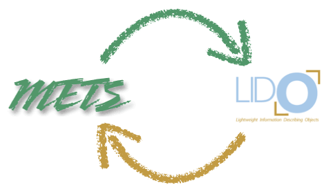
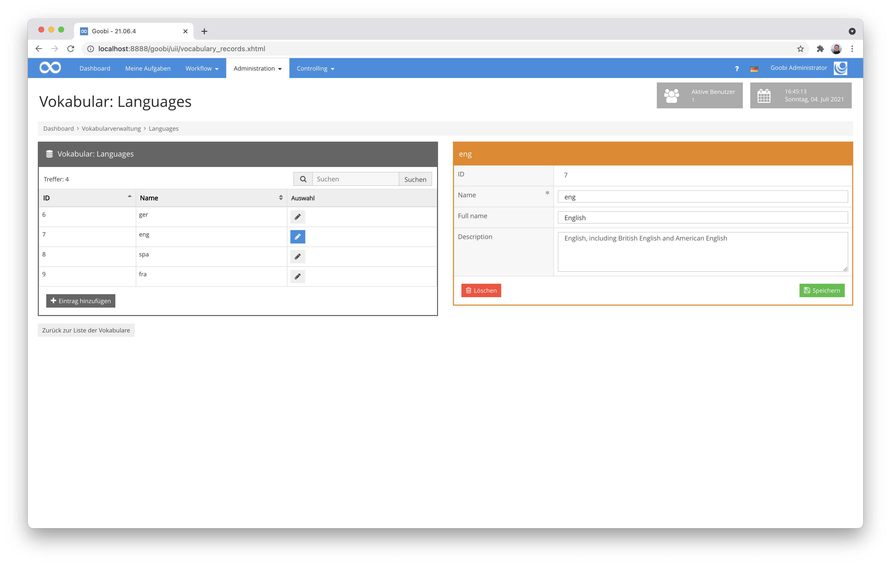
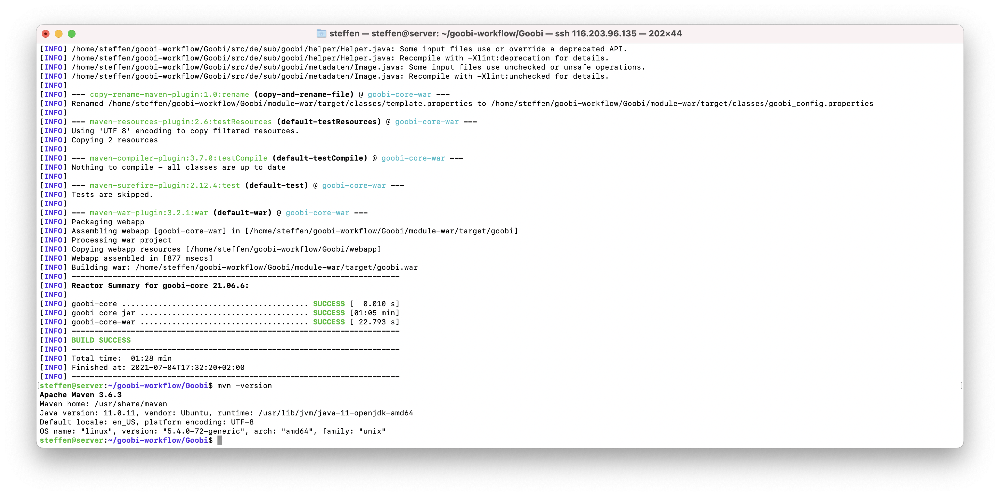
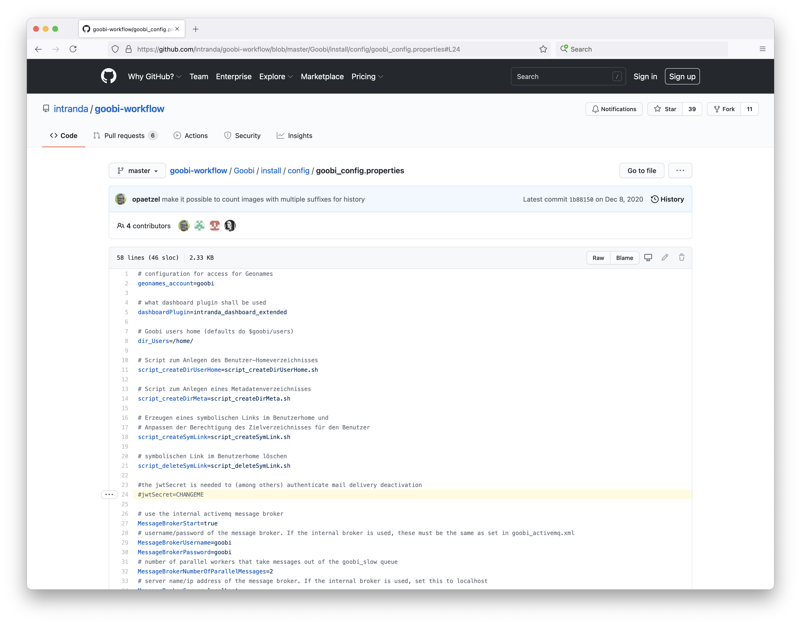
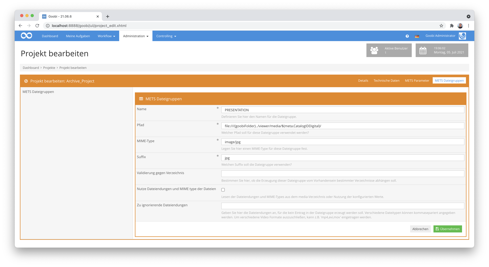
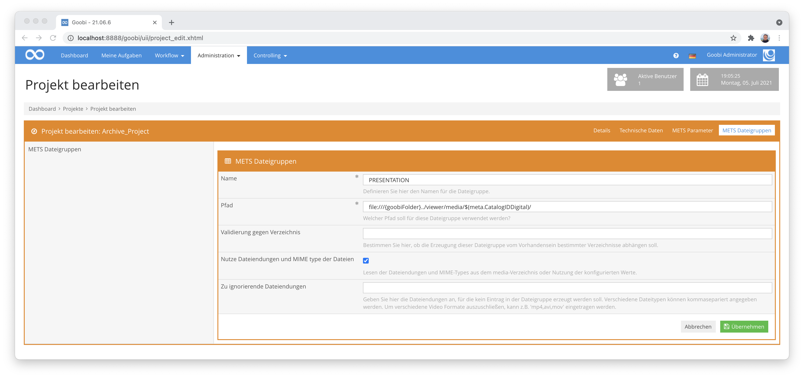
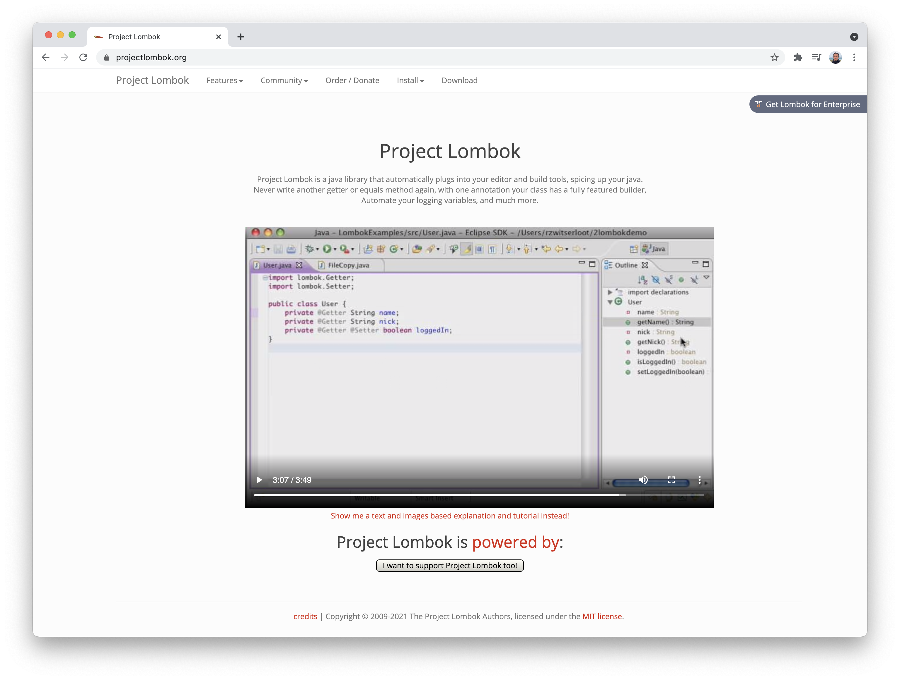

# Juni 2021

## Coming soon

* Auslagerung einiger Statistiken zu Plugins mit Auffrischung der Nutzeroberfläche
* Implementierung einer neuen Such-Syntax
* Überarbeitung der internen Ordnerstruktur zur Einhaltung der Maven-Konvention
* Ausbau der Plugin-Dokumentationen

## Konvertierung von Lido zu METS/MODS und METS/MODS zu Lido nun möglich

Goobi unterstützt nun die Konvertierung des Metadatenformats LIDO zu METS. So ist es von nun an zum Beispiel möglich, eine LIDO Datei zu importieren und intern wieder als METS-Datei zu speichern. Genauso lässt sich eine vorliegende METS-Datei auch wieder als LIDO-Datensatz exportieren.



[https://gitea.intranda.com/intranda/ugh-extension/commit/e9ce2e551e644f9e20ab6caf69c08f60ec37b48d](https://gitea.intranda.com/intranda/ugh-extension/commit/e9ce2e551e644f9e20ab6caf69c08f60ec37b48d)\
[https://gitea.intranda.com/intranda/ugh-extension/commit/f3b6864a867c28567c8c76af89436daaa6fc65f4](https://gitea.intranda.com/intranda/ugh-extension/commit/f3b6864a867c28567c8c76af89436daaa6fc65f4)

## Weitere Orte für Bilderreferenzierungen in LIDO-Dateien

Bisher wurden Bilder in LIDO als `<linkResource>` innerhalb des Elements `<resourceRepresentation>` erwartet:

```markup
<lido:administrativeMetadata>
<lido:resourceWrap>
<lido:resourceSet>
    <lido:resourceRepresentation lido:type="local">
    <lido:linkResource>00000001.jpg</lido:linkResource>
    </lido:resourceRepresentation>
</lido:resourceSet>
</lido:resourceWrap>
</lido:administrativeMetadata>
```

Mit den Entwicklungen in diesem Monat ist es nun möglich geworden, dass Bilder stattdessen auch als `<resourceID>` angegeben werden können. Dies ist insbesondere für die Datenübernahme aus der Applikation MuseumPlus hilfreich:

```markup
<lido:administrativeMetadata>
<lido:resourceWrap>
<lido:resourceSet>
    <lido:resourceID>00000001.tif</lido:resourceID>
</lido:resourceSet>
</lido:resourceWrap>
</lido:administrativeMetadata>
```

Zu beachten ist: Wenn ein Bild zu einem Unterelement gehört, so muss die Angabe innerhalb des `<lido>` Elements erfolgen, das dieses Unterelement beschreibt.

[https://gitea.intranda.com/intranda/ugh-extension/commit/183ef6f4b93a8b0becd0627df8094babce1a32ef](https://gitea.intranda.com/intranda/ugh-extension/commit/183ef6f4b93a8b0becd0627df8094babce1a32ef)

## Anpassungen an der Nutzbarkeit von IIIF-URLs in Skriptaufrufen

Vor kurzem hatten wir den sogenannten Variablen-Replacer dahingehend erweitert, dass dieser nun auch IIIF-URL für die zugehörigen Bilder eines Vorgangs in Skriptaufrufen erlaubt. Hier mussten wir noch einmal etwas nachkorrigieren, damit das Encoding der URLs für die jeweiligen Anwendungsfälle passt.

[https://github.com/intranda/goobi-workflow/commit/b887afbc47b8871588e0c1f2d7275981e1141eab](https://github.com/intranda/goobi-workflow/commit/b887afbc47b8871588e0c1f2d7275981e1141eab)\
[https://github.com/intranda/goobi-workflow/commit/1715a8603f476141b1c13d58385f51bc8641dff8](https://github.com/intranda/goobi-workflow/commit/1715a8603f476141b1c13d58385f51bc8641dff8)

## Aufbau eines Authority Servers für Vokabulare

Die Vokabularverwaltung in Goobi workflow ermöglicht es, in der Nutzeroberfläche kontrollierte Vokabulare zu verwalten und diese im Metadateneditor als Auswahlmöglichkeiten für Metadatenfelder zu nutzen. Besonders praktisch ist hierbei, dass die Beschreibung für eine bestimmte Entität geändert werden kann und dadurch, dass in der METS-Datei nur auf einen Vokabular-Eintrag verlinkt wird, der Eintrag automatisch auch in allen Vorgängen aktualisiert wird. Aufgrund dieser Vorzüge wird die Vokabularverwaltung in immer mehr Projekten verwendet.



Ein Problem bei der Verwendung der Vokabulare kann entstehen, wenn nach dem Export der Daten auch der Goobi viewer auf die gleichen Vokabulare zugreifen soll, da die Goobi workflow Installation häufig von außerhalb des Einrichtungsnetzes nicht erreichbar, da sie sich hinter eine Firewall befindet. Aus diesem Grund haben wir einen neuen Vokabularserver entwickelt, auf den Goobi workflow alle Änderungen an den in diesem Sinne konfigurierten Vokabularen spiegelt. In die Metadaten der METS-Datei wird in einem solchen Fall die URL der Datensätze im öffentlich zugänglichen Vokabularserver eingetragen, der bei intranda gehostet und entsprechend weltweit erreichbar ist. So kann der Goobi viewer dann auch ohne Probleme auf die Vokabulare zugreifen und erhält so immer aktuelle Datensätze aus dem Vokabular.

Der Code zu diesem Server ist bisher noch nicht veröffentlicht und befindet sich im intranda-internen Git-Repository: [https://gitea.intranda.com/intranda/goobi-authority-server](https://gitea.intranda.com/intranda/goobi-authority-server). Dort befindet sich auch die noch interne Dokumentation im Repository: [https://gitea.intranda.com/intranda/goobi-authority-server/src/branch/master/goobi-authority-server/docs/AuthorityServer.md](https://gitea.intranda.com/intranda/goobi-authority-server/src/branch/master/goobi-authority-server/docs/AuthorityServer.md). Über den Zeitpunkt der Veröffentlichung dieses Projektes haben wir bisher noch nicht entschieden. Zuvor möchten wir den Quellcode noch einem Review unterziehen und auch die Dokumentation aufbereiten und übersetzen.

## Beautifier für MARC Datensätze

Schon seit den ersten Tagen von Goobi existiert die Möglichkeit, dass Vorgänge auf der Basis einer Katalogabfrage erzeugt werden und somit die Daten aus dem Katalog nachnutzen. Leider ist jedoch die Antwort der jeweiligen Kataloge manchmal nicht so, dass Goobi beispielsweise die Publikationstypen verlässlich aus den zu erwartenden Feldern interpretieren kann. Daher gibt es schon lange die Möglichkeit, die Katalogantwort vor deren Auswertung mit dem sogenannten Beautifier zu manipulieren. Dies ging in der Vergangenheit bereits mit PICA-Datensätzen. Neu hinzugekommen ist nun, dass diese Möglichkeiten jetzt auch für MARC-Datensätze bestehen. Eine solche Konfiguration kann beispielsweise so aussehen:

### Manipulationen am Leader

In diesem Beispiel wird der Leader an Position `19` mit einem Leerzeichen (`\u0020`) ersetzt, sofern im Leader an Position `6` der Wert `e` steht.

```markup
<beautify>
<setvalue tag="leader19" subtag="" value="\u0020">
<condition tag="leader6" subtag="" value="e" />
</setvalue>
</beautify>
```

### Schreiben von Controlfields

Dieses Beispiel zeigt, wie bei einem Datensatz einer OPAC-Anfrage das Feld `<controlfield tag="999">` mit dem Wert `KXP` erzeugt wird.

```markup
<beautify>
<setvalue tag="999" subtag="" value="KXP" />
</beautify>
```

### Ersetzen von Feldinhalten:

Diese Beispiel zeigt, wie ein Feldinhalt geändert werden kann. Hier wird das Feld `041$a` mit dem Wert `ger` ersetzt, sofern es den Wert `lat` enthält.

```markup
<beautify>
<setvalue tag="041" subtag="a" value="ger">
<condition tag="041" subtag="a" value="lat" />
</setvalue>
</beautify>
```

Unter der folgenden URL ist die Konfiguration für Kataloge und auch die Festlegung des Beautifiers dokumentiert:


https://docs.goobi.io/goobi-workflow-de/admin/7/7.2


[https://github.com/intranda/goobi-plugin-opac-marc/commit/13de8118b5aff7c3a82127d0d01a31cdf0a5edc1](https://github.com/intranda/goobi-plugin-opac-marc/commit/13de8118b5aff7c3a82127d0d01a31cdf0a5edc1)\
[https://github.com/intranda/goobi-plugin-opac-marc/commit/930386f0838e462ce5d31c1567beb00bc4b637f4](https://github.com/intranda/goobi-plugin-opac-marc/commit/930386f0838e462ce5d31c1567beb00bc4b637f4)\
[https://github.com/intranda/goobi-plugin-opac-marc/commit/54d86f5246d3cad5b4f437d22a70ef0aee39d67b](https://github.com/intranda/goobi-plugin-opac-marc/commit/54d86f5246d3cad5b4f437d22a70ef0aee39d67b)

## Weitere Accessibility-Anpassungen

Und weiter ging die wilde Fahrt auch in diesem Monat was die Accessibility-Optimierungen angeht. Man erhält schon den Eindruck, dass es sich hier um eine Lebensaufgabe handelt. Aber es fühlt sich doch immerhin schon danach an, als ob wir auf der Zielgeraden sind. Schauen wir mal, wie es im nächsten Monat aussieht. :)


[https://github.com/intranda/goobi-workflow/commit/bcc76fa67841af7a7fe2a50a1fe3398c12554d1c](https://github.com/intranda/goobi-workflow/commit/bcc76fa67841af7a7fe2a50a1fe3398c12554d1c)\
[https://github.com/intranda/goobi-workflow/commit/70f65c14ab97a2394a7d5b0d7baa98c6bc433af2](https://github.com/intranda/goobi-workflow/commit/70f65c14ab97a2394a7d5b0d7baa98c6bc433af2)\
[https://github.com/intranda/goobi-workflow/commit/b6bd4dad318910aa8d0aa98a8e8ea0d54ba469a3](https://github.com/intranda/goobi-workflow/commit/b6bd4dad318910aa8d0aa98a8e8ea0d54ba469a3)\
[https://github.com/intranda/goobi-workflow/commit/17b88937cc79b71c1914533aa85b3685c5ca01fc](https://github.com/intranda/goobi-workflow/commit/17b88937cc79b71c1914533aa85b3685c5ca01fc)\
[https://github.com/intranda/goobi-workflow/commit/5806a5e8e5e011d2ac5ac6c68da2dfa950ec4a01](https://github.com/intranda/goobi-workflow/commit/5806a5e8e5e011d2ac5ac6c68da2dfa950ec4a01)\
[https://github.com/intranda/goobi-workflow/commit/106283895a5604de04c809d2e3a7bcfa99d8fc93](https://github.com/intranda/goobi-workflow/commit/106283895a5604de04c809d2e3a7bcfa99d8fc93)

## Kompilieren mit Java 11 möglich

Das Kompilieren von Goobi workflow ist nun nicht mehr festgelegt auf die schon recht betagte Version 8 von Java. Stattdessen ist von nun an nicht mehr nur der Betrieb mit Java 11 möglich sondern auch das Kompilieren.



Für diejenigen, die Goobi gern einmal selbst kompilieren möchten, gibt es hier einmal eine Mini-Zusammenfassung, wie man dies selbst durchführen kann:

```bash
# install needed packages
sudo apt install git
sudo apt install maven

# checkout Goobi workflow from GitHub
git clone https://github.com/intranda/goobi-workflow.git

# go into the Goobi workflow project
cd goobi-workflow/Goobi/

# compile Goobi workflow
mvn package
```

[https://github.com/intranda/goobi-workflow/commit/2049aa3ff998b4be5d11a8d792d8287cd65bafa7](https://github.com/intranda/goobi-workflow/commit/2049aa3ff998b4be5d11a8d792d8287cd65bafa7)\
[https://github.com/intranda/goobi-workflow/commit/7cdde2381c9e0ce2d5bd9eb741b2f82c3f4d7fe3](https://github.com/intranda/goobi-workflow/commit/7cdde2381c9e0ce2d5bd9eb741b2f82c3f4d7fe3)\
[https://github.com/intranda/goobi-workflow/commit/0138cc4c39a6985094e0f61d1c3adce71d1990c6](https://github.com/intranda/goobi-workflow/commit/0138cc4c39a6985094e0f61d1c3adce71d1990c6)

## Automatische Generierung von JWT Secrets

JSON Web Tokens (JWTs) werden in Goobi workflow an immer mehr Stellen eingesetzt, um anderen Programmen oder auch Personen zu erlauben, bestimmte Aktionen für eine gewisse Zeit auszuführen. Bisher musste hierzu im Vorfeld ein `JWT-Secret` zwingend von Hand vorkonfiguriert werden, um diese Funktionalität nutzen zu können. Seit diesem Monat erzeugt Goobi workflow das JWT secret selbst, wenn es bisher noch nicht vorkonfiguriert wurde.



[https://github.com/intranda/goobi-workflow/commit/35b13272d0f514b156eff0627783a87c258f60be](https://github.com/intranda/goobi-workflow/commit/35b13272d0f514b156eff0627783a87c258f60be)

## JWT key Rotation

Bei der Implementierung der oben beschriebenen automatischen Generierung der JWT secrets, ist eine potentielle Sicherheitslücke aufgefallen: Die JWT keys wurden nicht rotiert, was einem Angreifer bei vielen abgefangenen Nachrichten eventuell ermöglicht hätte, das secret zu erraten. Dies wurde nun geändert und die keys werden alle 24 Stunden rotiert.

[https://github.com/intranda/goobi-workflow/commit/8441eadb77d075d24ba6c448d2ceb27a3c189589](https://github.com/intranda/goobi-workflow/commit/8441eadb77d075d24ba6c448d2ceb27a3c189589)

## Anpassungen des Standard-Exports für Benennungsänderungen

Ganz selten kommt es vor, dass Dateinamen von Bildern einzelner Vorgänge an Goobi vorbei umbenannt werden, so dass Goobi von diesen Umbenennungen bisher keine Kenntnis hatte und dies bei erneuten Exporten der METS-Dateien zu Problemen führen konnte.



Mit einer Anpassung des Standard-Exports umgehen wir diese Problematik nun. Denn im Falle der Projektkonfiguration, dass die METS-Datei dynamisch die Dateinamen abhängig vom erkannten MIME-Type (z.B. image/jpeg) erzeugt werden soll, erfolgt nun auch eine Aktualisierung der intern gespeicherten zwischenzeitlich geänderten Dateinamen innerhalb der METS-Datei. Somit werden solche potentiellen Fehlerfälle bei unabhängig von Goobi vorgenommenen Umbenennungen (z.B. angepasste Groß- und Kleinschreibung, geänderte Dateiendung) abgefangen.



[https://github.com/intranda/goobi-workflow/commit/e58838f80e6bd24fc48e649602eca004ecd1a5ec](https://github.com/intranda/goobi-workflow/commit/e58838f80e6bd24fc48e649602eca004ecd1a5ec)

## Code-Optimierungen

Wenig spektakulär für Nicht-Programmierer klingt eine aufwendige Umstellung die wir intern gerade vornehmen für weitere Code-Optimierungen. Wir verwenden hier gerade noch mehr die Programmbibliothek Lombok zur Code-Generierung von langweiligem aufgeblähtem aber leider notwenigem Quellcode, den man per Konvention innerhalb von Java-Applikationen haben muss.

Für diejenigen Leser, die selbst Java programmieren: Lombok ist definitiv einen Blick wert und übernimmt die automatische Generierung von Gettern, Settern, Konstruktoren und noch einiges mehr.



[https://github.com/intranda/goobi-workflow/commit/17a0d32698c2c941cc7ec47317b08e0904dac756](https://github.com/intranda/goobi-workflow/commit/17a0d32698c2c941cc7ec47317b08e0904dac756)\
[https://github.com/intranda/goobi-workflow/commit/ef797453faf8c83a5bb6cd5096d04106cbebae18](https://github.com/intranda/goobi-workflow/commit/ef797453faf8c83a5bb6cd5096d04106cbebae18)\
[https://github.com/intranda/goobi-workflow/commit/a3ee13e8559eceb29f059557fdf80bb093bf73fd](https://github.com/intranda/goobi-workflow/commit/a3ee13e8559eceb29f059557fdf80bb093bf73fd)\
[https://github.com/intranda/goobi-workflow/commit/5eb5eecb3dfe7e4bc103cd061b64d2b13dc17384](https://github.com/intranda/goobi-workflow/commit/5eb5eecb3dfe7e4bc103cd061b64d2b13dc17384)\
[https://github.com/intranda/goobi-workflow/commit/afd5b82169ed063da7586ed9c329c5465785336f](https://github.com/intranda/goobi-workflow/commit/afd5b82169ed063da7586ed9c329c5465785336f)\
[https://github.com/intranda/goobi-workflow/commit/93b8d5cc45897e949322b79a8e3a7634bc1396c2](https://github.com/intranda/goobi-workflow/commit/93b8d5cc45897e949322b79a8e3a7634bc1396c2)\
[https://github.com/intranda/goobi-workflow/commit/16e903327281e247d6e3da84c4bf6224d89175f3](https://github.com/intranda/goobi-workflow/commit/16e903327281e247d6e3da84c4bf6224d89175f3)\
[https://github.com/intranda/goobi-workflow/commit/665f4bd3e2d9b94d479f0fbdb89a0bea3f66d264](https://github.com/intranda/goobi-workflow/commit/665f4bd3e2d9b94d479f0fbdb89a0bea3f66d264)

## Duplizieren von Metadatengruppen erweitert

Die Metadatengruppen haben wir kürzlich bereich massiv erweitert. Für ein Projekt in Kroatien benötigten wir hier noch etwas Nacharbeit: Es war notwendig, dass Metdatengruppen auch dupliziert werden können, so dass diese nun korrekt alle zugehören Metadaten, Personen sowie Untergruppen mit duplizieren. Das spart einige unnötige manuelle Bearbeitungen.


[https://github.com/intranda/goobi-workflow/commit/4ae3035f0e6e1582d68235fd71a22fde8079b0b9](https://github.com/intranda/goobi-workflow/commit/4ae3035f0e6e1582d68235fd71a22fde8079b0b9)