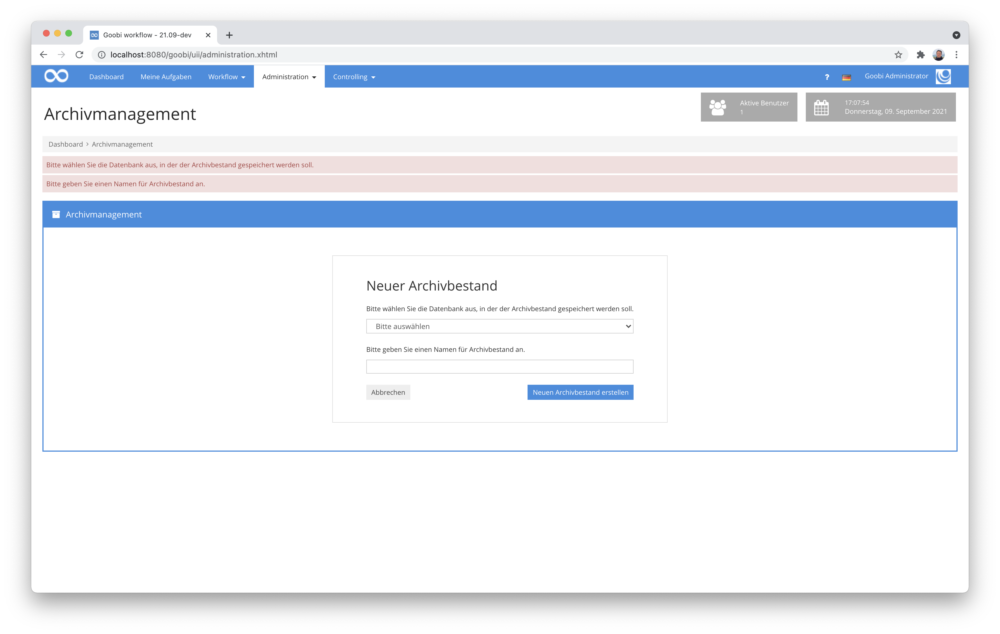

# August 2021

## Coming soon

* Entwicklung eines neuen Erfassungsplugins für die Integration mit Atlas AEON
* Entwicklunge eines neuen Plugins für die Bearbeitung von Konfigrationsdateien aus der Nutzeroberfläche
* Entwicklung eines neuen Plugins zur Bearbeitung von Regelsätzen aus der Nutzeroberfläche
* Entwicklung eines Plugins für die gleichzeitige Bearbeitung von Metadaten aus mehreren Vorgängen

## Keine neuen Vorgänge für deaktivierte Projekte

Bisher war es möglich, dass auch innerhalb der Produktionsvorlagen weiterhin Vorgänge angelegt werden können innerhalb von Projekten, die eigentlich als deaktiviert markiert sind. Hier gab es nun eine Umstellung, die die Bedienung vereinfachen und intuitiver machen soll.


Die Buttons zum Anlegen einzelner Vorgänge und auch diejenigen für den Massenimport werden für deaktivierte Projekte jetzt rot dargestellt und zeigen bei Verwendung eine erklärende Warnmeldung an. Darüberhinaus wird auch der Projektname ausgegraut dargestellt, um auf die Deaktivierung des Projektes hinzuweisen. Innerhalb der Dropdown-Felder, die sich mittels Klick auf das Pfeil-Icon des Buttons öffnen, werden deaktivierte Projekte nun nicht mehr aufgelistet.


## Ausblenden von nicht benötigen Buttons

Innerhalb der Konfiguration von Benutzern können unter anderem die erforderlichen Benutzergruppen und Projekte zugewiesen werden, die zu einem Nutzer gehören sollen. An dieser Stelle haben wir eine kleine Optimierung vorgenommen, die die Bedienung logischer macht.


In beiden Bereichen wird der Button zum Hinzufügen von Projekten und Benutzergruppen nun nur noch dann angezeigt, wenn noch weitere Projekte und Benutzergruppen zur Verfügung stehen, die noch nicht bereits zugewiesen wurden. Der Button wird entsprechend also nur noch angezeigt, wenn er auch wirklich eine Änderung ermöglicht. Das dürfte die Bedienung etwas intuitiver machen.


## Verbesserungen an der Nutzeroberfläche für das Archiv-Management

Um die Verwendung des Archiv-Management-Plugins noch einmal zu verbessern, haben wir einige zusätzliche interne Prüfroutinen implementiert und geben mehr informative Meldungen innerhalb der Nutzeroberfläche aus als bisher.


Ist beispielsweise die Verbindung zur Datenbank nicht vorhanden oder es fehlen erwartete Angaben z.B. für die Auswahl des zu bearbeitenden Bestandes, so werden nun hilfreiche Fehlermeldungen für den Bearbeiter angezeigt.



## Anpassungen am Menü

Im Zuge verschiedener interner Menü-Umbauten haben wir auch das vorher noch in einer eigenen Datei gepflegte mobile Menü (für Smartphones und andere schmale Geräte) in eine Datei zusammengefasst. Als Anwender merkt man davon hoffentlich nichts. Für uns als Entwickler hingegen ist diese Herangehensweise nun wesentlich einfacher, da neu hinzuzufügende Menüeinträge somit nur noch an einer zentralen Stelle berücksichtigt werden müssen.

Bei der Gelegenheit haben wir auch einige minimale optische Anpassungen vorgenommen und die farbliche Hervorhebung von aktiven Seiten angepasst. Hier gab es eine zwischenzeitlich farbliche Inkonsistenzen zwischen einigen blauen und einigen grauen hervorgehobenen Menüeinträgen. Nun werden wieder alle aktiven Menüeinträge in grau dargestellt.


## Neues Plugin zum Prüfen der Regelsatzkonformität

Wir haben ein neues Plugin entwickelt, von dem wir alle nicht wussten, dass wir es eigentlich schon seit langem brauchen. Der Bedarf fiel deswegen auf, weil insbesondere große Massenexporte von Daten gelegentlich in Fehlern resultierten, die sich durch zwischenzeitliche Anpassungen an Regelsätzen ergeben. Solche Situationen können sich beispielsweise ergeben, weil Metadaten zu einem späteren Zeitpunkt anders definiert werden. Wenn beispielsweise Metadaten nicht mehr vorkommen dürfen, in der Vergangenheit aber erlaubt waren, lassen sich die METS-Dateien nicht korrekt öffnen. Ältere Goobi-Vorgänge wurden entsprechend in der Vergangenheit erfolgreich und valide exportiert, verstoßen mit einem aktualisierten Regelsatz aber nun ggf. gegen dessen neue Regeln.


Dieses neue Plugin macht es einfacher, solche Vorgänge zu ermitteln. Es kann einfach für eine gefilterte Liste an Vorgängen ausgeführt werden und prüft dabei die erfolgreiche Lesbarkeit der vorliegenden METS-Dateien. Im Falle von Fehlern werden diese in einer Tabelle aufgelistet und es besteht die Möglichkeit, direkt den METS-Editor für den entsprechenden Vorgang zu betreten.

Der Quellcode des Plugins wurde hier auf GitHub veröffentlicht:


https://github.com/intranda/goobi-plugin-administration-ruleset-compatibility


Die ausführliche Dokumentation zu Installation, Konfiguration und Betrieb findet sich unter der folgenden Adresse:


https://docs.goobi.io/goobi-workflow-plugins-de/administration/intranda_administration_ruleset_compatibility


## Neues Plugin zum Zurücksetzen der Paginierung

In einem anderen Projekt hatten wir den besonderen Anwendungsfall, dass wir für sehr viele Vorgänge die Paginierung komplett zurücksetzen mussten, da die Anzahl der Dateien für hunderte Vorgänge sich änderte. In dem Kontext ist uns aufgefallen, dass es in Goobi workflow bisher keinerlei Automatismus gab, der eine solche benötigte Änderung bei vielen Vorgängen in Masse machen konnte.


Aus diesem Grund haben wir ein Plugin entwickelt, dass das Zurücksetzen der Paginierung für große Datenmengen erlaubt. Mit Hilfe eines frei wählbaren Filters läßt sich das Plugin so auch für tausende Vorgänge einsetzen.

Der Quellcode des Plugins wurde hier auf GitHub veröffentlicht:


https://github.com/intranda/goobi-plugin-administration-reset-pagination


Die ausführliche Dokumentation zu Installation, Konfiguration und Betrieb findet sich unter der folgenden Adresse:


https://docs.goobi.io/goobi-workflow-plugins-de/administration/intranda_administration_reset_pagination


## Darstellungsfehler in den Benutzereinstellungen

Wenn Benutzer innerhalb der Benutzereinstellungen viele Projekte zugewiesen hatten, so war die Anzeige der Informationen nicht optimal. Hier haben wir daher im August eine kleine optische Anpassung vorgenommen, damit auch sehr umfangreiche Listen an Projekten korrekt dargestellt werden.


Und weil diese Darstellung auch für die Benutzergruppen sinnvoll ist, haben wir diese ebenfalls mit geändert. Diese kleine Anpassung ist allerdings erst im kommenden Release des Septembers enthalten.

## Änderung an der Konfiguration

Die Speicherung der Keystore-Informationen erfolgt nun nicht mehr aus der Nutzeroberfläche von Goobi workflow heraus. Für eine bessere Nutzung von Keystores auch durch andere Programme wurde die Konfiguration umgestellt und erfolgt daher über die zentrale Konfigurationsdatei `goobi_config.properties`. Dort kann nun ein Keystore wie folgt definiert werden:

```
truststore = /path/to/file
truststore_password = password
```

Diese und auch weitere Änderungen, die für Updates bedacht werden müssen haben wir im Übrigen in der öffentlich einsehbaren Updateanleitung eingepflegt. Wer sie noch nicht kennt, findet sie hier:


https://docs.goobi.io/goobi-workflow-de/admin/9


## Datenbank-Optimierungen für größere Datenbestände

So langsam aber sicher erreichen einige Goobi-Installationen eine Datenmenge, bei der Datenbankabfragen mit unoptimierten Tabellen und Datenbankabfragen zu langsam werden. Wir haben uns aus diesem Grund einige Datenbankabfragen und Tabellen einmal genau angeschaut und Änderungen vorgenommen. Diese Anpassungen werden von uns bei der Durchführung von Goobi-Update stets mit ausgeführt. Wenn Sie hingegen das Update selbst durchführen, finden sich weitere Details zu den Änderungen wie gehabt in der Updateanleitung:


https://docs.goobi.io/goobi-workflow-de/admin/9/9.2


## Versionsbezeichnung

Die aktuelle Versionsnummer von Goobi workflow lautet mit diesem Release: **21.08**. Innerhalb von Plugin-Entwicklungen muss für Maven-Projekte innerhalb der Datei `pom.xml` entsprechend folgende Abhängigkeit eingetragen werden:

```markup
<dependency>
  <groupId>de.intranda.goobi.workflow</groupId>
  <artifactId>goobi-core-jar</artifactId>
  <version>21.08</version>
</dependency>
```