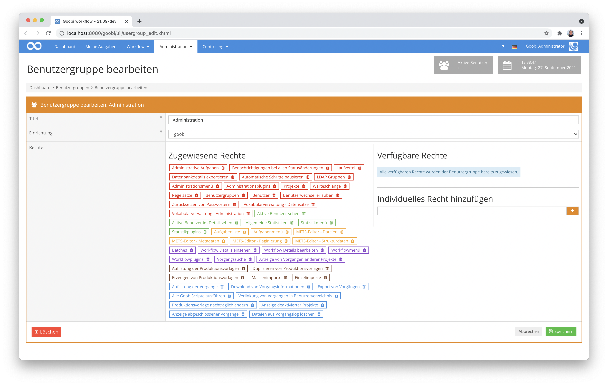

# September 2021

## Coming soon
- Neues Plugin für die Bearbeitung von Konfigurationsdateien
- Neues Plugin für die Bearbeitung von Regelsätzen
- Anpassungen der Institutionsanzeige
- AEON-Plugin

## Druckansicht für Metadaten überarbeitet
Vor ca. zwei Jahren hatten wir eine ganz neue Druckansicht für die Metadaten implementiert. Diese führte nicht nur neu ein, dass man ein Bild des Repräsentanten mit erhalten hatte. Vor allem konnte man damit nun auch die Hierarchie des Strukturbaums mit den zugehörigen Personen- und Metadaten druckbar machen. 


Was wir bei der Implementierung jedoch nicht mit bedacht hatten, war dass die Goobi-Anwender diese Funktion auch wirklich sofort intensiv benutzen werden, selbst für sehr tiefe Hierarchien. Wir hatten zunächst nur die Berücksichtigung von von zwei Hierarchiestufen implementiert. Mit der aktuellen Überarbeitung gehen wir nun jedoch bis zu acht Ebenen tief in der Auflistung auf der Druckansicht.


Neu in dem Kontext ist dabei ebenso, dass nun auch die zugehörigen Seiten mit aufgeführt werden. Zu jeden Strukturelement werden nun sowohl die Bildnummern als auch die logischen Seitenzahlen als Seitenbereich mit aufgeführt.


## Verständlichere Anzeige innerhalb von GoobiScript
Es gab wieder einmal einige kleinere Änderungen innerhalb der Ausführung von GoobiScript und der Anzeige der Ergebnisse. Ein gutes Beispiel für eine solche kleinere Änderung ist z.B. dass nun die Beschreibung, wie der Status eines GoobiScripts lautet, etwas aussagekräftiger ist. So wird z.B. für das GoobiScript zum Ändern der Projektzuhörigkeit nun eine verständliche Information angezeigt statt der zuvor recht kryptischen Information, mit der nicht einmal wir als Entwickler etwas anfangen konnten. :)


## Bessere Dokumentation für das XMP-Header Plugin
Während der Inbetriebnahme des XMP-Header Plugins auf einem Produktivsystem ist uns aufgefallen, dass die Dokumentation nicht ganz up-to-date war. Diese wurde nun noch einmal überarbeitet und in dem Zusammenhang auch gleich einige Änderungen an dem Plugin vorgenommen, die ein noch besseres Logging erlauben, für den Fall das das Plugin während der Ausführung auf Fehler stößt.

Hier findet sich die aktuelle Fassung der Dokumentation online:



## Kleinere Überarbeitungen an der Inline-Hilfe
An einigen Stellen von Goobi workflow gab es wieder mehrere kleinteilige Änderungen, um die Bedienung zu vereinfachen. Diese Änderungen sind zu viele und zu klein, als dass alle hier aufgeführt werden sollen. Als ein Beispiel soll daher hier einmal die Erweiterung der Inline-Hilfetexte dienen, die unter anderem bei der Konfiguration der Dateigruppen für die Erzeugung von METS-Dateien etwas umgeschrieben wurde.


Von solchen Änderungen gab es einige im Hintergrund. Im besten Fall fallen dem Nutzer diese kleinen Anpassungen noch nicht einmal auf.

## Verbessertes Speichern-Verhalten bei Benutzeradministration und Projektadministration
In der Benutzeradministration können nun Änderungen an den Zugehörigkeiten für Projekte und Gruppen mit dem Button `Abbrechen` rückgängig gemacht werden. Das ging bisher nicht. Eine ähnliche Anpassung haben wir bei der Gelegenheit auch bei den Projekten vorgenommen, wo die Einstellungen zu den Dateigruppen sich nun ähnlich verhält.


## Überarbeitung der Nutzeroberfläche für Benutzergruppen
Im Bereich der Benutzergruppen war die Oberfläche für die Nutzer noch nicht ideal. Dies betraf vor allem die Zuweisung von individuellen Berechtigungen, die von einzelnen Plugins mitgebracht werden können. Die Möglichkeit der Eingabe solcher individuellen Berechtigungen gab es zwar bisher schon. Sie war allerdings nicht intuitiv genug, so dass man die Eingabemöglichkeit zu einfach übersehen konnte. Diese ist mit einer Überarbeitung nun deutlich besser geworden.


Bei der Gelegenheit haben wir auch noch berücksichtigt, dass ein Nutzer noch besser erkennen können sollte, wenn keine weiteren Berechtigungen mehr zuweisbar sind. In einem solchen Fall erfolgt nun eine Anzeige eines kurzen Hilfetextes.




## Verbessertes Mapping von Metadaten bei der Nutzung von Datacite DOI 
Eine Entwicklung am DOI-Plugin ermöglicht es uns, dass jetzt auch Metadaten aus mehreren Ebenen eines Dokuments und dessen übergeordneter Einheit bei mehrbändigen Werken für die Registrierung von DOIs genutzt werden können, um sie als XML Elemente an Datacite zu übergeben, oder auch um sie als Liste von Elementen mit Attributen für die Registrierung der DOIs zu nutzen.

Hier noch einmal der Link zur Dokumentation des DOI-Plugins:


Und hier der Link zum Quellcodes des Plugins:



## Übersichtlicheres Vorgangslog in den Aufgaben
Das Vorgangslog hilft häufig, wenn es darum geht nachzuvollziehen, warum ein Vorgang in welchem Status ist, welche vorherige Kommunikation dazu bereits vorliegt und was gegebenenfalls auch einem schiefgegangen ist.


Bisher wurde das Vorgangslog innerhalb der Aufgaben nur als kleine Box angezeigt, die es bei vielen Inhalten erschwerte, die Ereignisse bequem zu lesen. Aus diesem Grund ist die Box des Vorgangslogs nun expandierbar und nimmt die ganze Breite des Browerfensters ein. Darüber hinaus zeigt sie alle Inhalte so an, dass ein Scrollen innerhalb der Box nicht mehr notwendig ist.


## Versionsbezeichnung
Die aktuelle Versionsnummer von Goobi workflow lautet mit diesem Release: **21.09**.
Innerhalb von Plugin-Entwicklungen muss für Maven-Projekte innerhalb der Datei `pom.xml` entsprechend folgende Abhängigkeit eingetragen werden:

```xml
<dependency>
  <groupId>de.intranda.goobi.workflow</groupId>
  <artifactId>goobi-core-jar</artifactId>
  <version>21.09</version>
</dependency>
```