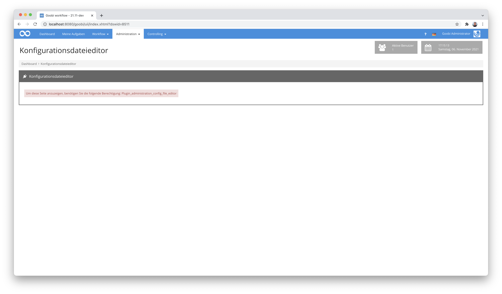
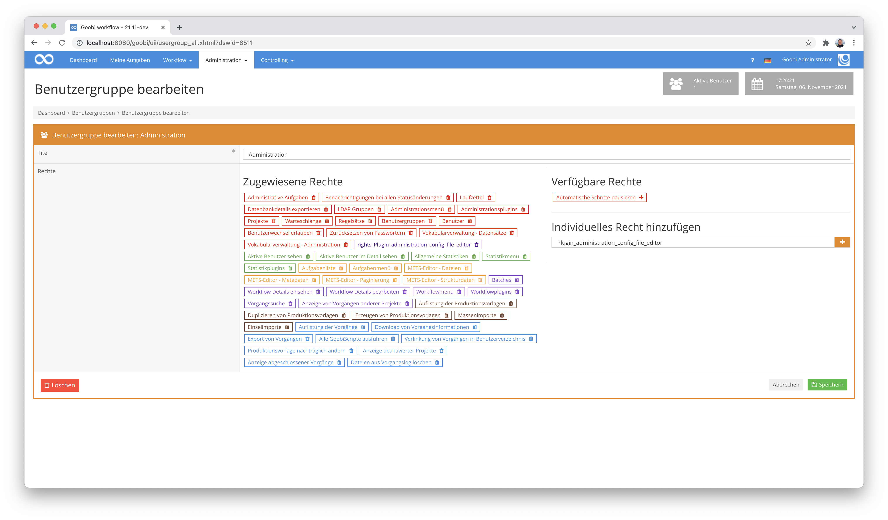
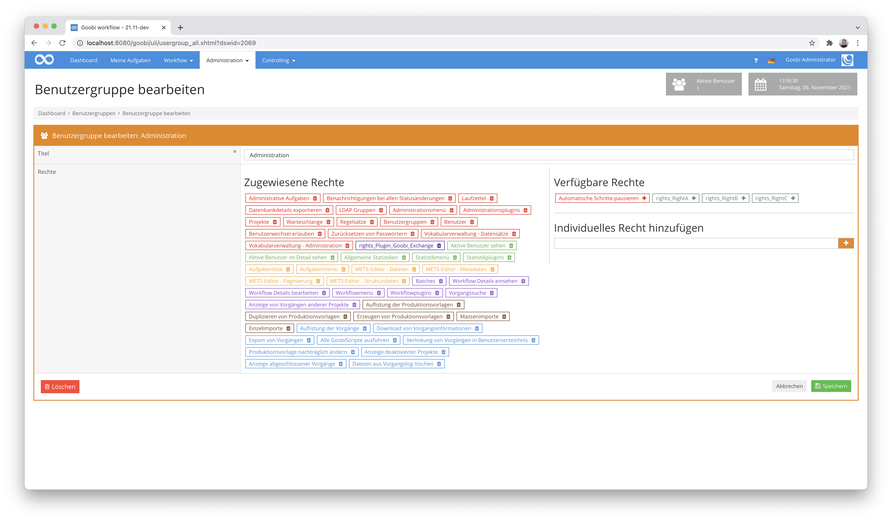
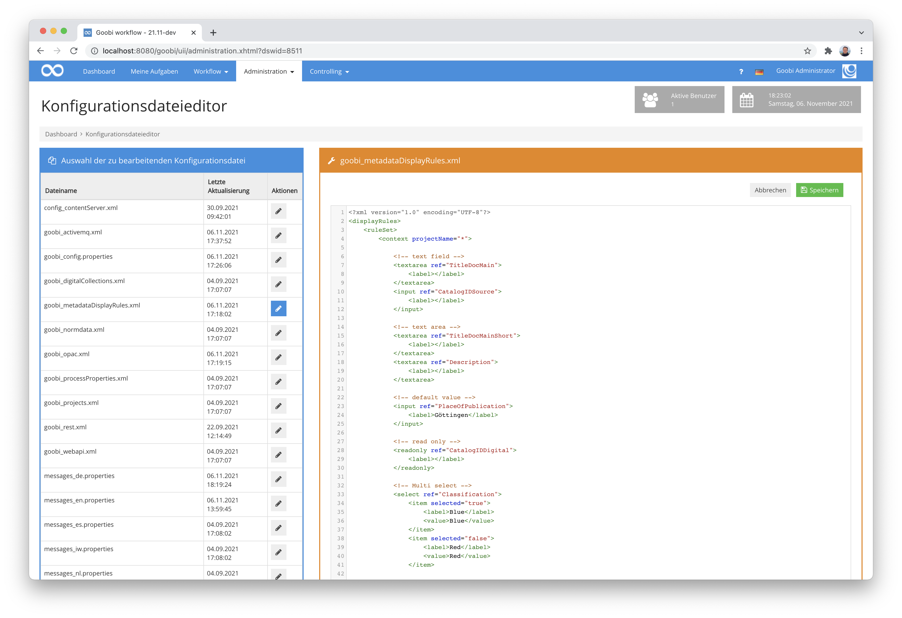
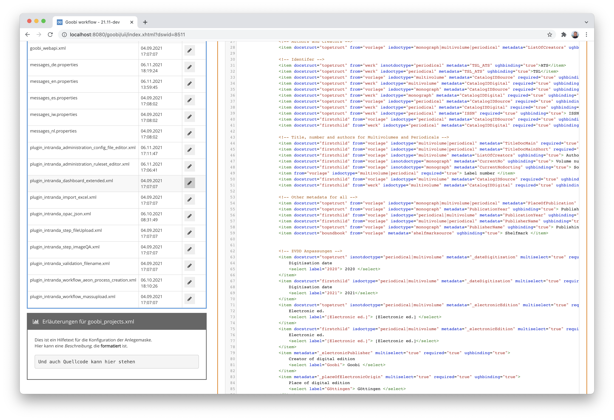
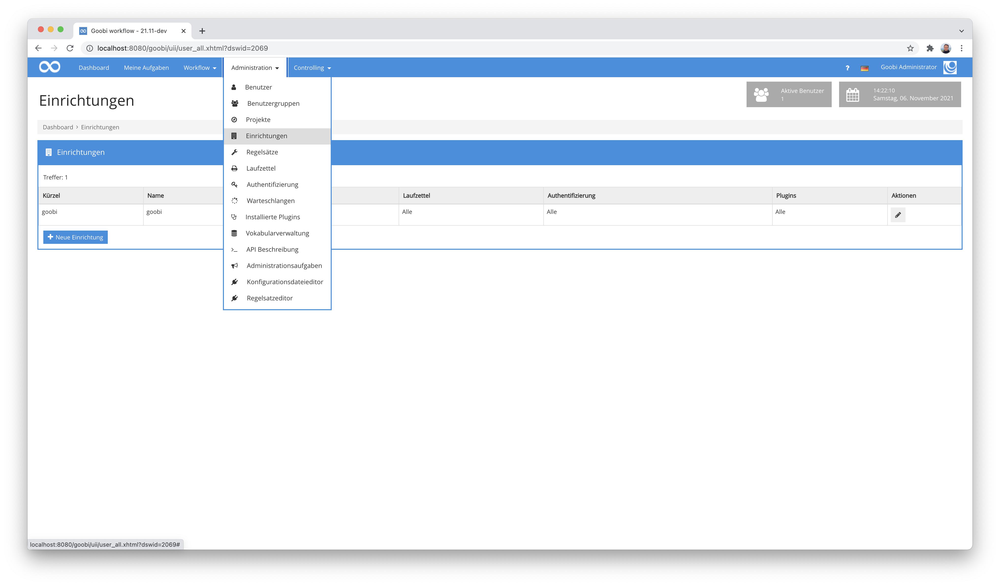
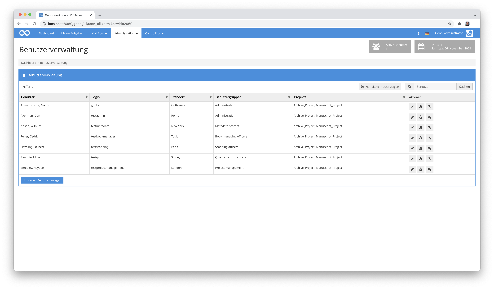
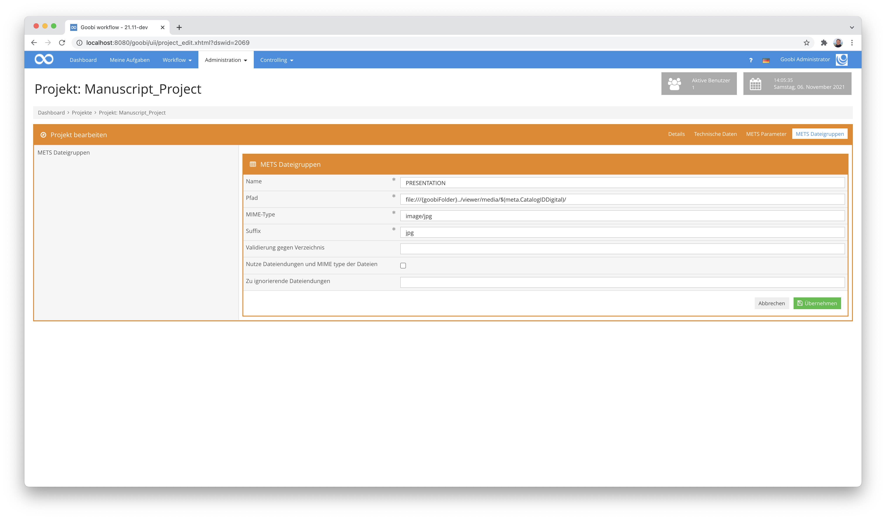
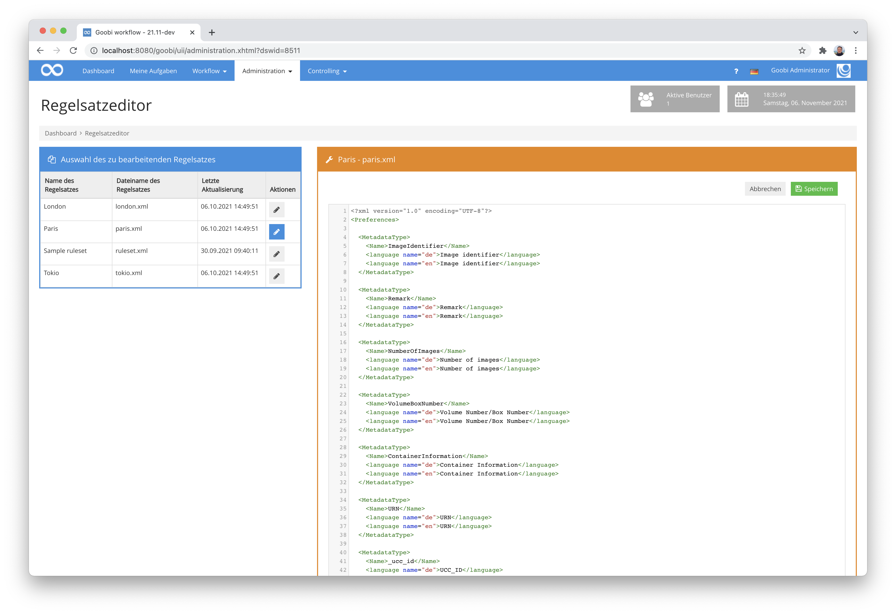
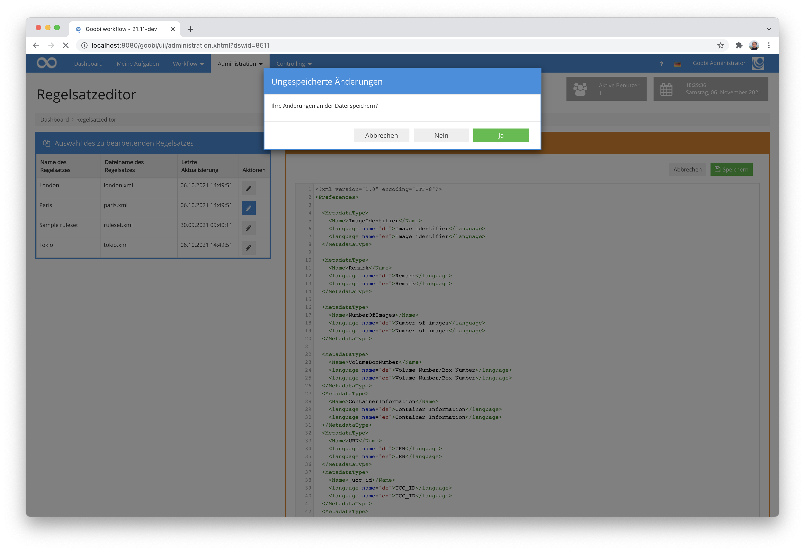

# Oktober 2021

## Coming soon
- Erweiterung des Plugins zur Ausgabenerkennung von Zeitungen
- Support von S3 als Speicher in weiteren Plugins
- Erweiterte Accessibility für Tabellen
- AEON Plugin Entwicklung
- Dokumentationen und Code-Veröffentlichungen


## Erweiterung der Anzeige verfügbarer Nutzerrechte
Bereits seit einer großen Umstellung vor einigen Jahren können Plugins eigene Nutzerrechte mitbringen. Diese lassen sich dann zusätzlich zu denjenigen Rechten, die Goobi workflow selbst bereits mitbringt verwendet werden. Dies erfolgt üblicherweise so, dass man aus dem Plugin den Namen des benötigten Rechts erfährt, indem man dieses öffnet.



Anschließend kann man innerhalb der Benutzergruppen das erforderliche Recht im rechten unteren Bereich eintragen und somit auch der Nutzergruppe zuweisen.



Im Falle von sehr komplexen Rechten, von denen einzelne Plugins auch mehrere mitbringen können, ist die Ermittlung der benötigten Rechte manchmal zu umständlich. Aus diesem Grund wurde Goobi workflow nun dahingehend erweitert, dass innerhalb der zentralen Goobi-Konfigurationsdatei all diejenigen Rechte bekannt gemacht werden können, die Goobi innerhalb der Auflistung der zur Verfügung stehenden Rechte aufführen sollen. Auf diese Weise sind die Rechte von Plugins genauso auswählbar und anklickbar wie diejenigen, die Goobi selbst bereits mitbringt.



Die Konfiguration diese zusätzlichen Rechte erfolgt innerhalb der Konfigurationsdatei `goobi_config.properties`. Sie sieht beispielhaft wie folgt aus:

```properties
userRight=RightA
userRight=RightB
userRight=RightC
```

Sollen die somit eingetragenen Rechte darüber hinaus auch noch mit passenden Übersetzungen angezeigt werden, so müssen diese entsprechend innerhalb der lokalen `messages_XY.properties` Dateien eingetragen sein. Dies muss beispielhaft so erfolgen:

```properties
rights_RightA=Right A for the user group
rights_RightB=Right B for the user group
rights_RightC=Right C for the user group
```


## Neues Plugin, um Batch-Vorgänge auf einen gemeinsamen Stand zu bringen
Im Rahmen eines Projektes, wo Goobi ein anderes technisches System (AEON) über eine API benachrichtigen soll, wenn alle Vorgänge eines Batches einen bestimmten Status erreicht haben, wurde ein neues Plugin implementiert. Es handelt sich hierbei um ein Step-Plugin, das die weitere Ausführung des Workflows für den jeweiligen Vorgang stoppt, sofern es noch weitere Vorgänge gibt, die zu dem gleichen Batch gehören und noch nicht den gleichen Status innerhalb des Workflows erreicht haben. Er der letzte Vorgang, der den gewünschten Status erreicht, löst damit aus, dass alle Vorgänge nun wieder gemeinsam in den jeweils nächsten Arbeitsschritt wechseln und somit den Workflow weiter durchlaufen. Dieses Plugin dient also dazu, alls Vorgänge wieder auf den gleichen Stand im Workflow zu bringen. Sofern gewünscht kann dabei das Plugin außerdem eine Anfrage an AEON über REST senden, um über die Änderung des Status zu informieren.

Eine detaillierte Dokumentation für das Plugin findet sich hier:


Und an dieser Stelle findet sich dann sowohl der Quellcodes des Plugins als auch die kompilierte Fassung des Plugins:



## Catalogue-Request-Plugin und Catalogue-Poller erweitert
Die beiden Plugins, die einfache oder auch wiederholte Katalogabfragen während des bereits laufenden Workflows erlauben, wurden erweitert, um mit den neuen Funktionen des JSON-OPAC-Plugins arbeiten zu können. Da dort nämlich mehrere Felder für eine einzige Abfrage aus einem Katalog verwendet werden können, um also mit mehreren Suchparametern ein Ergebnis zu importieren, hat sich die Konfiguration beider Plugins ändern müssen. Für Updates von Goobi bzw. den Plugins müssen entsprechend die Konfigurationsdateien berücksichtigt werden. Details dazu finden sich sowohl innerhalb der Dokumentation der Plugins hier:



... und hier:



Und natürlich sind die erforderlichen Anpassungen auch innerhalb der Updateanleitung detailliert aufgelistet:




## Neues Plugin für die Bearbeitung von Konfigurationsdateien
In der Vergangenheit war es schwierig kleine Anpassungen an Goobi vorzunehmen, wenn kein unmittelbarer Zugriff auf den Server vorlag. Mit dem neuen Plugin für die Bearbeitung von Konfigurationsdateien direkt aus der Nutzeroberfläche von Goobi ist dies nun anders. Verfügt ein Nutzer über die erforderlichen Rechte im System besteht nun die Möglichkeit, dass eine Änderung von Konfigurationen direkt aus Goobi heraus erfolgen kann. 



Im Hintergrund erzeugt das Plugin dabei Backups in festlegbarer Anzahl, so dass ein Administrator auch noch einmal eine frühere Version auf dem Server herstellen kann. Darüber hinaus bietet das Plugin auch die Möglichkeit einer integrierten Hilfe. Hier können Sie selbst festlegen, ob für die Bearbeitung von Konfigurationsdateien eigene Hilfetexte angezeigt werden sollen. Diese müssen dann entsprechend innerhalb der sogenannten messages-Dateien hinterlegt werden und können sogar auch Formatierungsangaben beinhalten.



Mehr Details über das Plugin finden sich in der sehr ausführlichen Dokumentation hier:


Der Quellcode und eine kompilierte Fassung des Plugins finden sich wie gewohnt hier:



## Logging und Login
Wenn sich Nutzer in Goobi workflow anmeldeten, war im Falle von technischen Problemen für uns als Entwickler schwer nachvollziehbar, woran dies manchmal lag. Aus diesem Grund haben wir uns dieser Thematik mal in Ruhe angenommen und das Schreiben von Log-Dateien speziell im Hinblick auf das Einloggen gründlich überarbeitet. Die Gratwanderung ist hierbei natürlich, dass wir im Hinblick auf die DSGVO so wenige Daten wir möglich loggen dürfen und auf der anderen Seite aber soviel Information wie benötigt in Log-Dateien schreiben, damit wir im Falle von Fehlern hier nun auch besser nachvollziehen können, woran es liegen mag. An all diese Themen haben wir nun gedacht und das Logging entsprechend angepasst. So können wir künftig gut damit arbeiten. Und falls es mal jemand in Aktion sehen möchte, kann er auf Serverseite einfach mal folgenden Befehl ausprobieren:

``` bash
cat goobi.log | grep "LOGIN PROCESS"
```


## Einrichtungen werden nur noch bedingt angezeigt
Vor ca. zwei Jahren haben wir Goobi workflow massiv erweitert, um eine bessere Mandantenfähigkeit zu erlauben. Diese basiert darauf, dass in einer Goobi-Instanz nun mehrere Einrichtungen/Mandanten definiert werden können.



Wurden allerdings in einer Goobi-Instanz nicht mehrere Einrichtungen definiert, so stand in vielen Bereich unnötigerweise ein neues Auswahlfeld zur Verfügung, in dem zumeist dann doch nur die eine Einrichtung ausgewählt werden konnte, weil der Use Case mehrerer Einrichtungen in einer Instanz relativ selten vorkommt. Daher haben wir nun an verschiedenen Stellen Änderungen vorgenommen, um diese Anzeige von Einrichtungen nur noch dann anzuzeigen, wenn auch wirklich mehrere Einrichtungen vorliegen. Andernfalls wird sowohl das Auswahlfeld als auch die die Tabellenspalte grundsätzlich versteckt. So bleibt die Oberfläche aufgeräumt und übersichtlich und zeigt keine unnötigen Informationen an.




## Namen von Projekten prominenter in der Bearbeitung
Sukzessive stellen wir einige optische Feinheiten um, so dass die Bedienung von Goobi noch intuitiver wird. Eine solche Feinheit ist z.B. dass wir beim Bearbeiten von Datensätzen, den Namen des jeweiligen Datensatzes nun deutlich prominenter in dem Titel der Seite aufführen. Der hier aufgeführte Screenshot verdeutlicht dies ganz gut, weil er den Namen des bearbeiteten Projektes groß im oberen Bereich anzeigt, auch wenn man sich auf einer Registerkarte innerhalb des Bearbeitungsformulars befindet. So wird jederzeit deutlich, an welchem Projekt man beispielsweise gerade Änderungen vornimmt.



## Neues Plugin zum Bearbeiten der Regelsätze
Um die Bearbeitung von Regelsatz-Dateien nicht mehr nur ausschließlich über einen Serverzugang zu ermöglichen haben wir ein neues Plugin entwickelt. Es erlaubt eine Bearbeitung der Regelsätze als xml-Dateien unmittelbar aus der Oberfläche von Goobi heraus. 



Der Verlust von Änderungen, die man innerhalb der Dateien vorgenommen hat, wird dadurch vermieden, dass ein Wechsel zu anderen Regelsätzen immer auch prüft, ob vielleicht ungespeicherte Daten vorliegen.



Für den Fall dass dabei mal etwas schiefgeht erzeugt das Plugin dabei im Hintergrund automatisch Backups in definierbarer Anzahl, so dass auch versehentliche Änderungen zur Not von einem Administrator auf dem Server noch einmal rückgängig gemacht werden können.


Bitte beachten Sie: Auch mit diesem Plugin sollte man wissen, was man hier wie konfiguriert. Der erleichterte Zugriff auf die Regelsätze kann bei fehlerhafter Bedienung zu schwerwiegendem Datenverlust zuvor erfasster Metadaten führen.

Eine sehr ausführliche Dokumentation für das Plugin findet sich unter der folgenden Adresse:


Der Quellcode des Plugins zusammen mit einer kompilierten Fassung des Plugins findet sich bei GitHub:



## Bessere Rückmeldungen beim Upload von Dateien
Beim Hochladen von Dateien mit dem File-Upload-Plugin kamen in der Vergangenheit irreführende Fehlermeldungen, wenn eine Validierung die hochgeladenen Dateien nicht akzeptieren wollte. Bisher kam dann jeweils die gleiche nicht wirklich hilfreiche Meldung, dass keine Objekte vorgefunden werden können. Der eigentliche Grund der Meldung war in solchen Fällen jedoch eigentlich, dass zwar Dateien vorgefunden werden, diese aber nicht der Validierungsregel entsprachen. Dies haben wir nun überarbeitet und zeigen jetzt deutlichere Meldungen für solche Anwendungsfälle an.


## Versionsbezeichnung
Die aktuelle Versionsnummer von Goobi workflow lautet mit diesem Release: **21.10**.
Innerhalb von Plugin-Entwicklungen muss für Maven-Projekte innerhalb der Datei `pom.xml` entsprechend folgende Abhängigkeit eingetragen werden:

```xml
<dependency>
  <groupId>de.intranda.goobi.workflow</groupId>
  <artifactId>goobi-core-jar</artifactId>
  <version>21.10</version>
</dependency>
```