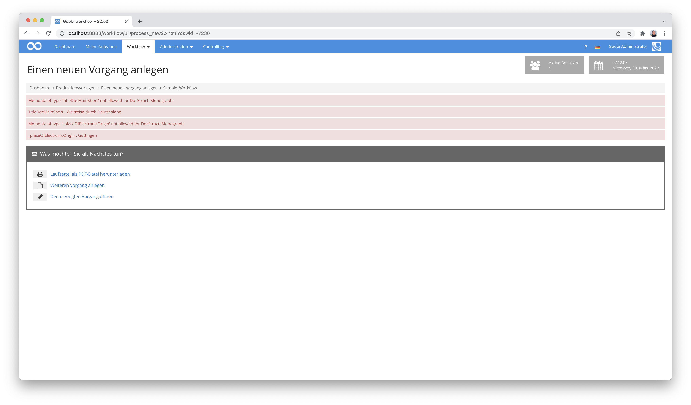
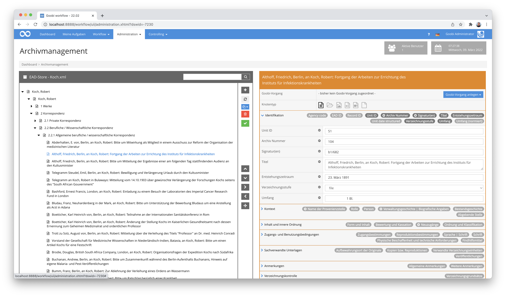
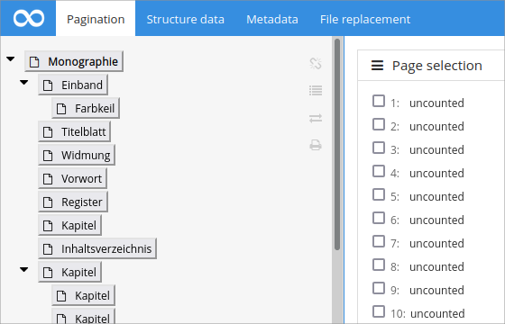
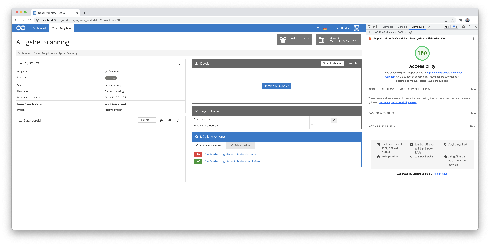
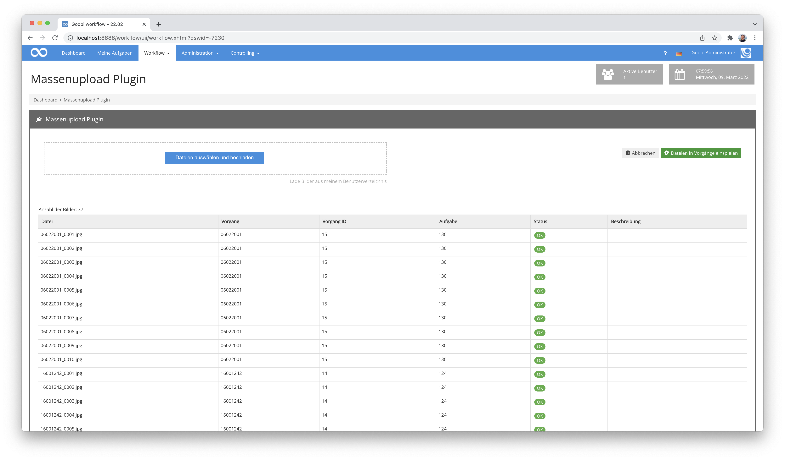
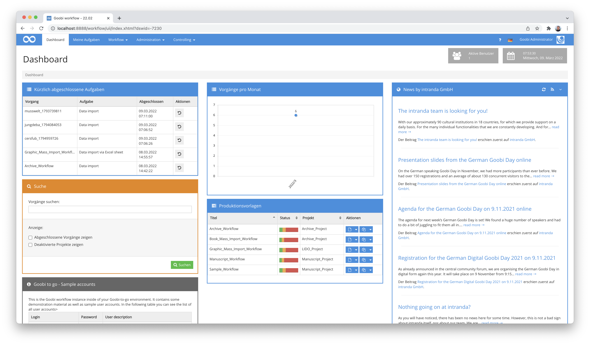
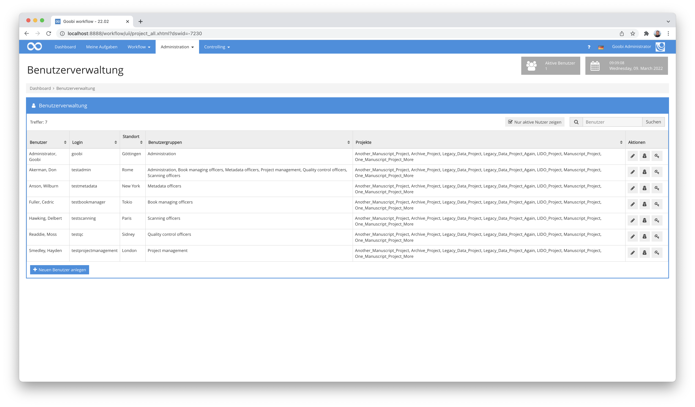
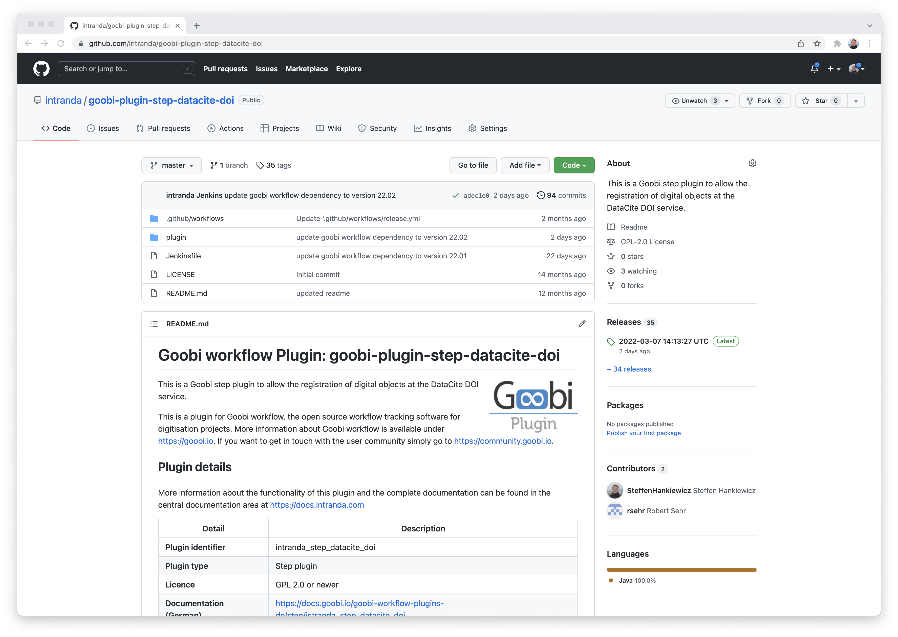
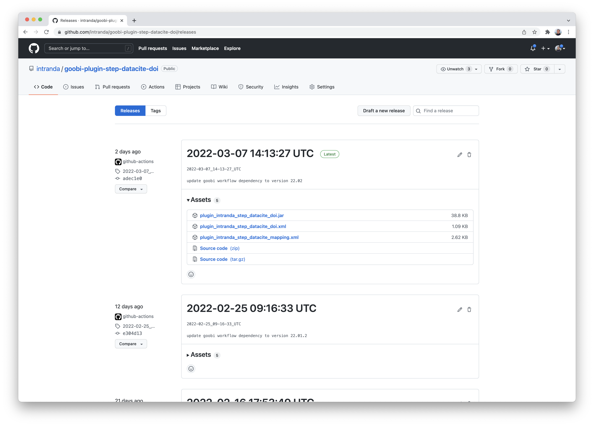

# November 2021

## Bessere Anzeige im Falle nicht importierbarer Metadatan

Wenn ein Vorgang in Goobi workflow angelegt wird und dafür Daten aus einem Katalog übernommen werden sollen, kann es gelegentlich passieren, dass nicht für alle bereitgestellten Metadaten bereits konfiguriert wurde, wo innerhalb der internen METS-Datei die Metadaten gespeichert werden sollen. Dies war bisher für den Nutzer nicht transparent, so dass wir eine Änderung vorgenommen haben. Metadaten, die nicht übernommen werden können, werden nun im Anlegeprozess deutlich visualisiert.




## ALTO-Editor kann aus der Thumbnail-Ansicht aufgerufen werden

Seit einigen Versionen verfügt Goobi workflow über die Möglichkeit, dass man direkt aus dem Metadateneditor heraus die Ergebnisse einer Volltexterkennung im ALTO-Format anzeigen und bearbeiten kann. Diese Funktionalität war bisher nur aus der Einzelseitenanzeige heraus betretbar. Mit den vorgenommenen Änderungen ist dies jedoch auch aus den Thumbnails heraus möglich und erlaubt anschließend eine Navigation zwischen den Bildern innerhalb der geöffneten Bearbeitungsmaske.


## ALTO-Editor unterstützt ALTO 4.0

Der bereits angesprochene Editor für die Volltexte im ALTO-Format unterstützt nun das ALTO Dateien in der Version 4.0 und erlaubt deren Anzeige und Bearbeitung. Damit ist es nun auch möglich, z.B. die Volltexte von Transkribus anzeigen und bearbeiten zu können.


## Verschiedene Erweiterungen am Archiv-Management-Plugin

Das Archiv-Management kommt in immer mehr Projekten in den produktiven Einsatz. In dem Kontext tauchen immer mal wieder neue Wünsche, notwendige Anpassungen oder auch optische Änderungsnotwendigkeiten auf, die wir sukzessive mit umsetzen. Hier gab es in letzter Zeit mehrere eher optische Anpassungen an der Erfassungsmaske, die es lohnen, mal wieder einen Blick auf die Funktionalität zu werfen.



Zur Erinnerung hier nochmal die ausführliche Dokumentation des Plugins:




## Accessibility als Dauerthema

Bei manchen Entwicklungen ist man auch mit viel Berufserfahrung noch immer überrascht, welche Ausmaße sie annehmen können, und womit man alles nicht gerechnet hätte. Das Thema Accessiblity ist ein gutes Beispiel dafür. Wir haben hier bereits unzählige Stunden investiert, um die Barrierefreiheit für Goobi workflow zu optimieren und erfüllen auch bereits gängige Validatoren. Und doch gibt es immer mal wieder neue Überraschungen, wie das folgende Beispiel zeigt:



Dieser Screenshot zeigt, welche Effekte Umstellungen haben können, wenn man beispielsweise Links zu Buttons ändert, damit u.a. Screenreader auch besser damit umgehen können. Natürlich haben wir das so nicht gelassen, sondern wieder hübsch gestyled. Wenn Sie aber dennoch einmal etwas ähnliches an einer anderen Stelle von Goobi workflow vorfinden, so freuen wir uns über Rückmeldung, damit wir das korrigieren können.

# Feinschliff für die Barrierefreiheit

Einige Monate nach dem Abschluss der eigentlichen Barrierefreiheitsarbeiten, sind uns noch ein paar Details aufgefallen, die verbessert werden konnten. Dabei ging es unter anderem um die richtigen Attribute in Tabellen, damit Screenreader diese richtig interpretieren können. 

Die Kompatibitlität mit den gängigen Validatoren bleibt bei uns unter ständiger Beobachtung und wir versuchen, die 100% Kompatibilität zu behalten. Hierbei muss man allerdings vor Augen haben, dass die Validatoren über die Zeit Änderungen hinsichtlich der Anforderungen haben und somit eine konstante Beobachtung der Kompatibilität notwendig bleibt. Das Thema ist also als solches vermutlich nie wirklich abgeschlossen. Momentan sieht es für Goobi workflow aber so aus, als ob wir unsere Hausaufgaben gut gemacht haben:




## Massenupload Plugin Anpassungen

Das Massenupload-Plugin ist vor allem dann praktisch, wenn viele Vorgänge in Goobi worklow automatisch mit den zugehörigen Bilddateien beliefert werden sollen. Das klappt erfahrungsgemäß ziemlich gut. Allerdings erlaubte der Button zum Zuordnen der Bilder zu den ermittelten Vorgängen eine doppelte Ausführung durch wiederholten Klick darauf. Dies führte dann zu undefiniertem Verhalten, so dass dies geändert werden musste. Der entsprechende Button wird daher von nun an nicht mehr angezeigt, wenn er bereits geklickt wurde und gerade Bilder in die Vorgänge einsortiert werden.



Bei der Gelegenheit haben wir übrigens noch eine kleine Korrektur vorgenommen: Wenn in der Konfiguration der Parameter `use-barcodes` auf `true` gesetzt war und bei dem Upload von Bildern kein Barcode ermittelt werden konnte, wird nun eine sprechende Fehlermeldung ausgegeben.

## Korrektur am Excel-Import

Aus der Kategorie "Unerwartete Seiteneffekte" kommt dieser Punkt: Tatsächlich konnte eine fehlerhafte Konfiguration des Excel-Import-Plugins dazu führen, dass das Dashboard und die Auflistung von Produktionsvorlagen in Goobi workflow nicht mehr richtig angezeigt wurden. Hier haben wir Korrekturen vorgenommen, so dass alles wieder gut aussieht.



## Tabellenlayout in der Benutzerverwaltung verbessert

Innerhalb der Benutzerverwaltung war die Darstellung der Spalte mit den Buttons zu schmal geraten, so dass die Buttons ungünstig umgebrochen sind. Das wurde durch eine Mindestbreite der Spalte behoben und sieht somit auch bei vielen Projekten und Benutzergruppen gut aus.




## Gelöschte und anonymisierte Nutzer aus den Aufgaben entfernt

Wenn Nutzer in Goobi gelöscht werden, so wird im Hintergrund der Datensatz des Nutzers nicht wirklich gelöscht, sondern komplett anonymisiert. Dies erfolgt, damit die Daten insgesamt noch vollständig bleiben. Zur Verdeutlichung, dass solche Nutzer auch tatsächlich nicht im Workflow aktiv sein können, werden solche gelöschgten Nutzer nun auch aus der Liste der berechtigten Nutzer für eine Aufgabe entfernt, sofern sie dort zugewiesen waren. Dies ist in erster Linie eine optische Korrektur, da die Nutzeraccounts bereits deaktiviert waren und sich entsprechend auch nicht mehr einloggen können.


## Automatische Veröffentlichung nahezu aller Plugins als kompilierte Dateien

Dass Goobi worklow und nahezu alle Plugins unter eine Open-Source-Lizenz stehen, dürfe sich bereits rumgesprochen haben. Derzeit existieren etwas über 300 Plugins für Goobi workflow und bereits ca. 130 sind auch bereits bei GitHub unter https://github.com/intranda veröffentlicht. Sehr viele der Plugins verfügen auch bereits über eine ziemlich ausführliche Dokumentation unter https://docs.goobi.io, die unter anderem erläutert, wie eine Installation der Plugins erfolgt. Bisher musste man für die Inbetriebnahme allerdings noch selbst die Plugins als Quellcode herunterladen und kompilieren. Dies war umständlich und sehr technisch. Daher haben wir dies so geändert, dass bei GitHub nun automatisch kompilierte Fassungen der Plugins abgelegt werden, immer wenn wir eine Änderung an einem Plugin vornehmen oder eine neue Goobi Version veröffentlichen. Man gelangt zu diesen kompilierten Plugins, indem man bei dem jeweiligen Plugin im rechten Bereich auf `Releases` klickt.



Anschließend erhält man Einblick in die herunterladbaren Dateien, die sowohl das Plugin selbst als auch die eventuell benötigten Konfigurationsdateigen umfassen. Diese Dateien kann man nun herunterladen und gemäß der Anleitung korrekt installieren, so dass die Inbetriebnahme deutlich vereinfacht wurde.




## Versionsbezeichnung
Die aktuelle Versionsnummer von Goobi workflow lautet mit diesem Release: **21.11**.
Innerhalb von Plugin-Entwicklungen muss für Maven-Projekte innerhalb der Datei `pom.xml` entsprechend folgende Abhängigkeit eingetragen werden:

```xml
<dependency>
  <groupId>de.intranda.goobi.workflow</groupId>
  <artifactId>goobi-core-jar</artifactId>
  <version>21.11</version>
</dependency>
```