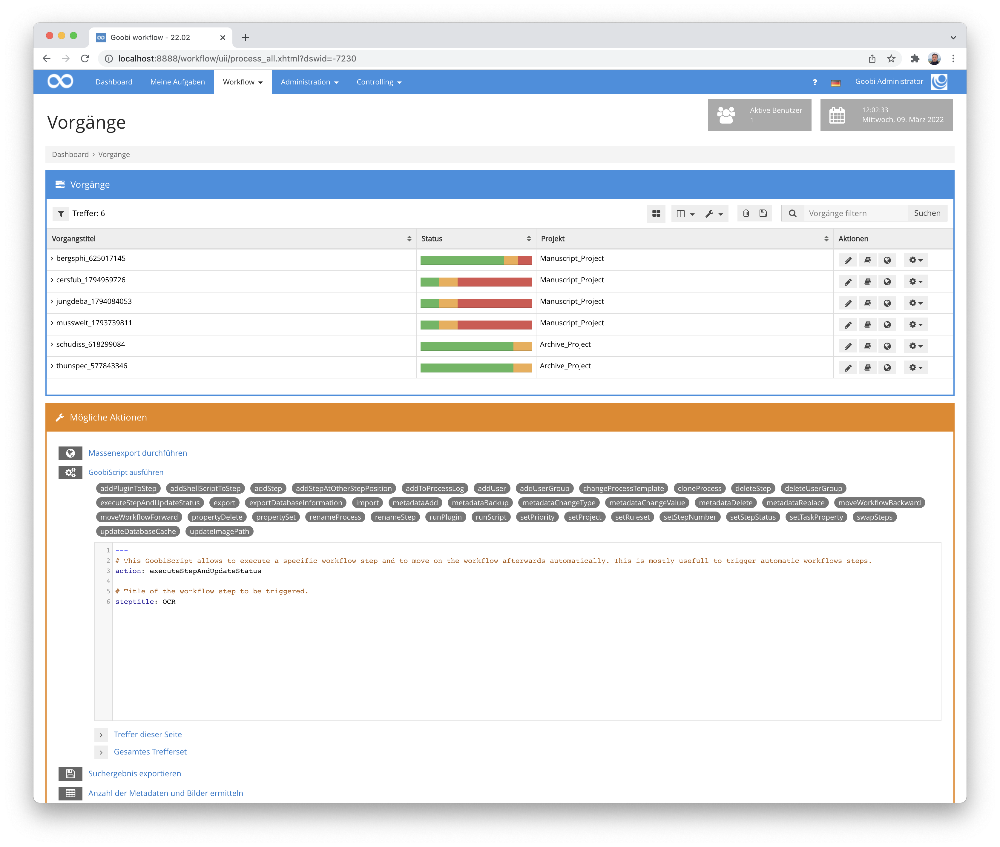
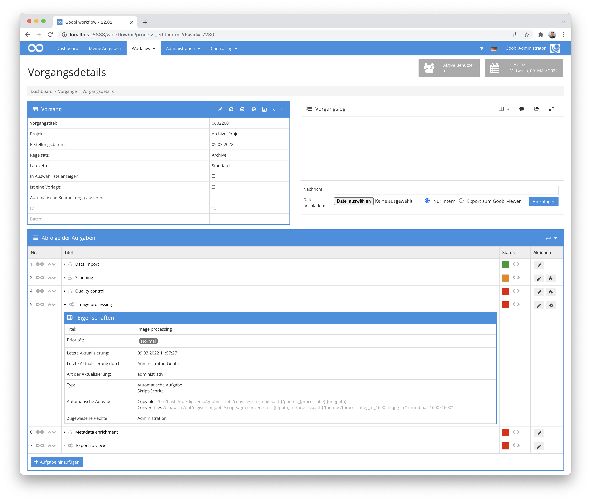

# Dezember 2021

## Sicherheitslücke Log4j
Wie viele andere bekannte Softwarelöungen und Webseiten war auch Goobi workflow von der Sicherheitslücke innerhalb der Programmbilbiothek Log4j betroffen. Zumindest theoretisch. Wir haben noch am gleichen Tag als die Sicherheitslücke bekannt wurde, die Applikation aktualisiert, eine neue Version von Goobi workflow veröffentlicht und ca. 200 Server aktualisert. Sicherheitsprobleme sind daher bei keinem der von uns betreuten Systeme aufgetreten. 


Im weiteren Verlauf des Monats haben wir uns aber dennoch weiter intensiv mit der Thematik Log4j, dem Logging allgemein und weiteren Update beschäftigt, und wir haben verschiedene automatische junit-Tests entwickelt.


## Neues GoobiScript: metadataBackup
Es gibt mal wieder ein neues GoobiScript. Dieses heisst `metadataBackup` und erlaubt es, dass ganz bequem Backups der Dateien `meta.xml` und `meta_anchor.xml` erstellt werden können. Hierbei handelt es sich um die wichtigen internen METS-Dateien, die zu jedem Vorgang gehören. Eine solches Backup ist vor allem dann sinnvoll, wenn automatisiert Änderungen an diesen Dateien vorgenommen werden sollen und daher eine Sicherheitskopie zuvor erstellt werden soll. 

Der Aufruf dieses GoobiScripts erfolgt einfach ohne weitere Parameter:

```yaml
---
# This GoobiScript allows to create a backup of meta.xml and meta_anchor.xml.
action: metadataBackup
```


## Excel-Exports in Statistiken korrigiert
Für einen kurzen Moment waren einige Goobi-Installation davon betroffen, dass aus den Statistiken keine Excel-Dateien mehr erzeugt werden konnten. Ursache hierfür war das zwischenzeitliche Update eine Programmbibliothek für Excel-Dateien und die damit verbundene Änderung des Dateiformats. Dies haben wir mit dem Update korrigiert.


## Korrigierter Fehler beim Speicherintervall
Wenn Nutzer den Zeitraum für das automatische Speichern der Metadaten angepasst haben, so führte dies zu Ladeproblemen beim Betreten des Metadateneditors. Dies wurde behoben.


## Erweiterung des Plugins zum automatischen Löschen von Inhalten
Das Plugin zum automatischen Löschen von Inahlten aus Goobi workflow wurde erweitert. Es ist damit nun möglich, dass auch gezielt Metadaten und Eigenschaften gelöscht können. Dies ist zum Beispiel dann sinnvoll, wenn Daten nach einem festgelegten Zeitraum automatisch anonymisiert werden sollen.

Die Konfgurationsmöglichkeiten sind für diesen Anwendungsfall erweitert und dokumentiert worden:


Das Plugin selbst für die Installation sowie der Quellcode befinden sich wie gehabt bei GitHub unter folgender URL:




## Erweiterung des Delay-Plugins für mehrere Konfigurationen
Das Delay-Plugin für eine automatische Pausierung von Workflows für eine konfigurierbare Zeit wurde deutlich erweitert. Statt wie bisher nur eine zentrale Konfiguration zu erlauben, ist es nun möglich, dass wie bei den meisten anderen Plugins auch, ein einzelner Konfigurationsblock pro Projekt oder Arbeitsschritt erzeugt werden kann. Somit läßt sich das gleiche Plugin mehrfach in verschiedenen Projekten und Arbeitsschritten verwenden und kann sich dabei unterschiedlich verhalten.

Eine beispielhafte Konfiguration sieht dabei wie folgt aus:


Und auch dieses Plugin ist natürlich unter GitHub veröffentlicht:




## GoobiScript executeStepAndUpdateStatus angepasst
Das GoobiScript `executeStepAndUpdateStatus` hat beim Aufruf an Arbeitsschritten bisher die eigentlich hierfür konfigurierte Warteschlangen ignoriert. Das wurde nun behoben, so dass die Ausführung regulär in die konfigurierte Message-Queue eingereiht und somit korrekt priorisiert ausgeführt wird.




## Ausführen von Scripten innerhalb der Vorgangsdetails
Auch die Ausführung von Scripten innerhalb der Vorgangsdetails hat die Ausführung innerhalb einer Warteschlange bisher ignoriert. Diese Stelle wurde korrigiert, so dass diese nun ebenfalls innerhalb der Message-Queues ausgeführt und korrekt priorisiert ausgeführt werden.




## Pluginübersicht zeigt nun auch Inhalte aus dem goobi/lib Ordner an
Die praktische Pluginbersicht mit ihrer darin enthaltenen Versionsanzeige für jedes einzelne Plugin hilft den Goobi-Administratoren für die Wartung sehr. Schließlich läßt sich so gut überblicken, ob alle Plugins mit der jeweils installierten Goobi-Version kompatibel sind. Gefehlt haben in dieser Auflitung allerdings bisher noch diejenigen Plugins, die in dem Verzeichnis `goobi/lib` abgelegt sind. Um auch diese in der Auflistung sehen und bequem auf ihren Status hin überprüfen zu können wurde die Übersichtsseite erweitert.


## Accessibility: Dropdown-Buttons überarbeitet
Auch diesen Monat gab es wieder einige Verbesserungen an der Accessibility. So wurden unter anderem alle Buttons, die über eine Dropdown-Funktionalität verfügen, so angepasst, dass ihr Zustand (geöffnet vs. geschlossen) gut von Screenreadern verarbeitet werden können. 


## Versionsbezeichnung
Die aktuelle Versionsnummer von Goobi workflow lautet mit diesem Release: **21.12**.
Innerhalb von Plugin-Entwicklungen muss für Maven-Projekte innerhalb der Datei `pom.xml` entsprechend folgende Abhängigkeit eingetragen werden:

```xml
<dependency>
  <groupId>de.intranda.goobi.workflow</groupId>
  <artifactId>goobi-core-jar</artifactId>
  <version>21.12</version>
</dependency>
```