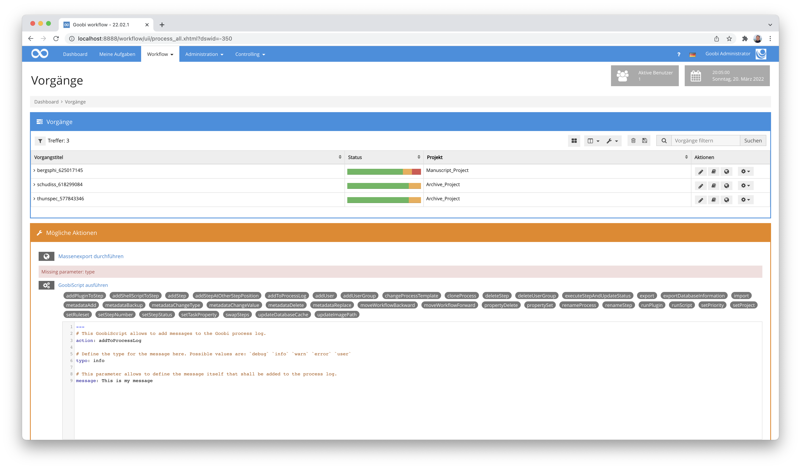

# Januar 2022

## Erweiterung der Benutzereinstellungen zur individuellen Konfiguration des Anzeigemodus
Innerhalb der Benutzereinstellungen gibt es nun im Bereich `Allgemein` die Möglichkeit, dass sich jeder Nutzer selbst den Anzeigemodus individuell festlegt. Hierbei kann zwischen `Normaler Anzeige`, `Low Vision Modus` sowie dem `WCAG kompatiblen Modus` ausgewählt werden.


Diese Option besteht natürlich zusätzlich zu der Möglichkeit, dass jeder Nutzer sich über eigene CSS-Definitionen das Layout von Goobi selbst anpassen kann.


## Anpassungen am Konfigurationseditor
Im Konfigurationsdateien-Editor-Plugin ist es ab jetzt möglich, eine Liste von Verzeichnissen, in denen Dateien zum Bearbeiten gesucht werden sollen, zu konfigurieren. Die neue Konfiguration sieht erweitert nun wie folgt aus:


```xml
<config_plugin>

    <configFileDirectories>
        <directory backupFiles="16">/opt/digiverso/goobi/config/</directory>
        <directory backupFolder="wizzardBackup/" backupFiles="4">/opt/digiverso/layoutwizzard/</directory>
        <directory backupFolder="itmPluginsBackup/" backupFiles="4" fileRegex="\.xml">/opt/digiverso/itm/plugins/config/</directory>
        <directory backupFolder="itmBackup/" fileRegex="\.xml">/opt/digiverso/itm/config/</directory>
        <!--
        Example:
        <directory backupFolder="exampleBackup/" backupFiles="12" fileRegex="\.xml">/opt/digiverso/example/config/</directory>
        -->
    </configFileDirectories>

</config_plugin>
```

In dem Zusammenhang wurde bedacht, dass der Editor nicht dafür genutzt werden sollte, seine eigene Konfigurationsdatei zu ändern. Dies hätte andernfalls ermöglicht, dass sich berechtigte Anwender zusätzliche Pfade für den Editor festlegen, um auch tiefgreifendere Eingriffe in das System vorzunehmen.

Die Dokumentation für das Plugin findet sich an dieser Stelle:




## Skip Link
Im Rahmen unserer permanenten Verbesserung der Nutzeroberfläche zur Steigerung der Barrierefreiheit haben wir nun auch einmal den zentralen `Skip Link` genauer anschaut. Dieser befindet sich auf allen Seiten ganz oben und erlaubt, dass Nutzer mit einer Tastatursteuerung über die `TAB`-Taste sofort zu dem Inhaltsbereich der Seite navigieren können. Hier gab es nun also eine kleine Korrektur für die richtige Reihenfolge des Durchlaufens der Seitenelemente.


## Aufgaben aus Produktionsvorlagen nicht mehr im Dashboard
Innerhalb des Dashboards, was die Mehrheit der Goobi workflow Nutzer einsetzen, werden die zuletzt abgeschlossenen Aufgaben angezeigt. Dort wurden bisher auch versehentlich Aufgaben mit aufgelistet, die aus kürzlich bearbeiteten Produktionsvorlagen stammen. Hier gab es nun eine Korrektur, die diesen Anzeigefehler vermeidet.


## Kommentare zu einzelnen Bildern nun möglich
Mit den neuen Entwicklungen ist es von nun an möglich, Kommentare zu einzelnen Bildern zu schreiben. Diese Kommentar-Funktion ist an mehreren Stellen in Goobi workflow integriert: im METS-Editor, im ImageQA Plugin sowie auch im LayoutWizzard. Um diese neue Funktionalität nutzen zu können, muss sie innerhalb der zentralen Konfigurationsdatei `goobi_config.properties` aktiviert werden:

```toml
ShowImageComments=true
```


## Thumbnailauswahl hat nur Auswirkung auf Paginierung
Bisher hat innerhalb des Metadateneditors ein Klick auf ein Thumbnail immer auch die aktuelle Seite in der Paginierung gesetzt, selbst wenn man sich zum Beispiel in der Strukturdaten-Ansicht befunden hat. Dadurch konnte es versehentlich zu Fehlbedienungen kommen, wenn später weitere Paginierungsarbeiten erfolgen sollen. Durch eine Änderung der Bedienlogik ändert ein Klick auf die Thumbnails von nun an nur noch die in der Paginierung ausgewählte Seite, wenn man auch tatsächlich in der Paginierung ist.


## Fehler im Vorgangslog bei Enter
Es gab ein Fehlverhalten innerhalb des Vorgangslogs, wenn ein Nutzer nach Eingabe eine Nachricht Enter gedrückt hat. Dort wurde die Anzeige gewechselt, statt die Nachricht abzusenden. Dieser Fehler ist nun behoben.


## Überprüfung aller Buttons
Sämtliche Buttons innerhalb von Goobi workflow wurden einmal intensiv geprüft, um sicherzustellen, dass diese nach den umfangreichen Accessibility-Umstellungen auch weiterhin funktionieren und richtig angezeigt werden. Sollten wir hierbei doch einen Button oder eine Funktionalität übersehen haben, so freuen wir uns über eine Rückmeldung.


## Invalide Goobiscript-Syntax verweigert nun direkt die Arbeit
Bisher hat der GoobiScript-Parser bei invalide verwendeter Syntax des YAML-Formats zunächst die Sicherheitsabfrage angezeigt und dann erst ganz oben auf der Seite einen Fehler angezeigt. Das hat zu Verwirrungen bei den Nutzern geführt, weil das zuvor abgesendete GoobiScript doch nicht wie erwartet ausgeführt wird. Aus diesem Grund wird ab jetzt das GoobiScript direkt nach dem Abschicken auf Validität überprüft und bei einem eventuellen Fehler eine Fehlermeldung direkt oberhalb des GoobiScript-Bereichs angezeigt.




## GoobiScript "addUserGroup" kann nun erfolgreich mehrfach aufgerufen werden
Im GoobiScript `addUserGroup` gab es ein Fehlverhalten, das bei mehrfachem Aufruf dazu geführt hat, dass lediglich die zuletzt hinzugefügte Nutzergruppe zu der gewünschten Aufgabe hinzugefügt wurde. Dieses Verhalten wurde nun behoben und das GoobiScript verhält sich von nun an korrekt.


## Keine führenden oder endenden Leerzeichen mehr in der Vokabularverwaltung
In der Vokabularverwaltung werden ab jetzt bei allen Textfelder (Input, Textara, HTML) vorangestellte und nachfolgende Leerzeichen entfernt, um solche versehentlichen Eingaben und die sich daraus potentiell ergebenden Probleme zu vermeiden.


## Metadatenanpassungen via GoobiScript nutzen VariablenReplacer
Die GoobiScripte `metadataChangeValue`, `metadataAdd`, `metadataDelete` und `metadataReplace` setzen nun für Änderungen von Inhalten den Variablenreplacer ein und erlauben somit eine sehr flexible Verwendung unter Einbeziehung anderer Metadatenfeldinhalte oder auch Informationen über den Vorgang, zu dem die Metadaten gehören.

Ein beispielhafter Aufruf sieht so aus:

```yaml
# This GoobiScript allows to add a new metadata to a METS file.
action: metadataAdd

# Internal name of the metadata field to be used. Use the internal name here (e.g. `TitleDocMain`), not the translated display name (e.g. `Main title`).
field: Description

# This is used to define the value that shall be stored inside of the newly created metadata field.
value: {meta.TitleDocMain} is the book title for the process with ID {processid}.

# Define where in the hierarchy of the METS file the searched term shall be replaced. Possible values are: `work` `top` `child` `any`
position: work

# Define if the further processing shall be cancelled for a Goobi process if an error occures (`false`) or if the processing should skip errors and move on (`true`).
# This is especially useful if the the value `any` was selected for the position.
ignoreErrors: true
```

Mehr Informationen gibt es wie gehabt hier zum Variablensystem von Goobi workflow:




## Versionsbezeichnung
Die aktuelle Versionsnummer von Goobi workflow lautet mit diesem Release: **22.01**.
Innerhalb von Plugin-Entwicklungen muss für Maven-Projekte innerhalb der Datei `pom.xml` entsprechend folgende Abhängigkeit eingetragen werden:

```xml
<dependency>
  <groupId>de.intranda.goobi.workflow</groupId>
  <artifactId>goobi-core-jar</artifactId>
  <version>22.01</version>
</dependency>
```