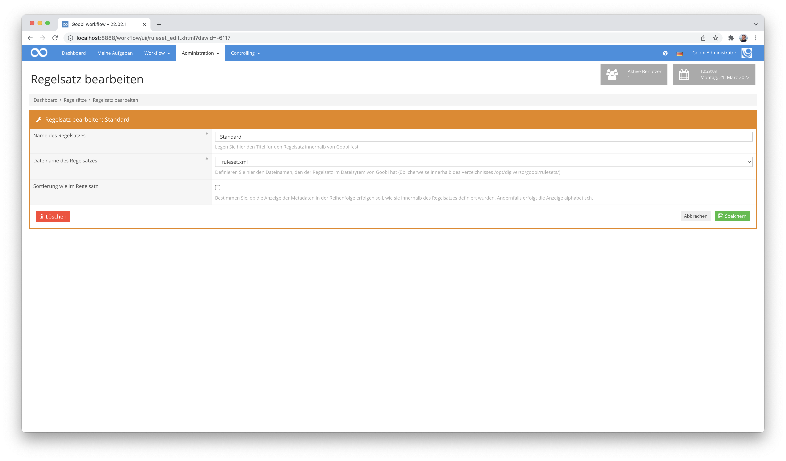

# Februar 2022

## Flip-Funktionalität im QA-Plugin
Innerhalb des Plugins für die Qualitätskontrolle von Dateien besteht bereits seit einiger Zeit die Möglichkeit, dass gezielt einzelne Dateien auch verändert werden können, sofern dies in der Konfiguration aktiviert wurde. So lassen sich Bilder beispielsweise dauerhaft rotieren oder gar löschen. Neu hinzugekommen ist nun, dass Bilder von nun an auch gespiegelt werden können. Dies ist sowohl horizontal wie auch vertikal möglich.


Zur Nutzung dieser Funktionalität muss die Konfiguration entsprechend den Vorgaben angepasst werden. Die Details dazu finden sich wie bisher innerhalb der Plugin-Dokumentation:




## Verständlichere Meldung von Fehlern bei Extraktion von PDF-Dateien
Wenn innerhalb des Workflows mit PDF-Dateien gearbeitet werden soll, stehen hierfür Routinen zur Verfügung, die die Inhalte der PDF-Dateien automatisch extrahieren und zu Bildern konvertieren. Hier gab es in der Vergangenheit allerdings gelegentlich eine Anzeige von irritierenden Meldungen im Falle von aufgetretenen Fehlern. Das wurde entsprechend geändert und ist nun für die Anwender deutlich aussagekräftiger und hilfreicher.


## Sortierung der Benutzer jetzt intuitiver
Die Sortierung der Anzeige der Benutzer innerhalb von Goobi workflow erfolgte bisher nicht ganz intuitiv. Dies ist nun behoben und die Sortierung ist intuitiver, ohne das Groß- und Kleinschreibung von Namen unerwartete Nebeneffekte haben.


## Neues GoobiScript zum Klonen von Vorgängen
Es gibt mal wieder ein neues GoobiScript. Dieses Mal geht es darum, dass wir eine Funktionalität benötigten, die es erlaubt bestehende Vorgänge in Goobi workflow vollständig zu duplizieren samt ihrer zugehörigen Daten. Dabei kann der zu verwendende Titel des Vorgangs unter Nutzung von Variablen frei definiert werden. Auch läßt sich festlegen, ob nur die Daten aus der Datenbank oder auch alle internen Verzeichnisse mit dupliziert werden sollen.

So sieht das neue Goobi-Script nun beispielhaft aus:

```yaml
---
# This GoobiScript allows to clone an existing process and store it under a new name.
action: cloneProcess

# Title for the new process that is created. Please notice that typically no special characters and no blanks are allowed.
title: "{processtitle}_copy"

# You can define here now much of the content shall be cloned. Possible values are `all` (all data, the database entry and the METS file), `empty` (no data, just the database entry and the corresponding METS file)
content: all
```

Und wie auch bisher findet sich die vollständige Dokumentation zu GoobiScript unter dieser Adresse:




## Ausführung eines Plugins aus den Vorgangsdetails schreibt nun eine Nachricht ins Vorgangslog
Bisher war es so, dass der Aufruf eines Plugins aus den Vorgangsdetails nicht innerhalb des Vorgangslogs mitgeführt wurden. Zur besseren Nachvollziehbarkeit wäre dies aber immer mal wieder praktisch. Aus diesem Grund haben wir die Logik der Ausführung nun so geändert, dass solche Ausführungen auch im Vorgangslog mitgeführt werden.


## Regelsatz-Datei nun per Dropdown auswählbar
Für die Konfiguration von Regelsätzen innerhalb der administrativen Oberfläche von Goobi workflow mussten bisher die Dateinamen der Regelsätze im zentralen Regelsatzverzeichnis `/opt/digiverso/goobi/rulesets/` angegeben werden. Hier gab es jetzt eine kleine Umstellung. Statt den Dateinamen manuell eintragen zu müssen, kann dieser von nun an aus einer Auswahlliste ausgewählt werden. Dadurch werden eventuelle Tippfehler bei der Angabe von Regelsätzen für die Zukunft vermieden.




## Breadcrumbs nach dem Anlegen eines Vorgangs korrgiert
Wenn man innerhalb von Goobi workflow einen neuen Vorgang angelegt und gespeichert hat, besteht die Möglichkeit, von dort direkt zu dem neu erzeugten Vorgang zu gelangen, indem man auf den Link `Den erzeugten Vorgang öffnen` klickt. Die dort angezeigte Breadcrumb zur Navigation zur Gesamtliste aller Vorgänge führte bisher gelegentlich zu einer leeren Trefferliste. Dies wurde nun korrgiert, so dass die Navigation korrekt funktioniert und an der Stelle alle Vorgänge auflistet.


## Rechteverwaltung: Bug behoben
Goobi workflow erlaubt ja, dass einzelne Plugins sogar eigene Rechte festlegen können, über die ein Nutzer verfügen muss, damit er das Plugin ausführen kann. Entsprechend ist es möglich solche flexiblen Rechte in der Nutzerverwaltung von Goobi worklow zu konfigurieren. Dort war es allerdings bis vor kurzem auch möglich, dass leere Rechte hinzugefügt werden konnten, ohne dass also eine Angabe eines Rechts erfolgte. Dies wurde jetzt korrigiert, so dass eine solche Fehlerfassung nicht mehr möglich ist.


## Regelsatzdatei in den Vorgangsdetails einsehbar
Bei der Arbeit mit mehreren Regelsätzen musste man in der Vergangenheit öfter noch einmal im Bereich `Administration` - `Regelsätze` prüfen, um welche Regelsatzdatei es sich tatächlich handelt (z.B. für den Regelsatz `Standard`). Um diese Recherche einfacher zu machen, haben wir nun eine kleine Funktionalität implementiert, die diesen Dateinamen innerhalb der Vorgangsdetails direkt anzeigt, wenn man den Mauszeiger über den Regelsatznamen hält.


Die gleiche Funktionalität haben wir übrigens auch an verschiedenen anderen Bereichen in der Vergangenheit schon implementiert. So zum Beispiel bei den Eigenschaften:


Und auch bei den Metadaten gibt es diese versteckte Funktion:


## Neues Backupsystem für meta.xml und meta_anchor.xml
Das alte Backup-System in Goobi workflow hat für die Namen der Backups bisher lediglich mit einem Zähler am Ende der Datei gearbeitet. Die Datei mit dem höchsten Zähler war dabei bisher entsprechend das älteste Backup:

```bash
meta.xml.1
meta.xml.2
meta.xml.3
```

Dieses System hatte insbesondere in hierarchischen Dateisystemen Probleme, da dort die selten genutzte Dateien auf einen langsameren Speicherbereich ausgelagert werden. Da mit dem bisherigen Backupsystem allerdings auch immer die älteren Backups mit umbenannt wurden, kam es hier teilweise zu sehr langen Speicherzeiten. Daher haben wir den Mechanismus der Benennung dieser Backupdateien überarbeitet und verwenden hier nun einen Zeitstempel, um die Backupdateien zu benennen. Das Namensschema sieht dabei wie folgt aus:

```
YYYY-MM-DD-HHmmssii
2022-02-25-113430394
```

Dabei handelt es sich bei `ii` um die Millisekunden in der Sekunde. Ein Beispiel für eine neue Backup-Datei sieht folgendermaßen aus:

```bash
meta.xml.2022-02-25-113430394
```


## Backup Rotation: Nur von Goobi verwaltete Dateien werden behandelt
Mit der alten Backup-Lösung in Goobi workflow wurden in der Vergangenheit auch nicht von Goobi verwaltete Dateien mit in die Rotation einbezogen (zum Beispiel `meta.xml.MYBACKUP`). Dies hat dazu geführt, dass manuell erstellte Backups wegrotiert wurden oder die manuell erstellte Datei nicht auf der Festplatte gespeichert werden konnte. Ab diesem Release betrachtet Goobi nur noch die Dateien `meta.xml.1`, `meta.xml.2`, `meta.xml.3` etc. und die nach dem neuen Schema erstellten Backups für die Rotation. Manuell erstellte Backups hingegen bleiben unverändert bestehen.


## Bessere Metadatenerfassung für Bildbereiche
Dass im Metadateneditor mittlerweile Metadaten auch für Seitenbereiche erfasst werden können, geht schon seit etwa 1-2 Jahren. Was während der Verwendung im täglichen Einsatz allerdings auffiel war, dass noch eine besser Bedienbarkeit benötigt wurde, um zu einem Strukturelement mehrere Seitenbereiche hinzuzufügen oder auch um solche Seitenbereich in ihrer Größe anzupassen oder gar zu löschen. Hier haben wir nun so einige Verbesserungen implementiert.


Für ein Strukturelement können im Bereich zum `Ändern von Strukturelementen` nun weitere Seitenbereiche ergänzt werden:


Und hier lassen sich bereits angelegte Seitenbereiche auch wieder einfach entfernen.


## Excel import kann nun bei fehlenden Bildern kontrolliert fehlschlagen
Bisher hat das Excel Import plugin fehlende Bildordner ignoriert und mit dem nächsten Vorgang fortgefahren. Unser Anliegen war allerdings, dass in einem solchen Anwendungsfall eine transparente Kommunikation mit dem Nutzer erfolgt, damit dieser auch besser von den fehlenden Bildern erfährt. Mit der Erweiterung des Plugins ist dies nun möglich geworden. Der folgende Ausschnitt aus der Konfiguration verdeutlicht, wie von nun an mit solchen Situationen umgegangen werden kann:

```xml
<importImages failOnMissingImageFiles="true">
    <!-- prefix path to the image folder. Can be empty or missing if the import doesn't contain images or if the excel field contains absolute path  -->
    <imageFolderPath>/opt/digiverso/images/</imageFolderPath>
    <!-- define which column contains the image folder name. Can be combined with <imageFolderPath> prefix or an absolute path.
    If the field is missing, empty or does not contain an existing directory, no images will be imported -->
    <imageFolderHeaderName>images</imageFolderHeaderName>
    <!-- Image handling strategy. Valid values are "move", "copy" or "ignore".  -->
    <imageHandlingStrategy>move</imageHandlingStrategy>
</importImages>
```

## Verbesserungen beim Update des Datenbank Schemas
Nach einem Update überprüft Goobi workflow, ob das Datenbank-Schema noch aktuell ist. Ist es nicht aktuell, wird üblicherweise automatisch ein Update durchgeführt und damit die Version des Schemas auf die aktuelle Version gebracht. In einigen Fällen konnte es allerdings passieren, dass bei diesem Update etwas schief ging und die Versionsnummer in der Datenbank trotzdem erhöht wurde. Dies hat zu einem veralteten Schema mit aber aktueller gespeicherter Versionsnummer geführt. Hier wurden nun jedoch die Fehlerbehandlung verbessert, so dass nun nicht mehr nach einem Fehler die aktuelle Version in die Datenbank geschrieben wird. Dies verhindert eventuelle Inkompatibilitäten in der Zukunft.


## GoobiScript executeStepAndUpdateStatus schließt nun auch bei Schritte-Plugins den Schritt
Im GoobiScript `executeStepAndUpdateStatus` gab es ein Fehlverhalten, das verhindert hat, dass Schritte, in denen ein Plugin konfiguriert ist, korrekt geschlossen wurden. Dieses Verhalten wurde nun korrgiert, so dass die Arbeitsschritte beim Aufruf durch dieses GoobiScript jetzt verläßlich geschlossen werden.


## Anzahl der Metadaten und Bilder ermitteln: Reihenfolge der Tabellen geändert
Wenn man unterhalb der Tabelle der Vorgänge in Goobi workflow auf den Link `Anzahl der Metadaten und Bilder ermitteln` klickte, wurde bisher zuerst die Tabelle mit den Ergebnissen für jeden einzelnen Vorgang angezeigt. Da die meisten Anwender allerdings eher an der Tabelle mit der Zusammenfassung interessiert sind, haben wir uns dazu entschlossen, die Reihenfolge der Tabellen zu tauschen, so dass die Zusammenfassung nun zuerst erscheint, ohne zunächst über alle Vorgänge scrollen zu müssen.


## Versionsbezeichnung
Die aktuelle Versionsnummer von Goobi workflow lautet mit diesem Release: **22.02**.
Innerhalb von Plugin-Entwicklungen muss für Maven-Projekte innerhalb der Datei `pom.xml` entsprechend folgende Abhängigkeit eingetragen werden:

```xml
<dependency>
  <groupId>de.intranda.goobi.workflow</groupId>
  <artifactId>goobi-core-jar</artifactId>
  <version>22.02</version>
</dependency>
```