# März 2022

## Neues GoobiScript zum Ändern von Personen-Rollen
Es gibt bereits seit einiger Zeit verschiedene GoobiScripts, die sehr bequem Änderungen sogar an Metadaten in Masse vornehmen können. Dabei haben wir uns in der Vergangenheit oft auf reguläre Metadaten konzentriert. Mit einem neuen GoobiScript erlauben wir jetzt auch Änderungen bei Personen. Hierbei geht das darum, dass eine bequeme Möglichkeit benötigt wurde, um die Rollen von Personen in Masse ändern zu können, um beispielsweise in 100.000 Vorgängen aus verkehrt zugewiesenen Personenrollen als Autoren stattdessen Erfinder machen zu können. In einem solchen Fall würde der Aufruf des neuen GoobiScripts wie folgt aussehen:

```yaml
# This GoobiScript allows to change the type of an existing person.
action: metadataChangePersonType

# Define the current type that shall be changed. Use the internal name here (e.g. `TitleDocMain`), not the translated display name (e.g. `Main title`).
oldType: Author

# Define the type that shall be used as new type. Use the internal name here as well.
newType: Inventor

# Define where in the hierarchy of the METS file the searched term shall be replaced. Possible values are: `work` `top` `child` `any`
position: work

# Define if the further processing shall be cancelled for a Goobi process if an error occures (`false`) or if the processing should skip errors and move on (`true`).
# This is especially useful if the the value `any` was selected for the position.
ignoreErrors: true
```

Dieses und die vielen anderen GoobiScripts finden sich wie immer in der Online-Doku detailliert beschrieben.

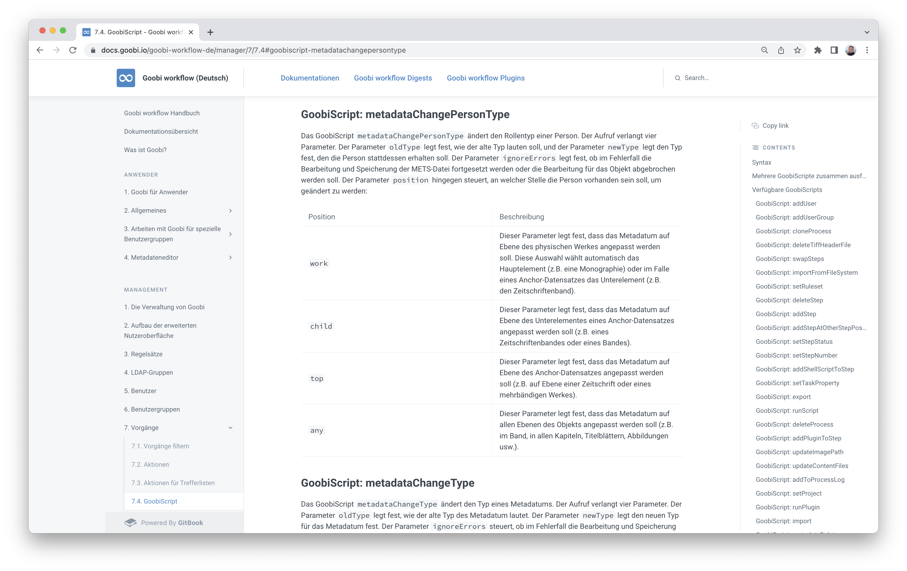

Hier der Link zur weiteren Hilfe:




## Neue Dokumentation für Entwickler
Lang hat es gedauert. Aber dafür ist es auch wirklich gut geworden: Es gibt nun eine sehr ausführliche Dokumentation für künftige Goobi workflow Entwickler. Dort wird detailliert aufgezeigt, wie man sich eine Entwicklungsumgebung aufsetzt, welche Tools für die Inbetriebnahme benötigt werden und welche Einstellungen man hier und da vornehmen sollte, damit die Entwicklung flüssig von der Hand geht.

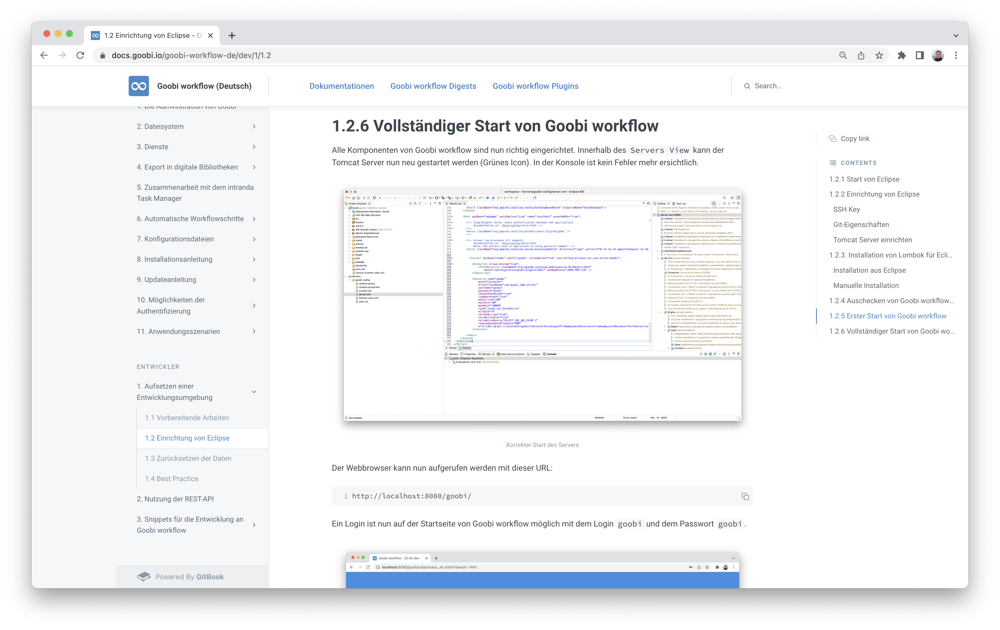

Um es den künftigen Entwicklern möglichst einfach zu machen haben wir innerhalb der Anleitung auch gleich noch dokumentiert, wie man sich sehr bequem einen kleinen sinnvollen Datenbestand einrichtet, damit die Entwicklung auch mit tatsächlichen sinnvollen Daten möglich ist. Hierzu kamen uns die vielen Erfahrungen im Umgang mit Goobi-to-go zugute.

Wer also schon immer mal an Goobi mitentwickeln wollte, hat es nun einfacher denn je. Hier gehts zur Doku:




## Export-Button nun in der Spalte "Aktionen" der Vorgangsdetails
Goobi worklow erlaubt schon seit einiger Zeit, dass innerhalb eines Workflows Exporte auch über Plugins stattfinden können. Diese ist für individuelle Exporte zu besonderen Systemen mit besonderen Formatanforderungen manchmal notwendig. Wenn allerdings innerhalb eines Workflows mehrere Exporte stattfinden sollen, dann war es bisher für Administratoren nicht möglich einen bestimmten Export eines Workflows gezielt auszuführen. Im Rahmen des Durchlaufens des Workflows hingegen funktionierten die Exporte jedoch bereits so wie gewünscht.

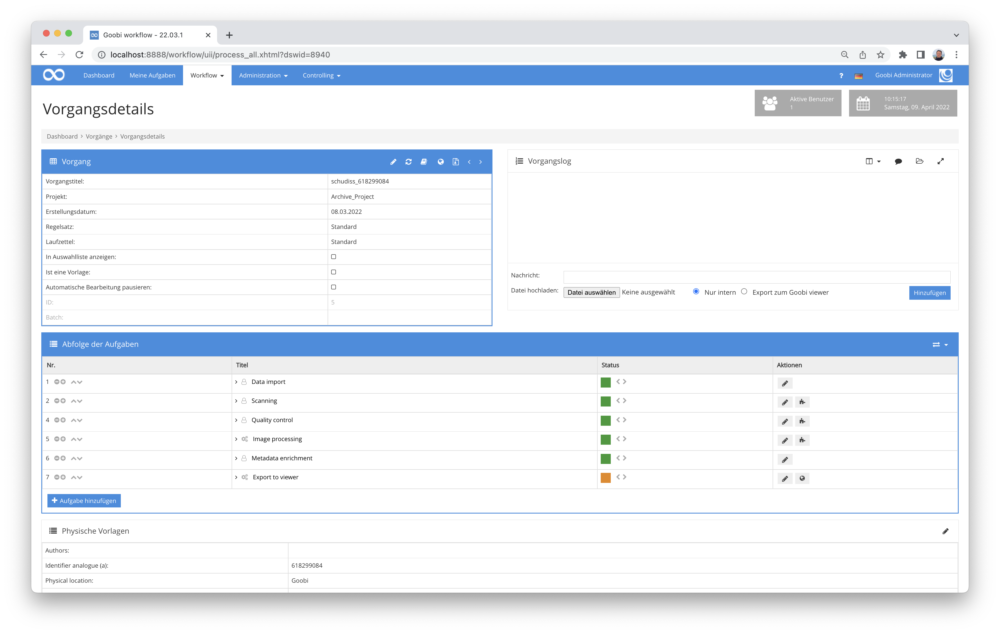

Um es nun auch für die Goobi Administratoren zu vereinfachen, dass gezielt einzelne Export-Schritte selektiv manuell aufzurufen, werden Export-Buttons nun innerhalb der Vorgangsdetails direkt neben den betreffenden Aufgaben angezeigt. Damit ist ein Aufruf jetzt wie gewünscht möglich geworden.


## Besseres Looging beim Ändern eines Schrittstatus via GoobiScript
Uns ist aufgefallen, dass das Logging innerhalb des Vorgangslogs noch verbesserungswürdig war, wenn mittels GoobiScript der Status von Aufgaben geändert wurde. Wir wollten gern, dass sowohl der alte als auch der neu gesetzte Status im Vorgangslog noch weiterhin gut nachvollziehbar sein sollten. Aus diesem Grund gab es hier jetzt eine kleine Anpassung, die solche Statusänderungen besser nachvollziehbar macht.

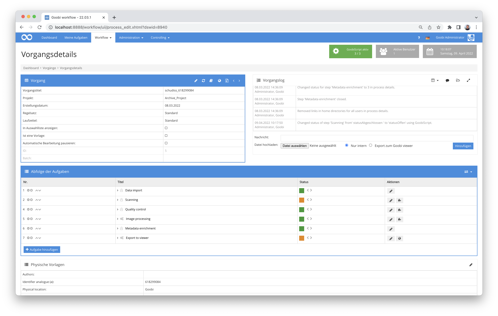


## Benennung der Backup-Dateien im Editor für Konfigurationsdateien und Regelsätze
Wir hatten kürzlich bereits die Benennung der Backup-Dateien für die METS-Dateien der Goobi-Vorgänge dahingehend geändert, dass diese im besser nachvollziehbar sind, nicht weiter rotieren und damit unnötige Schreibzugriffe auf langsame Speicherbereiche verursachen. Um dieses Benennungsschema nun konsequent umzusetzen, wenden wir diesen Mechanismus ab sofort ebenfalls für die automatisch erzeugten Backups der Dateien an, die innerhalb der noch recht neuen Editoren für die Konfigurationsdateien und Regelsätze erzeugt werden.

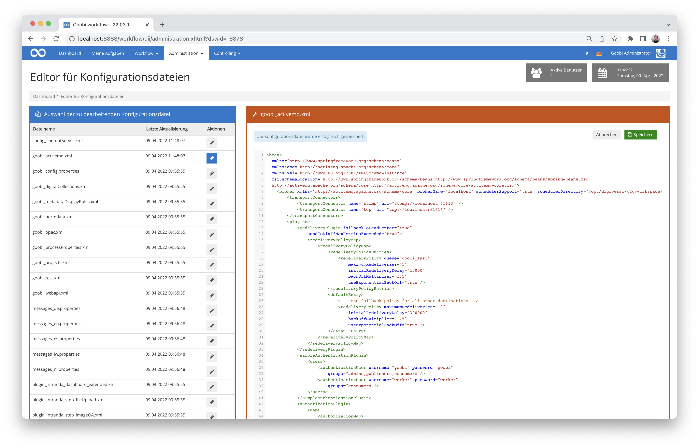

Auch hier ist die Benennung der Backup-Dateien nun so, dass aus dem Dateinamen unmittelbar das Datum und die Zeit des Backups ersichtlich wird und hilft im Falles des Falles gut weiter.

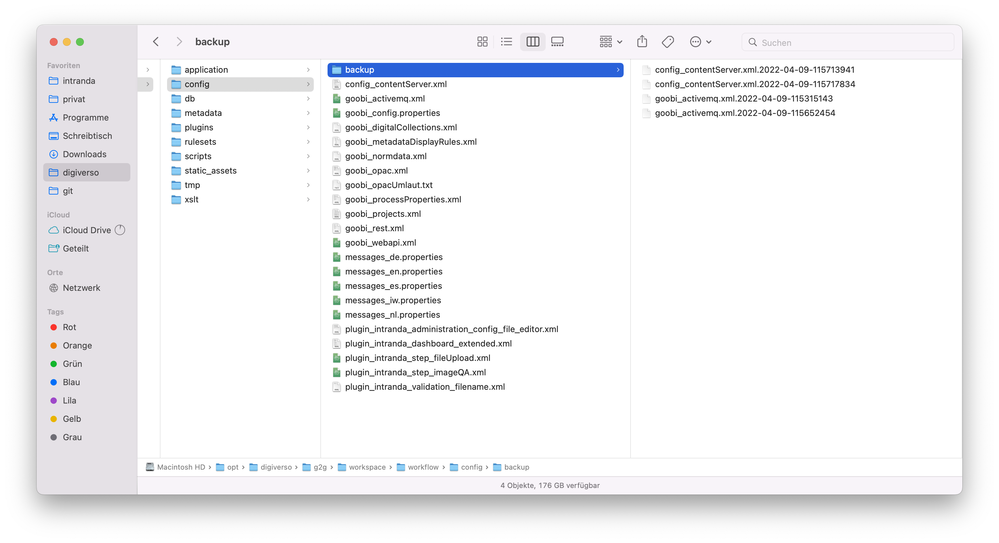


## WCAG: Änderungen hier und da
Dass uns das Thema der Barrierefreiheit nicht nur interessiert sondern auch Vollzeit beschäftigt haben wir ja schon des öfteren beschrieben. Insofern ist es nur konsequent, dass wir auch in diesem Monat wieder viele Kleinigkeiten zugunsten der Accessibility verbessert haben. Dies betraf nun vor allem die Darstellung des Vorgangslogs und einige Anpassungen für die Anzeige der Vorgangsliste.

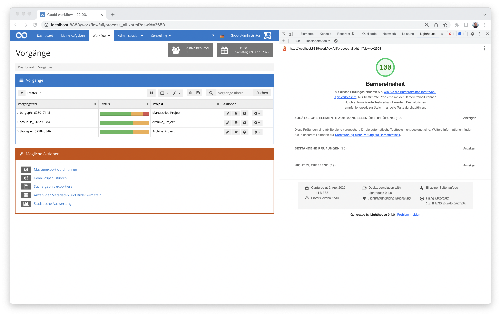

Es wird aber sicher nicht das letzte Mal sein, dass dieser Punkt hier in den Digests aufgeführt wird. 😀


## Implementierung einer ARK-Registrierung
Wir haben in der Vergangenheit bereits verschiedene Mechanismen für persistente Identifier in Goobi workflow integriert. So fanden neben URN auch Handle und DOI ihren Weg in das Goobi-Universum. Neu hinzugekommen ist kürzlich die Unterstützung von ARK-Identifiern. Hierbei handelt es sich um ein weiteres System, das im Zusammenspiel mit dem Goobi viewer eine dauerhafte Verlinkung von Werken und auch eine granulare Verlinkung auf Seitenebene erlaubt. Im Gegensatz zu anderen Systemen erfordern ARK-Identifier keine Lizenzkosten und können eigenständig frei vergeben werden. Mehr Informationen zu ARK im Allgemeinen finden sich hier:



Und hier findet sich die Dokumentation für das von uns entwickelte Plugin:



Der Quellcode zum Plugin findet sich bei GitHub hier veröffentlicht:




## Regelsatz als neue Spalte für Vorgänge und Produktionsvorlagen
Manchmal ist es hilfreich, wenn man gleich auf einen Blick sieht, welcher Regelsatz für eine Produktionsvorlage Verwendung findet. Aus diesem Grund kann der Regelsatz ab sofort innerhalb der Auflistung von Vorgängen und Produktionsvorlagen eingeblendet werden. So sieht das dann aus:

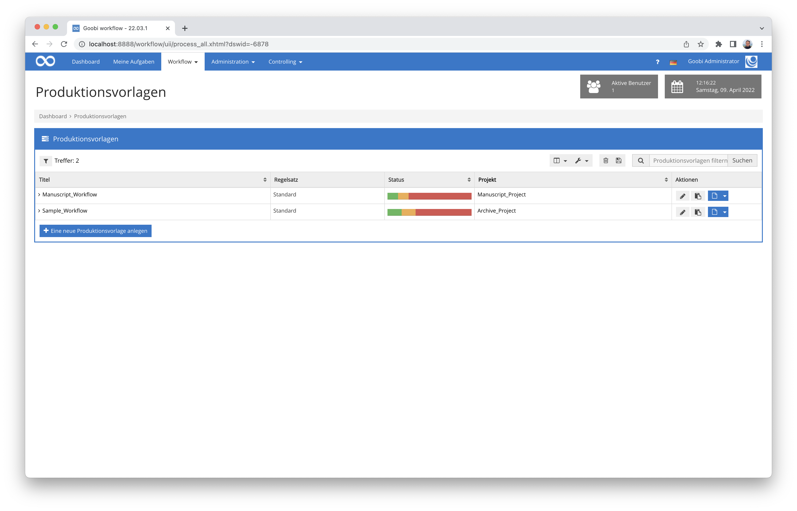


## Plugin zum Versenden von Mails
Es wurde ein neues Plugin für das Versenden von Mails innerhalb einer Aufgabe entwickelt. Die Liste der Empfänger und der Text lassen sich dabei für verschiedene Schritte individuell konfigurieren. Dabei stehen auch alle Felder aus dem Variablen-Replacer zur Verfügung. Somit kann auch auf Metadaten oder Informationen zum Vorgang, Schritt oder Projekt zurückgegriffen werden, um diese innerhalb der Mail zu verwenden.

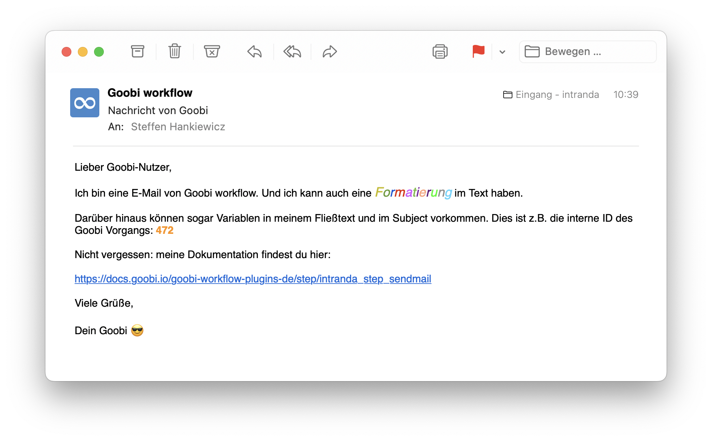

Die ausführliche Dokumentation für die Inbetriebnahme des Plugins findet sich hier:



Und an dieser Stelle findet sich das Plugin als Quellcode und in kompilierter Fassung:




## Erweiterung der Benutzereinstellungen zur individuellen Konfiguration des Anzeigemodus

Im Bereich "Allgemein" gibt es nun die Möglichkeit, den Anzeigemodus individuell festzulegen. Hier kann zwischen Normaler Anzeige, Low Vision Modus und WCAG kompatiblen Modus gewählt werden.

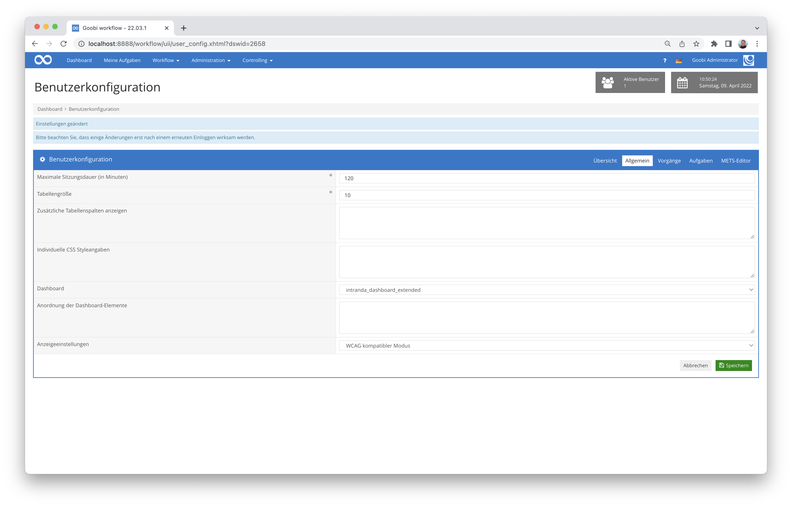


## Plugin zum Export von Zeitungen in das DDB Zeitungsportal
Wir haben ein neues Plugin für den Export von Zeitungen für das Zeitungsportal der DDB entwickelt. Das Plugin dient zur Erstellung der spezifischen METS-Struktur, die von Seiten der DDB für Zeitungen gefordert werden. Dabei wird für die Gesamtaufnahme einer Zeitung eine METS-Anchor Datei erzeugt. (https://wiki.deutsche-digitale-bibliothek.de/display/DFD/Gesamtaufnahme+Zeitung+1.0)

Für jeden exportierten Jahrgang wird eine weitere METS-Anchor Datei erzeugt und innerhalb der Gesamtaufnahme verlinkt. Der Jahrgang enthält weitere Strukturen für Monat und Tag. (https://wiki.deutsche-digitale-bibliothek.de/display/DFD/Jahrgang+Zeitung+1.0)

Jede Ausgabe hingegen wird als einzelne METS-Datei erstellt und in der METS-Anchor Datei des jeweiligen Jahrgangs verlinkt. Die Ausgabe kann weitere Strukturdaten wie Artikelbeschreibungen oder Beilagen enthalten. Hier wird auch auf die digitalisierten Bilder verwiesen. (https://wiki.deutsche-digitale-bibliothek.de/display/DFD/Ausgabe+Zeitung+1.0)

Eine detaillierte Dokumentation für das Plugin findet sich hier:


Und an dieser Stelle findet sich dann sowohl der Quellcodes des Plugins als auch die kompilierte Fassung des Plugins:



## Umfangreiche Umstellungen in der internen Projektstruktur
Die Entwicklung an Goobi workflow startete bereits im Jahr 2004. In der Zwischenzeit hat sich funktioniell viel Neues ergeben und die Applikation ist um ein vielfaches gewachsen. Um hierbei einerseits den Überblick weiterhin gut zu bewahren aber auch um etablierte Best-Practice für Software-Entwicklung einzuhalten (Maven-Verzeichnisstruktur) sowie künftig auch noch einfacher stets auf aktuellem Stand der verwendeten Programmbibliotheken zu bleiben, haben wir die Projektstruktur massiv überarbeitet. Dies sollte funktioniell für die Anwender keine Änderung mit sich bringen. Für uns als Entwickler sind das allerdings umfangreiche Eingriffe in den Arbeitsalltag und die Projektorganisation. Wenn Ihnen bei der Benutzung von Goobi workflow in kommender Zeit unerwünschte Seiteneffekte auffallen sollten, die sicher nicht gewünscht sein sollten, so lassen Sie uns dies bitte wissen.

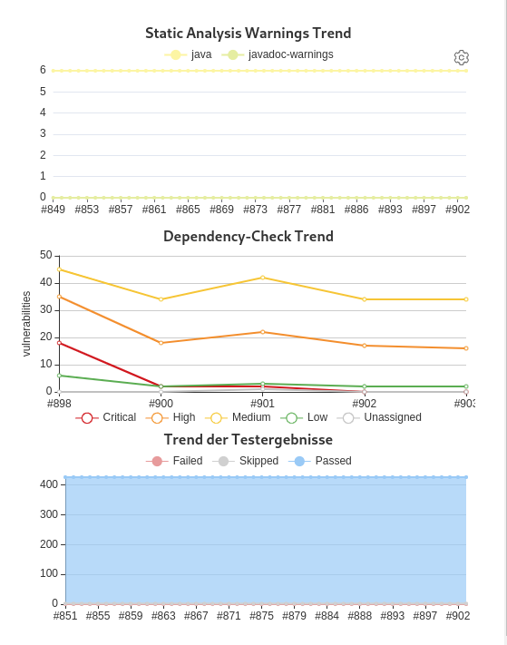

Im Übrigen haben sich durch diese Umstellungen auch bereits einige positive Ergebnisse gezeigt. Die durch die Umstellung vorgenommenen Updates verschiedener Programmbibliotheken führten bereits zu einer messbaren Steigerung der Sicherheit potentiell angreifbarer Code-Bestandteile externer Bibliotheken und eine bessere Automatisierbarkeit des Testens auf mögliche künftige Sicherheitslücken.


## Darstellungsfehler in einem Dropdown in den eigenen Aufgaben
Es gab einen kleinen Darstellungsfehler innerhalb der eigenen Aufgaben. Dort bestand ein eigenwilliger Zeilenumbruch mit ungewöhnlicher Zeichendarstellung, die dort nicht hingehörte. Dies haben wir korrigiert. Nix passiert. 😀


## Versionsbezeichnung
Die aktuelle Versionsnummer von Goobi workflow lautet mit diesem Release: **22.03**.
Innerhalb von Plugin-Entwicklungen muss für Maven-Projekte innerhalb der Datei `pom.xml` entsprechend folgende Abhängigkeit eingetragen werden:

```xml
<dependency>
  <groupId>de.intranda.goobi.workflow</groupId>
  <artifactId>goobi-core-jar</artifactId>
  <version>22.03</version>
</dependency>
```