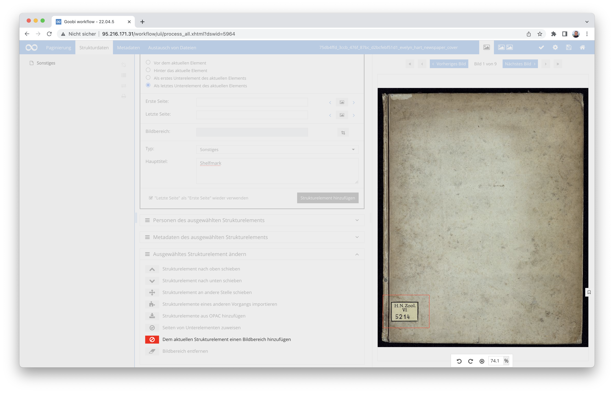
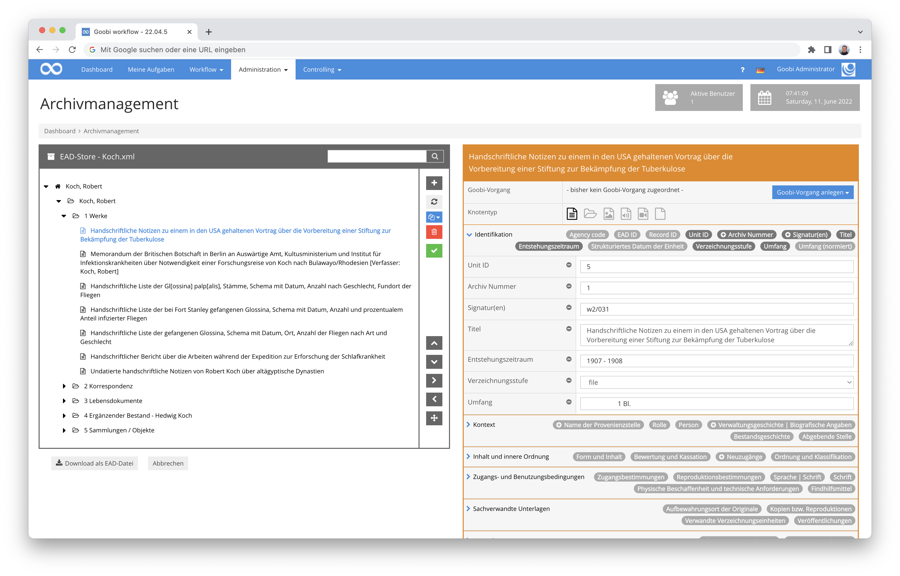
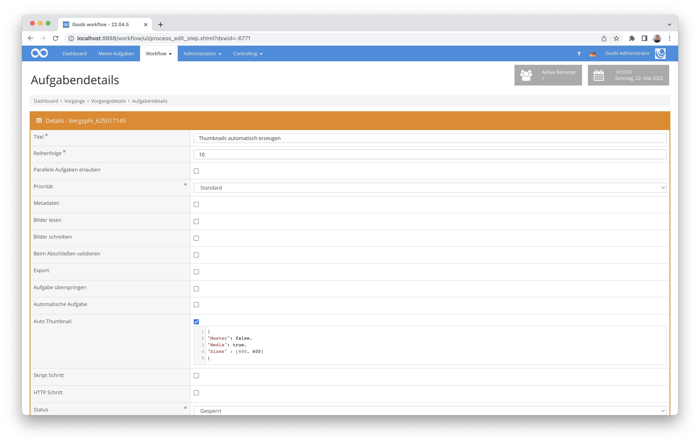
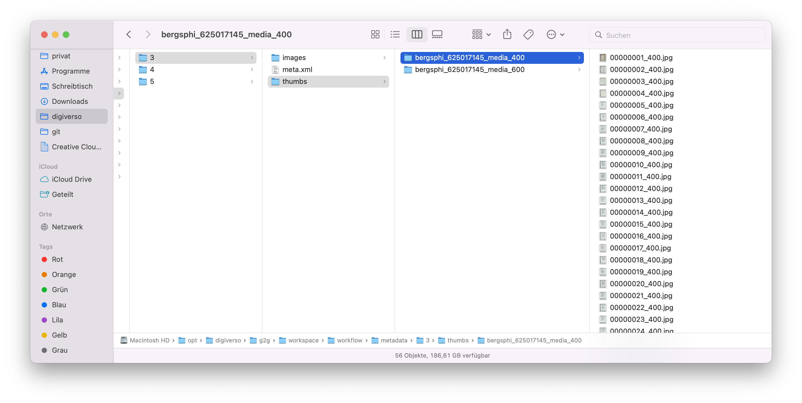
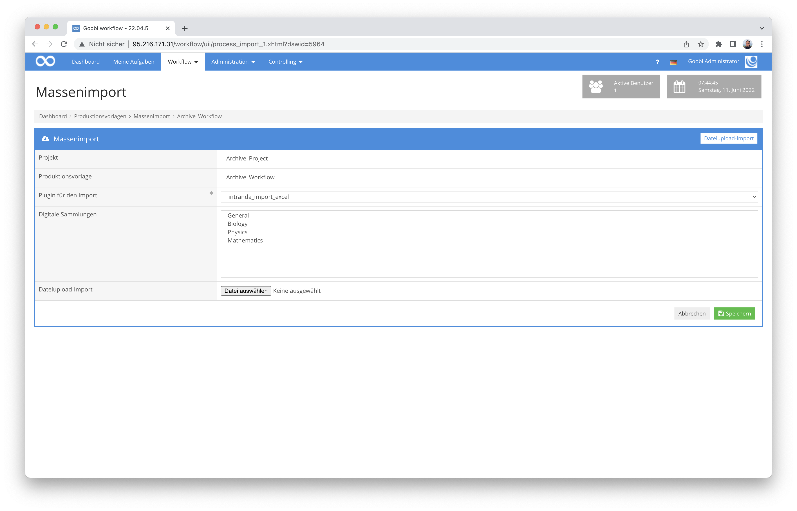

# April 2022

## Step-Plugin zur Laufzettelgenerierung
Wir haben ein neues Plugin entwickelt, dass die Generierung von Laufzetteln während des Workflows automatisiert. Bisher war es ja bereits möglich, dass Laufzettel unmittelbar nach dem Erzeugen von Vorgängen oder aber auch mit einem Plugin innerhalb von Aufgaben heruntergeladen werden konnten. Neu ist hinzugekommen, dass Laufzettel mit einem neuen Plugin als PDF oder Bilddatei erzeugt werden können sollen und dass diese automatisch in gewünschter Auflösung innerhalb eines konfigurierbaren Verzeichnisses gespeichert werden können.

Mehr Details zu dem Plugin finden sich in der ausführlichen Dokumentation hier:



Der Quellcode des Plugins findet sich bei GitHub veröffentlicht:




## Bildbereiche besser erfassbar
Nicht in allen Fällen war sichergestellt, dass die Bildbereichserfassung im Metadateneditor nur dann angezeigt war, wenn die zugehörigen Regelsätze dies auch erlauben. Dies haben wir noch einmal intensiv getestet und auch Änderungen an der Logik vorgenommen, um hier Fehler zu vermeiden. Wenn wir dabei an alle Bereiche gedacht haben, dann dürften hier keine Schwierigkeiten mehr zu erwarten sein für das Neuanlegen von Bildbereichen, das Hinzufügen weiterer Bildbereiche und das Löschen von Bildbereichen für Strukturelemente.



Um sicherzustellen, dass wir dies für Updates dennoch gut berücksichtigen, ist auch die Updateanleitung diesbezüglich aktualisiert worden. Dort findet sich entsprechend ein Hinweis auf die vorzunehmenden Anpassungen innerhalb der Regelsätze:




## Erweiterung der Editoren für Konfigurationsdateien und Regelsätze
Dass die beiden noch recht neuen Plugins zur Bearbeitung von Konfigurationsdateien und Regelsätzen so schnell so beliebt werden, hätten wir nicht erwartet. Im Zuge der raschen Verbreitung merkten wir dann recht bald, dass wir dort noch einiges optimieren sollten. So fiel uns unter anderem auf, dass die Benennung der Backup-Dateien noch einmal geändert werden sollten, dass eine Prüfung und Visualisierung der Schreibrechte für die Backup-Dateien und die zu bearbeitenden Dateien sinnvoll wäre und dass die Art und Weise, wie wir die Erfolgs- oder Fehlermeldungen anzeigen, noch einmal ändern sollten.

Alles in allem sollten beide Editoren nun also noch ein kleines bisschen praktischer sein, als sie ohnehin bereits waren. :)

Hier noch einmal die Links zu den aktualisierten Dokumentationen:






## Icon für Bestände im Archiv-Management
Es ist zwar nur eine Kleinigkeit, aber letztlich hat es uns selbst so gestört, dass wir nun froh sind über die Änderung: Der oberste Knoten eines jeden Bestandes innerhalb des Archiv-Management-Plugins wurde grundsätzlich fälschlicherweise mit einem Datei-Icon visualisiert. Um Missverständnisse zu vermeiden, ist dieser oberste Knotenpunkt nun adäquat ausgezeichnet und damit selbsterklärend für alle Anwender.




## Automatische Generierung von Vorschaubildern
Bei einem Arbeitsschritt kann nun konfiguriert werden, dass Vorschaubilder für die Anzeige im Metadateneditor oder Image-QA-Plugin erzeugt werden sollen.
Die Generierung dieser Vorschaubilder findet statt, wenn der Arbeitsschritt geöffnet werden soll. Wenn hierbei die interne Message Queue aktiv ist, findet die Bearbeitung darüber statt, ansonsten werden die Bilder direkt erzeugt.
Erst nachdem die Erzeugung dieser Vorschaubilder erfolgreich abgeschlossen wurde, wird anschließend der Arbeitsschritt für die Nutzer freigegeben, um diese annehmen zu können. Automatische Aufgaben hingegen werden nach der Erzeugung der Vorschaubilder direkt geschlossen.



Eine Konfiguration für die Erzeugung solcher Vorschaubilder sieht beispielhaft so aus:

```
{
"Master": false,
"Media": true,
# "Img_directory": additional directory,
# "Custom_script_command": "",
"Sizes" : [400, 600]
}
```
In den jeweiligen Verzeichnissen entstehen somit die Vorschaubildern, wie konfiguriert.




## Passwortlänge über Konfiguration steuerbar
Um sicherstellen zu können, dass die Nutzer sichere Passwörter verwenden, ist von nun an steuerbar, welche Mindestlänge Passwörter aufweisen müssen, wenn diese neu vergeben werden, wenn sie zurückgesetzt werden oder ein Nutzer sich selbst das Passwort ändern möchte.

In der Konfigurationsdatei `goobi_config.properties` kann ab jetzt der folgende optionale Wert für die Mindestlänge angegeben werden:

```toml
minimumPasswordLength=12
```

Dokumentiert ist dieser Konfigurationsschalter sowie auch viele andere im Goobi workflow Handbuch hier:




## Neues Plugin zur Metadatenanreicherung aus einer Excel-Datei
Es gib ein neues Plugin zur Anreicherung bestehender METS-Dateien auf der Basis vorliegender Excel-Dateien. Hierbei werden Metadaten und Personen aus einer konfigurierbaren Datei gelesen und in die Metadaten des Vorgangsübernommen.

Genauere Details zu dem Plugin und dessen Konfiguration finden sich hier:



Der Quellcode des Plugins wurde hier veröffentlicht:




## Neues Plugin zur Datenübername aus einem Verzeichnis
Ein weiteres neues Plugin wurde entwickelt, um vorliegende Daten aus einem Verzeichnis zu lesen und nach METS zu übernehmen. Hierbeit werden Metadaten, Strukturdaten und auch Paginierungsinformationen aus den Verzeichnissen übernommen. Genaueres findet sich hierzu in der Dokumentation:



Und auch dieses Plugin ist bei GitHub veröffentlicht:




## Neues Plugin für Manipulationen innerhalb der METS-Dateien
Für einen konkreten Anwendungsfall benötigten wir eine Möglichkeit, dass innerhalb von vorhandenen METS-Dateien automatisiert einzelne Metadaten ermittelt und interpretiert werden, um daraus anschließend eigenständige Metadaten innerhalb der METS-Datei zu erzeugen. Der bisherige Anwendungsfall ist derzeit noch sehr auf die Bedürfnisse des Stadtarchivs Kiel zugeschnitten und damit unter Umständen kaum für andere Goobi-Nutzer unverändert nachnutzbar. Das Plugin bietet aber eine gute Grundlage, um ähnliche Vorgaben in Zukunft auf dieser Basis zukünftig ebenso umzusetzen.

Die ausführliche Dokumentation für dieses neue Plugin findet sich hier:



Der Quellcode des Plugins wurde unter dieser Adresse bei GitHub veröffentlicht:




## Auswahl eines Massenimport-Plugins vereinfacht
In den meisten Anwendungsfällen sind innerhalb von Goobi nicht mehrere Massenimport-Plugins installiert. Aus diesem Grund haben wir eine kleine Änderung vorgenommen, um die Auswahl von Plugins in der Nutzeroberfläche zu vereinfachen. Steht dort nur ein Plugin zur Auswahl, so wird dieses nun stets sofort ausgewählt. Dies ist nicht nur logisch und bequemer sondern spart darüber hinaus auch noch unnötige Mausklicks.




## Erweiterung des Plugins zur Bearbeitung von Metadaten
Das bestehende Plugin zur Bearbeitung von Metadaten wurde erweitert, um dort die Metdaten auf die gleiche Art und Weise hinzufügen und löschen zu können, wie diese auch im Metadateneditor bereits der Fall ist. Dadurch die die Bedienlogik für den Anwender besser nachvollziehbar und das Plugin erlaubt zusätzliche Anwendungsszenarien. Die Dokumentation des Plugins findet sich nach wie vor unter dieser Adresse:




## Archivmanagement: Benennung von hochgeladenen EAD-Dateien
Bei der Möglichkeit, dass innerhalb des Archiv-Management-Plugins direkt EAD-Dateien hochgeladen können werden, wurden einige Nutzerszenarien zunächst nicht bedacht. Ein solches Szenario ist beispielsweise, dass die hochgeladenen Dateien ungünstige Dateibenennungen aufweisen können oder auch die Dateiendung fehlt. Solche Fälle werden jetzt abgefangen und auch Leerzeichen durch Unterstriche ersetzt. Auf diese Weise dürften Benennungsprobleme von EAD-Dateien der Vergangenheit angehören. Wenn aber dennoch Probleme mit künftigen Dateinamen für EAD-Dateien auftreten, so freuen wir uns über Rückmeldungen hierzu, um doch noch einmal Anpassungen vorzunehmen.


## Fehler beim GoobiScript metadataAdd werden besser geloggt
Bei der Ausführung des GoobiScripts `metadataAdd` erfolgte bisher kein vorbildliches Logging im Fehlerfall. Speziell haben wir dort die Anzeige von Informationen innerhalb des Vorgangslogs vermisst. Dies ist korrigiert worden.


## Überarbeitung des SRU-Clients
Für Techniker ist es vermutlich spannender als für andere: Wir haben die Implementierung des SRU-Clients komplett überarbeitet, da die dort verwendeten Programmbibliotheken End-of-Life erreicht haben. Mit einer Neuimplementierung, die auch in vielen OPAC-Plugins z.B. Verwendung findet sind wir hier nun wieder auf aktuellem Stand der Technik.


## Logging innerhalb des Plugins für den Massenupload
Uns ist aufgefallen, dass das Logging innerhalb des Massenupload-Plugins deutlich zu granular und dadurch für die Administratoren nicht mehr wirklich hilfreich war. Hier haben wir Änderungen vorgenommen, damit das Logging ab jetzt in dem Maße erfolgt, dass dieses für eventuell notwendige Fälle auch sachdienliche Hinweise darauf geben kann, was während des Upload passierte.


## Logging auch für das Ausloggen von Nutzern hilfreicher
Mehr Goobi-Anwender bringen immer auch mehr potentiell andere Nutzungsfälle und andere Infrastrukturen. Und so fällt uns dann durchaus auch einmal auf, wo wir etwas für uns selbst verbessern können oder sollten. So auch hier im Bereich des Ausloggens von Nutzern. Hier wünschten wir uns bereits ein besseres Logging, wenn Nutzer sich eingeloggt haben. Und jetzt haben wir dies ebenso für das Ausloggen nachgeholt. Darüber freut sich doch jeder Admin, oder?


## Bugfix für die Statistik "Speicherzuwachs über Zeit"
Im "Speicherzuwachs über Zeit" Statistikmodul konnte es bei großen Datenmengen zu Problemen bei der Darstellung kommen. Dies lag vor allem daran, dass der eingegebne Startzeitpunkt nicht übernommen und stattdessen der erste Eintrag in der Datenbank als Startdatum genommen wurde. Dies führte zu sehr großen Datenmengen (über 2500 Datensätze), mit denen die eingesetzte Visualisierungsbibliothek nicht mehr umgehen konnte. Das Startdatum wird mit den vorgenommenen Änderungen nun korrekt übernommen und die Darstellung nicht zu großer Zeiträume funktioniert wieder.


## Versionsbezeichnung
Die aktuelle Versionsnummer von Goobi workflow lautet mit diesem Release: **22.04**.
Innerhalb von Plugin-Entwicklungen muss für Maven-Projekte innerhalb der Datei `pom.xml` entsprechend folgende Abhängigkeit eingetragen werden:

```xml
<dependency>
  <groupId>de.intranda.goobi.workflow</groupId>
  <artifactId>goobi-core-jar</artifactId>
  <version>22.04</version>
</dependency>
```