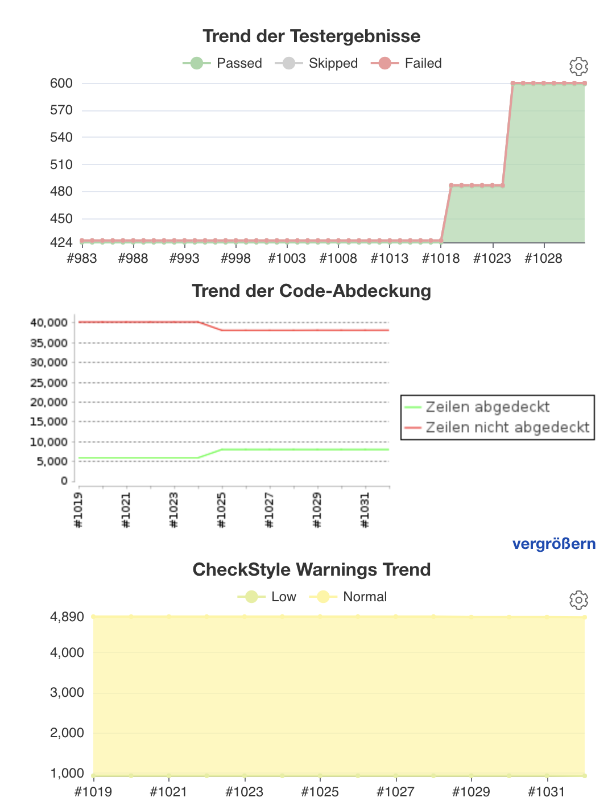

# Mai 2022

## Anzeige der Bilderanzahl in Aufgaben und Vorgängen
Innerhalb der Nutzeroberfläche ist es ab sofort möglich, sich die Anzahl der Bilder als Spalte einblenden zu lassen. Dies kann sowohl innerhalb der Vorgangsliste erfolgen als auch in den eigenen Aufgaben. Dies sieht dann beispielhaft so aus:


## Installierte Plugins besser überschaubar
Die unheimlich praktische Anzeige der installierten Plugins und deren Versionsstände haben wir leicht überarbeitet. Dort werden nun alle vorhandenen Plugins richtig sortiert aufgelistet und es werden auch die Pfadangaben zu den Verzeichnissen aufgeführt.


## Bessere Sortierbarkeit der Vorgänge und Aufgaben
In der Liste der Vorgänge haben wir einige Verbesserungen hinsichtlich der Sortierung vorgenommen. Der größte merkliche Unterschied wird dabei vermutlich nur den Administratoren auffallen:

Alle Spalten sortieren jetzt lexikographisch aufsteigend, wenn man die Sortierung einer Spalte aktiviert. Nur die Spalte mit der ID verhält sich anders und sortiert beim ersten Klick absteigend, um die aktuellsten Vorgänge sofort oben anzuzeigen. Administratoren wird es freuen. :)


## Projektstruktur optimiert
Goobi workflow verwendet seit einigen Jahren Maven als Buildsystem. Im vergangenen Monat wurde die Projektstruktur innerhalb von Maven weiter konsolidiert, so dass es ein dediziertes Modul für die Ausführung von automatischen Tests und Checks innerhalb der Continous Integration Infrastruktur gibt.

Die bereits vorher existierenden Module, um eine .war Datei für das Deployment der bekannten Applikation innerhalb eines Tomcats zu erstellen und das Modul um eine .jar Datei zu bauen, wurden aufgeräumt und sind jetzt nur noch für das Kompilieren der Artefakte zuständig. Neu hinzugekommen ist ein CI-Modul, dass vorher verstreute Schritte im Lifecycle bündelt und auch neue Checks integriert. Das sind im einzelnen:

* Das Ausführen der JUnit Tests
* Überprüfung der verwendeten Abhängigkeiten auf bekannte Sicherheitslücken (OWASP)
* Erstellen einer Analyse, wie viel Code mit Unit Tests abgedeckt ist (Jacoco)
* Überprüfung des Quelltexts auf Verstöße gegen ausgewählte Checkstyle Regeln
* Durchführen einer statischen Codeanalyse mittels Sonar

In dem gleichen Zuge wurde die Ausführung der Unit Tests von einer suite-basierten Infrastruktur auf eine klassenbasierte umgestellt. Die Anzahl der regelmäßig geprüften Tests konnte dabei massiv erhöht werden. Außerdem wurden letzte Codestellen aufgeräumt werden, die ein kompilieren mit Java 8 erforderten und explizite Compileroptionen benötigten.

Die veränderte Projektinfrastruktur ermöglicht jetzt ein schnelleres Bauen der einzelnen Module und dadurch weniger Overhead in der Entwicklung sowie eine erweiterte und verbesserte Prüfung der täglichen Arbeiten zur Erhöhung der Codequalität.

Wer unseren Fortschritt hinsichtlich der Codequalität nachvollziehen möchte kann dies hier gern jederzeit tun:



Noch zeigen die Diagramme auf, dass wir noch einiges vor uns haben. Aber wir sind auf dem Weg.


Und bei uns intern sieht der Fortschritt in etwa so aus momentan:



Es geht also voran. Wir berichten künftig öfter darüber hier.


## Bessere Log-Informationen über ausgeführtes GoobiScript
In der Vergangenheit ist uns des öfteren aufgefallen, dass wir uns mehr Logging gewünscht hatten, wenn einmal ein GoobiScript nicht das tut, was man sich erhofft hatte. Diese Thematik sind wir nun angegangen und haben es nun so gelöst, dass Administratoren in den Logdateien künftig gut nachvollziehen können, was aufgerufen wurde. Dort sieht es nun also in etwa so aus:


## Erweiterungen für das AEON-Plugin
Vor einiger Zeit hatten wir bereits darüber berichtet, dass wir eine umfangreiche Schnittstelle zu der Software AEON implementieren. Hier gab es wieder zahlreiche Erweiterungen. So wurde unter anderem die Optik der Oberfläche massiv überarbeitet.


Eigenschaften können für ganze Datenbestände oder auch für einzelne tatsächlich zu digitalisierende Objekte individuell angepasst oder übernommen, wobei Abweichungen von den Default-Werten klar visualisiert werden. Außerdem ist es nun möglich, dass Vorgänge, deren Digitalisierungsworkflow bereits in Bearbeitung ist, nun gestoppt werden können, sofern nicht bereits ein konfigurierbarer Status erreicht wurde.


Alles in allem also große Fortschritte, die aber auch noch weiter in Bearbeitung sind.


## GoobiScripte für Metadatenmanipulationen erweitert
Es gibt ja wirklich schon eine Menge an GoobiScripten. Und doch fällt immer mal wieder auf, dass eine bestimmte Funktionalität doch mal praktisch wäre. Diesmal ist uns aufgefallen, dass es doch schon ganz praktisch wäre, wenn wir die Manipulationen an Metadaten nicht nur in den logischen Bereichen der METS-Dateien vornehmen könnten, sondern auch innerhalb der Metadaten für die Bilder. Gesagt, getan. Neben den Parametern `work` `top` `child` und `any` ist es von nun an möglich, dass die GoobiScripte zur Manipulation der Metadaten auch `physical` verstehen und anwenden. Genaueres gibt es hier in der Dokumentation:




## Umstellungen des Datenbanktreibers
Damit Goobi workflow besser auch mit neueren MySQL-Datenbanken umgehen kann, haben wir den Treiber für die Kommunikation mit der Datenbank ersetzt. Von nun an setzen wir den folgenden Treiber ein:

```
software.aws.rds.jdbc.mysql.Driver
```

Damit ist es nun möglich, Goobi workflow mit den MySQL Versionen 5.7 und 8 zu betreiben. Die früheren Versionen hingegen werden damit nun nicht mehr unterstützt. Dies muss bei künftigen Updates also entsprechend berücksichtigt werden.

Innerhalb der Updateanleitung ist dies auch bereits aufgeführt:




## Erweiterung des Goobi-Handbuchs
Wie man an unseren Digests und den Plugins bereits gut nachvollziehen kann, steht bei uns die Dokumentation der Entwicklungen seit einigen Jahren sehr im Vordergrund. Aktuell haben wir uns hier übrigens auch den Konfigurationsdateien zugewendet. Der Bereich ist noch Work-in-Progress. Aber wer einmal schauen möchte, findet hier schon ein paar gute Beispiele:





Hier wird sich noch einiges tun in den nächsten Wochen.


## Bessere Anzeige von Informationen im Vorgangslog
Im Falle fehlgeschlagener Skriptaufrufe, war das Vorgangslog bisher nicht wirklich sehr hilfreich. Dies ist angepasst worden, so dass fehlerhafte Aufrufe nun mit einer klaren Fehlermeldung im Vorgangslog auftauchen.


## Neuer User: Passwort war kein markiertes Pflichtfeld
Fälschlicherweise wurde beim Anlegen neuer Nutzer nicht angezeigt, dass ein Passwort für einen neuen Account ein Pflichtfeld ist. Dies ist korrigiert worden.


## Versionsbezeichnung
Die aktuelle Versionsnummer von Goobi workflow lautet mit diesem Release: **22.05**.
Innerhalb von Plugin-Entwicklungen muss für Maven-Projekte innerhalb der Datei `pom.xml` entsprechend folgende Abhängigkeit eingetragen werden:

```xml
<dependency>
  <groupId>de.intranda.goobi.workflow</groupId>
  <artifactId>goobi-core-jar</artifactId>
  <version>22.05</version>
</dependency>
```