# Juni 2022

## Opac Plugin für Kalliope dokumentiert
Lange gibt es das Plugin schon. Aber irgendwie haben wir wohl noch keine Zeit gefunden, dass Plugin einmal zu dokumentieren, und so könnte man fast meinen, dass Goobi keine Anbindung an Kalliope hätte. Das stimmt aber nicht, denn diese Dokumention beweist, dass es ein solches Plugin schon längst gibt:



Wenn man genau im Quellcode schaut, der bei GitHub veröffentlicht wurde, dann sieht man sogar, dass es das Plugin bereits seit November 2014 gibt. Wer hätte das gedacht?




## Opac Plugin für Ariadne erweitert
Für die Anbindung von Ariadne haben wir bereits vor längerer Zeit ein Plugin implementiert. Dieses wurde nun erweitert, um den Publikationstyp flexibler steuern zu können. Und bei der Gelegenheit haben wir das Plugin auch gleich einmal ausführlich dokumentiert und bei GitHub veröffentlicht.

Hier findet sich die ausführliche Dokumentation für das Plugin:



Und hier haben wir das Plugin bei GitHub veröffentlicht:




## Neues flexibleres DOI-Plugin
Vor ca. 1,5 Jahren haben wir bereits ein Plugin veröffentlicht, das die Registrierung von DOIs erlaubte. So ganz glücklich waren wir mit der Implementierung aber nicht. Insbesondere wenn man sich einmal genau anschaut, was bei der Registrierung der Persistenten Identifier bei DataCite in einem eigenen Metadatenschema gemeldet werden kann, erkennt man, dass die bisherige Lösung dort enge Grenzen hatte. Aus diesem Grund haben wir nun ein zweites DOI-Plugin implementiert, dass deutlich flexibler ist und auf der Basis von XSLT nahezu alle erdenklichen Datenformate erzeugen könnte.

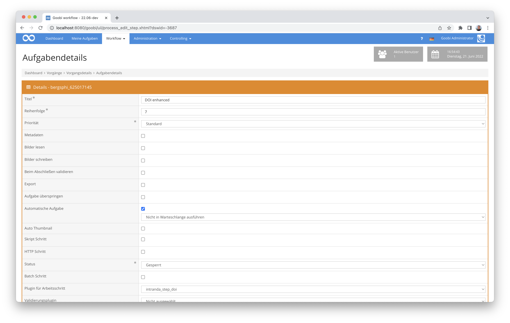

Hier haben wir das Plugin einmal genau dokumentiert:


Der Quelltext für das Plugin wurde hier bei GitHub veröffentlicht:



## Umbau der Inline-Hilfe
Goobi worklow hat schon seit geraumer Zeit eine integrierte Hilfe. Diese erlaubt, dass insbesondere bei verschiedenen Formularen Hilfetexte eingeblendet werden können, die für die Eingabe eine Unterstützung sind. Unglücklicherweise war dort bisher das Problem, dass beim Umschalten dieser integrierten Hilfe auch stets die Seite neu geladen wurde, so dass bereits im Formular eingetragene oder geänderte Werte wieder zurückgesetzt wurden, wenn diese noch nicht gespeichert waren.

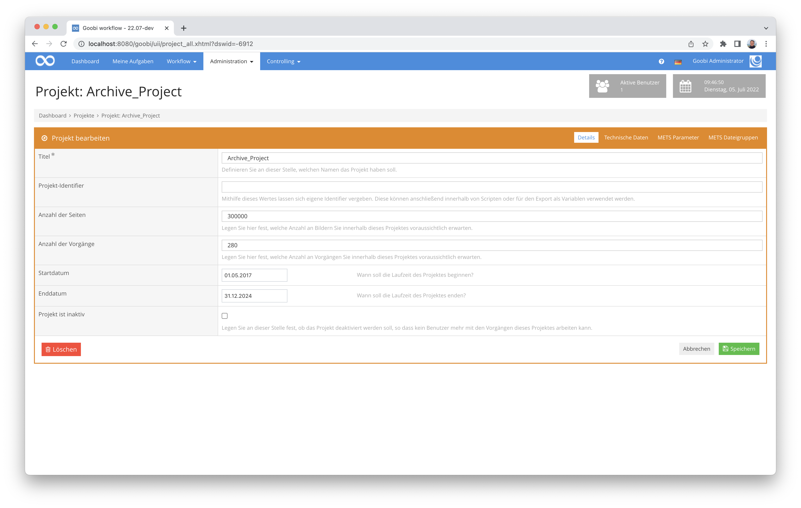

Hier gab es jetzt eine Umstellung, wie die Anzeige der Hilfe aktiviert wird. Sie lädt ab nun allein über JavaScript und kann somit auch ohne ein Neuladen der Seite eingeblendet werden. Das vermeidet die Problematik, dass ungespeicherte Inhalte versehentlich zurückgesetzt werden.

## (Weiter-)Entwicklung eines Plugins für einen flexiblen Export
Wir haben bereits vor einigen Jahren ein Export-Plugin entwickelt, dass einen sehr flexiblen Export erlaubt und wo sich unter anderem steuern liess, welche Bildverzeichnisse alle für den Export berücksichtigt werden sollten. Dieses Plugin haben wir nun noch einmal massiv erweitert und auch vorbildlich dokumentiert. Es erlaubt nun unter anderem auch, dass innerhalb eines Exportaufrufs abhängig von einem vorhandenen Metadatum ein Export in mehrere Goobi viewer erfolgen kann und dabei z.B. unterschiedlichen Bildverzeichnisse genutzt werden und ein verschiedener Umgang mit OCR-Daten erfolgen soll.

Mehr Informationen gibt es wie gewohnt hier in der neuen Dokumentation:


Und hier haben wir das neue Plugin bei GitHub veröffentlicht:



## Erweiterung des Goobi-Handbuchs für Konfigurationsdateien
Im Grunde war der ganze Monat stark auf Dokumentation ausgerichtet. Denn neben den frisch erstellten Dokumentationen für neue und auch schon bestehende Plugins ist insbesondere in dem Bereich der Konfigurationsdateien viel Neues hinzugekommen.

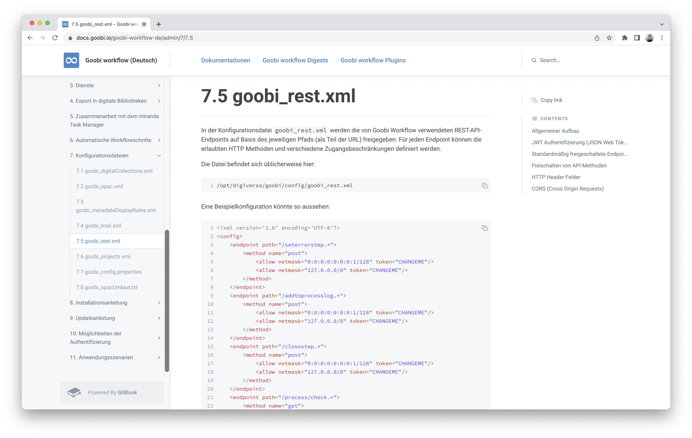

Folgende Konfigurationsdateien von Goobi workflow sind neu dokumentiert oder in ihrer bestehenden Dokumentation massiv überarbeitet worden:

### goobi_metadataDisplayRules.xml
Diese Konfigurationsdatei ist maßgeblich dafür, wie sich die Eingabefelder innerhalb des Metdateneditors verhalten sollen:



### goobi_rest.xml
In dieser Konfigurationsdatei wird festgelegt, auf welche Bereich der REST-API externe Dienste zugreifen dürfen und wie sie sich authentifizieren müssen:




### goobi_opac.xml
Diese Konfigurationsdatei legt die Kataloge fest, aus denen Goobi workflow Daten importieren können soll:




### goobi_opacUmlaut.txt
Diese Konfigurationsdatei steuert, wie mit Umlauten, die bei der Katalogabfrage zurückgegeben werden, verfahren werden soll:




### goobi_projects.xml
Diese umfangreiche Konfigurationsdatei erlaubt einen Einfluß darauf zu nehmen, wie genau die Anlegemaske von Goobi aufgebaut sein soll:




## Korrektur für GoobiScript bei Ausführung von mehreren setTaskProperty-Aufrufen
Es gab einige besondere Ausnahmefälle, bei denen die Ausführung mehrerer GoobiScripte nur das jeweils letzte der gleichzeitig abgesendeten Kommandos ausgeführt hat. Dies konnte glücklicherweise nun aber gefunden und behoben werden, so dass auch solche gleichartigen Kommandos nun an Goobi übergeben werden können und korrekt ausgeführt werden.

```yaml
---
action: setTaskProperty
steptitle: "My step"
property: readimages
value: true

---
action: setTaskProperty
steptitle: "My step"
property: writeimages
value: true

---
action: setTaskProperty
steptitle: "My step"
property: metadata
value: false

---
action: setTaskProperty
steptitle: "My step"
property: exportdms
value: false
```


## Gültigkeitsdauer der Session
Goobi workflow hatte über viele Jahre schon die Möglichkeit, dass Nutzer sich ein individuelles Session-Timeout einstellen können. Davon haben nur sehr wenige Nutzer Gebrauch gemacht und dies auch nur deswegen, weil der Standardwert auf zu kurze 30 min eingestellt war. hier haben wir nun eine Änderung vorgenommen. Der neue Standardwert ist ab nun 4 Stunden.


## Verarbeitung und Bereitstellung von E-Pflicht-Publikationen - Work in Progress
Zusammen mit der Zentral- und Landesbibliothek Berlin (ZLB) entwickeln wir gerade eine ganz neue Funktionalität für die Verarbeitung und Bereitstellung von E-Pflicht-Publikationen. Hierbei handelt es sich ingesamt um ein recht sportliches Vorhaben mit teilweise enormer Komplexität. Aus diesem Grund wird sich die Entwicklung der Funktionalität auch noch über ein paar Wochen erstrecken. Um die Welt da draußen aber nicht ewig auf die Folter zu spannen, möchten wir hier einmal einen kleinen Einblick in den aktuellen Status quo der Entwicklungen ermöglichen, indem wir hier einmal verschiedene Screenshots der (noch) nur deutschsprachigen Oberfläche zeigen:

Auf einer eigens angepassten Oberfläche im Corporate Design können sich die Abliefernden in Goobi workflow einloggen oder registrieren.

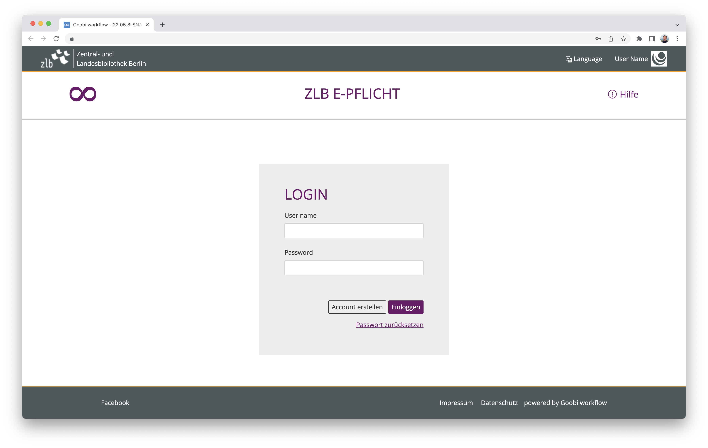

Abliefernde Einrichtungen legen sich in einer möglichst intuitiv bedienbaren Oberläche eigene Benutzerkonten an.

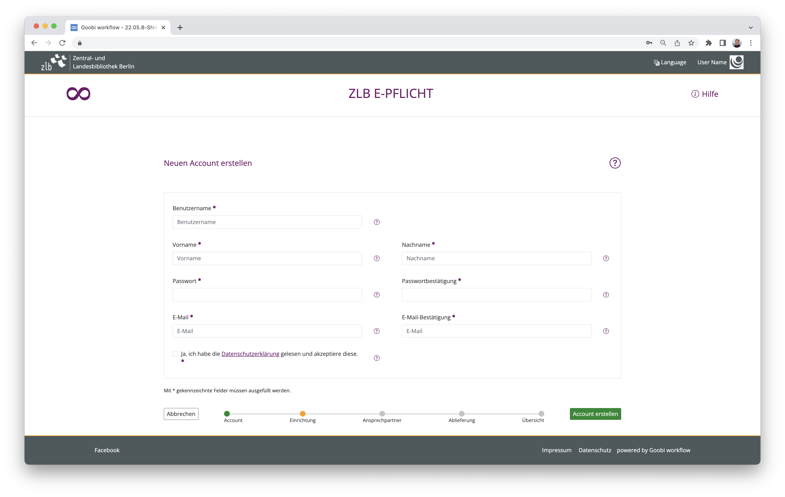

Nachdem die ZLB neu registrierte Nutzer für die Ablieferung freigeschaltet hat, können diese weitere Daten zu der abliefernden Institution ergänzen.

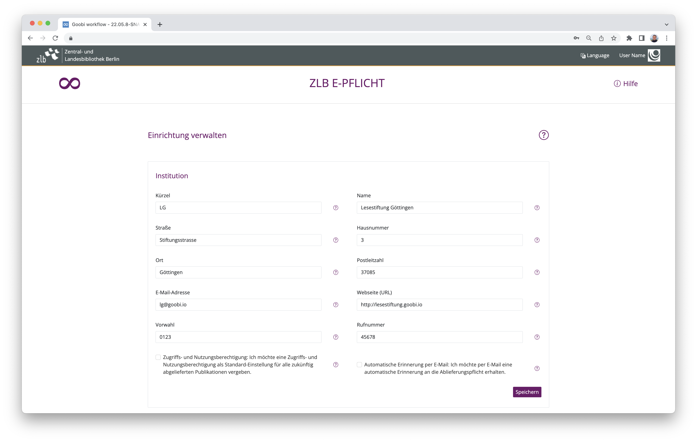

Nach vollständiger Registrierung der abliefernden Einrichtung sind verschiedene Aktionen möglich, so unter anderem die Ablieferung von eigenständigen Werken.

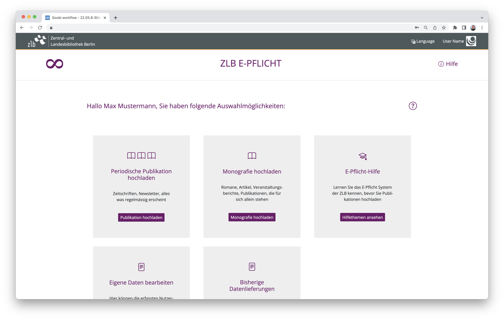

Innerhalb der Nutzeroberfläche ist es über eine eingebettete Hilfefunktion jederzeit möglich, sich Hilfetexte zur Eingabe anzeigen zu lassen.

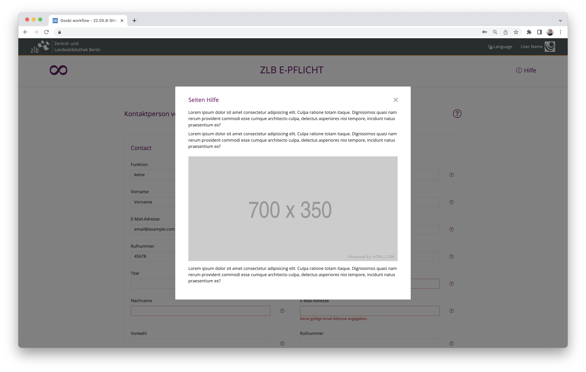

Innerhalb der regulären Oberfläche von Goobi workkflow sorgt ein besonderes Administrationsplugin dafür, dass die ZLB einen Überflick über alle abliefernden Einrichtungen behält, die in Goobi als Mandanten vorliegen.

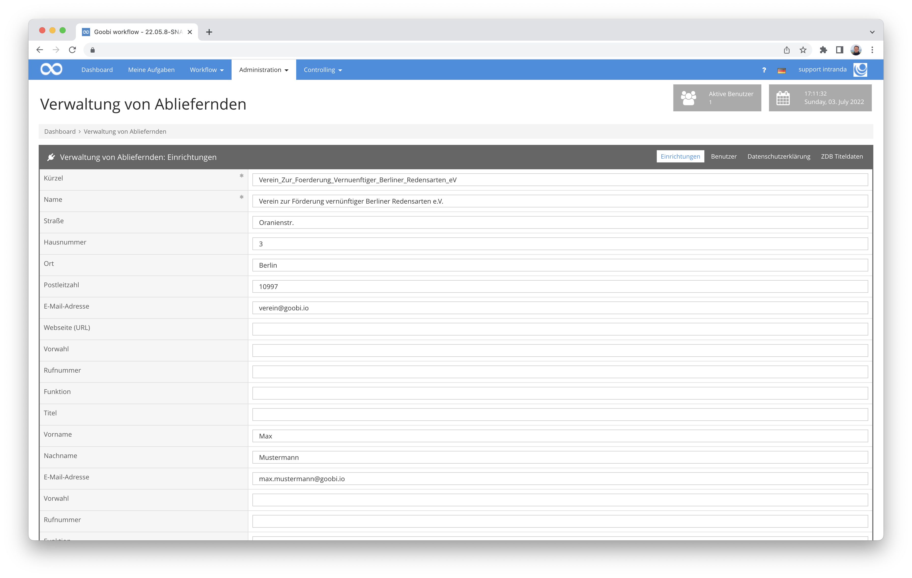

Auch die zugehörigen Nutzer einer abliefernden Einrichtung lassen sich über die administrativen Bereiche verwalten.

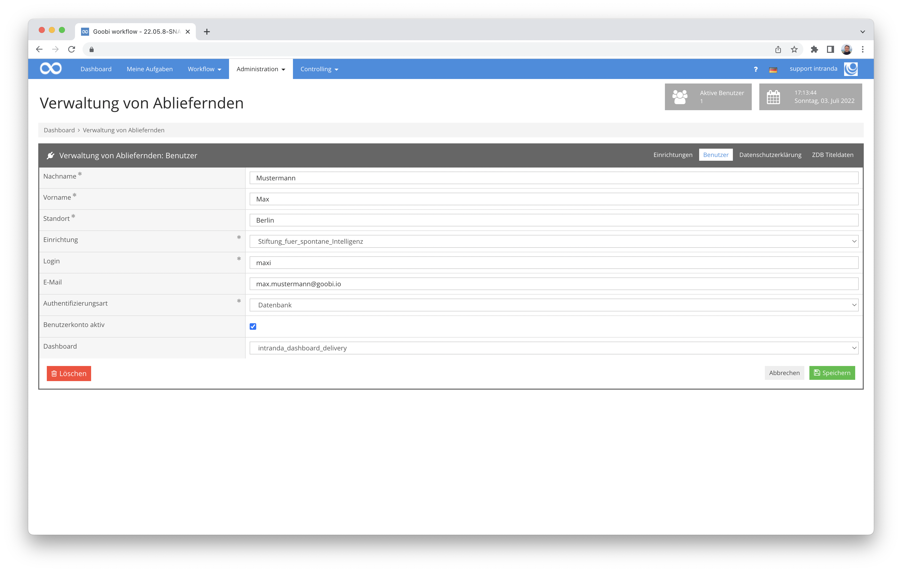

Unter anderem ist auch die Datenschutzerklärung in diesem Bereich bearbeitbar, die die Abliefernden während der Registrierung akzeptieren.

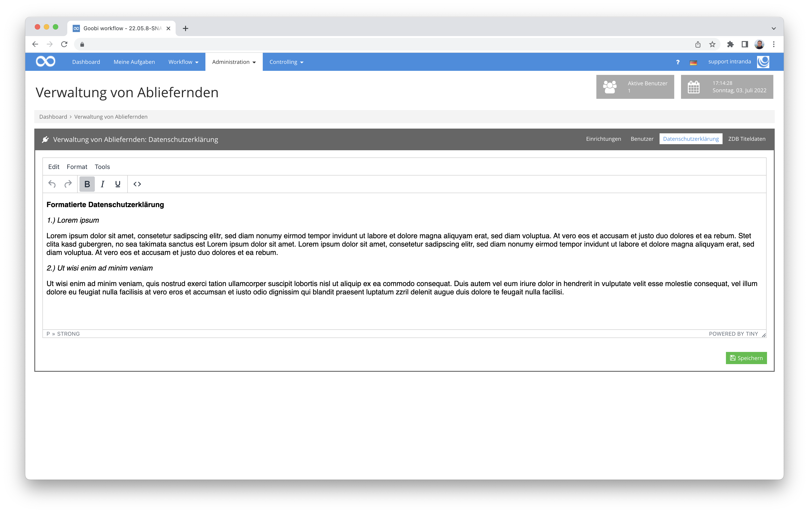

Alles in allem ist hier also bereits schon viel geschehen. Die Arbeiten sind aber noch in vollem Gang und werden noch einiges an Zeit in Anspruch nehmen. Manche Funktionen und Oberflächen werden sich vermutlich auch noch einmal deutlich ändern in den kommenden Wochen. Aber als ein erster Einblick zeigen die Screenshots hier bereits gut, was in den nächsten Wochen und Monaten als weitere Funktionalität für alle Interessierten als Open-Source-Lösung bereitstehen wird.


## Versionsbezeichnung
Die aktuelle Versionsnummer von Goobi workflow lautet mit diesem Release: **22.06**.
Innerhalb von Plugin-Entwicklungen muss für Maven-Projekte innerhalb der Datei `pom.xml` entsprechend folgende Abhängigkeit eingetragen werden:

```xml
<dependency>
  <groupId>de.intranda.goobi.workflow</groupId>
  <artifactId>goobi-core-jar</artifactId>
  <version>22.06</version>
</dependency>
```