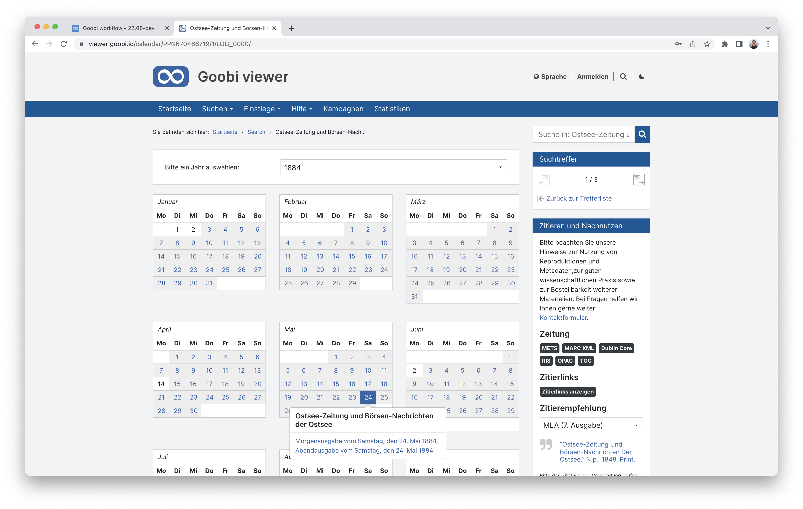

# Juli 2022

## Core

### Generierung von URLs für die SRU Schnittstelle und das IIIF Manifest
In den Projekteinstellungen gibt es nun im Reiter `METS Parameter` zwei zusätzliche Felder zur Erfassung der URL zur SRU Schnittstele des Goobi viewers und der URL des IIIF Manifests für das Gesamtwerk.


Beispielhafte Einträge könnten hierbei wie folgt aussehen:

```
http://viewer.example.org/sru/$(meta.CatalogIDDigital)
https://viewer.example.org/api/v1/records/$(meta.CatalogIDDigital)/manifest/
```

Das Ergebnis innerhalb einer so erzeugten METS-Datei ist entsprechend dann wie folgt:

```xml
<dv:links>
<dv:iiif>https://viewer.example.org/api/v1/records/1234567889/manifest/</dv:iiif>
<dv:sru>http://viewer.example.org/sru/1234567889</dv:sru>
</dv:links>
```


### Anpassungen für die Bildkommentare
Vor nicht allzu langer Zeit haben wir die neuen Bildkommentare hier vorgestellt. Mit deren erster Nutzung an verschiedenen Einrichtungen ist uns allerdings aufgefallen, dass der interne Speicherort für die Daten nicht ideal war. Aus diesem Grund haben wir hierfür eine Änderung vorgenommen. Wer diese Funktionalität also bereits in Verwendung hatte, sollte daher beim nächsten Update unsere hier bereitstellte Updateanleitung beachten:




### GoobiScript metadataChangeType korrigiert
Bei dem GoobiScript `metadataChangeType` funktionierte der Parameter `any` nicht wie erwartet. Dies wurde korrgiert und erlaubt nun wie gewünscht die Änderung von Metadaten auf allen Ebenen einer METS-Datei. 


Der Vollständigkeit halber hier nochmal der Link zur ausführlichen Dokumentation von GoobiScript:




### Logging beim Applikations-Stop verbessert
Administratoren lieben Logging. Das hilft, um im Fehlerfall besser nachvollziehen zu können, warum ein Problem aufgetreten ist und was als Auslöser für ein Fehlverhalten in Betracht gezogen werden kann. Für einen verläßlichen Betrieb produktiver Applikationen ist ein sinnvolles Logging nicht nur hilfreich, sondern oft auch einfach zwingend notwendig. Umso besser ist es, wenn die Entwickler einer Software eng mit den Admistratoren zusammenarbeiten, die die Software tatsächlich betreiben. 

Ergebnis einer solchen Zusammenarbeit im Kontext Goobi ist, dass wir permanent versuchen, dass eben auch das Logging von Goobi workflow verbessert wird. In diesem Monat haben wir das Logging beim Applikations-Stop einmal näher betrachtet und einiges verbessert. Denn zu viel Logging ist manchmal schließlich auch nicht richtig. 


## Plugins

### Verarbeitung von Zeitungen
Auf den Goobi-Tagen hatten wir darüber schon einmal berichtet. In den letzten Monaten kamen unsere Entwicklungen für die Verarbeitung von Zeitungen aber immer häufiger in den Einsatz. Deswegen möchten wir das Thema zusammen mit den letzten Entwicklungen noch einmal explizit aufgreifen:

Für Goobi besteht bereits seit einger Zeit die Möglichkeit, dass Zeitungsausgaben semiautomatisch erkannt und mit Metadaten erschlossen werden. Dazu erfolgt im Workflow zunächst eine automatische Erkennung von Zeitungsausgaben auf der Basis von trainierten Modellen. Diese haben wir kürzlich noch einmal deutlich erweitert und mit mehr Ground-Truth-Daten gefüttert. Somit ist die Erkennungsgenauigkeit von Zeitungsausgaben um ein vielfaches besser geworden. 


Nach dieser automatischen Erkennung steht in Goobi worklow ein Plugin zur Anreicherung der Zeitungsausgaben mit ausgabenbezogenen Metadaten bereit. Dieses erlaubt relativ bequem, dass Ausgabennummern, Datumsangaben sowie auch die Erscheinungstage samt Morgens- und Abendausgaben erfasst werden können, ohne dass man dies für jede Ausgabe einzeln machen müsste. Stattdessen greift hier ein Semi-Automatismus, der mit wenigen Angaben eines Nutzers die Folgeausgaben entsprechend hochzählt, mit Datumsangaben anreichert und auch benennt.


Darüber hinaus lassen sie hier auch Beilagen schnell erzeugen, so dass anschließend eine umfangreiche METS-Datei erzeugt wird, die über normierte Datumsangaben verfügt und im Goobi viewer z.B. über einen Kalendereinstieg recherchierbar ist. 




Um den Anforderungen der Deutschen Digitalen Bibliothek und des DFG-Viewers gerecht zu werden, gibt es seit kurzem übrigens auch ein zusätzliches Export-Plugin, dass die Daten entsprechend den Vorgaben aufbereitet und bereitstellt.


An diesen hier beschriebenen einzelnen Komponenten haben wir in den letzen Monaten viel gearbeitet und immer wieder Optimierungen auch hinsichtlich der Bedienung vorgenommen. Einiges wird in den nächsten Wochen hier auch noch weiter passieren. Gern können wir das in einem Workshop auf den kommenden Goobi-Tagen auch einmal detailliert vorstellen.


### Massenimporte mit Archivbestand-Anreicherung
Bisher hatten wir auf die verschiedenen neueren Import-Plugins noch gar nicht hingewiesen, die wir in letzter Zeit für einige spezifische Massenimporte umgesetzt hatten. Für diese Plugins existieren bisher auch noch keine ausführlichen eigenständigen Dokumentationen. 


Uns ist aber dennoch wichtig einmal darauf hinzuweisen, dass es mehrere neue Massenimporte gibt, die ihrerseits oft nicht nur Vorgänge in Goobi workflow anlegen sondern ebenso immer häufiger sogar ganze Archivbäume mit einer Tektonik erzeugen oder anreichern.


Je nach Projekt können hierbei im Übrigen auch wie bei anderen Importern für Goobi workflow strukturierte METS-Dateien erzeugt werden, wo jeweils Strukturelmente und zugehörige Metadaten samt Normdaten zu den zugehörigen Bilddateien eingespielt werden.


### Bessere Volltextextraktion aus PDF-Dateien

Das Step-Plugin `intranda_step_pdf-extraction`erlaubt, dass Volltexte aus PDF-Dateien extrahiert und als ALTO-Dateien gespeichert werden können. Dabei ist uns allerdings kürzlich ein Fehler in der Verarbeitung aufgefallen, der dafür verantwortlich war, dass innerhalb von manchen Wörtern unpassende Lücken entstanden sind, unter anderem durch eine vorhandene Silbentrennung in den Wörtern.

Die Ursache dieses Problems konnten wir nun finden und beheben. Dokumentiert war das Plugin übrigens hier schon:



Veröffentlicht haben wir das Plugin ist unter der folgenden URL, wo nun auch die korrigierte Fassung heruntergeladen werden kann:




## Dokumentationen

Im Bereich unserer Dokumentationen ist auch wieder viel passiert:

### Inline-Dokumentation für GoobiScript
Bei dem GoobiScript `addToProcessLog` waren die enthaltenen Erläuterungen nicht ideal. Hier gab es eine kleine Korrektur, die nun so aussieht:


### Kleine Umstellung in der Updateanleitung
Damit die Updateanleitung für Goobi workflow intuitiver ist, ist sie nun nicht mehr nach Datum gegliedert, sondern nach der jeweils veröffentlichten Version. Diese Umstellung gilt nur für alle künftigen Hinweise, die dort aufgenomnmen werden und nicht rückwirkend. Sie sollte es für Administratoren hoffentlich künftig etwas übersichtlicher machen. 


### Konfigurationsdateien
Wir haben wieder ein beachtliches Maß an Energie in die Dokumentation weiterer Konfigurationsdateien gesteckt. Annähernd alle Konfigurationsdateien sind dort nun bereits vorbildlich dokumentiert. Ein paar Restarbeiten stehen noch an. Wer aber einmal schauen mag findet hier einige Beispiellinks zu neuen Dokumentationen:

Konfiguration für Laufzettel:


Konfiguration der Warteschlangen:


Konfiguration für Eigenschaften:


Konfiguration für Übersetzungen:


Konfiguration für die Web-Api:


Konfiguration für die Normdaten:


Konfiguration für die Feldanzeige im Metadateneditor:



## Versionsbezeichnung
Die aktuelle Versionsnummer von Goobi workflow lautet mit diesem Release: **22.07**.
Innerhalb von Plugin-Entwicklungen muss für Maven-Projekte innerhalb der Datei `pom.xml` entsprechend folgende Abhängigkeit eingetragen werden:

```xml
<dependency>
  <groupId>de.intranda.goobi.workflow</groupId>
  <artifactId>goobi-core-jar</artifactId>
  <version>22.07</version>
</dependency>
```