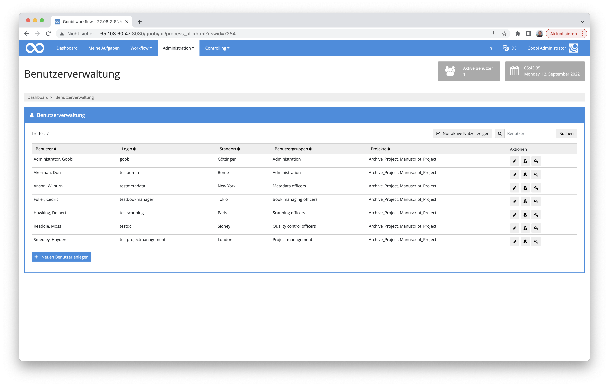
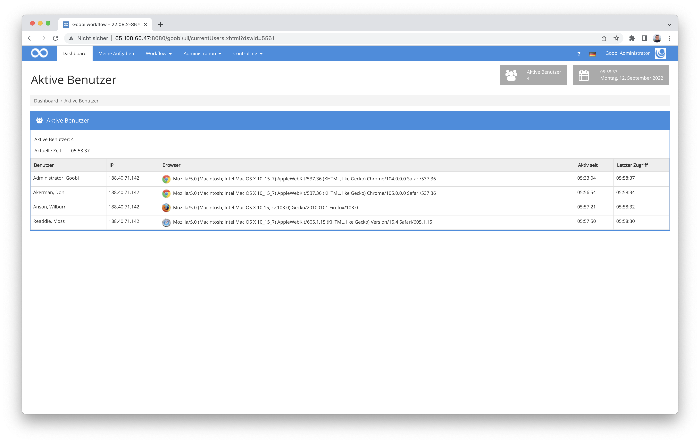
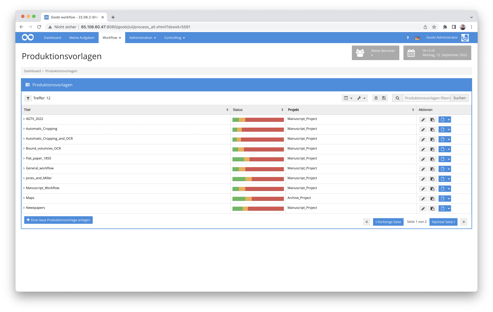
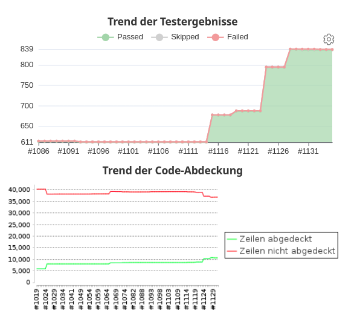
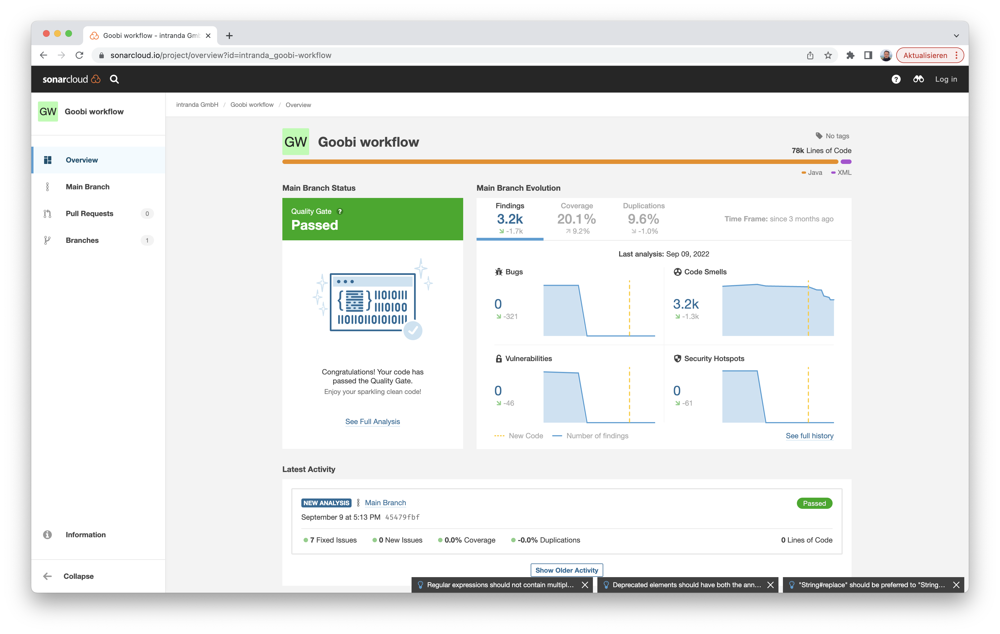
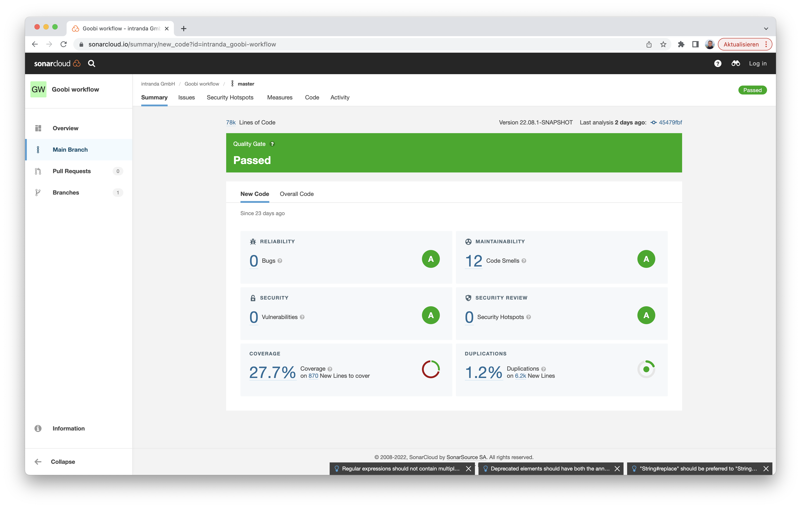
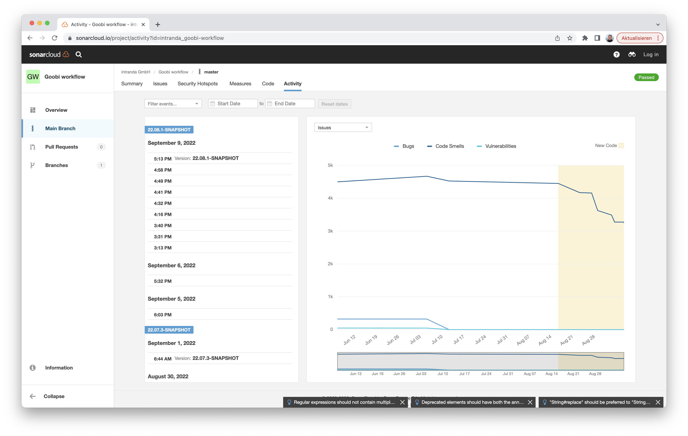
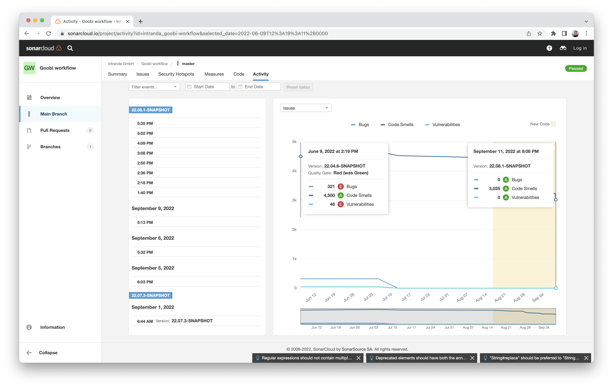
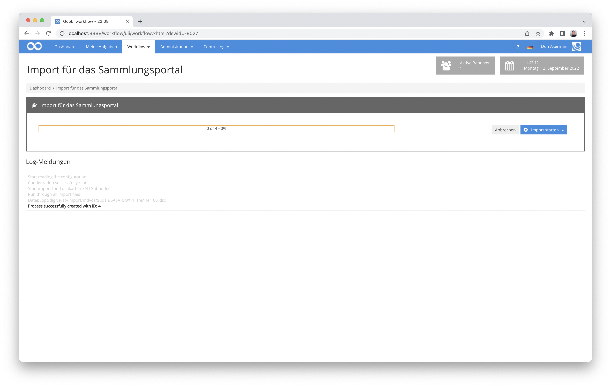

# August 2022

<!-- +++++++++++++++++++++++++++++++++++++++++++++++++++++++++++++++++++++++++++++++++++ -->
## Core

### Allgemeine Layout-Umstellung auf Bootstrap 5
Angekündigt hatten wir es ja schon. So mancher Nutzer wird es vielleicht auch schon bemerkt haben, dass sich das Layout (zunächst) minimal ändert: Sukzessive stellen wir das Layout von Goobi workflow auf Bootstrap 5 um. Erste Seiten sind bereits umgezogen. 



Aber wer hätte es gedacht: Es ist aufwendiger als erwartet. Es begleitet uns als Thema also auch noch weiterhin ein bisschen.


### Bereinigung der Anzeige der aktiven Sessions
Wir haben am Bereich des Logins und Logout in den letzten Monaten schon einige Umstellungen vorgenommen, die unter anderem die Anzeige der aktiven Nutzer und auch das Logging betrafen. Uns ist allerdings aufgefallen, dass nach dem Ausloggen von Nutzern dessen Session nicht sofort komplett bereinigt wurde bisher. Hier haben wir noch einmal einiges angepasst und anschließend auf Herz und Nieren durchgetestet. Damit sind wir jetzt zufrieden, der Speicherplatz für die Sessions fällt nun etwas kleiner aus und es kann aus unserer Sicht so bleiben.




### Datenbankanbindung für Produktionsvorlagen optimiert
Auf einigen Goobi-Systemen, insbesondere denjenigen mit umfangreichem Datenbestand, viel auf, dass die Auflistung der Produktionsvorlagen signifikant langsamer war als die Auflístung der Vorgänge. Das haben wir uns in diesem Monat einmal genauer angeschaut und konnten feststellen, dass hier die umfangreichere Rechteprüfung der Projektmitgliedschaften einen wesentlichen Einfluß hat. Das ließ sich glücklicherweise aber ganz gut beheben, so dass jetzt keine Performanceeinbußen bei den Produktionsvorlagen mehr erkennbar sein sollten. 




### Prüfung der Passwortlänge korrigiert
Uns ist leider ein kleiner Bug aufgefallen, der die Prüfung der Passwortlänge von Nutzern betrifft. Die Länge des Passworts wurde fälschlicherweise auch dann geprüft - und als zu kurz angemerkt, wenn Daten eines bestehenden Nutzers geändert werden sollten, ohne dass überhaupt ein Feld für die Passworteingabe in der Nutzeroberfläche angezeigt wurde. Wir haben den Fehler in diesem Release korrigiert.


### Automatische Unit-Tests
Um die Qualität von Software sicherzustellen, können Softwareentwickler automatische Tests implementieren. Solche Tests können dann automatisiert einzelne Funktionalitäten der Gesamtsoftware prüfen und werden mindestens vor der Veröffentlichung eines Release ausgeführt.

Goobi workflow hat bereits seit vielen Jahren einige hundert solcher Tests. Dennoch ist es unser Ziel, dass wir möglichst viel des Quellcodes mit Tests abdecken, um somit einerseits die Codequalität sicherzustellen und andererseits auch, um bei Neuentwicklungen und Anpassungn stets sicher sein zu können, dass die vorhandene Funktionalität auch weiterhin gewährleistet ist.



Mit dem Release in diesem Monat sind ca. 230 neue Tests hinzugekommen. Das bemerkenswerte hierbei ist allerdings nicht nur die Anzahl der Tests allein. Denn gerade die neu hinzugekommenen Tests beziehen sich hier auf einen der komplexesten Bereiche von Goobi workflow, indem wir nun auch im Metadateneditor eine deutliche bessere Testabdeckung erreicht haben.


### Code-Qualität
Neben der Steigerung der Testabdeckung mittels automatisierter Tests haben wir uns intensiv mit der Code-Qualität von Goobi workflow auseinandergesetzt. Dafür haben wir Goobi workflow nun auch innerhalb von Sonarcloud mit registriert, so dass wir dort automatisch Codeanalyseergebnisse erhalten und sukzessive Verbesserungen am Quellcode der Software vornehmen können.

Dort läßt sich nun beispielsweise nachvollziehen, wie wir in diesem Monat eine Einstufung auf Level A erreicht haben für alle wichtigen Bereiche der Qualitätsanalyse:







Hier kann man auch noch einmal einen Vergleich zwischen Vorher und Nachher einsehen:



Wer einmal selbst im Detail schauen möchte, wir die Qualität des Quellcodes von Goobi workflow aussieht, der kann hier einmal Einblick nehmen:

 


<!-- +++++++++++++++++++++++++++++++++++++++++++++++++++++++++++++++++++++++++++++++++++ -->
## Plugins

### Erweiterung des URN-Plugins für besonderen Aufbau
Vor gar nicht allzu langer Zeit haben wir hier über ein neues Plugin für die Registrierung von URNs berichtet, das die REST-API der Deutschen Nationalbibliothek nutzt. Dieses Plugin ist nun bereits bei den ersten Goobi-Nutzern in den Regelbetrieb gegangen. In dem Zusammenhang haben wir dann noch einmal eine zusätzliche Funktionalität ergänzt: Der Aufbau der URNs kann nun auf Wunsch den Timestamp der Registrierung einsetzen. 

Bisherige Verwendung mit einem Zähler:

```
...
urn:nbn:de:gbv:48-goobi-10
urn:nbn:de:gbv:48-goobi-11
urn:nbn:de:gbv:48-goobi-12
urn:nbn:de:gbv:48-goobi-13
...
```

Neue Möglichkeit mit Nutzung eines Timestamps:

```
...
urn:nbn:de:gbv:48-goobi-2022-08-17-06-30-15
urn:nbn:de:gbv:48-goobi-2022-08-17-06-31-17
urn:nbn:de:gbv:48-goobi-2022-08-17-06-31-23
urn:nbn:de:gbv:48-goobi-2022-08-17-06-31-42
...
```

Bei der Gelegenheit haben wir auch gleich die Log-Meldungen im Vorgangslog noch einmal etwas übersichtlich gestaltet, so dass diese alle einen Präfix erhalten und so klar von anderen Log-Meldungen unterscheidbar sind, wie in diesem Beispiel:

```
URN PLUGIN: Running URN generation for process ID 1234
URN PLUGIN: Finished URN generation for process ID 1234
```

Und natürlich haben wir auch die Doku erweitert und um die neuen Möglichkeiten ergänzt:



Hier auch noch einmal der Link zu dem Quellcode und der kompilierten Fassung des Plugins bei GitHub:




### Löschen von mehreren Bildern im Plugin Image-QA
Wir haben eine Fehlfunktion im beliebten Image-QA-Plugin gefunden. Dort ist es ja möglich, dass auch Bilder gelöscht werden können, sofern dies aktiviert wurde. Hier hatte sich aber scheinbar ein Fehler eingeschlichen, der bei der Auswahl mehrerer Bilder zum Löschen dafür sorgte, dass nicht immer die ausgewählten Bilder gelöscht wurden. Dies ist jetzt korrigiert.


Mehr Informationen zu dem Plugin finden sich hier in der Dokumentation:



Und wer das Plugin noch nicht einsetzt, sollte es unbedingt mal testen. Hier läßt es sich beziehen:




### Export-Package-Plugin mit ZIP-File-Funktionalität ausgestattet
Mit dem Plugin Export-Package steht ein Plugin zur Verfügung, das nahezu alle erdenklichen Exporte der Daten an Drittsysteme erlaubt. Dabei läßt sich genau steuern, welche Daten im Export vorhanden sein sollen, wo die Daten hingeliefert werden sollen und vieles mehr. Sogar eine Konvertierung der METS-Dateien in dritte Formate kann hierbei erfolgen, indem eine xslt-Transformation angewendet wird. Was allerdings bisher noch nicht ging war, dass das exportierte Ergebnis nicht mehr nur als Verzeichnis exportiert sondern im Anschluß gezippt werden soll. Diese Funktion haben wir nur entwickelt und auch entsprechend in der Dokumentation ergänzt.

Hier findet sich die ausführliche Dokumentation des Plugins:

 

Und wie gehabt befindet sich der Quellcode des Plugins zusammen mit der kompilierten Fassung des Plugins hier: 




### Neues Plugin für Massenimport aus Excel-Dateien mit EAD-Anreicherung
Wir haben ein neues Plugin für den Massenimport von Excel-Dateien implmeentiert und veröffentlicht. Die Besonderheit hierbei ist, dass aus jeder Excel-Datei, die importiert wird, mehrere Strukturelemente erzeugt werden, jeweils ein Element pro Zeile. Darüber hinaus kann hierbei auch ein vorhandener EAD-Baum mit weiteren Knoten angereichert werden, so dass ein umfangreicher Bestand entsteht.



Im Detail kann die Funktionalität des Plugins hier in der Dokumentation eingesehen werden:



Und hier befindet sich der Quellcode des Plugins:




<!-- +++++++++++++++++++++++++++++++++++++++++++++++++++++++++++++++++++++++++++++++++++ -->
## Versionsbezeichnung
Die aktuelle Versionsnummer von Goobi workflow lautet mit diesem Release: **22.08**.
Innerhalb von Plugin-Entwicklungen muss für Maven-Projekte innerhalb der Datei `pom.xml` entsprechend folgende Abhängigkeit eingetragen werden:

```xml
<dependency>
  <groupId>de.intranda.goobi.workflow</groupId>
  <artifactId>goobi-core-jar</artifactId>
  <version>22.08</version>
</dependency>
```