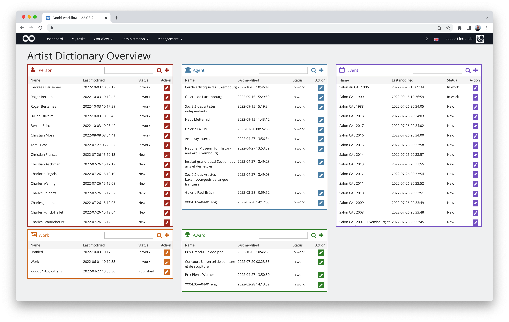
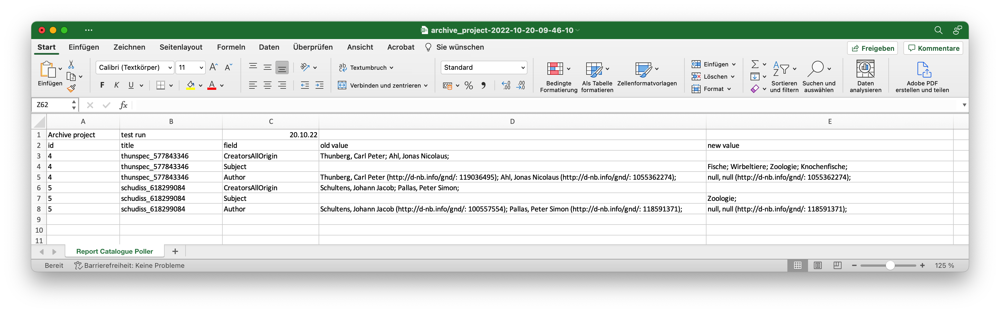

# September 2022

<!-- +++++++++++++++++++++++++++++++++++++++++++++++++++++++++++++++++++++++++++++++++++ -->
## Core


### Speichern im Metadateneditor
Innerhalb des Metadateneditors ist uns aufgefallen, dass verschiedene Browser unterschiedlich reagierten, wenn Nutzer auf den Speichern-Button geklickt haben. Speziell war es so, dass die Webbrowser Chrome und Safari beim Klick auf den Speichern-Button keinerlei Funktion ausgeführt haben, während Firefox beispielsweise korrekt funktionierte. 


Der Button mit dem Titel `Speichern und Zurück` war von diesem Problem im Übrigen nicht betroffen. 


Nach einigem Hin und Her und viel Ursachenrecherche konnten wir das Problem letztlich lösen und haben mit dem Release einen Fix bereitstellen können.


### Neue Journalfunktionalität
Seit bestimmt 8 Jahren schon gibt es die Möglichkeit in Goobi workflow, das verschiedene Informationen und Kommunikationen über das Vorgangslog nachvollziehbar sind. Auch bestand schon seit einiger Zeit die Möglichkeit, dass dort Dateien (z.B. für Restaurationsdokumente) hochgeladen werden können. Erweitert wurde dies vor ca. 1,5 Jahren nochmals um die Möglichkeit, dort auch Schadensdokumente gleich beim Anlegen von Vorgängen mit speichern zu können. 


Mit anderen Worten: das Vorgangslog ist einfach praktisch. So praktisch, dass wir es auch an anderen Stellen gern haben wollten. Dazu mussten wir es dummerweise umbenennen, dass es ja nicht mehr nur bei Vorgängen verwendet werden soll. 


Herausgekommen ist das Journal. Funktional ist es so geblieben wie bei den Vorgängen bisher. Nun allerdings steht es auch bei den den Einrichtungen zur Verfügung und zumindest in einem besonderen Anwendungfall (Lieferung von Pflichtexemplaren) auch bei Benutzern.


Uns würden noch weitere Stellen in Goobi workflow einfallen, wo das Journal eine Hilfe sein könnte (z.B. bei Projekten). Vielleicht findet sich dazu bald einmal eine Gelegenheit, weil es jemand anders ebenso praktisch fände. In dem Fall werden wir das Journal dann erweitern können und berichten hier wieder davon.


### Beschleunigtes Ladeverhalten für umfangreiche Werke
Insbesondere bei sehr umfangreichen Werken kam es bei dem Einsatz von S3 als Speichersystem immer wieder zu enormen Verzögerungen in der Ladegeschwindigkeit. Ursache hierfür ist, dass ein S3-System keine Ordnerhierarchie besitzt und alle Dateien stattdessen enorm lange Dateinamen aufweisen. Dies sieht beispielsweise wie folgt aus:

```bash
s3://bucket/123/images/bla_media/00000001.tif
s3://bucket/123/images/bla_media/00000002.tif
s3://bucket/123/images/master_bla_media/00000001.tif
s3://bucket/123/images/master_bla_media/00000002.tif
s3://bucket/123/images/bla_jpg/00000001.tif
s3://bucket/123/images/bla_jpg/00000002.tif
``` 

Dieser abweichende Aufbau sorgte dafür, dass bei der Ermittlung bspw. des Master-Verzeichnisses stets alle Dateien durchlaufen werden mussten, um dabei jeweils zu prüfen, ob der gesuchte Verzeichnisname vertreten ist. Insbesondere bei sehr umfangreichen Werken hat hierbei die Performance stark gelitten. 

Das haben wir nun geändert, so dass bei einer Ordnersuche in der gewünschten Hierarchiestufe alles nach dem nächsten Slash (`/`) nicht mehr beachtet wird und so bei einer Suche innerhalb des images-Ordners deutlich weniger zu prüfende Dateinamen aufgeführt werden.

Daneben haben wir die Dateisuche nun auch immer auf den tatsächlich relevanten Ordner beschränkt, so dass auch bei einer Suche nach den master-Bildern nicht mehr die Daten aller Ordner eines Vorgangs abgefragt werden.

Eine weitere große Verbesserung in der Performance ergab sich dadurch, dass wir in der IIIF-API nun nicht mehr pro Bild prüfen, ob ein Verzeichnis mit dem Namen `thumbs` existiert, sondern das Ergebnis eine eine Weile cachen. Dadurch haben wir auch die Anzahl der Anfragen an das System noch einmal deutlich verringern können.


### Schönheitsfehler bei leeren Tabellenspalten beseitigt
Bei der Detailanzeige von Workflowinformationen einzelner Arbeitsschritte kam es gelegentlich einmal vor, das leere Tabellenspalten angezeigt wurden. 


Dies haben wir einmal geprüft und überarbeitet. Damit tritt dieser kleine Anzeigefehler nun nicht mehr auf.


### Bessere Prüfung des verfügbaren Speicherplatzes
Uns ist aufgefallen, dass der Metadateneditor keine nutzerfreundliche Meldung darüber angezeigt hat, wenn während der Bearbeitung der Metadaten nicht mehr genug Speicherplatz auf dem Goobi-Server zur Verfügung steht, um die Metadaten zu speichern. Dieser Falle sollte natürlich im Idealfall innerhalb des Alltags möglichst gar nicht vorkommen. Passiert es dennoch, so fällt Goobi der fehlende Speicherplatz nun besser auf und es wird eine gut verständliche Meldung für den Nutzer angezeigt. 


### Zusammenarbeit mit einem Proxy verbessert
Wenn es notwendig ist, dass Goobi selbst über einen Proxy mit anderen Diensten kommunizieren soll, so war dies bisher bereits recht problemlos möglich. Eine neue Anforderung jedoch ergab sich durch die zunehmende Verbreitung des Archivmanagements. Hierfür ist nämlich eine Kommunikation mit einer weiteren lokalen Datenbank notwendig, wofür wiederum keine Kommunikation über einen Proxy erwünscht ist. 

Mit dieser Version ist daher eine neue Konfigurationsmöglichkeit ergänzt worden, die es ab sofort erlaubt, dass Goobi für die Kommunikation mit dem eigenen Server (localhost) der Proxy nicht verwendet wird. Konfiguriert wird dies mit dem neuen Schalter so:

```toml
http_proxyIgnoreHost=localhost
```


### Erweiterter LIDO-Support
Wenn Goobi verwendet wird, um statt METS insbesondere im Falle von Museumsobjekten das Format LIDO zu verwenden, besteht ab dieser Version die Möglichkeit, das auch leere Elemente innerhalb der erzeugten XML-Dateien geschrieben werden. Dazu wurde eine neue Konfigurationsmöglichkeiten für die Regelsätze geschaffen, intern dort das Folgende angegeben wird:

```xml
<exportEmptyNode>true</exportEmptyNode> 
```

An einem konkreten Beispiel veranschaulicht sieht dies so aus:

```xml
<Metadata>
    <InternalName>OtherTitle</InternalName>
    <exportEmptyNode>true</exportEmptyNode>
    <XPath>./lido:objectIdentificationWrap/lido:titleWrap/lido:titleSet/lido:appellationValue[@lido:pref='alternative']</XPath>
    <WriteXPath>./lido:objectIdentificationWrap/lido:titleWrap/lido:titleSet/#lido:appellationValue[@lido:pref='alternative']</WriteXPath>
</Metadata>
```

Das Ergebnis innerhalb des generierten LIDO würde dann so aussehen:

```xml
<lido:objectIdentificationWrap>
    <lido:titleWrap>
        <lido:titleSet>
            <lido:appellationValue lido:pref="preferred">Testdatensatz_LIDO, Zusatztitel</lido:appellationValue>
            <lido:appellationValue lido:pref="alternative" />
        </lido:titleSet>
    </lido:titleWrap>
</lido:objectIdentificationWrap>
```

Die vorgenommene Konfiguration hat hier den folgenden Einfluss:

Wenn das betroffene Metadatum existiert, wird es ganz normal exportiert. Existiert es hingegen nicht, wird geprüft, ob es im aktuellen Strukturelement erlaubt ist. Falls dies der Fall ist, wird ’WriteXPath’ ebenfalls ausgeführt. Dabei kann eine solche Konfiguration auch für eine Gruppe oder bei einem Metadatum in einer Gruppe angegeben werden.

Wird eine solche Konfiguration nicht vorgenommen, entfällt im generierten LIDO diese Zeile:

```xml
<lido:appellationValue lido:pref="alternative" />
```

Mehr zu den Möglichkeiten der Konfiguration für die Metadatenexporte findet sich in der folgenden Dokumentation:



<!-- +++++++++++++++++++++++++++++++++++++++++++++++++++++++++++++++++++++++++++++++++++ -->
## Plugins

### Plugin für die Bearbeitung von Personendaten kurz vor Fertigstellung
Auch in diesem Monat ist wieder viel Energie in die Fertigstellung eines neuen Plugins für die granulare Erfassung von Personendaten geflossen. Neben verschiedenen kleinen und großen Fehlerbehebungen wurde unter anderem die Nutzeroberfläche noch einmal grundlegend geprüft und angepasst. 




Wir gehen davon aus, dass wir das Plugin im Oktober abschließen und dann auch gründlich dokumentieren können werden. Wir halten Euch auf dem Laufenden.


### Erweiterung des Catalogue Pollers
Der Catalogue Poller dient dazu, dass die Metadaten innerhalb der METS-Dateien für zahlreiche Vorgänge periodisch automatisch aktualisiert werden. Auf diese Weise können Katalogänderungen automatisch übernommen werden und werden im Anschluß auch für die Präsentation der Digitalisate berücksichtigt.
Dieses Plugin wurde nun einmal grundlegend überarbeitet und mit weiteren Funktionen ausgestattet. Neben einigen Änderungen an der Nutzeroberfläche kam hierbei vor allem die neue Möglichkeit hinzu, dass der Catalogue Poller nun auch Testläufe ausführen kann, die es ermöglichen, dass man ohne tatsächliche Änderung der Daten einsehen kann, welche Änderungen an den Daten stattfinden würden. Das Ergebnis eines solchen Testlaufs ist dabei als Excel-Datei herunterladbar. 




Ebenfalls neu ist außerdem die Möglichkeit, dass innerhalb der Konfiguration der zu berücksichtigenden Metadaten nicht mehr nur die Felder benannt werden können, die nicht geändert werden sollen (Blacklist). Stattdessen ist nun auch möglich, dass nur diejenigen Felder benannt werden können, die geändert werden sollen (Whitelist). Hier dazu einmal ein Ausschnitt aus der Konfiguration:

```xml
      <!-- fieldList: Must have a mode attribute which can contain either blacklist or whitelist as a value.
        blacklist: All fields are updated except the defined ones. This is a potential dangerous setting!
        whitelist: Only the definied fields are updated. All others are skipped. 
        field: Use the internal metadata names from the ruleset as field definition
      -->
      <fieldList mode="blacklist">
         <field>viewerinstance</field>
         <field>singleDigCollection</field>
         <field>pathimagefiles</field>
         <field>_urn</field>
         <field>_representative</field>
      </fieldList>
```

Die Dokumentation des Plugins findet sich in aktualisierter Form unter der folgenden Adresse:



Das Plugin kann wie gehabt hier von GitHub heruntergeladen werden:




### Plugin für die Generierung von PDFs erweitert
Seit einiger Zeit schon gibt es ein Plugin, das während der Workflowausführung automatisch PDFs erzeugen kann. Bisher war dessen Konfigurierbarkeit allerdings eingeschränkt. Dies ist mit der neuen Version besser geworden, so dass sich so auch pro Projekt und Titel eines Arbeitsschritts eine individuelle Konfiguration festlegen lassen kann. Diese kann beispielsweise so aussehen:

```xml
<?xml version="1.0" encoding="UTF-8"?>
<config_plugin>
    <!-- order of configuration is: 
         1.) project name and step name matches 
         2.) step name matches and project is * 
         3.) project name matches and step name is * 
         4.) project name and step name are * 
    -->
    <config>
        <!-- which projects to use for (can be more then one, otherwise use *) -->
        <project>*</project>
        <!-- which stepss to use for (can be more then one, otherwise use *) -->
        <step>*</step>
         <!-- Choose the source images folder that shall be used for PDF generation. Possible values are 'media' and 'master' -->
        <imagesFolder>media</imagesFolder>
        <!-- If enabled, PDF files for every single image are generated -->
        <pagePdf enabled="true" /> 
        <!-- If enabled, a PDF file for the entire record is generated. This file includes the table of contents from the METS file if exists. -->
        <fullPdf enabled="true" />
    </config>
    
    <config>
        <project>testocr</project>
        <step>testpdf</step>
        <imagesFolder>master</imagesFolder>
        <pagePdf enabled="true" />
        <fullPdf enabled="false" />
    </config>
</config_plugin>
```

Auf diese Weise lässt sich das Plugin so auch mehrfach in einem Goobi in unterschiedlichen Projekten und Workflows und mit jeweils verschiedener Einstellung betreiben.


### Neues REST Plugin für MARC-Datenbezug
Im Kontext unserer Entwicklungen für die elektronischen Pflichtexemplare bestand die Anforderung, dass von externen Systemen ein Datenabzug ausgewählter Vorgänge aus Goobi workflow möglich sein sollte. Hierfür steht folgende Funktionalität zur Verfügung:

Innerhalb des Workflows existiert zunächst ein Arbeitsschritt für den MARC-Export, der die Metadaten als marcxml exportiert. Hierfür kommt das folgende Plugin zum Einsatz:



Die somit exportierten Daten landen im Anschluss in einem Verzeichnis, das vom neuen REST-Plugin überwacht wird. Hierbei handelt es sich um das folgende Plugin:



Innerhalb dieses REST-Plugins stehen verschiedene Befehle zur Verfügung, um eine Kommunikation zwischen Goobi Workflow und einem Bibliothekskatalog zu ermöglichen. 

Folgende Kommandos stehen zur Verfügung:

#### Auflistung aller importierbaren Daten
Mit diesen Kommando werden alle Datensätze aufgelistet, die aktuell bereitliegen. 

Aufruf der REST-API:
```bash
curl -s -H "Content-Type: application/xml" -H "token:SECRET" http://127.0.0.1:8080/goobi/api/delivery/listfiles
```

Antwort der REST-API:
```xml
<?xml version="1.0" encoding="UTF-8" standalone="yes"?>
<files>
    <file>a643b394-d56c-415c-9da9-b07008187445.xml</file>
</files>
``` 

#### Abfrage eines konkreten Datensatzes
Mit diesem Kommando kann ein einzelner Datensatz gezielt abgefragt werden. 

Aufruf der REST-API:
```bash 
curl -s -H "Content-Type: application/xml" -H "token:SECRET" http://127.0.0.1:8080/goobi/api/delivery/get/a643b394-d56c-415c-9da9-b07008187445.xml
``` 

Die REST-API antwortet anschließend mit dem abgefragtes MARC Datensatz. 

#### Erfolgreiche Datenübernahme
Dieser Aufruf bestätigt die erfolgreiche Übernahme des Datensatzes und meldet die Katalog-ID (aDIS ID). Anschließend wird der Arbeitsschritt geschlossen.

Aufruf der REST-API:
```bash
curl -s -X POST -H "Content-Type: application/xml" -H "token:SECRET" http://127.0.0.1:8080/goobi/api/delivery/finish/a643b394-d56c-415c-9da9-b07008187445.xml/aDIS-ID12345
``` 

#### Meldung über einen Fehler bei der Datenübernahme
Dieses Kommando dient dazu, dass ein Datensatz an Goobi gemeldet werden kann, dessen Datenübernahme nicht erfolgreich war. Es wird hierbei der Fehler gemeldet und der Arbeitsschritt in den Fehlerstatus gesetzt.

Aufruf der REST-API:
```bash
curl -s -X POST -H "Content-Type: application/xml" -H "token:SECRET" -d'<msg><type>error</type><message>Corrupt filename</message></msg>' http://127.0.0.1:8080/goobi/api/delivery/error/a643b394-d56c-415c-9da9-b07008187445.xml
``` 

Bei den beiden letztgenannten Aufrufen wird jeweils ein Arbeitsschritt geschlossen bzw. in den Fehlerstatus gesetzt. Anschließend wird der MARC-Datensatz aus dem export-Verzeichnis entfernt, damit er bei der nächsten Suche nicht erneut aufgelistet wird.


<!-- +++++++++++++++++++++++++++++++++++++++++++++++++++++++++++++++++++++++++++++++++++ -->
## Dokumentation

### Updatehinweise für das XMP-Plugin ergänzt
Uns ist aufgefallen, dass in der Updateanleitung im Juli 2020 noch ein Hinweis für die notwendigen Anpassungen der Konfiguration des XMP-Header-Plugins fehlten. Diese haben wir nun ergänzt, so dass alles auf aktuellem Stand sein sollte. 

Die Updateanleitung findet sich wie gehabt unter der folgenden Adresse:




<!-- +++++++++++++++++++++++++++++++++++++++++++++++++++++++++++++++++++++++++++++++++++ -->
## Versionsbezeichnung
Die aktuelle Versionsnummer von Goobi workflow lautet mit diesem Release: **22.09**.
Innerhalb von Plugin-Entwicklungen muss für Maven-Projekte innerhalb der Datei `pom.xml` entsprechend folgende Abhängigkeit eingetragen werden:
```xml
<dependency>
    <groupId>de.intranda.goobi.workflow</groupId>
    <artifactId>goobi-core-jar</artifactId>
    <version>22.09</version>
</dependency>
```