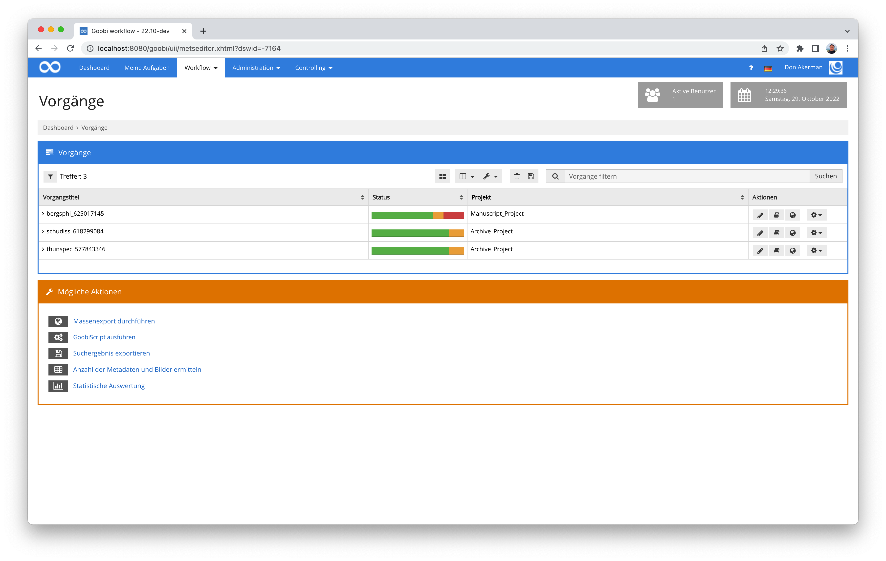
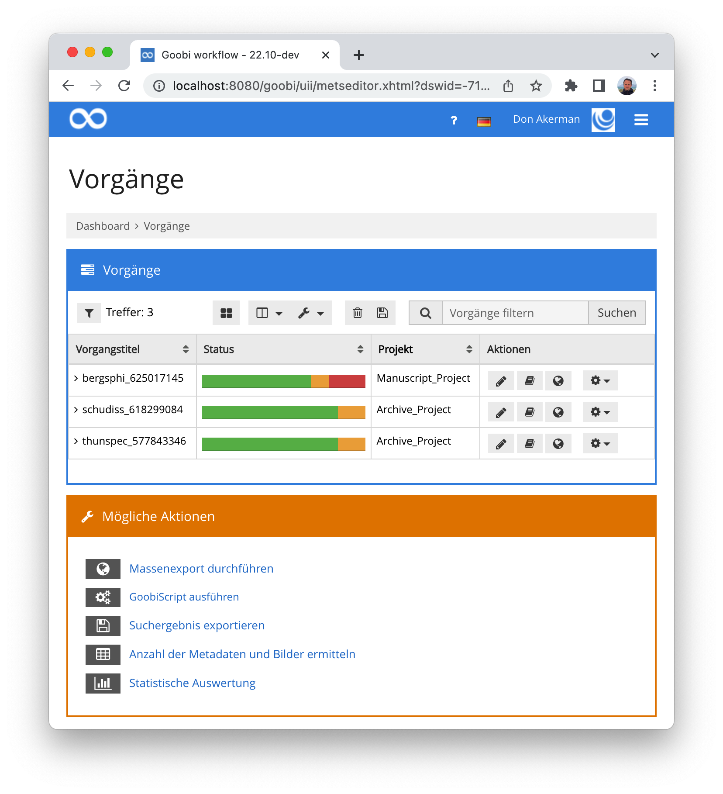
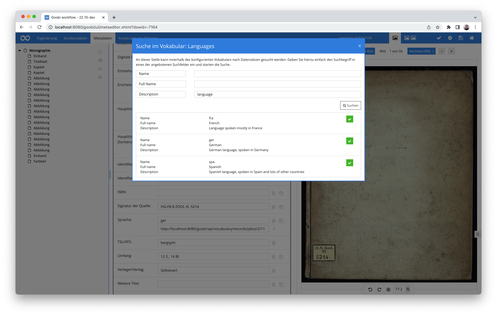
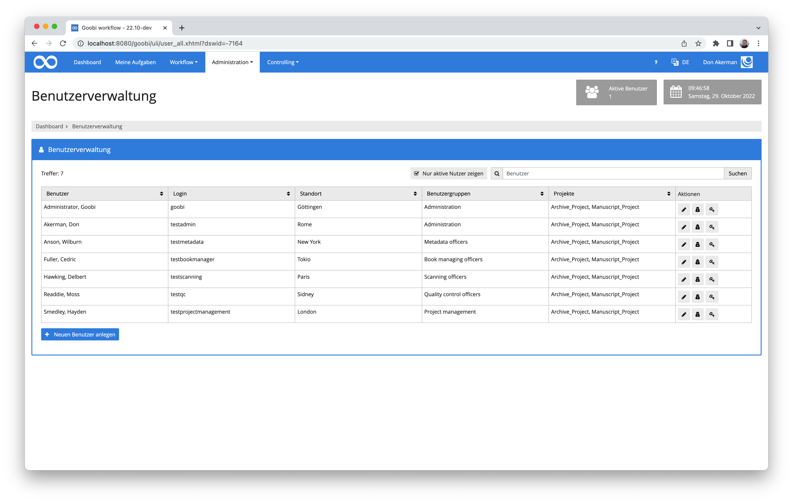
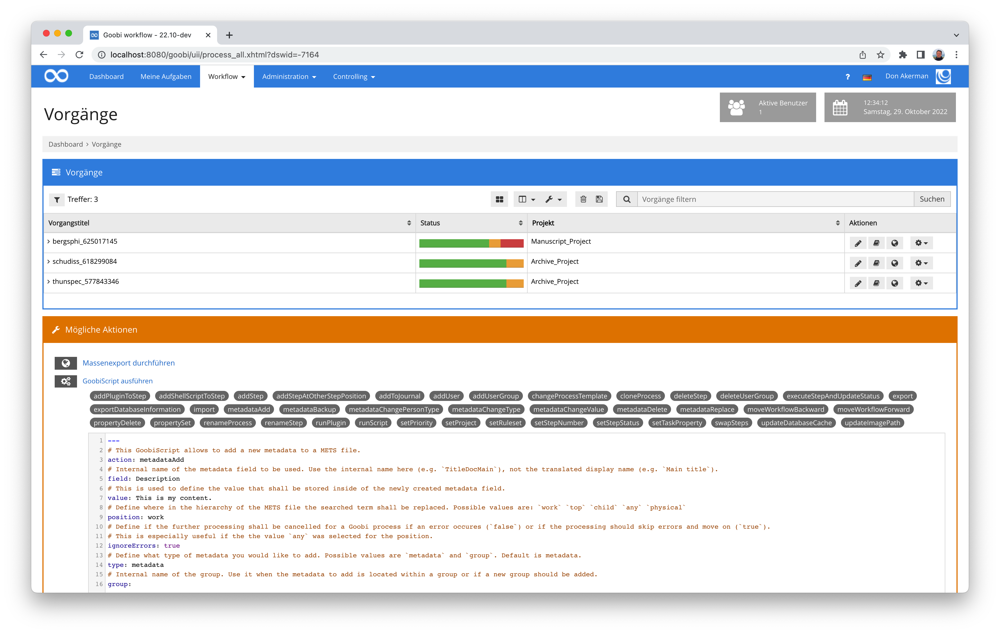
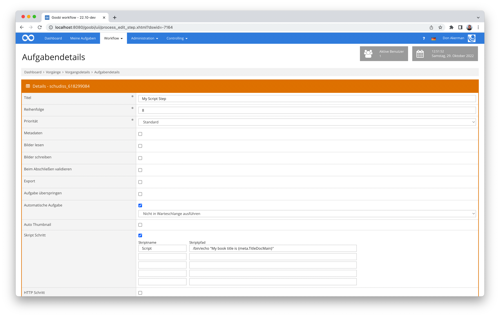
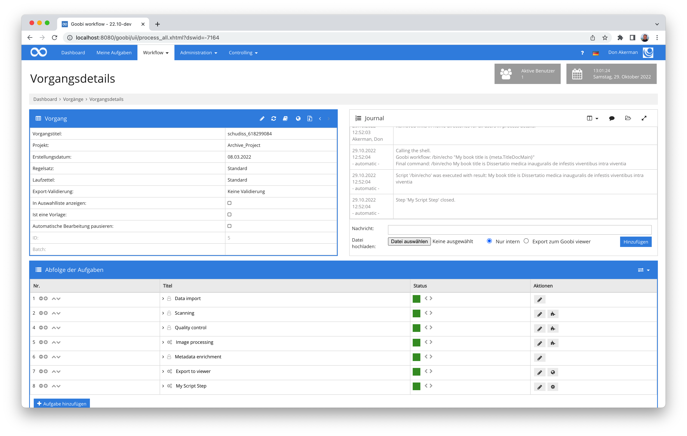
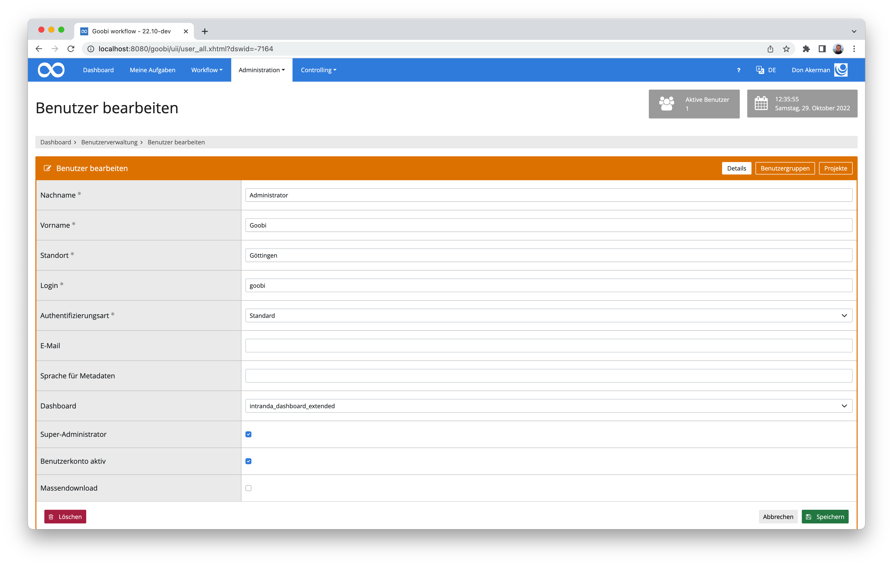

# Oktober 2022

<!-- +++++++++++++++++++++++++++++++++++++++++++++++++++++++++++++++++++++++++++++++++++ -->
## Core


### Bessere Anzeige von Validierungsergebnissen im Metadateneditor
In Goobi workflow läßt sich durch den Regelsatz steuern, welche Metadaten beispielsweise wie häufig vorkommen dürfen, wo sie erlaubt sind und welche Inhalte darin möglich sind. Auf diese Weise läßt sich eine Qualitätsanforderung an die zu erfassenden Metadaten gut steuern und einhalten. Damit der Nutzer diese Anforderungen gut einhalten kann, zeigt der Metadateneditor Validierungsmeldungen an, die auf Probleme hinweisen. In der Vergangenheit wurden diese Meldungen allerdings immer nur global anzeigt, nicht direkt am betreffenden Metadatum selbst und auch nicht am zugehörigen Strukturelement. Mit anderen Worten: Man war ein bisschen ratlos als Nutzer, welches Feld nun wo genau nicht valide war. Man musste sich erst einmal auf die Suche machen.

An dieser Stelle gibt es ab sofort einige größere Änderungen. Validierungsmeldungen erscheinen unmittelbar am Feld in roter Farbe und weisen mit einer hilfreichen Meldung direkt auf die Probleme hin. 


Und auch in der Baumanzeige der Strukturelemente im linken Bereich werden die Validierungsprobleme jetzt hervorgehoben und ermöglichen dem Nutzer jetzt, sehr schnell das betreffende Metadatum zu finden, für das eine Meldung vorliegt.


Wenn man dabei den Mauszeiger über ein Strukturelement mit Fehlern hält, sieht man in einem Popup sofort die zugehörige Meldung.


Ausserdem haben wir bei der Gelegenheit übrigens auch eine neue Tastenkombination für die Durchführung der Validierung eingeführt. Sie lautet: `CTRL` + `SHIFT` + `V`.

### Suchschlitz in der Vorgangsliste endlich wieder bequem nutzbar
Nachdem durch kleinere optische Anpassungen der Suchschlitz innerhalb der Vorgangsliste von Goobi workflow zu klein geraten ist, war er in letzter Zeit etwas zu mühsam in der Benutzung. Man konnte einfach nicht mehr gut überblicken, welche Suchbegriffe man schon eingetragen hatte, wenn die Suchanfrage etwas länger wurde. 

Ab diesem Monat gehört dieser Umstand der Vergangenheit an. Der Suchschlitz ist jetzt grundsätzlich deutlich länger auf regulären Displays.



Und auch auf Mobilgeräten ist die Bedienbarkeit so, dass man vernünftig mit der Suche arbeiten kann:



### Korrektur der URLs für Vokabulardatensätze
Goobi workflow verfügt ja seit einiger Zeit schon über eine Vokabularverwaltung, die unter anderem dafür verwendet werden kann, dass de Metadateneditor mittels Auswahlfeldern mit kontrollierten Listen möglichst bequem bedient werden kann. Dabei ist es auch möglich, dass die Werte nicht nur in einem Auswahlfeld zur Verfügung stehen sondern ebenso nach Nutzung einer Suchmaske aus einer Trefferliste ausgewählt werden können. 


Übernommen wird in einem solchen Fall nicht nur der ausgewählte Wert für die anschließende Anzeige der Digitalisate im Goobi viewer. Stattdessen wird außerdem eine URL für die Verlinkung auf den entsprechenden Vokabulardatensatz eingetragen. 



Hier hatte sich unglücklicherweise ein kleiner Fehler eingeschlichen, so dass diese URLs ggf. nicht korrekt waren. Dieses Verhalten haben wir nun korrigiert, so dass die URLs jetzt stimmen. Bitte prüfen Sie aber, ob Sie diese Funktionalität bisher bereits verwendet haben. In diesem Fall sollten die bereits eingetragenen URLs gegebenenfalls noch bei Ihnen korrigiert werden.

### Erste Layoutumstellungen gehen live
Wir hatten schon angekündigt, dass wir hinsichtlich Accessibility und Usability einige größere Umbauten im Hintergrund vornehmen. Bei der Administrationsmaske für die Benutzer ist es jetzt soweit, dass wir diese Änderungen langsam in Betrieb nehmen. Wie angekündigt gehen damit kleinere optische Änderungen einher. Dies sollte sich bald dann auch flächendeckend auf andere Bereiche auswirken. 

So sieht es jetzt schon aus:



### GoobiScript nun auch zur Änderung von Metadaten innerhalb von Metadatengruppen
Es gab schon seit einiger Zeit verschiedene GoobiScripts, um Daten innerhalb der Metadaten zu ändern. Leider war dies jedoch bisher nicht ohne weiteres auch für Metadatengruppen möglich. Hier gab es in diesem Monat nun jedoch einige Änderungen, so dass die bestehenden GoobiScripte jeweils auch für Metadatengruppen anwendbar sind, wenn die jeweiligen Parameter korrekt gesetzt sind. 



Da die Änderungen recht umfangreich sind, haben wir auch die Dokumentation gleich angepasst bzw. erweitert. Sie findet sich wie gehabt unter folgender Adresse:



### Aufrufe von Skripten im Journal besser nachvollziehbar
Innerhalb des Journals (früher `Vorgangslog`) sind die einzelnen Aktivitäten eines Workflow üblicherweise gut nachvollziehbar. Unter anderem wurden dort auch bereits in der Vergangenheit schon die Aufrufe von Skripten protokolliert, um diese in Problemfällen auch besser nachvollziehen zu können. Was allerdings fehlte war, das innerhalb der Skriptaufrufe auch die verwendeten Variablen in ihrer ersetzten Form angezeigt werden. Dies ist jetzt angepasst worden, so dass nach jedem Aufruf eines Skriptes innerhalb des Journals sowohl der Skriptaufruf in seiner ursprünglichen Form als auch in seiner aufgelösten Form aufgeführt wird. 

Im Fall eines einfachen Skripts wie diesem hier:



... sieht so der Aufruf innerhalb des Journals nun aus:



Bei der Gelegenheit haben wir übrigens auch gleich einmal die Höhe der Box angepasst, so dass diese den verfügbaren Platz besser ausnutzt und man ohne zu scrollen gleich mehr Informationen auf einmal einsehen kann.

### Super-Admins haben jetzt immer alle Rechte
Goobi workflow verfügt über ein ziemlich granular steuerbares Rechtesystem. Es ist dabei so flexibel, dass sogar Plugins eigene Rechte definieren können, über die ein Nutzer verfügen muss, damit er mit dem Plugin arbeiten kann. 

Um den Administratoren (also auch uns selbst) das Leben etwas einfacher zu machen, haben wir nun eingeführt, dass alle Nutzer, die über den Status `Super-Administrator` verfügen, auch automatisch stets über sämtliche Rechte in Goobi verfügen inklusive derjenigen individuellen Rechte, die Plugins mitbringen. 



<!-- +++++++++++++++++++++++++++++++++++++++++++++++++++++++++++++++++++++++++++++++++++ -->
## Plugins


### Neues Plugin für flexible Dateivalidierungen
Im Rahmen unserer Entwicklungen der Lieferung von elektronischen Pflichtexemplaren benötigten wir eine flexible Möglichkeit, dass die von Nutzern hochgeladenen Dateien validiert und auf die Einhaltung von Anforderungen hin geprüft werden. Hierfür sollte es unter anderem möglich sein, dass beliebige externe Tools zur Validierung verwendet werden können und dass die Einhaltung definierter Level sichergestellt wird.

Herausgekommen ist in der Entwicklung nun ein extrem flexibles Validierungsplugin, dass sich sehr granular konfigurieren läßt. Eine umfangreiche Dokumentation für das Plugin haben wir hier auch samt mehrerer sinnvoller Konfigurationsbeispiele veröffentlicht:



Und wie gewohnt findet sich der Quellcode des Plugins sowie eine kompilierte Fassung bei GitHub:



<!-- +++++++++++++++++++++++++++++++++++++++++++++++++++++++++++++++++++++++++++++++++++ -->
## Dokumentation


### URN-Plugin erlaubt nun den Einsatz hinter einem Proxy
Dies dürfte nur wenige Nutzer betreffen, aber für diejenigen ist es wichtig:

Das noch recht neue Plugin für die Registrierung von URN konnte bisher nicht verwendet werden, wenn der Goobi- Server nur über einen Proxy auf das Internet zugreifen darf. Hier haben wir jetzt eine Anpassung vorgenommen, die ab sofort auch den Betrieb hinter einem Proxy erlaubt. 

Die Dokumentation haben wir für diese Änderung auf den aktuellen Stand gebracht:



Das Plugin findet sich wie gehabt hier auf GitHub:



### Dokumentation für das Artist Dictionary Plugin ist online
Nach langer Entwicklung an dem Plugin zur Erfassung von verlinkten Entitäten haben wir nun auch die zugehörigen Plugins abgeschlossen und bei GitHub veröffentlicht. Hierbei handelt es sich einerseits um ein besonderes Dashboard-Plugin:



Andererseits wird ausserdem dieses Workflow-Plugin benötigt:



Die Installation und Konfiguration dieser Plugins sind nun auch vollständig und sehr granular dokumentiert. Sie stehen wie gewohnt auf unserer Dokumentationsplattform zur Verfügung:




<!-- +++++++++++++++++++++++++++++++++++++++++++++++++++++++++++++++++++++++++++++++++++ -->
## Versionsbezeichnung
Die aktuelle Versionsnummer von Goobi workflow lautet mit diesem Release: **22.10**.
Innerhalb von Plugin-Entwicklungen muss für Maven-Projekte innerhalb der Datei `pom.xml` entsprechend folgende Abhängigkeit eingetragen werden:

```xml
<dependency>
    <groupId>de.intranda.goobi.workflow</groupId>
    <artifactId>goobi-core-jar</artifactId>
    <version>22.10</version>
</dependency>
```