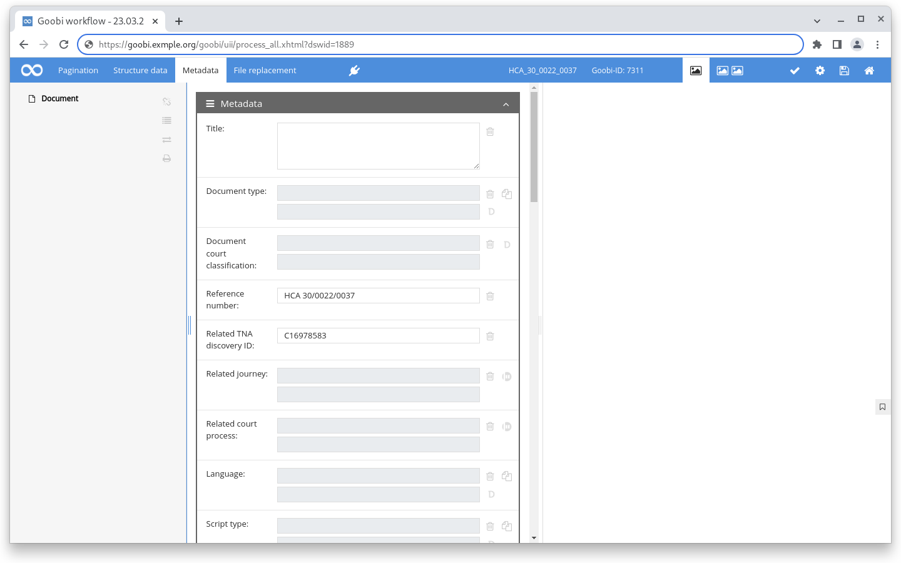
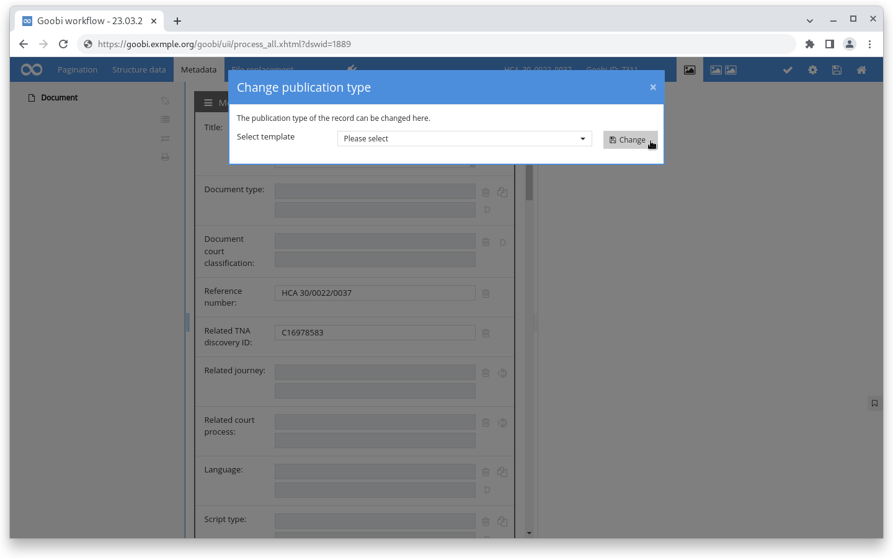
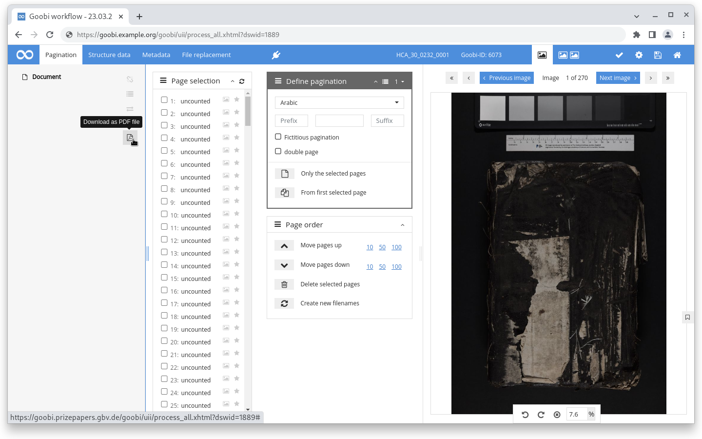

# November 2022

## Projekte

### easydb

Wir haben für einen Partner eine Prozesskette entwickelt, die es erlaubt aus einer easydb exportierte Datensätze vollautomatisch in Goobi workflow zu importieren, zu verarbeiten und in einen Goobi viewer zu exportieren.

Für diese Prozesskette wurden drei Plugins verwendet und erweitert um die Anforderungen an das Projekt zu erfüllen.

Das [generische XML OPAC Plugin](https://github.com/intranda/goobi-plugin-opac-generic-xml) kann ab jetzt nicht nur eine entfernte API abfragen, sondern auch XML Dateien aus dem Dateisystem lesen.

Der [DataPoller](https://github.com/intranda/goobi-plugin-administration-catalogue-poller) (ehemals CataloguePoller) wurde im Rahmen des Projektes um die Möglichkeit erweitert, nicht nur über ein Filterset von Vorgängen zu arbeiten, sondern auch über die Dateien in einem Ordner zu iterieren. Neu ist auch die Funktionalität, dass die einzelnen Arbeitsaufträge über die interne Ticket Queue abgearbeitet werden.

Das [Fetch-Images-From-Metadata Schritteplugin](https://github.com/intranda/goobi-plugin-step-fetch-images-from-metadata) hat kleinere Anpassungen erfahren um zum Beispiel Dateien ohne Dateiendung zu finden, mit doppelten Dateinamen umzugehen oder um Fehlermeldungen bei fehlenden Bildern zu überspringen.

Die Prozesskette funktioniert auch periodisch und legt neue Vorgänge an oder aktualisiert bestehende. Einmal importiert durchlaufen die Datensätze wie gewohnt die einzelnen Schritte des Workflows.

## Core

### Plugins im Metadateneditor

Der Kern von Goobi workflow wurde um die Möglichkeit erweitert innerhalb des Metadateneditors Plugins anzubieten. Diese binden sich oben in der blauen Kopfzeile ein und stellen ihre Funktionalität zur Verfügung.

Ausschlaggebend für die Entwicklung war die Anforderung innerhalb des Metadateneditors den Publikationstyp wechseln zu können. Hierfür sollten Templatevorgänge angelegt und bestimmte, gekennzeichnete Metadaten bei dem Wechsel übernommen werden.

<figure><figcaption><p>Plugins im Metadateneditor oben in der blauen Leiste</p></figcaption></figure>

<figure><figcaption><p>Metadateneditor Plugin zum wechseln des Publikationstyps</p></figcaption></figure>

### Metadatengenerierung

Immer wieder kommt es vor, dass bestimmte Metadaten automatisch aus anderen Werten gebildet werden sollen. Ein Beispiel könnte der Haupttitel eines Briefes sein, der immer wie folgt gebildet werden soll: "`Brief von [Absender] an [Empfänger] an [Ort], [Datum]`"

Um diese Funktionalität im Metadateneditor zur Verfügung stellen zu können wurde der die Konfigurationsdatei `goobi_metadataDisplayRules.xml` um die Möglichkeit erweitert für bestimmte Metadaten unter konfigurierbaren Bedingungen Werte aus anderen Metadatenwerten generieren zu können.

Eine Konfiguration für das oben genannte Beispiel könnte wie folgt aussehen:

<pre class="language-xml"><code class="lang-xml"><strong>&#x3C;generate ref="TitleDocMain">
</strong>    &#x3C;condition>goobi:metadata[@name='genre'][text()='Letter']&#x3C;/condition>
    &#x3C;value>Letter from [ACTOR_FROM] to [ACTOR_TO] at [PLACE], [DATE]&#x3C;/value>

    &#x3C;item>
        &#x3C;label>ACTOR_FROM&#x3C;/label>
        &#x3C;type>xpath&#x3C;/type>
        &#x3C;field>goobi:metadata[@type='group'][@name='name'][goobi:metadata[@name='name_role_roleTerm'][text()='is created by (intellectual)']]/goobi:metadata[@name='name_displayForm']&#x3C;/field>
        &#x3C;regularExpression>(.+), .*&#x3C;/regularExpression>
        &#x3C;replacement>$1&#x3C;/replacement>
    &#x3C;/item>
    &#x3C;item>
        &#x3C;label>ACTOR_TO&#x3C;/label>
        &#x3C;type>xpath&#x3C;/type>
        &#x3C;field>goobi:metadata[@type='group'][@name='name'][goobi:metadata[@name='name_role_roleTerm'][text()='is intended for']]/goobi:metadata[@name='name_displayForm']&#x3C;/field>
        &#x3C;regularExpression>(.+), .*&#x3C;/regularExpression>
        &#x3C;replacement>$1&#x3C;/replacement>
    &#x3C;/item>
    &#x3C;item>
        &#x3C;label>PLACE&#x3C;/label>
        &#x3C;type>xpath&#x3C;/type>
        &#x3C;field>goobi:metadata[@type='group'][@name='location_related_place'][goobi:metadata[@name='location_holdingExternal_relation_type'][text()='is bound from']]/goobi:metadata[@name='location_physicalLocation_related_place']&#x3C;/field>
    &#x3C;/item>
    &#x3C;item>
        &#x3C;label>DATE&#x3C;/label>
        &#x3C;type>variable&#x3C;/type>
        &#x3C;field>{meta.originInfo_dateCreated_start}&#x3C;/field>
        &#x3C;regularExpression>([0-9]{4})-[0-9]{2}-[(0-9]{2}&#x3C;/regularExpression>
        &#x3C;replacement>$1&#x3C;/replacement>
    &#x3C;/item>
&#x3C;/generate>
</code></pre>

### PDF Download im Metadateneditor

Innerhalb des Metadateneditors besteht jetzt die Möglichkeit zu jeder Zeit ein PDF aller Bilder zu generieren. Dafür befindet sich ein neuer PDF-Button in der linken Spalte mit dem Strukturbaum

<figure><figcaption><p>PDF-Download im Metadateneditor</p></figcaption></figure>

## Plugins

### Schritt: Vorgang umbenennen

Es gibt ein neues Schritteplugin um innerhalb eines Workflows einen Vorgang umzubenennen. Dafür kann auf die in Goobi workflow vorhandenen Variablen zurückgegriffen werden. Zusätzlich sind Unterstriche und Minus als Zeichen erlaubt. Leere Variablen werden übersprungen und Leerzeichen entfernt.



### Export: Zeitungsexport

Das Plugin um einen Export für das DDB Zeitungsportal zu realisieren wurde für eine bessere Anzeige der Daten im DFG-Viewer angepasst.



## Dokumentation

Die Dokumentation der `goobi_config.properties` wurde umfassend überarbeitet, dokumentiert und steht ab sofort in [Kapitel 7.2](https://docs.goobi.io/goobi-workflow-de/admin/7/7.2) der Dokumentation zur Verfügung:

## Versionsbezeichnung

Die aktuelle Versionsnummer von Goobi workflow lautet mit diesem Release: **22.11**. Innerhalb von Plugin-Entwicklungen muss für Maven-Projekte innerhalb der Datei `pom.xml` entsprechend folgende Abhängigkeit eingetragen werden:

```xml
<dependency>
    <groupId>de.intranda.goobi.workflow</groupId>
    <artifactId>goobi-core-jar</artifactId>
    <version>22.11</version>
</dependency>
```