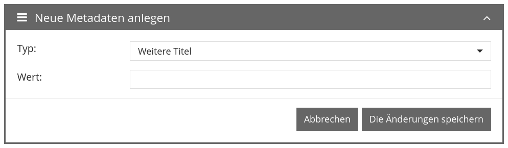
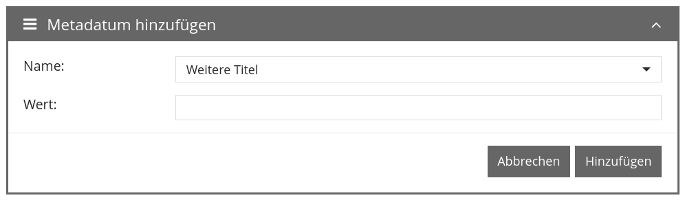

# Januar 2023

## Coming soon :rocket:

* Portierung der **Benutzeroberfläche** auf **neues Framework**
* **Regelmäßige Aufgaben**
* **Dokumentation** der **Schrittedetails**

## Core

### ALTO Editor

Der ALTO Editor zur OCR Korrektur, der bei Bedarf im Metadateneditor geöffnet werden kann, unterstützt jetzt auch Rechts-nach-links Sprachen. Die Umschaltung erfolgt automatisch auf Basis der gewählten Einstellung im Metadateneditor selbst.

### Bedienbarkeit

Nach und nach fließen kleinere Änderungen für die Bedienbarkeit in die Oberfläche ein. In diesem Digest möchten wir auf einen winzigen Teilbereich eingehen und aufzeigen was das in der Praxis bedeutet.

Ausgangslage ist in diesem Fall der Metadateneditor und die Möglichkeit ein weiteres Metadatum hinzuzufügen. Das sah bisher wie folgt aus:

<figure><figcaption><p>Terminologie vor der Änderung</p></figcaption></figure>

Wir haben diesen kleinen Teilbereich beleuchtet und dabei folgende Punkte notiert:

* Die Überschrift "Neue Metadaten anlegen" suggeriert durch den Plural, dass man hier mehrere gleichzeitig "anlegen" kann. Das ist aber nicht möglich denn in der Maske kann immer nur eines "angelegt" werden.
* Das Wort "anlegen" ist von der Terminologie eher mit "Vorgang anlegen" verknüpft. Das Wort "hinzufügen" ist hier passender, da ja zu einem bestehenden Vorgang ein neues Metadatum hinzugefügt werden soll
* Auch das Wort "Neu" in dem Zusammenhang ist eigentlich zuviel. "Metadatum hinzufügen" ist ebenfalls klar und eindeutig. Es wird an der Stelle ja nicht den Regelsatz editiert.
* Mit "Typ" wird eher so etwas wie "Text, MultiSelect, DropDown, Textarea" assoziiert, nicht aber "Weitere Titel". Ein Metadatum vom Typ "Weitere Titel" ist komisch. Besser ist schlicht "Name".
* "Die Änderungen speichern" sagt aus das man etwas geändert hat. Aber es wird doch etwas "angelegt" beziehungsweise ist nicht "Hinzufügen" die richtige Terminologie hier?

Das Ergebnis der Überlegungen sieht wie folgt aus:

<figure><figcaption><p>Terminologie nach der Änderung</p></figcaption></figure>

Natürlich gibt es noch viel mehr was man sich an der Stelle Fragen kann:

* Warum ist die Box ein- und ausklappbar?
* Ist es aus UX Perspektive richtig den Abbrechen und Hinzufügen Button visuell gleichwertig gewichtet zu haben?
* Warum wird das nicht einfach in einem Modal als Overlay geöffnet?
* ...

Aber diese Fragen sind komplexer zu beantworten und wir gehen kleine Schritte. Dieses Beispiel soll nur aufzeigen wie wir an verschiedensten Stellen und nach und nach Dinge besser machen.

## Plugins

### Schritt: Metadatenbearbeitung

Das Schritteplugin um Metadaten direkt aus dem angenommenen Aufgabe heraus bearbeiten zu können kann jetzt leere Felder ausblenden. Das war bisher nicht möglich und hat bei Anwendungsfällen wo das Plugin für die schnelle Prüfung von Metadaten eingesetzt wurde zu sehr langen Listen geführt.



## Versionsnummer

Die aktuelle Versionsnummer von Goobi workflow lautet mit diesem Release: **23.01**. Innerhalb von Plugin-Entwicklungen muss für Maven-Projekte innerhalb der Datei `pom.xml` entsprechend folgende Abhängigkeit eingetragen werden:

```xml
<dependency>
    <groupId>de.intranda.goobi.workflow</groupId>
    <artifactId>goobi-core-jar</artifactId>
    <version>23.01</version>
</dependency>
```