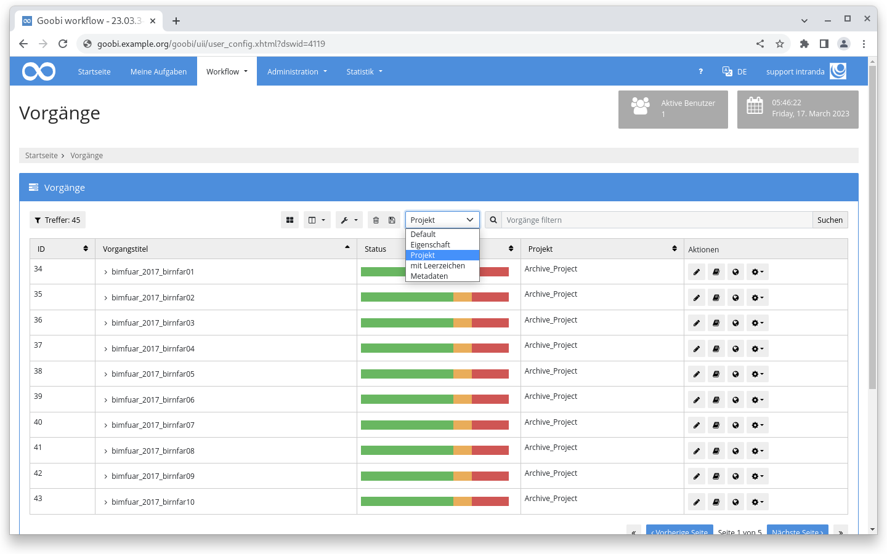

# Februar 2023

## Coming soon :rocket:

* Portierung der **Benutzeroberfläche** auf **neues Framework**
* **Regelmäßige Aufgaben**
* **Dokumentation** der **Schrittedetails**

## Core

### Performance

Es konnte ein Flaschenhals bei der Performance von SQL Queries mit "Like"-Queries identifiziert und behoben werden wenn. Das war zum Beispiel der Fall, wenn Suchanfragen nach Schrittetiteln ausgeführt wurde. Die Ladezeiten konnten teilweise von 155 Sekunden auf 3,2 Sekunden reduziert werden.

Auch im Bereich der automatischen Aufgaben konnte durch eine Umstellung der SQL-Queries ein deutlicher Geschwindigkeitszuwachs erzielt werden.

Das Ergebnis ist in bestimmten Situationen eine schneller reagierende Oberfläche.

### Suche

Benutzer können sich jetzt individuelle Sucheinstiege konfigurieren. Dafür steht in den Benutzereinstellungen im Bereich "Allgemein" ein neuer Eingabebereich für individuelle Sucheinstellungen zur Verfügung.

Jede Zeile ist nach dem `Name=Suchfilter` Prinzip aufgebaut wobei der Platzhalter `{}` für den Suchbegriff steht. Eine Beispielkonfiguration könnte zum Beispiel wie folgt sein:

```
Default={}
Eigenschaft={} |processproperty:Template:{}
Projekt={} |project:{}
mit Leerzeichen="{}" "|processproperty:Material type:{}" 
Metadaten={} |meta:TitleDocMain:{}
```

Sofern konfiguriert erscheint auf der Seite "Vorgänge" vor dem Suchschlitz oberhalb der Tabelle ein Dropdown Menü mit den konfigurierten Werten.

<figure><figcaption><p>Individuelle Sucheinstiege oberhalb der Vorgangsliste</p></figcaption></figure>

## Plugins

### Schritt: Dateien umbenennen

Das Plugin zum Umbenennen von Dateien hat bisher automatisch in allen Vorgangsordnern umbenannt. Jetzt kann es auch nur in bestimmten Ordnern arbeiten. Der Anwendungsfall ist dabei, dass man verschiedene Uploadschritte hat, die Dateien jeweils in einen temporären Ordner zwischenspeichert, anschließend das Plugin die Dateien individuell benennt und diese dann mit einem Skript in den _master Ordner verschoben werden. Dadurch kann man eine individuelle und dennoch einheitliche Benennung der Dateien sicherstellen.



### Schritt: Workflow ändern

Das Plugin zum Ändern des Workflows auf Grundlage von Vorgangseigenschaften kann jetzt auch die Priorität für einzelne oder alle Schritte eines Vorgangs beeinflussen. Der Hintergrund zu der Erweiterung ist, dass innerhalb eines Workflows die Entscheidung stattfindet ob der Vorgang aus Gründen auf die Überholspur muss, oder nicht. Wenn Überholspur, dann bekommen alle Schritte im Vorgang eine höhere Priorität und tauchen entsprechend weiter oben in den Aufgaben auf.



## Versionsnummer

Die aktuelle Versionsnummer von Goobi workflow lautet mit diesem Release: **23.02**. Innerhalb von Plugin-Entwicklungen muss für Maven-Projekte innerhalb der Datei `pom.xml` entsprechend folgende Abhängigkeit eingetragen werden:

```xml
<dependency>
    <groupId>de.intranda.goobi.workflow</groupId>
    <artifactId>goobi-core-jar</artifactId>
    <version>23.02</version>
</dependency>
```